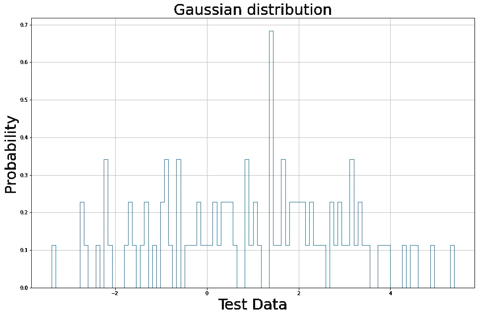
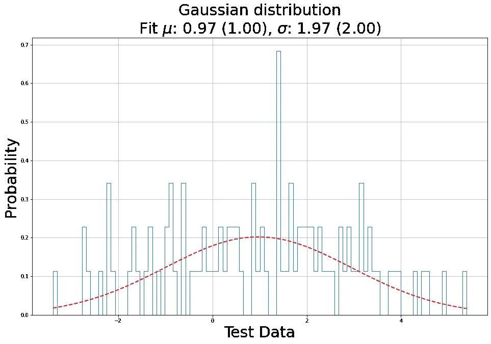
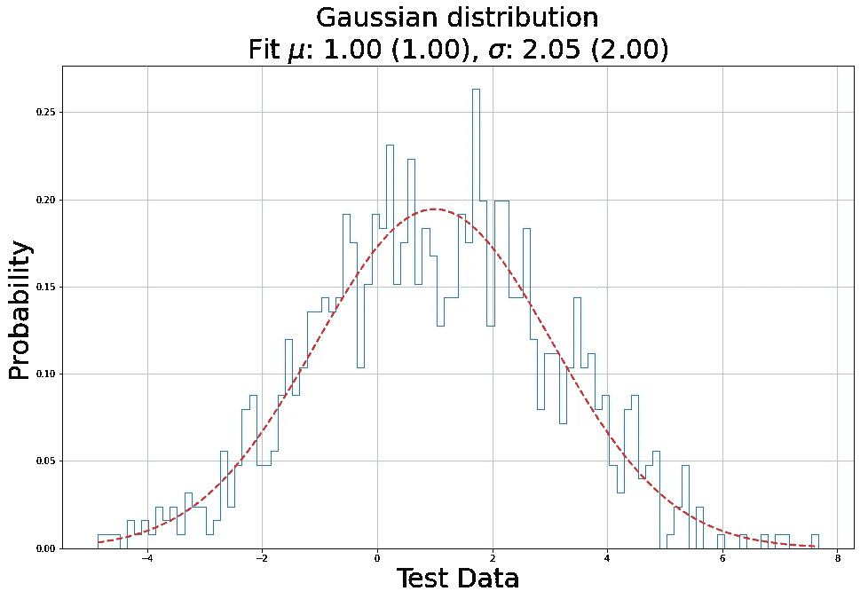
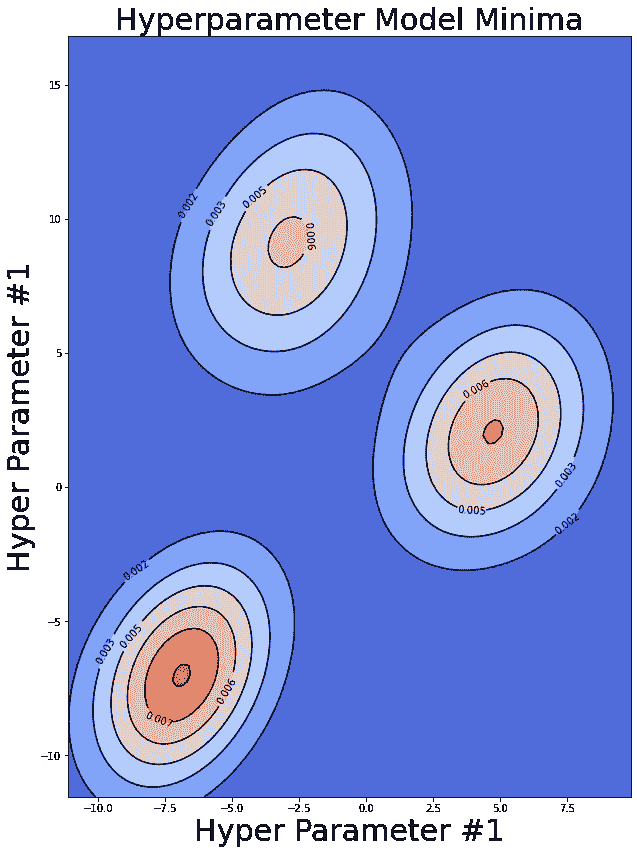
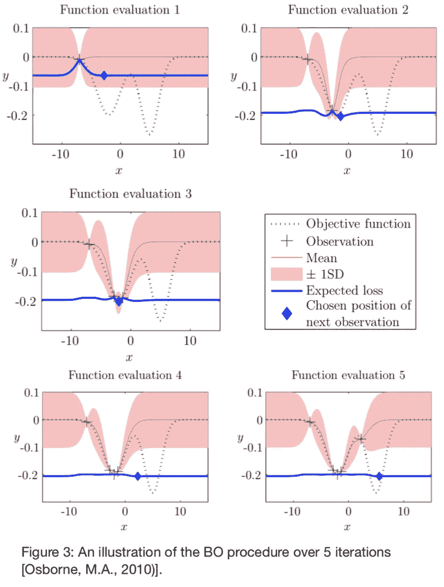

# 高斯过程:更智能地调整您的 ML 模型

> 原文：<https://towardsdatascience.com/gaussian-processes-smarter-tuning-for-your-ml-models-c72c7d4f5833?source=collection_archive---------36----------------------->

## [实践教程](https://towardsdatascience.com/tagged/hands-on-tutorials)

## 通常情况下，模型的最佳性能取决于正确的参数，但测试每种组合的计算成本太高。使用[高斯过程](https://en.wikipedia.org/wiki/Gaussian_process)可以有所帮助。


照片由[奥拉夫·阿伦斯·罗特内](https://unsplash.com/@olav_ahrens?utm_source=medium&utm_medium=referral)在 [Unsplash](https://unsplash.com?utm_source=medium&utm_medium=referral) 拍摄

我想我们都经历过。我们有一个基本的机器学习模型，但它的性能还不太好。幸运的是，许多机器学习算法都有许多旋钮和开关，你可以用来调整它，使其性能更好(例如，你在随机森林中构建的树的深度，或者你的梯度增强算法的学习速率)。

有多个现有函数可帮助您执行此调优，并且 [SciKit learn 有几个](https://scikit-learn.org/stable/modules/classes.html#module-sklearn.model_selection)(仅高层次解释，但给出链接):

*   [GridSearchCV](https://scikit-learn.org/stable/modules/generated/sklearn.model_selection.GridSearchCV.html) —在给定的参数范围内尝试每个组合
*   [参数网格](https://scikit-learn.org/stable/modules/generated/sklearn.model_selection.ParameterGrid.html#sklearn.model_selection.ParameterGrid) —从每个参数允许值的离散列表中构建参数组合
*   [参数采样器](https://scikit-learn.org/stable/modules/generated/sklearn.model_selection.ParameterSampler.html#sklearn.model_selection.ParameterSampler) —从分配给每个参数的分布中采样参数
*   [RandomizedSearchCV](https://scikit-learn.org/stable/modules/generated/sklearn.model_selection.RandomizedSearchCV.html#sklearn.model_selection.RandomizedSearchCV) —类似于 GridSearch，但只随机抽样这么多用户集组合

如果你和我一样，你可能已经用你自己的经验将参数空间限制在你认为可能给出好结果的区域，然后如果组合很小，使用 GridSearchCV，否则可能使用 RandomizedSearchCV 来获得你在剩下的时间里可以找到的最佳组合。

通常，我发现我做的很多项目都是全新的蓝天，所以数据集是不完整的，支离破碎的，非常脏。这意味着数据科学的格言“80%的数据清理和 20%的其他事情”在我的案例中经常是正确的。当训练模型的计算成本很高时，搜索 10，000 个(甚至 100 个)组合的大参数对于满足交付期限是不实际的。


蒂姆·高在 [Unsplash](https://unsplash.com?utm_source=medium&utm_medium=referral) 上拍摄的照片

# **我们能做什么？**

我很高兴你问了。你可能已经看到或者没有看到关于使用 [Scikit-Optimize](https://scikit-optimize.github.io/stable/) 的信息，但是如果你还没有或者不确定如何使用它来调整你的模型，那么请继续阅读。

**那么，是什么呢？**

它的核心是一组函数，使您能够对评估代价高昂的问题进行建模。这种开销可能是因为获得参数组合的结果需要很长时间，也可能是因为彻底解决问题的计算成本很高。

在我的工作生涯中，我用它来解决这两个问题。

对于“评估每个组合的等待时间过长”的问题，它被用来收集数据，以建立生产线的机器学习模型。每次算法建议尝试一组新的参数时，都需要花费很长时间来返回结果(生产线需要达到稳定状态，然后需要有人取走样品，将其带到测试实验室并运行测试来分析产品输出，进一步增加了等待时间)，由于测量的成本，只能获取这么多的数据点。由于这个限制，我们使用这个解决方案来获取最有价值的数据点。

我将谈到的第二种用法(无法测试每种可能的组合)是，尝试调整模型的参数组合在计算上太过昂贵，我会老死。

SciKit Optimise 为您提供了许多工具，但我将集中讨论我使用最多的一个工具，即 gp_minimize。它的主要描述是“使用高斯过程的贝叶斯优化”，这是一项了不起的任务，只需要向已经知道它是什么的人解释它是什么。

在高层次上，如果您知道从数据中获得的基本分布，您就可以预测某些事件发生的概率。如果你有一个均匀分布，那么你知道在指定范围内的任何值都是同样可能的，但在生活中，情况并不总是这样。如果我向靶心投掷飞镖，你会认为我的大部分命中目标可能离靶心更近而不是更远。但也许我不是最好的射手，我总是倾向于击中某个特定的点而不是靶心。那么我们如何辨别呢？

如果我拍了 100 张照片，我们只是测量了从靶心开始的水平距离，并制作了直方图，我们可能会得到这样的照片。



由此可能有点难以确定我们认为我可能会再次击中哪里。但是如果我们对它进行分布拟合，图形会变成这样:



来自 100 个样本的结果符合具有估计参数的高斯分布(真值在括号中)

在视觉上，它对用户来说变得更加清晰。此外，因为我们知道分布的数学定义，我们不仅可以询问我的平均值在哪里，还可以询问我投篮的分布。

有必要说明一下，如果我拍摄了 1000 张照片，图表看起来会是这样:



用估计参数拟合高斯分布的 1000 个样本的结果(括号中为真)

拟合的分布要精确得多，但是你也可以说你不需要它来直观地询问你得到的形状。

那你用的是什么形状？

我用的是[高斯分布](https://en.wikipedia.org/wiki/Normal_distribution)。这是一个常用的发行版，因为它不仅比其他发行版更容易使用，而且自然界中的许多过程都可以这样建模。

这有什么关系？

好吧好吧。因此，这里的关键点是，对于 100 点与 1000 点的图表，拟合分布使您更容易看到发生了什么，可以说，有了它，您可以用比 1000 点图表少 900 个数据点的方式很好地估计实际值。我们正在对数据进行分布拟合，以表明我们认为最可能的点在哪里。

> 高斯过程使你能够用最少的数据提取尽可能多的信息

高层次的方法是:

1.获取一组初始数据点

2.对其进行分布拟合(在本例中为高斯分布)

3.读出你认为将在你的分布的最大值的结果区域

4.测试它并返回结果

5.根据您的数据重新调整分布，包括这个新点

6.回到步骤 3

在机器学习中，我们可以用树木的数量来构建一个随机的森林。我们测试几个不同的参数，计算训练模型的准确性，并返回这些参数。高斯过程将适合这些点，并尝试计算出哪一个树值给你最大的准确性，并要求你尝试一下。这导致两种结果:

如果精度增加，那么高斯拟合将变得更清晰

如果它是错误的，那么拟合将变平，它将开始看得更远

# 机器学习的问题是

随着我们添加超参数，我们开始添加更多的维度，我们可以想象对于两个参数，我们最终得到一个显示模型精度的图，如下所示:



超参数设置对模型性能的影响。三个最小值是显而易见的。

在这个例子中，我们可能有不止一个区域显示出模型性能的改进。这一过程的巨大优势在于它有能力以一种智能的方式描绘出这一点。

我们可以看一些例子(取自这里)来展示这个拟合过程。



贝叶斯优化如何随着我们添加更多数据点而改变的例子([来源](https://ora.ox.ac.uk/objects/uuid:1418c926-6636-4d96-8bf6-5d94240f3d1f)

在这里，我们可以看到正在探索空间，当它达到第一个最小值时，它需要几个样本来建立它，然后继续探索它认为可能会得到更好结果的地方。在这个过程的最后，它会给你在这个过程中找到的最佳点。

在模型调优中，考虑到您给定的搜索限制，这将是模型的最佳参数集。

如果你想了解更多这方面的数学知识，我建议你:

[用于顺序预测、优化和求积的贝叶斯高斯过程](https://ora.ox.ac.uk/objects/uuid:1418c926-6636-4d96-8bf6-5d94240f3d1f)

[康乃尔大学:第 16 讲:高斯过程和贝叶斯
优化](https://www.cs.cornell.edu/courses/cs4787/2019sp/notes/lecture16.pdf)

[高斯过程贝叶斯优化背后的直觉](/the-intuitions-behind-bayesian-optimization-with-gaussian-processes-7e00fcc898a0)

# 让我们来看一些代码

在那篇冗长的引子之后，我们可以看看一些代码。我们非常幸运，因为已经存在一个用于调整机器学习模型的简单实现( [BayesSearchCV](https://scikit-optimize.github.io/stable/modules/generated/skopt.BayesSearchCV.html?highlight=bayessearchcv#skopt.BayesSearchCV) )。

首先，我们需要导入所需的模块和我们想要适应的 ML 算法(我使用的是 [gbrtclassifier](https://scikit-learn.org/stable/modules/generated/sklearn.ensemble.GradientBoostingClassifier.html) )。

```
from skopt import BayesSearchCV
from skopt.space import Real, Categorical, Integer
from sklearn.ensemble import GradientBoostingRegressor
```

BayesSearchCV 在这里做繁重的工作。它的功能就像一个管道，接收你想要搜索的所有参数值(以及你如何设置它们)，你想要调整的机器学习算法，并有大量其他可以改变的设置。

```
# Initialise the algorithm, search area and other parametersn_data = len(X_train)
opt = BayesSearchCV(
      GradientBoostingRegressor,
      {
      'max_depth': Integer(1, int(n_data / 2),
      'learning_rate': Real(0.01, 0.2, prior='log-uniform'),
      'subsample': Real(0.1, 0.8, prior='uniform')
      },
      n_iter=30)# Start the optimisation and return a fitted algorithm
opt.fit(X_train, y_train)
```

在这里，我们传递算法，并且对于每个超参数空间，我们可以定义范围(一个例子是动态的，因为‘n _ data’是训练数据的行数)以及范围的种类，例如离散、浮点甚至分类。这告诉高斯过程它如何能探索这个空间。“n_iter”告诉它可以采样多少个点。我通常发现我在 30+分后开始得到好的结果。这部分是由问题的复杂性决定的，但也取决于你在开始时随机抽取了多少样本(默认情况下，它随机抽取 10 个样本来提供初始拟合)。


[安布林·哈桑](https://unsplash.com/@ambreenhasan?utm_source=medium&utm_medium=referral)在 [Unsplash](https://unsplash.com?utm_source=medium&utm_medium=referral) 上的照片

# 瞧啊。你完了！

现在，您已经用几行代码安装并调整了一个机器学习算法。如果您已经定义了问题，那么(哪些参数和范围等。)与从头开始尝试每一个组合相比，您应该可以更快地(和更少的采样)获得更好的结果。


照片由 [Camylla Battani](https://unsplash.com/@camylla93?utm_source=medium&utm_medium=referral) 在 [Unsplash](https://unsplash.com?utm_source=medium&utm_medium=referral) 上拍摄

## 还有一件事…

这个预建的功能不是你唯一能做的。你可以定义自己的目标来最小化。这非常有趣，因为你可以用它来优化非常复杂的问题。

例如，如果您对机器学习算法的纯分数不感兴趣，而是对它如何影响另一个函数感兴趣，您可以编写一个返回此值的目标函数。基本的规则是，如果你能把它压缩成一个值，回到高斯过程，你就可以写一个函数来最小化它。

下次见！