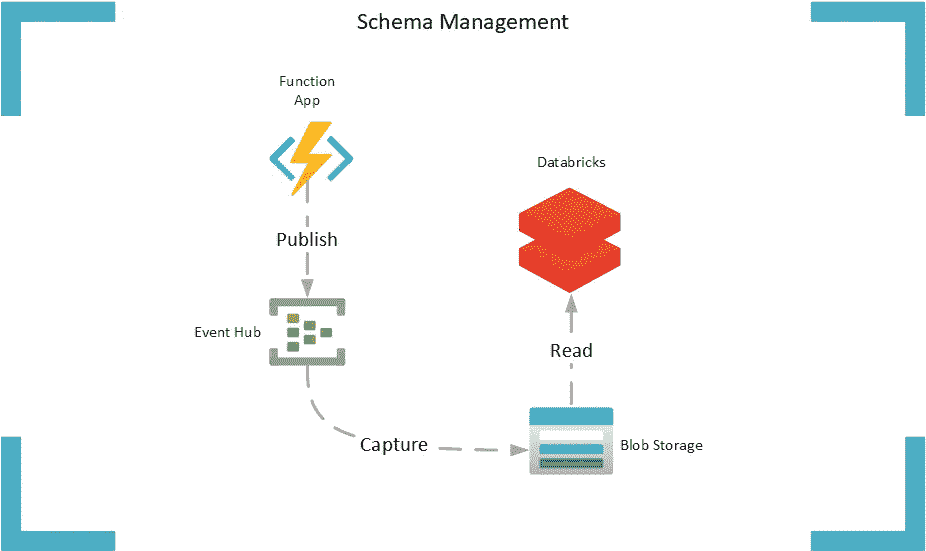

# GAVRO —托管大数据模式演进

> 原文：<https://towardsdatascience.com/gavro-managed-big-data-schema-evolution-8217431f278f?source=collection_archive---------39----------------------->

## 构建一个适应变化的数据接收架构不是很好吗？更具体地说，对模式演变具有弹性。


图片来源[Pixabay.com](http://Pixabay.com)

对于架构师和软件工程师来说，管理模式变更总是很麻烦。构建大数据平台没有什么不同，管理模式演变仍然是一个需要解决的挑战。NoSQL、Hadoop 和读取模式的咒语在一定程度上缓解了严格的模式执行的束缚。然而，集成开发人员、分析师和数据科学家在从大数据中提取准确见解时，仍然会受到大量数据争论的阻碍。

“成功的业务”以加速和放大已知数据模式的易变的步伐成长和发展。数据集不是静态的，而且是不断发展的，因此了解业务事实数据在业务的当前和历史时期代表了什么对于做出自信的信息洞察至关重要。

通过这篇文章和附带的 GitHub [repo](https://github.com/GaryStrange/GAVRO) ，我将展示如何使用微软 Azure 技术在大数据平台中管理模式演进。

> 这是一个在实践中容易被忽略的领域，直到您遇到第一个生产问题。如果没有仔细考虑数据管理和模式演化，人们通常会在以后付出更高的代价。

> confluent . io(2020 年 4 月 29 日)，模式演变和兼容性。[https://docs . confluent . io/current/schema-registry/avro . html # schema-evolution-and-compatibility](https://docs.confluent.io/current/schema-registry/avro.html#schema-evolution-and-compatibility)

作为一名作家，很难决定如何讲述你的故事。我是直接进入技术解决方案，以满足寻找简洁例子的工程师，还是从为什么和动机开始？所以我就交给读者了。如果您想直接进入技术示例，请访问 [GitHub repo](https://github.com/GaryStrange/GAVRO/blob/master/README.md) 。如果你想知道更详细的情况，请继续阅读…

# 模式管理

如果消费者理解用于写入数据的模式并且该模式从不改变，那么序列化要存储在文件中以供以后分析的数据是相当简单的。

但是，如果模式随着时间的推移而演变，会发生什么呢？它变得有点复杂。

当写模式由于新的业务需求而发展时，消费者(读者)必须理解新模式是何时引入的，以及新模式的定义，以便成功地反序列化数据。未能理解模式更改事件将影响数据处理管道，服务将出错，因为它们无法反序列化数据。

这个问题有几种解决方案……(这绝不是一个详尽的列表)。

**发布协调**

作者和读者协调他们的积压工作和软件发布。当编写器和读取器应用程序由同一个工程团队开发和维护时，这可能会工作得很好。然而，通常情况下，作者和读者在整个企业中致力于不同的目标和优先级。应该避免通过严格的接口依赖来临时耦合独立的团队积压工作，因为这会抑制敏捷性和交付速度。

**模式版本管理**

版本化写模式支持向前和向后兼容性管理。提供向前和向后的兼容性可以消除积压和优先级，允许工程团队独立地实现他们的目标。

版本控制通常在两个不同的子主题的上下文中讨论。

主要—主要版本变更通常会破坏系统之间的接口和契约。主要的模式更改通常会阻止读者读取新模式版本写入的数据。向前和向后兼容很困难或不可能。

次要—次要版本变更通常被视为低影响变更。向前和向后兼容通常是可能的。读取器通常会像以前一样继续操作，成功地对数据进行解序列化，而不会升级到模式的最新版本。

构建一个能够适应变化的数据接收架构不是很好吗？更具体地说，是对模式演变的弹性。

下面是我将用来描述如何成功管理模式进化的 Azure 架构。



# 模式注册表

Kafka 的 Schema Registry 提供了一个在流架构上管理模式演化的很好的例子。Azure Event Hubs 是微软的 Kafka 类产品，目前没有模式注册功能。发布到事件中心的事件被序列化为嵌套在事件中心 Avro 模式体中的二进制 blob(图 1)。我们将很快讨论细节，但本质上发布的事件数据是无模式的，任何下游读取器都需要通过在读取时断言模式来对二进制 blob 进行反序列化。有一些巧妙的变通方法，利用了 Confluent 的模式注册表和事件中心。我将在这些建议的基础上，提供一种模式进化弹性的替代方法。在我之前的故事([发展成为 Azure Cloud 中的大数据驱动业务:数据摄取](https://medium.com/@gary.strange/evolving-into-a-big-data-driven-business-in-the-azure-cloud-data-ingestion-65bc8b659570?source=your_stories_page---------------------------))中，我描述了一个数据湖摄取架构，该架构利用事件中心和事件中心捕获来形成大数据分析的批处理层。我将使用这个架构作为处理模式演变的参考。

> 图一。

```
{"type":"record",
    "name":"EventData",
    "namespace":"Microsoft.ServiceBus.Messaging",
    "fields":[
                 {"name":"SequenceNumber","type":"long"},
                 {"name":"Offset","type":"string"},
                 {"name":"EnqueuedTimeUtc","type":"string"},
                 {"name":"SystemProperties","type":{"type":"map","values":["long","double","string","bytes"]}},
                 {"name":"Properties","type":{"type":"map","values":["long","double","string","bytes"]}},
                 {"name":"**Body**","type":["null","bytes"]}
             ]
}
```

**活动中心**

多少？我应该有几个活动中心？或者换句话说，我应该为我的所有数据使用一个大管道，还是为每种消息类型使用许多小管道？关于卡夫卡的话题，也有人问过同样的问题，但没有明确的答案。有一件事很有可能，不同的用例会偏好不同的方法。如果您关心的只是从 A 到 B 获取消息，或者您正在与您控制之外的架构集成，那么消息可能会通过一个事件中心，一个大管道流动。如果您的一些数据高度敏感，并且您只希望某些订户读取和处理这些数据，或者您可能需要特定的分区策略，这将导致在一个名称空间中采用许多事件中心、许多更小的管道。

大烟斗

*   如果一个事件中心包含许多具有不同模式的消息类型，我们如何正确地识别和反序列化各种消息？

小管

*   当一个事件中心只包含一种消息类型，并且这种消息类型会随着时间的推移而演变时，消费者如何反序列化新版本的消息呢？

乍一看，这些问题似乎毫无关联。然而，它们是同一个核心问题的表现。如何管理数据的去序列化？

事件中心上的所有消息都是二进制的匿名 blobs。一种选择是让消费者推断模式。然而，这种方法是不确定的，并且是基于抽样的，所以推断出的模式只能是一种近似。另一种方法可能是断言消费模式。然而，这意味着使用消息的工程团队暂时与模式的发展相结合，即使是很小的变化。事件中心捕捉为我们提供了一个打破时间耦合的机会，让消费者能够以自己的节奏消费从 t0**开始的数据。但是，如果使用者想要读取和使用由事件中心捕获流程生成的所有 AVRO 文件，他们还需要知道在捕获事件期间使用了哪些写模式来写入二进制消息。这可能是几个月甚至几年的数据。作为消费者，我需要知道模式演变的时间线，否则我将很难利用这些数据。

***井至少从乞讨事件中枢捕获配置。*

活动中心捕捉的早期印象可能会让您认为 AVRO 被用来帮助解决上述问题。然而，在阅读了 [AVRO 规范](https://avro.apache.org/docs/current/spec.html)之后，似乎只有微小的版本变化是可能的。因此，无法管理重大变更，也不可能有多种消息类型的 AVRO 文件。

事件中心允许我们在发布消息时添加额外的元数据。这些元数据是管理模式演变的关键。

有两种可能的选择。

1)写模式与每个消息一起存储在事件中心客户端属性字典中。这将严重抬高存储成本。

2)消息类型标识符存储在事件中心客户端属性字典中。然后，该标识符用于从中央存储中查找模式。

对于这两种解决方案，模式总是直接或间接地与数据存储在一起。Event Hub Capture 生成的文件总是有一种识别写模式的方法。此外，每个文件可以包含 x 个消息类型和 y 个消息版本。

让我们来看一个使用客户端 SDK 将消息发布到 Event Hub 的 Azure 函数。

模式标识符总是存储在数据旁边(第 17 行)。

# Azure 函数

在上面的例子中，函数使用一个定时器触发器每 5 秒执行一次函数的新实例。函数触发器是不相关的，它可以很容易地成为一个 CosmosDB 变更提要处理绑定或任何其他生成待处理数据的绑定。而且，用功能 app 也无关紧要，重要的是你发布到事件中枢的内容。函数 app 本身就是一个简洁的例子。

需要注意的是，通过添加对 eventData.Properties 的引用，消息的模式版本与消息一起被持久化。当事件发布到事件中心时，模式标识符总是与数据一起存储。

## 事件中心捕获

我将事件中心捕获配置为每分钟或每 500mb 生成一个新的 AVRO 文件，以先到者为准。因此，我们现在有了模式标识符和在整齐分区的 AVRO 文件中捕获的数据，但是我们如何在大数据管道中处理它呢？在我之前的故事中，我讨论了维护模式存储库的主题，以获取所有企业模式的真实描述。这种回购是用来创造一个人工制品，将在数据处理管道消费。这个产品是一个简单的键值存储，将版本化的模式标识符与所使用的写模式连接起来。出于本文的目的，我将使用一个简单的 Databrick Python 笔记本来处理 AVRO 数据。

# 数据块—笔记本

我不会对完整的笔记本进行详细描述，而是关注最重要的单元(完整的笔记本在 GitHub repo 中)。

## AVRO 非军事化

首先是读取事件中心数据捕获 AVRO。Spark 的 AVRO dataframeReader 用于从存储器中读取 AVRO 文件，并将它们解编为数据帧。我们可以让 Spark 在这一点上推断模式，因为我们知道它是非易失的(即 Azure Event Hub 模式)。properties 属性保存用于将数据写入二进制字段“Body”的模式版本信息。对数据进行简单的投影，以处理具有三列的精确数据帧。模式版本是从 properties 对象中提取的(序列化属性字典中的存储值存储在子属性 member2 中)。“Body”属性被转换成一个字符串，因为我们想在后面的笔记本中对它使用 spark 的 JSON 反序列化器。

```
**from** pyspark.sql.functions **import** colrawAvroDf = spark.read.format("avro").load("wasbs://" + containerName + "@" + storageAccName + ".blob.core.windows.net/gavroehnamespace/gavroeh/*/2020/*/*/*/*/*.avro")avroDf = rawAvroDf.select(col("Properties.SchemaVersion.member2").alias('SchemaVersion'), col("Body").cast("string"))display(avroDf)
```

## 模式查找

第二个是模式查找对象。出于简化示例的目的，我将手动创建一些模式，用于反序列化 AVRO 数据。然而，在实践中，这些模式将从模式存储库中生成，并作为运行时工件存储。自我提醒，需要将此作为后续文章来写。

存储在一维数组中的模式代表一个已经进化的实体。在这个理论上的例子中，企业已经成长并开始以新的货币进行海外交易。交易现在需要货币标识符，因此在销售订单数据模式中添加了一个新的属性“currency”。作为读者，我们需要能够成功地对新数据进行反序列化。

```
**from** pyspark.sql.types **import** StructType, StructField, LongType, StringType, ArrayType, DoubleTypesalesOrderV1 =StructType([StructField('OrderId',StringType(),**True**),StructField('OrderAmount',DoubleType(),**True**),StructField('OrderCreatedUTC',StringType(),**True**)])salesOrderV2 =StructType([StructField('OrderId',StringType(),**True**),StructField('OrderAmount',DoubleType(),**True**),StructField('Currency',StringType(),**False**),StructField('OrderCreatedUTC',StringType(),**True**)])salesOrderSchemaDictionary = { "v1.0":salesOrderV1, "v2.0":salesOrderV2 }salesOrderSchemaDictionary
```

## JSON 去军事化

我想关注的第三个单元是实际读取数据并对数据进行反序列化的单元。先前读入数据帧的事件中枢数据捕获输出用于确定数据中存在的模式版本的不同列表。对于每个模式版本，将创建一个新的临时 SparkSQL 表来访问反序列化的数据。原始 AVRO 数据帧在“for”循环的每次迭代中被过滤，通过不同的模式版本对记录进行分组以产生数据子集。然后，使用 salesOrderSchemaDictionary 中的相应模式对每个子集进行反序列化。将创建许多新的临时表，该单元的输出将显示已创建对象的列表。

```
**from** pyspark.sql.functions **import** concat, lit, regexp_replacedistinctSchemaVersions = avroDf.select('SchemaVersion').distinct()objectToCreate = distinctSchemaVersions.withColumn('TableName', concat(lit('SalesOrder'),regexp_replace(col('SchemaVersion'), '[.]', '_'))).collect()display(objectToCreate)**for** record **in** objectToCreate:schemaVersion = record.SchemaVersionjsonRdd = avroDf.filter(col("SchemaVersion") == schemaVersion).select(avroDf.Body)objectJson = jsonRdd.rdd.map(**lambda** x: x[0])dataExtract = spark.read.schema(salesOrderSchemaDictionary[schemaVersion]).json(objectJson)dataExtract.registerTempTable(record.TableName)
```

## 最后

最后，SparkSQL 可用于探索临时表中成功的去序列化数据。

```
%sql
**select** * **from** SalesOrderv1_0%sql
**select** * **from** SalesOrderv2_0
```

# 结论

我应该先弄清楚伽弗洛是什么。抱歉让你失望了，但这不是你不知道的新 Apache 孵化器项目。我的同事给我在本文中描述的方法起了一个可爱的名字。我相信这是我的首字母和 AVRO 的组合，起初我发现他们对这种方法的昵称是团队友谊的产物，但后来它坚持下来了。

我不相信设计和规定方法是完全精确的，应该无条件地适用于每个企业，因为每个企业都是不同的。因此，如果你从阅读这篇文章中学到了什么，那么我希望它是思考你的大数据管道中糟糕管理的模式演变的内涵的动力。我们一次又一次地听到组织在从大数据中提取信息和可操作的洞察力方面遇到的困难，以及数据科学家浪费 80%的时间在数据准备上是多么昂贵。如果应用得当，模式管理是一种武器，可以用来加速数据理解和减少洞察时间。所以花时间投资它，你会收获健康的回报。

## 引文

[1]沃尔坎·西韦莱克，事件中心模式验证(2019 年 4 月 1 日)，[https://azure . Microsoft . com/en-GB/blog/Schema-validation-with-Event-Hubs/](https://azure.microsoft.com/en-gb/blog/schema-validation-with-event-hubs/)

[2]马丁·克莱普曼，是否应该把几个事件类型放在同一个卡夫卡主题里？(2018 年 1 月 18 日)，[https://Martin . kleppmann . com/2018/01/18/event-types-in-Kafka-topic . html](https://martin.kleppmann.com/2018/01/18/event-types-in-kafka-topic.html)

## 影响

雅虎的 Apache Pulsar 系统:[https://Pulsar . Apache . org/docs/en/schema-evolution-compatibility/](https://pulsar.apache.org/docs/en/schema-evolution-compatibility/)

Confluent.io 的 Schema-Registry:[https://docs . confluent . io/current/Schema-Registry/index . html](https://docs.confluent.io/current/schema-registry/index.html)

杰伊·克雷普斯，《日志:每个软件工程师都应该知道的实时数据统一抽象》(2013 年 12 月 16 日)，[https://engineering . LinkedIn . com/distributed-systems/Log-What-every-a-software-engineer-should-know-on-real-time-datas-unified](https://engineering.linkedin.com/distributed-systems/log-what-every-software-engineer-should-know-about-real-time-datas-unifying)