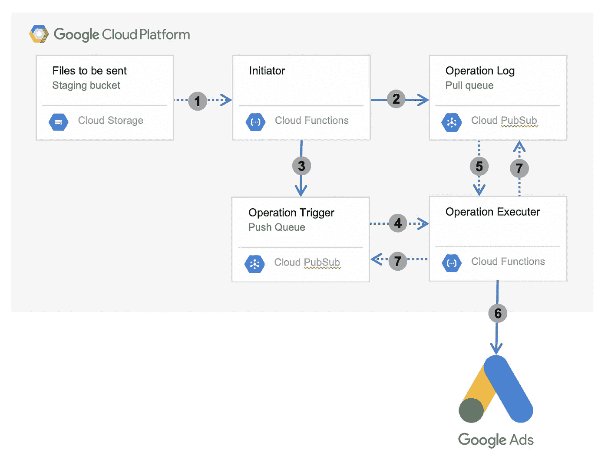
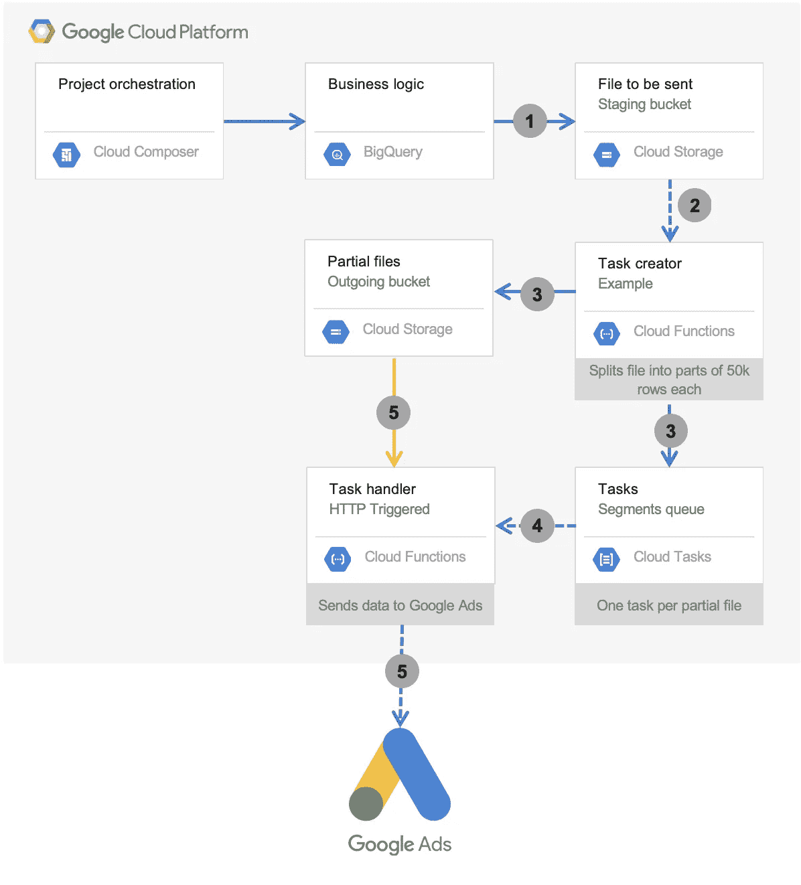

# GCP 无服务器设计模式:遵守云任务的速率和并发限制

> 原文：<https://towardsdatascience.com/gcp-serverless-design-pattern-adhering-to-rate-concurrency-limits-with-cloud-tasks-30aa756da763?source=collection_archive---------44----------------------->

尽管我认为自己了解与数据工程相关的多种 GCP 产品，但我之前从未听说过云任务的用例。

这篇文章旨在通过提出一个具体的问题，并从发布者与云任务的角度讨论它，来阐明云任务的用例。

# 挑战

作为客户数据细分项目的一部分，我遇到了将用户数据发送到 [Google Ads 再营销受众 API](https://developers.google.com/adwords/api/docs/reference/v201809/AdwordsUserListService?hl=de) 的挑战，该 API 有以下限制:

1.  每个请求只能包含大约 50.000 条用户记录。随着每个请求的记录越来越多，性能会以指数级的速度增长。
2.  每个 Google Ads 帐户一次只能处理一(1)个请求。同时提交另一个请求会导致所有其他正在进行的请求出错。
3.  每个请求需要一到五分钟来处理。

**项目背景:**

需要发送给 API 的数据将以 CSV 文件的形式从 BigQuery 到达云存储。每个预期的 CSV 文件将包含 50，000 到 4，000，000 条记录。

编排引擎(Cloud Composer)只负责在 BigQuery 中运行业务逻辑，并将结果保存到云存储中。Cloud composer 不处理传出数据管道，因为传出数据管道应该是反应式的&无服务器的。

要细分的客户群包含大约 400 万客户，每个客户至少属于一个细分市场。编排引擎将在 BigQuery 中运行一个业务逻辑查询——每个片段将被推送到 Google Ads——导致 7 个不同的文件在几分钟内到达云存储。

# 局部解决

当一个新文件进入云存储时，一个事件可以被提交到 PubSub，或者立即反馈到云功能。更多关于这个[的信息在这里](https://cloud.google.com/storage/docs/pubsub-notifications)。

通过设置从云存储桶触发的云功能，我们可以通过将文件分成更小的部分来解决 api 限制 1(每个请求最多 50k 条记录)。

但是现在呢？简单地循环原始文件并将部分记录推送到 Google Ads 中是一种非常脆弱的处理方式。只需考虑以下几点:

## 我们期望该函数运行多长时间？

4.000.000/50.000=80 份。假设 50.000 条记录的每个部分需要 5 分钟来传输。我们谈论的是近 7 小时的连续运行时间。这远远超出了云功能所支持的范围。

## **如果我们已经在传输一个文件了，而另一个文件到达了 GCS 怎么办？**

如前一节所述，我们的编排引擎将为每个片段生成一个文件。这意味着，当我们开始向谷歌广告推送第一个片段的大块时，另一个片段将会出现，并并行触发云功能的执行。根据 API 限制的第二(2)点，这将导致两个请求都失败。如果没有某种方法来确保只有一个并发的调度发生，我们将不得不把到达云存储的数据段之间的时间分散开。

# Cloud PubSub 的问题(针对本次挑战)

我最初的方法是遵循 Google 设计的这个解决方案中概述的架构: [*一个 GMP*](https://cloud.google.com/solutions/serverless-integration-solution-for-google-marketing-platform) *的无服务器集成解决方案。*该解决方案结合使用了启动器和传输功能，以及 3 个 PubSub 主题。要了解他们提议的架构，请阅读解决方案的 [*架构概述*](https://cloud.google.com/solutions/serverless-integration-solution-for-google-marketing-platform#architectural_overview) 部分。

我认为该解决方案中使用的架构可以精简一点，解释如下:

1.  新文件登陆云存储，触发云功能*启动器*
2.  *Initiator* 将文件分割成几个较小的部分，并将它们发布到 PubSub 主题*操作日志*。
3.  完成(2)后，*发起方*向*操作触发器*发布主题发送一条空消息
4.  *操作触发器*通过订阅*操作执行器*推送空消息
5.  *操作执行器*执行并从*操作日志中提取信息开始。* **如果*操作日志*中没有消息，则不执行任何操作。循环到此结束。**
6.  如果从*操作日志*中检索到消息，*操作执行器*会尝试将其推送到 Google Ads。
7.  如果上一步(6)成功，*操作执行器*确认之前从*操作日志*拉取的消息，并向*操作触发器*发布空消息*。**从 4 继续。***

## 这种方法的问题

我认为这种方法有几个问题:

*   如果*操作执行器*出错或失败，整个循环可能会中断。如果错误是由 Google Ads API 端错误引起的，您需要在代码中捕捉到这一点，并向*操作触发器*发送一条空消息以继续循环。这并不符合快速失效的原则(下面会有更多的介绍),而且开发起来更加困难。
*   如果当操作日志中只剩下一(1)条消息时发生上述错误，则该消息不可从*操作日志*中提取，直到确认截止日期过去。随后执行的*操作执行器*会认为没有更多的消息，并结束循环。
*   为了遵守 Google Ads API 的限制 2(并发请求)，在*操作触发器*和*操作执行器*之间只能有一条消息流动。当第二个段文件到达云存储时，这将被违反。
*   我相信调试和理解架构是复杂的。

如果我们没有输出 API (Google Ads)的限制，这个解决方案会更好。

由于这种方法不经过深思熟虑是不可行的，所以我决定寻找替代方法。

# 云任务简介

云任务是一个分布式任务队列。您可以定义一个或多个可以向其发送任务的队列。队列就像它们听起来的那样。任务是要做的事情，通常定义为“运行这个 HTTP-请求，等待直到你得到一个 200/OK-响应代码”，如果没有，在 X 时间内再试一次。

**在一个队列级别上，你有以下(和更多)** [**设置**](https://cloud.google.com/tasks/docs/configuring-queues#routing) **:**

*   每秒最大分派数:这个队列处理新任务的速度有多快？
*   *最大并发调度:*可以同时运行/执行多少个任务？
*   *最大尝试次数:*一个任务在进入“失败”状态之前可以尝试多少次？

**在一个任务级别上你有以下(和更多)** [**设置**](https://cloud.google.com/tasks/docs/creating-http-target-tasks) **:**

*   任务类型:在本文中，我们将只讨论 HTTP 目标类型。
*   *HTTP Task HTTP Method*:HTTP 方法(GET/POST)
*   *HTTP 任务请求体*:HTTP 请求体。最大 100kb。

请注意，云任务不是一个消息队列(像 PubSub)，它只是感兴趣的任务定义，并支持最大 100kb 的请求体来描述在哪里可以找到任何最终数据。

现实生活中的排队。图片来源:https://unsplash.com/photos/Xbh_OGLRfUM 亚历山大·波波夫

# 云任务的完整解决方案

为了将云任务与我们的部分解决方案集成，我们可以将到达云存储的大传输段文件分解成多个位，并为每个位创建一个任务。我们会将所有这些任务发送到一个任务队列，我们已经将 *Max concurrent dispatches* 设置为一(1)，以避免溢出 Google Ads API。

由于云任务不执行任务(它们只调用 HTTP-endpoint 并等待 200/OK 代码返回)，我们将实际的 Google Ads API 调用放在云函数中。

## 架构概述

利用云任务将一个大请求分解成多个小请求的架构图。

1.  BigQuery 将结果输出文件写入 GCS。
2.  完成写入 GCS 后，云功能*任务创建器*从 GCS 触发。
3.  *任务创建者**任务创建者*从 GCS 中的触发文件的文件名中获取目标 API 和其他属性，并将其与任务主体中的部分文件的路径一起发送。
4.  *段队列*中的任务被逐一处理，每个调用云函数*任务处理程序*。
5.  对于*任务处理程序* 的每次调用，它都会解码任务主体并检索 GCS 中部分文件的路径以及 API 配置。然后，它将部分文件推送到 Google Ads，并在完成后向云任务返回 200/OK 响应代码。

## 这个架构给了我们什么？

云任务充当我们的输入和输出之间的缓冲，确保输出符合 API 的速率限制。

它还通过提供重试层来帮助我们提高开发速度，使我们能够编写集成代码，而[很快就会失败。](https://en.wikipedia.org/wiki/Fail-fast)如果*任务处理器*函数失败，就让它失败，默认发送一个 http-error-code 给云任务。云任务将在适当的时候重试该任务。只要错误是在谷歌广告方面，任务最终将成功执行。

## 向外扩展

它也很容易向外扩展，以支持谷歌广告中更多的帐户(假设一个广告商活跃在几个国家),我们只需要在云任务中创建额外的队列。我们向*任务创建器*添加了一些代码，以便它可以动态选择任务队列，还向*任务处理器*添加了一些代码，以便它可以动态获取 API 凭证/配置。除此之外，可以使用完全相同的功能。

# 最后的话

这个用例显然不是打算由 PubSub 解决的，我很高兴它不是，因为它教会了我很多关于 PubSub 的局限性。

云任务显然是针对这一领域的问题，这是一个非常容易上手的服务。我强烈建议每个人都尝试一下，因为它可能是处理低性能 API 的最佳(无服务器)服务之一。

我计划在这个集成挑战中结合云任务和 PubSub。我有一个他们如何合作的想法。

如果你想进一步讨论这个问题，或者不同意我提出的任何观点，请随意发表评论。我是来学习的👨‍💻🤓