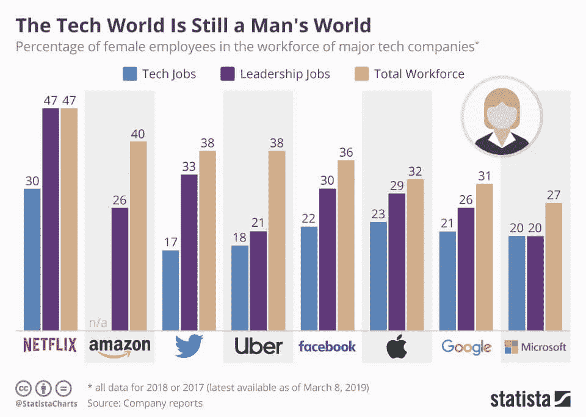
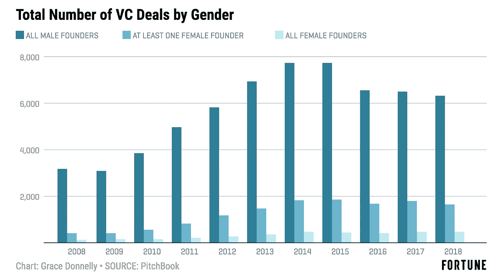
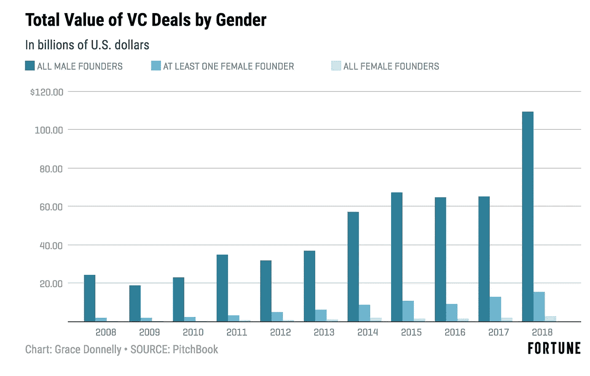

# 性别和人工智能

> 原文：<https://towardsdatascience.com/gender-and-artificial-intelligence-5fcff34589a?source=collection_archive---------29----------------------->

## 当前的问题和挑战是什么？

社会对性别的看法正处于临界点。AI 也是如此。那么，这些问题是如何交叉的，我们面临着哪些挑战？

[https://gi phy . com/gifs/Zurich insurance-pride-gender-diversity-and-inclusion-fssx J3 npkjexlv 36 zh](https://giphy.com/gifs/ZurichInsurance-pride-gender-diversity-and-inclusion-fssXJ3nPkjeXlV36ZH)

## 1.艾绝大多数是女性

https://peopleofdesign.ru/2018/04/ios-12-concept/

在美国，94.6%的秘书和行政助理是女性。不出所料，Siri 也是。几乎没有主要的人工智能辅助项目可以避免这个缺陷，也没有太多改进的动力。虽然一些人工智能团队专注于代表性，但其他人提出了进一步的争议。

这些团队正在转向发展“无性别”的声音，以避免批评，但在现实中，有一个“无性别”的声音意味着什么？是我们无法识别为人类的东西，还是属于非二元/酷儿群体的声音？我们是不是在不知不觉中把 LGBTQ+的人推到了二等公民的范畴？为了开发对社会负责的人工智能，我们必须努力解决这些问题。

另一方面，也有视觉人工智能，这里的问题不仅仅是大多数是女性，还有超性感化。毫不奇怪，这种性别化的基调是面向白人，异性恋男子。像前玛奇纳这样的虚构人工智能导致了像 Lil Miquela 这样的“现实世界”名人，Lil Miquela 是一个由人工智能制成的 Instagram 名人/流行明星。

Lil Miquela(取自 Instagram)

虽然她可能是一个经理的梦想，但这个行业的女性已经表示，这种“没有意愿的女人”是她们的噩梦。这是麦莉·赛勒斯《黑镜》那一集的情节，他们把她变成了一个机器人，这样她的经理就可以完全控制她了……男性 AI 名人在哪里？女人什么时候才能摆脱天真、顺从的仆人变成红颜祸水的叙事？AI 好像也没什么帮助。

## 2.偏见

填空:

> 男人之于国王，犹如女人之于王后。
> 父亲之于医生，犹如母亲之于 _ _ _ _ _ _ _ _ _ _。

我说医生，艾一般说护士。

这个问题是由偏见引起的。这个问题源于数据集质量差，没有充分代表或歪曲某个群体。当我们根据这些数据训练我们的模型时，模型也会变得有偏差。这里，我们有一个偏向女性的填空模型，因为它所训练的文本包含了以这种方式反映女性的数据。这个问题不仅在女性中普遍存在，在非二元种族和少数种族中也是如此。

CalArts

在人工智能时代之前，在历史上收集大量数据的领域，这是一个更大的问题，当时偏见没有像今天这样受到重视。例如，大多数过去的医学研究都集中在雄性身上，尤其是在像老鼠这样的动物身上。这是由无数的原因造成的。特别值得注意的是，科学家声称女性的荷尔蒙周期是一个额外的变量。他们说他们无法控制这一点，因此应该将女性排除在研究之外(好像男性没有荷尔蒙)。这种情况有所改善，因为一些现代期刊要求在研究中包括一定数量的女性。然而，关于女性健康的历史数据远远少于我们对男性健康的历史数据，而且许多医学研究继续以这种方式运作。

偏见的另一个流行例子是面部识别，女性面部的错误率更高。对于肤色较深的人来说，这一比例甚至更高。这些问题的答案似乎是收集更好的数据，更有代表性的数据。此外，我们应该继续分别评估不同人口统计的错误率，以便我们可以改进我们的人工智能模型。

然而，如果我们消除了这种偏见，问题就变成了:我们到底应该用性别来通知人工智能的决定吗？很多推荐系统会猜测你的性别(使用你的在线行为)，然后根据猜测给出建议。可以吗？它是否强化了性别刻板印象？我们是否需要更好地理解性别，这样我们就可以对男性/女性身体进行分类，并以此为医学提供信息？我们能问同样的关于种族的问题吗？

我们才刚刚开始理解这些问题的重要性以及我们可以回答这些问题的方法。负责的人工智能团队倾向于专注于数据收集以消除偏见，但未能解决这些影响，我们必须将它们进一步置于聚光灯下。

## 3.工作场所的性别问题

在数据科学职位中，性别薪酬差距并不是特别糟糕，但在数据分析职位中(这些职位通常薪酬较低)。此外，由于该领域是新的，当涉及到就业市场的心理时，存在很大的差距。有人说数据科学领域的每个人都有冒名顶替综合症，但尤其是女性。此外，男性可能会申请符合 50%或以上要求的工作，而女性通常只会申请符合 90%或以上要求的工作。

其他常见的工作场所问题也进入了人工智能世界，如骚扰，尴尬，无意义的权力动态。虽然这些并不是人工智能所特有的，但它们伴随着不平等及其所有后果困扰着科技领域。

女性申请专利的数量也存在差异，产假政策也不恰当。如果我们从数字上看，人工智能的工作场所显然仍然是男性主导的。比如→

[https://www . statista . com/chart/4467/female-employees-at-tech-companies/](https://www.statista.com/chart/4467/female-employees-at-tech-companies/)

更令人震惊的是风险投资→

> 只有 1-2%获得风投资金的初创公司是由女性创始人领导的，尽管女性领导的公司获得了 200%的投资回报。这是科技行业中性别偏见最严重的部分。-帕斯卡尔·冯

宣传手册

是的，你没看错，大约 2%的风投资助的初创企业，比如脸书，是由女性领导的。

宣传手册

***数字说明一切。***

## 4.用人工智能将现实生活中的女性商品化

你可能听说过 DeepNude，这是 deep fakes 的一个特殊实例，它处理你选择的一个人的照片，并返回他们完全裸体的图像。这是对神经网络的一种反常使用，安妮·海瑟薇(Anne Hathaway)对市场对性行为的看法——“我们生活在一种将不情愿的参与者的性行为商品化的文化中”——被人工智能不和谐地深化了。

如果人工智能工作场所的差异不是如此极端，这种情况会发生吗？基于人工智能的骚扰或虐待在#MeToo 运动中有一席之地吗？我相信是的，女权主义，就像生活中的其他领域一样，仍然需要赶上科技来保持它的道德性。

## 来源:

 [## 2018 年，所有女性创始人加起来比朱尔少了 100 亿美元

### 2018 年，女性创始人获得了所有风险投资美元的 2.2%，与 progress 前一年的比例完全相同…

fortune.com](https://fortune.com/2019/01/28/funding-female-founders-2018/)  [## 这就是为什么人工智能有性别问题

### “对不起，我不知道那个。”Alexa，Cortana，甚至公共交通工具上的自动公告——它们都有…

www.weforum.org](https://www.weforum.org/agenda/2019/06/this-is-why-ai-has-a-gender-problem/)  [## 解决人工智能中性别偏见的 4 种方法

### 对人工智能中偏见的任何检查都需要认识到这样一个事实，即这些偏见主要来源于人类的…

hbr.org](https://hbr.org/2019/11/4-ways-to-address-gender-bias-in-ai)