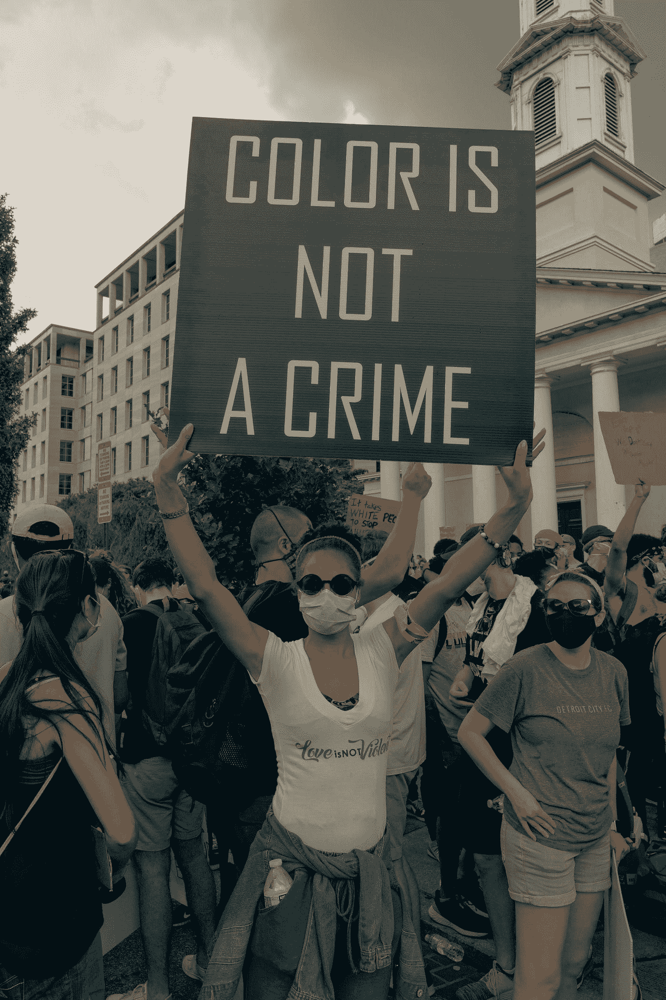
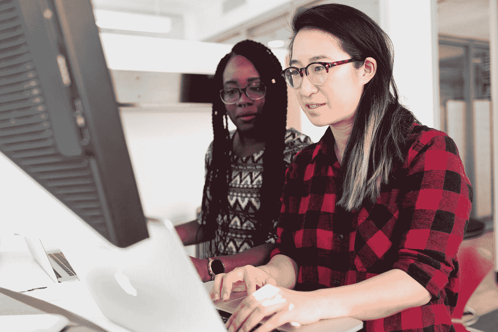

# 认知人工智能中的性别和种族偏见。

> 原文：<https://towardsdatascience.com/gender-and-racial-bias-in-cognitive-ai-ac528048cf7?source=collection_archive---------26----------------------->

## 什么是认知 AI 偏差，我们如何与之对抗？

[粘土银行](https://unsplash.com/@claybanks?utm_source=medium&utm_medium=referral)在 [Unsplash](https://unsplash.com?utm_source=medium&utm_medium=referral) 拍摄的照片

我们无法理解人工智能中偏见的概念，除非我们首先理解“偏见”这个术语的含义。根据[维基百科](https://en.wikipedia.org/wiki/Bias)的定义，偏见是对一个想法或事物的或*不相称的支持*，通常是以一种封闭的、偏见的或不公平的方式。偏见可能是天生的，也可能是后天习得的。人们可能会对某个人、某个团体或某个信仰产生偏见。在科学和工程中，偏差是一种系统误差。统计偏差是由不公平的总体抽样或不能给出准确平均结果的估计过程造成的。**

关于图像 AI 的性别和种族偏见，也称为**认知 AI 偏见**，是一种由工程师构建的模型和算法未能为特定性别或种族的人提供最佳服务的概念。在图像人工智能中，最常见的情况是，即使识别系统也无法检测和识别代表性不足的性别和种族。这是一个非常严重的问题，尤其是对于那些为公众提供平等和透明服务的系统而言。在这个故事中，我们将讨论模型和算法描绘性别和种族偏见的一些典型实例，讨论由此造成的一些影响，并谈论我们如何帮助打击图像人工智能中的种族和性别偏见。

# 是什么导致了图像人工智能中的性别和种族偏见

> 智能模型的好坏取决于用来训练它的数据。— [德里克·德贝杜伊](https://medium.com/u/ae8672bc4dec?source=post_page-----ac528048cf7--------------------------------)

模型和算法只能做它们被训练去做的事情；检测和识别他们被训练识别的事物(或人)。几乎每一个生产中的图像 AI 模型或算法都经过了非常大的数据的训练和测试。制作这样的数据集非常耗时且昂贵。如果模型或算法是为公众服务而开发的，它需要许多不同性别和种族的不同人的高质量头像照片。由于制作如此庞大的数据集所涉及的压力，大多数工程师更喜欢使用开源或闭源数据集，其中大部分数据收集已经为他们完成。他们没有认识到的是，即使他们的模型和算法会以非常高的精度通过，也必须有几乎每个性别和种族的人的足够数据。如果只使用白人的数据进行训练，你的模型和算法对黑人来说将会失败，反之亦然。这同样适用于性别。你的组织有唯一的责任确保你的训练和测试数据包括所有可能使用你的服务或产品的种族和性别。当这些事情都处理好了，我们终于可以在认知 AI 中拥有无偏的系统、模型或算法。

# 人工智能系统描绘认知人工智能偏差的典型例子。

过去几周，许多人发现了大多数人工智能系统描绘的认知偏见，并开始公开宣布这些偏见，以便公众知道，并因此迫使相关公司修复他们的人工智能系统。我将分享其中的一些推文，这样任何想了解公开测试期间发生的事情的人都可以找到答案。

*   **Zoom 无法检测到黑人面孔并在使用虚拟背景时删除他们:** Twitter 用户[科林·马德兰](https://twitter.com/colinmadland)注意到一名黑人教师在切换到虚拟背景时，他的面孔被 Zoom 的面部识别系统删除了。下面的图片捕捉到了发生的事情。

*   **Twitter 在帖子中裁剪出黑人面孔:** Twitter 运行一种面部检测算法，裁剪发布在平台上的图像，以关注发布图像中的面部。最近，很多用户注意到，当不同种族的人在一幅图像中有多张脸时，裁剪图像的算法会优先考虑白人脸。

上面嵌入的同一个用户， [Colin Madland](https://twitter.com/colinmadland) 注意到，在张贴了一张他和他的黑人教员的脸的图像后，twitter 算法在移动设备上的图像预览中裁剪出了他的黑人教员的脸。

许多用户还进行了社会实验，以测试对 twitter 算法的指控是否属实，结果仍然相同，得出的一般结论是，该算法确实存在种族偏见。这里有一些来自社会实验的推文。

这些只是成千上万个例子中的几个，twitter 算法描绘了认知人工智能在预览图像时从图像中剔除有色人种的偏见。

*   **Twitter 从图像预览中裁剪女性:**早在 2019 年，VentureBeat 就发布了一条关于 Yann LeCun，Hilary Mason，吴恩达和 Rumman Chowdhury 对 2019 年人工智能预测的推文，作者是 [Khari johnso](https://twitter.com/kharijohnson) n。在图像预览中注意到，帖子中涉及的女性的脸被裁剪出了图像预览。这是 twitter 算法对性别偏见的一个演示。以下是确切的推文。

# 人工智能中认知偏差的后果

多年来，人工智能积极融入我们的日常生活，随之而来的性别和种族偏见影响了许多有色人种和代表性不足的性别的生活。这些系统有很多错误的预测，导致很多人在监狱里度过一生，享受不到某些服务，甚至死亡。这里有几篇文章指出了人工智能中的认知偏差带来的一些不利后果。

 [## 数百万黑人受到医疗保健算法中种族偏见的影响

### 一种在美国医院广泛使用的为病人分配医疗保健的算法已经被系统地识别…

www.nature.com](https://www.nature.com/articles/d41586-019-03228-6)  [## 为什么这个皂液机不能识别深色皮肤？

### 周三，尼日利亚的一名脸书员工分享了一个小麻烦的镜头，他说这是对技术的…

gizmodo.com](https://gizmodo.com/why-cant-this-soap-dispenser-identify-dark-skin-1797931773)  [## 被算法错误地指控

### 这可能是第一个已知的同类案件，一个错误的面部识别匹配导致了密歇根…

www.nytimes.com](https://www.nytimes.com/2020/06/24/technology/facial-recognition-arrest.html)  [## 警察面部识别对毛利人的歧视只是时间问题——专家

### 毛利人因为面部识别的错误匹配而被错误逮捕只是时间问题…

www.rnz.co.nz](https://www.rnz.co.nz/news/te-manu-korihi/425081/police-facial-recognition-discrimination-against-maori-a-matter-of-time-expert)  [## 摄影中固有的种族偏见

### 莎拉·刘易斯探讨了种族主义和照相机之间的关系。本周，哈佛大学的拉德克利夫…

www.nytimes.com](https://www.nytimes.com/2019/04/25/lens/sarah-lewis-racial-bias-photography.html)  [## 语音识别仍然存在明显的种族和性别偏见

### 与面部识别、网络搜索甚至皂液机一样，语音识别是另一个…

hbr.org](https://hbr.org/2019/05/voice-recognition-still-has-significant-race-and-gender-biases) 

# 我们如何在认知人工智能中对抗性别和种族偏见

在认知人工智能中打击性别和种族偏见的第一步也是最重要的一步是纠正我们在训练和测试我们的系统、模型和算法时使用的数据集。我们需要重新思考我们的数据收集和保留协议，并使我们的工程团队多样化。我们需要严格确保我们部署到生产中的系统、模型和算法已经通过了我们可以进行的所有测试，以确保系统是健壮的，即使它们考虑到了可能使用系统或模型的每个单一性别或种族的人。

克里斯蒂娜@ wocintechchat.com 在 [Unsplash](https://unsplash.com?utm_source=medium&utm_medium=referral) 上的照片

我希望我可以提高对认知人工智能中系统性性别和种族偏见的认识，并鼓励工程师和开发人员做得更好，建立比我们目前更好的系统。认知人工智能中种族和性别偏见的不利影响相当严重，我们不希望无辜的人经历他们目前正在经历的一些事情。

如果你想谈论与这个话题或数据科学、人工智能或人工智能相关的话题，请随时在 [LinkedIn](https://www.linkedin.com/in/buabaj/) 或 [Twitter](https://twitter.com/buabaj_) 上与我联系。我很乐意和你聊天。为构建系统和算法干杯，为所有种族和性别的人创造一个更美好的世界。黑客快乐！🚀

*上帝保佑* [*安娜·阿依库*](https://medium.com/u/ba2c585b06bd?source=post_page-----ac528048cf7--------------------------------) *为她花时间和耐心校对和纠正我写这篇❤️时犯的许多错误*