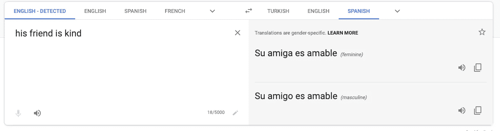
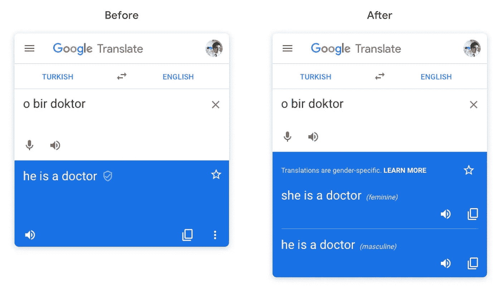

# 机器翻译中的性别偏见

> 原文：<https://towardsdatascience.com/gender-bias-in-machine-translation-819ddce2c452?source=collection_archive---------46----------------------->

莱昂纳多·大久保俊郎在 [Unsplash](https://unsplash.com?utm_source=medium&utm_medium=referral) 上的照片

## 机器翻译中性别偏见的故事和谷歌解决它的方法

2016 年 5 月 [ProPublica 发表了](https://www.propublica.org/article/how-we-analyzed-the-compas-recidivism-algorithm)一项分析，显示 COMPAS，一种通过预测被告重新犯罪的风险来指导美国判决的人工智能工具，存在种族偏见。黑人被告更有可能被错误地标记为高风险，而白人被告更有可能被错误地标记为低风险。

2018 年 10 月，亚马逊[承认](https://www.reuters.com/article/us-amazon-com-jobs-automation-insight/amazon-scraps-secret-ai-recruiting-tool-that-showed-bias-against-women-idUSKCN1MK08G)在发现该模式重男轻女后，他们已经放弃了一个自动审核申请人简历的项目。

2018 年，[谷歌宣布](https://www.google.com/amp/s/blog.google/products/translate/reducing-gender-bias-google-translate/amp/)在谷歌翻译[显示](https://www.google.com/amp/s/qz.com/1141122/google-translates-gender-bias-pairs-he-with-hardworking-and-she-with-lazy-and-other-examples/amp/)在将中性土耳其语翻译成英语时存在性别偏见后，他们正在采取第一步措施解决机器翻译中普遍存在的性别偏见。

# 机器学习中的偏差

偏见是当今围绕人工智能和机器学习的最大伦理问题之一。根据韦氏大词典的定义，偏见是

> 通过选择或鼓励一个结果或答案而引入抽样或测试的系统误差。

虽然机器学习模型可以是一个强大的工具，但它只能与它学习的数据一样好。因此，如果用于训练机器学习算法的数据中存在系统误差，那么产生的模型将会反映这一点。[俗话说](https://www.google.com/amp/s/dictionary.cambridge.org/amp/english/garbage-in-garbage-out)“垃圾进，垃圾出”。

paweczerwi ski 在 [Unsplash](https://unsplash.com?utm_source=medium&utm_medium=referral) 上的照片

在许多情况下，这并不是机器学习实践者在选择数据集或训练模型时主动偏向的结果。相反，固有的社会偏见，如性别或种族偏见，在本质上是特定社会历史记录的数据集中表现出来。反过来，这些数据集将它们的偏见传递给从中学习的机器学习模型。

作为一个例子，我们稍后将重新讨论，如果历史上*担任医生的男性*多于女性，那么基于历史数据训练的机器学习模型将学习到医生更可能是男性而不是女性，这与当前*医生中的*性别差异无关。

# 机器翻译中的性别偏见

机器翻译模型是在巨大的文本语料库上训练的，有成对的句子，一个句子是另一个句子的不同语言的翻译。然而，语言中的细微差别常常使得从一种语言到另一种语言提供准确和直接的翻译变得困难。

从英语翻译成法语或西班牙语等语言时，一些中性名词会被翻译成特定性别名词。比如“他的朋友是善良的”中的“朋友”这个词，在英语中是中性的。但在西班牙语中，它是有性别区分的，要么是“amiga”(阴性)，要么是“amigo”(阳性)。

在西班牙语中，“朋友”一词是有性别区分的，可以是“amiga”或“amigo”

另一个例子是从土耳其语到英语的翻译。土耳其语几乎是一种完全中性的语言。土耳其语中的代词“o”在英语中可以翻译成“他”、“她”、“它”中的任何一个。谷歌[声称](https://ai.googleblog.com/2018/12/providing-gender-specific-translations.html)他们 10%的土耳其语翻译查询是不明确的，可以正确翻译成任何性别。

在这两个例子中，我们可以看到一种语言中的短语如何正确地翻译成另一种语言，并根据性别有不同的变化。没有哪一个比另一个更正确，并且在没有提供进一步的上下文的情况下，具有相同翻译任务的人将面临相同的歧义。(唯一的区别是，也许人类会知道询问进一步的上下文，或者提供两种翻译。)这意味着当从一种语言翻译成另一种语言时，假设任何给定的单词、短语或句子总是有一个正确的翻译是不正确的。

现在很容易理解为什么谷歌翻译会有性别偏见的问题。如果社会偏见意味着历史上成为医生的男性比女性多，那么在培训数据中，男医生的例子就会比女医生多，这只是性别失衡的准确历史记录。该模型将从这些数据中学习，导致医生更可能是男性的偏见。

现在，当面临从土耳其语到英语为“o bir doktor”、“他/她是医生”找到一个*单个*翻译的任务时，模型会假设“o”应该被翻译为“他”，因为医生更可能是男性。

人们可能会看到护士会出现相反的情况。

照片由[在线营销](https://unsplash.com/@impulsq?utm_source=medium&utm_medium=referral)在 [Unsplash](https://unsplash.com?utm_source=medium&utm_medium=referral) 上拍摄

# 对中性查询进行分类

2018 年，当谷歌承诺迈出解决谷歌翻译中性别偏见的第一步时，他们的[解决方案](https://ai.googleblog.com/2018/12/providing-gender-specific-translations.html)涉及两个关键步骤。首先，他们创建了一个分类器来确定有资格被翻译成多种性别的查询。他们训练了他们的分类器，一个卷积神经网络，在数千个人类标记的例子中，人们被要求判断查询是否是性别中立的。

第二步是根据目标语言中是否包含阳性、阴性或中性词，将他们的训练集分成三组。然后，他们在查询的开头添加了一个额外的标记，以明确说明该查询应该转换成的性别:

*   他是一名医生
*   她是一名医生

这样，翻译者就知道将中性查询翻译成哪种性别。

在用户方面，这样做的结果是，如果分类器将查询标记为中性，并且没有明确要求，那么这个特性会将查询翻译成两种性别。

Google Translate 过去基于数据偏差假设中性查询的性别(左)，现在它同时提供阳性和阴性翻译(右)

# 审查性别翻译后

当时，谷歌声称这个新系统将“在 99%的时间里可靠地产生阴性和阳性翻译”。然而，在今年早些时候的博客[帖子](https://ai.googleblog.com/2020/04/a-scalable-approach-to-reducing-gender.html)中，他们收回了原话，称“随着这种方法被应用到更多的语言中，很明显在伸缩方面存在问题”。

他们声称有两个主要问题:

1.  该模型无法在多达 40%被视为性别中立的查询中显示性别特定的翻译。这意味着，即使指定目标语言中所请求性别的标记是正确的，模型也无法返回基于该性别的正确翻译。
2.  他们发现，用一个单独的分类器来确定每一种不同语言的性别中立性，数据过于密集。

相反，他们提出了一种新的方法，一种基于*重写器*的方法。在第一种情况下，不是将查询翻译成两种不同的性别，而是产生单个默认翻译。接下来是一个审查过程，以发现性别中立的查询导致特定性别翻译的实例。如果是这种情况，最初的翻译是用异性重写的。最后，为了确保准确性，将两种翻译进行相互比较，以确保唯一的差异是性别。

# 偏差减少

在设计新方法的过程中，谷歌还定义了一个新的指标，*偏差减少*，来衡量新系统相对于旧系统的改进。这是偏差减少的百分比，所以如果一个系统在 80%的时间里做出错误的特定性别选择，而新系统在 20%的时间里做出错误选择，偏差减少将是 75%。

照片由[乌萨马·阿扎姆](https://unsplash.com/@ussamaazam?utm_source=medium&utm_medium=referral)在 [Unsplash](https://unsplash.com?utm_source=medium&utm_medium=referral) 上拍摄

根据谷歌[博客](https://ai.googleblog.com/2020/04/a-scalable-approach-to-reducing-gender.html)的说法，在从土耳其语翻译成英语时，基于新重写器的系统的偏差减少了 95%，高于使用基于分类器的系统时的 60%。他们的性别翻译的精确度也是 97%，这意味着除了 3%的情况外，他们在所有情况下都正确显示了性别翻译。

# 结论

尽管谷歌不得不接受 2018 年 99%的数字，但它的新数字似乎更保守，也更有分寸。我们也希望他们能吸取教训，在发布指标时更加小心。但在现实中，谷歌将不得不等待，看看有多少愤怒的社交媒体帖子出现偏见谷歌翻译查询的截图！

与此同时，像谷歌这样的公司需要继续解决他们产品中不同的偏见问题。然而，他们不仅应该从过程的机器学习端解决这些问题，还应该考虑如何更好地收集数据，以避免一开始就出现偏差。