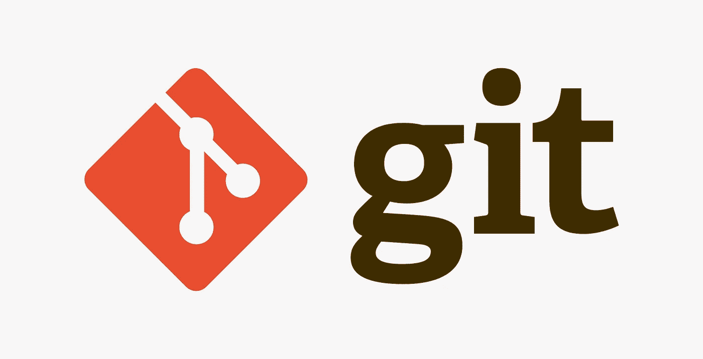
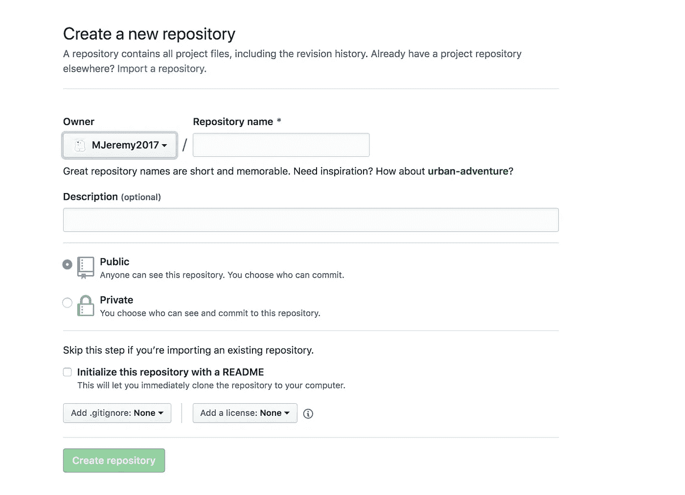

# 通用 Git 工作流程

> 原文：<https://towardsdatascience.com/general-git-workflow-94cb22d1f18a?source=collection_archive---------24----------------------->

## *使用 Git 时最常用的命令*

Git 是最常用的代码版本跟踪工具，可能每个开发人员都使用它，无论你使用 Github、Gitlab 还是 Bitbucket，只要你想分享你的代码或学习他人的代码，或与他人合作开发一个项目，git 都是必备的能力。

那里有很多 git 使用教程、命令介绍文章和文档。但坦率地说，当我查看大多数官方文档时，我被太多的命令和太详细的介绍填满了，这使我很难找到我真正需要的东西。因此，在本文中，我将只介绍您在使用 git 时肯定会用到的命令行工具。

我将分为两个工作流程:

1.  使用现有存储库
2.  创建自己的存储库



# 使用现有存储库

当你在一家公司工作时，这是最常见的，在大多数情况下，你需要从其他人那里接管一个项目，或者只是在一个大型项目上与其他开发人员合作。一般的工作流程是:

给自己找一个工作文件夹

```
cd {YOUR_FOLDER}
```

克隆项目(使用 SSH 或 HTTPS)

```
git clone {PROJECT_PATH}
```

现在项目已经下载到你的本地计算机上，你就在主分支了。下一步是创建您自己的分支，并在该分支上开发您的特性。**如果你不是项目的所有者或者你和许多其他开发人员一起工作，千万不要直接在主分支**上进行变更。经验法则是，我们总是把母版制作得干净整洁，直到可以投入生产。

```
git checkout -b {YOUR_BRANCH_NAME}
```

如果你已经有一个分支，需要转移到那个分支，你只需要

```
git checkout {YOUR_EXISTING_BRANCH}
```

好了，现在你在你的分支上，你做了一些改变。一切看起来都很好，您认为您已经准备好向 master 更新您的更改了。然后，您需要首先将您的更改提交到本地:

```
# check what files you've changed
git status# add those files to staging
git add .# commit your files
git commit -m "what I have done"
```

这三个命令可能是 git 最常用的命令。除了添加所有你修改过的文件的`git add .`，你还能做什么

```
git add {LIST OF SPECIFIC FILES}
```

并分别提交。

***提示***

*运行* `*git status*` *后，您发现一些您不打算添加到提交中的系统文件，如* `*.idea, __cache__*` *等。然后你需要编辑你的* `*.gitignore*` *文件(或者如果根文件夹中不存在就直接添加)。*

`*.gitignore*` *顾名思义就是告诉 git 故意忽略一些不必要的文件，这样 git 就会跟踪这些文件的变化。例如，您可以添加*

```
*.idea
*/**/.idea*
```

*变成你的* `*.gitignore*` *。*

*你可以做的另一件事是使用* `*git rm*` *，它从 git 中移除文件并停止跟踪它，而不是从你的电脑中！*

现在您已经提交了您的文件，并且您对它们很有信心，所以让我们推进到远程并合并到主文件。

```
git push origin {YOUR_BRANCH_NAME}
```

在大多数情况下，你不能做`git push origin master`，因为你的授权是受限的。但即使可以，也不应该这么做。这里的规则是，如果你在一个分支上工作，总是推到远程分支。上面的命令将您的本地分支推送到远程分支(如果远程分支不存在，git 将帮助您创建一个)。

当您执行上述命令时，通常它会在控制台中返回一个 url，引导您提交一个合并请求。请注意，这个合并请求是将您的远程分支合并到远程主服务器。您可以提交您的合并请求，并让回购所有者批准合并到主(可能需要单独解决冲突的方式)。

***提示***

*假设远程主机非常活跃，并且有许多其他开发人员正在开发它。在提交合并请求之前，您希望将新的更改合并到远程主分支中，并可能解决本地主分支中的冲突。那么你可以这样做:*

```
*# go to your local master
git checkout master**# merge your local master with remote master
git pull origin master**# go to your branch
git checkout {YOUR_BRANCH}**# merge master into your branch
git rebase master*
```

*最后一步你还可以做* `*git merge master*` *。他们以不同的方式绑定了 git 提交的历史。你可以在这里* *查看* [*的区别。*](https://www.atlassian.com/git/tutorials/merging-vs-rebasing)

这些基本上都是关于与他人一起工作，使用最常用的命令，以及您可能遇到的问题。

# 创建自己的存储库

想想当你在笔记本电脑上做自己的项目时，突然它在你的脑海中闪现——这是一个多么棒的项目！我要和别人分享！

酷，让我们创建自己的回购协议，并把我们的代码放在网上。它分为两步:

## 创建远程存储库

转到您的 Github、GitLab 或 Bitbucket，并选择 create a new repository。这里我以 Github 为例:



给你的项目一个名字和一些描述，然后点击`Create repository`按钮。

将克隆按钮中的 URL(SSH 或 HTTPS)复制到剪贴板，我们稍后会用到它。

现在回到你的牛逼项目文件夹根目录

```
cd {YOUR_PROJECT_ROOT}
```

用 git 初始化你的项目

```
git init
```

这会在你的文件夹中启动 git，如果你运行`ls -a`，你将会在你的根文件夹中看到隐藏的文件`.git`，它告诉你从现在开始，git 将会跟踪这个文件夹中的每一个变化。

接下来是将您的本地文件连接到您的远程 repo，如果您运行

```
git remote -v
```

这将列出您当前项目的远程 url，到目前为止它应该是空的，因为您创建了一个远程 repo，您还告诉 git 跟踪您的文件，但是您还没有告诉 git 如何将您的本地 repo 连接到远程。为此，请运行:

```
git remote add origin {URL_OF_YOUR_REPO}
```

这将您的本地项目与您刚刚创建的远程 repo 连接起来，并给它一个昵称`origin`(您可以随意命名，但人们通常将其命名为 origin)。

***提示***

*一个本地 repo 实际上可以连接多个不同 URL 的远程 repo。你只要做:*

```
*git remote add upstream1 {SECOND_URL}**git remote add upstream2 {THIRD_URL}**...*
```

*这样，当您在本地进行更改时，您可以同时更新多个远程回购。*

现在再次运行`git remote -v`，你会看到你的网址列在那里。让我们推出改变，分享我们的代码！

添加和提交代码的步骤是一样的:

```
# check what files you've changed
git status# add those files to staging
git add .# commit your files
git commit -m "what I have done"
```

要将您的更改推送到遥控器，有两种情况。

1.  如果遥控器有一些文件不包含在你的本地，比方说，一个`README.md`的创建回购初始化，你需要:

```
git pull origin master --allow-unrelated-histories# resolve conflicts and then push to remotegit push origin master
```

`allow-unrelated-histories`是在分支独立开始时合并它们，这里就像你的本地文件夹和你的远程 repo。

2.如果你的遥控器是干净的，那么就做`git push origin master`。

***提示***

*你不需要每次都输入回购名称。运行*

```
*git push --set-upstream origin master*
```

*这明确告诉我们* `*origin*` *将会被默认分支推送到，这样下次你只需要运行* `*git push*` *。*

***提示***

*当您在本地有多个分支，并且您需要在分支之间跳转时，您可能会遇到 git 告诉您在切换分支之前提交的问题，但是您不确定当前的更改，并且您不想提交，在这种情况下，您可以:*

```
*git stash*
```

这将保存您的更改，并使您能够跳转到另一个分支而无需提交它们。当你回到这个分支时，你可以运行:

```
*git stash pop*
```

*恢复您刚才所做的更改。*