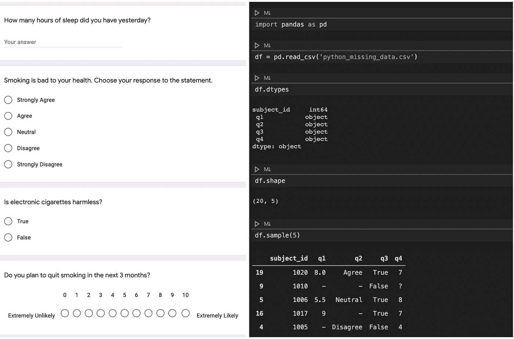
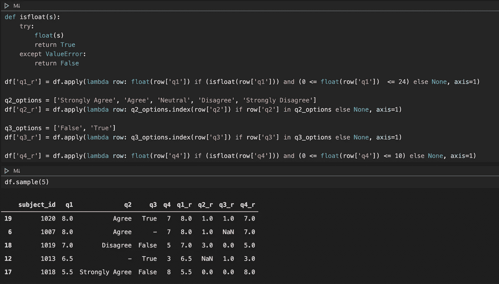
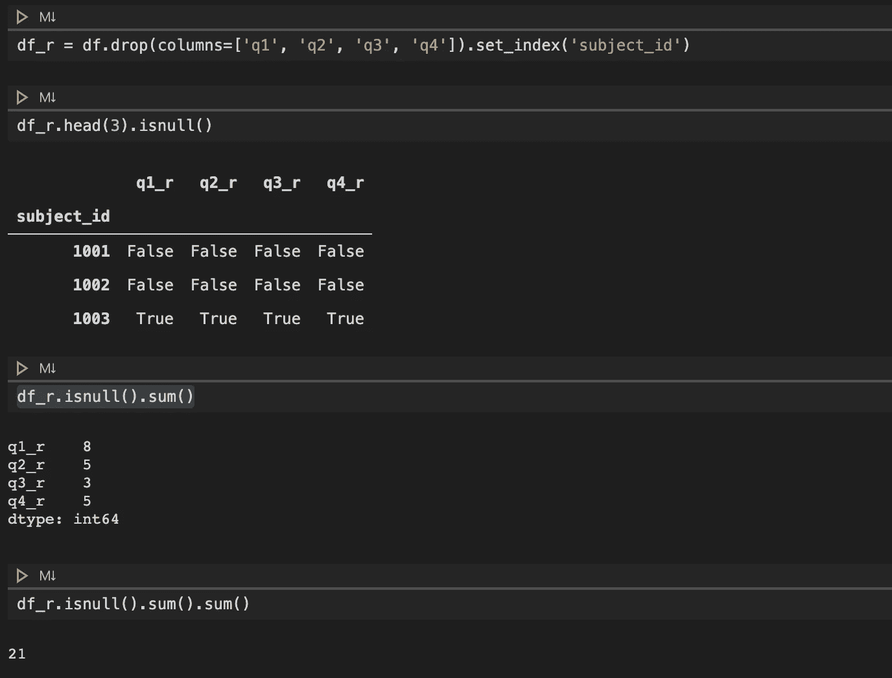
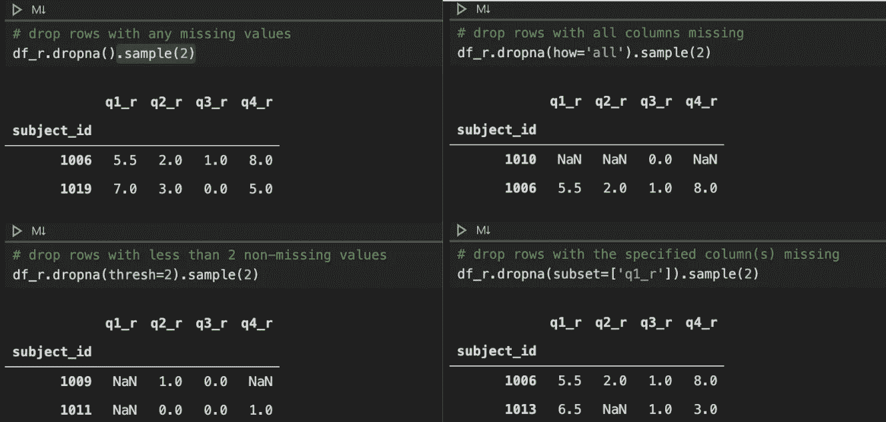
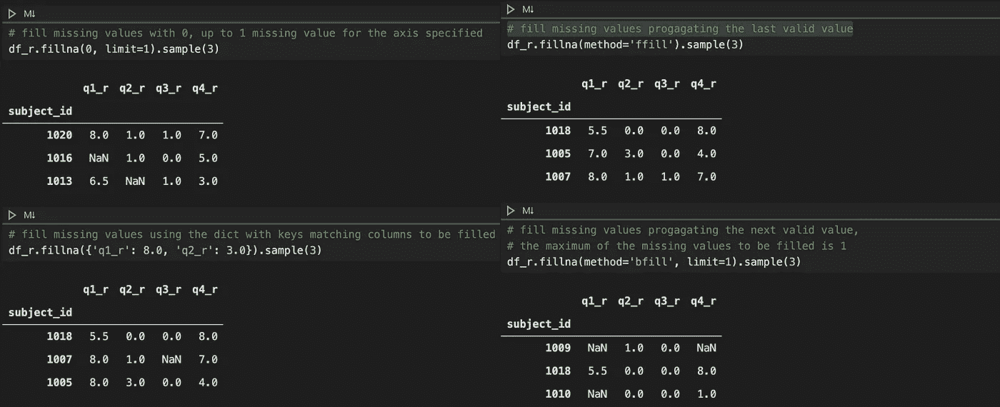

# 处理熊猫丢失数据的一般准则

> 原文：<https://towardsdatascience.com/general-guidelines-on-handling-missing-data-in-pandas-67e03a3e343c?source=collection_archive---------28----------------------->

图片由 Willi [Heidelbach](https://pixabay.com/users/wilhei-883152/?utm_source=link-attribution&amp;utm_medium=referral&amp;utm_campaign=image&amp;utm_content=693865) 来自 [Pixabay](https://pixabay.com/)

## 缺失值在现实生活的数据集中很常见。需要正确处理它们，以便进一步处理和正确解释数据。

作为一名成瘾科学家，我的研究包括从临床试验的社区参与者那里收集数据。一些参与者可能会跳过临床访视，因此数据可能会在整个访视中丢失。有时，参与者可以跳过某个问卷的一些问题，导致部分数据缺失。参与者在需要整数值的地方输入不相关的自由文本的情况也时有发生。由于这些不同的原因，临床数据中缺失值是很常见的。

因此，处理缺失值是处理临床数据的常规任务，这也适用于许多其他真实数据。在本文中，通过一个假设的例子，我将向您展示我们应该如何处理 Pandas 中丢失的数据 Pandas 是我最喜欢的数据处理 Python 包之一。出于本教程的目的，我在 [GitHub](https://gist.github.com/ycui1/dd33483219aeec871b9137a1e7925235) 上创建了一个假想的数据集。当然，实际的临床数据或其他现实生活中的数据可能更混乱，因此也更复杂，但同样的原则也适用。

# 第一步。了解您的数据

**基本原理:**了解数据大小和数据类型的有效性(例如，预期的数据类型和范围)。

第一步是理解你正在处理的数据。例如，假设我们的数据是对调查的回答的集合，包括下面左面板中显示的四个问题。在右边的面板中，我们将数据作为熊猫的数据框导入，并快速查看数据框。我们知道数据帧有 20 行和 5 列，subject_id 是整数，而其余的字符串。

当然，在实际的数据处理中，我通常会运行一些分类变量的频率表和数值变量的单变量分析，以更深入地了解我们的数据。这些超出了本文的范围，我们可以在以后的单独文章中讨论它们。

假设调查数据

# 第二步。记录数据

理由:我们需要检查我们所有的数据是否有效。为了方便起见，我们将重新编码我们的数据。但是，如果某些值无效，我们将把它们重新编码为缺失。

对于这四个问题，我们希望 q1-q4 的回答遵循下面的验证规则。为了方便起见，我还列出了我们将为现有列重新编码的数据类型。

数据验证规则

因为我们确切地知道数据应该是什么样子，所以我们可以开发详细的验证规则，并在验证和重新编码过程中将这些规则应用到每一列。

下面的代码向您展示了我们将如何做。为清楚起见，这四列(即 q1-q4)中的每一列都单独重新编码。请注意，我们现在仍然希望保留旧的列，这样我们可以将它们与重新编码的列进行比较，以确保数据被正确地重新编码。

数据记录

# 第三步。检查丢失的数据

基本原理:在我们对缺失数据做任何事情之前，我们需要找出我们有多少缺失数据。

一旦我们完成了数据记录，我们就可以检查我们的数据集中有多少缺失的数据。因为我们现在只对重新编码的列感兴趣，所以我们可以简单地删除旧列，只检查新列的数据缺失。我们注意到的另一件事是，每条记录对于一个主题是唯一的，因此我们可以在删除旧列后使用 subject_id 作为索引创建一个新的数据框。

检查数据缺失

如上图所示，我们可以使用`isnull()`来评估每个单元格是否缺失(`True`)或不缺失(`False`)。由于真值被评估为 1，当我们使用`sum()`函数时，可以显示每一列缺失值的数量。为了找出总的缺失数，我们只需运行`df_r.isnull().sum().sum()`，在我们的例子中，我们有 21 个缺失值。

与这个主题相关的是另一个方法`isna()`，它做的事情和`isnull()`一样。如果要检查非缺失数据，可以使用`notna()`或`notnull()`方法。

# 第四步。处理缺失值

**基本原理:**需要显式处理缺失值，以避免数据集的错误解释。

缺失数据的处理方式由几个因素决定，例如缺失的性质(例如，随机缺失或非随机缺失)和潜在的预期措施—生物、心理或物理。换句话说，缺失是在数据的大背景下逐案处理的。本节将向您展示一些处理缺失数据的常用方法。

## **删除缺失值的数据记录**

第一种方法是删除缺少值的数据记录。下面的代码片段向您展示了我们如何使用`dropna()`方法来删除丢失数据的行。当然，我们可以在列上做类似的操作，但是我们通常不这么做，因为列在大多数时候是研究兴趣的变量。下面使用的每种方法都有其预期应用的简要描述。

删除缺少值的记录

使用`dropna()`方法的几个要点:

*   `thresh`参数指定了指定轴的每个系列应该具有的非缺失值的最小数量。
*   您可以使用`'any’`和`‘all’`作为`how`参数，这将删除丢失部分或全部值的记录。
*   您可以删除指定轴、行或列上的缺失值。
*   除非方法调用指定了`inplace=True`，否则`dropna()`方法不会改变原始数据帧。

## 用缺失值填充数据记录

另一种方法是用一些值来填充缺失的值。为此，我们可以使用`fillna()`方法。与`dropna()`方法类似，您可以在两个轴上使用`fillna()`。下面的代码片段提供了一些常见的用例。

用缺失值填充记录

使用`fillna()`方法的几个要点:

*   `limit`参数指定要填充的最大记录数。当设置了`method`参数时，该限制适用于上一个和下一个可用有效值之间的间隔，当未设置该参数时，该限制适用于列。
*   您可以使用`'ffill'`和`'bfill'`作为`method`参数，它们分别使用最后一个或下一个有效值来填补空白。
*   您可以填充指定轴、行或列上缺少的值。
*   除非方法调用指定了`inplace=True`，否则`fillna()`方法不会改变原始数据帧。

# **外卖**

处理缺失值并不像某些人想象的那么简单。一些研究人员经常忽略的部分实际上是我们数据处理的最早步骤——从内容角度理解我们数据的含义。例如，对于我自己作为一名成瘾科学家，我总是检查我的数据集对应哪些问题，基于这些问题，我可以正确处理缺失的数据。

因此，我不能再强调这一点，但最大的收获是在彻底理解数据内容含义的情况下处理数据。