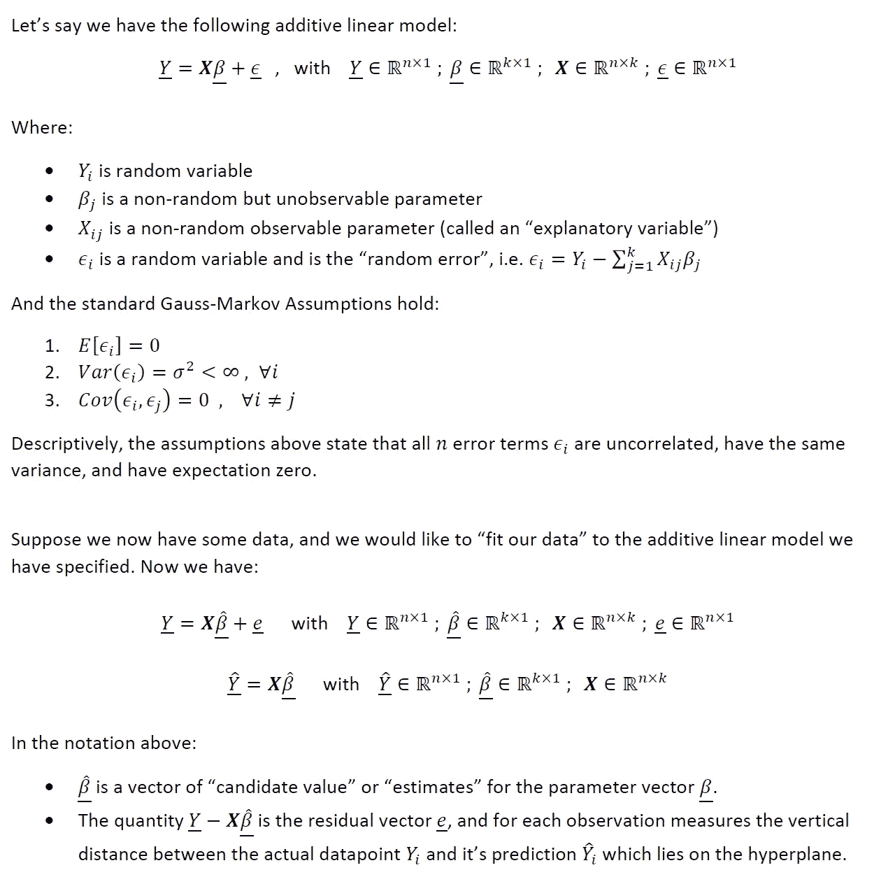
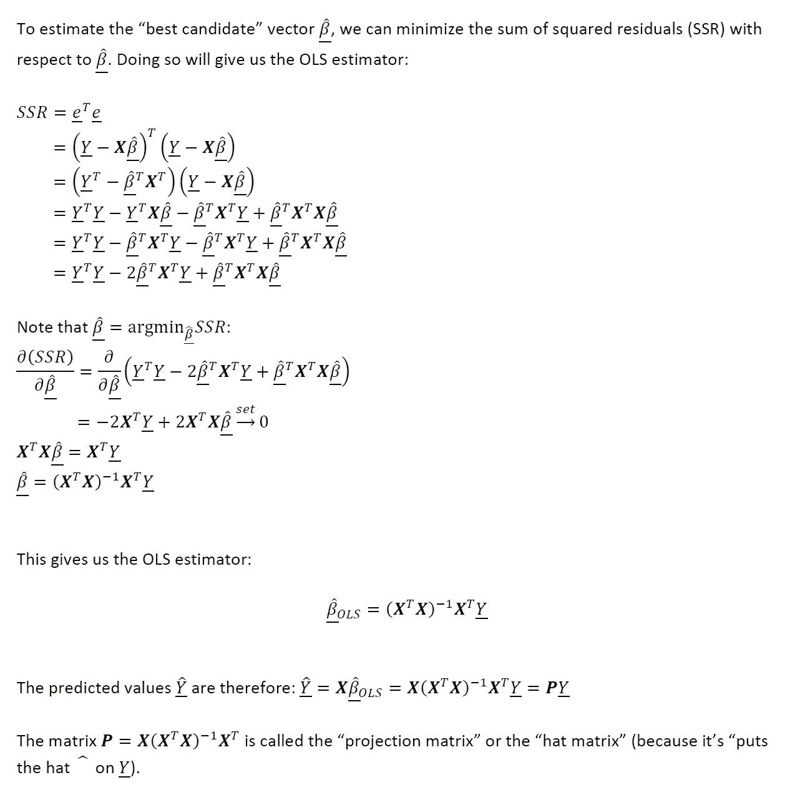
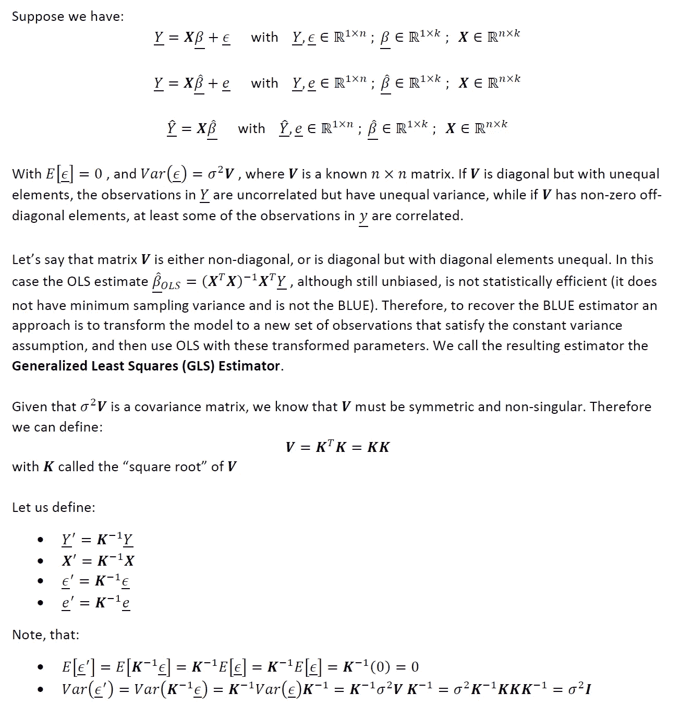
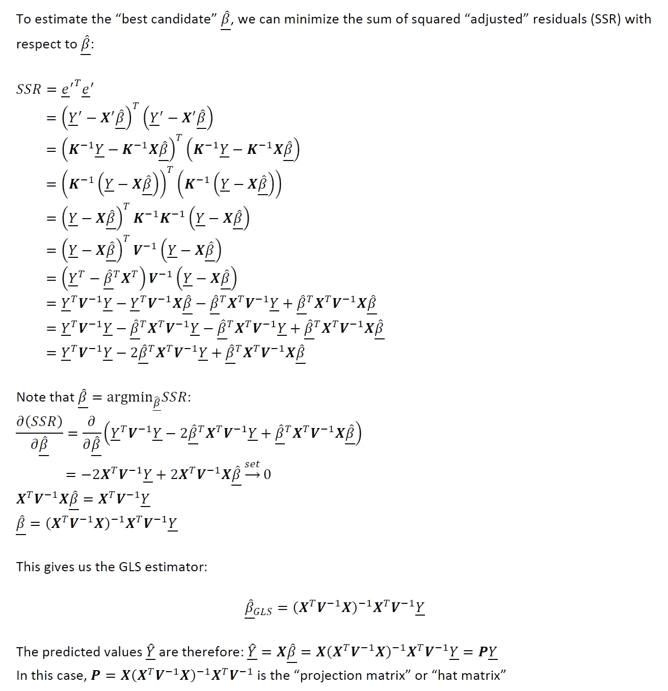
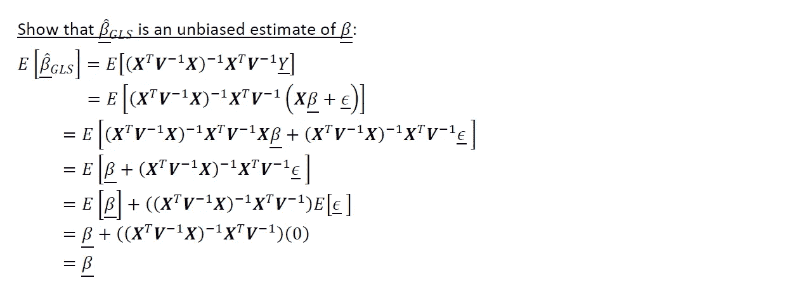
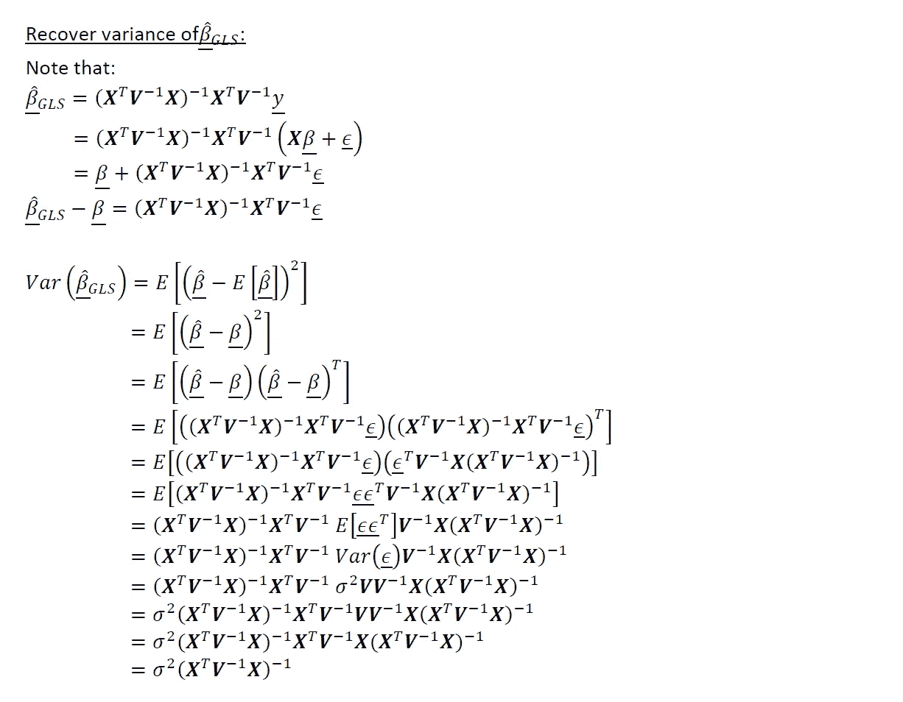
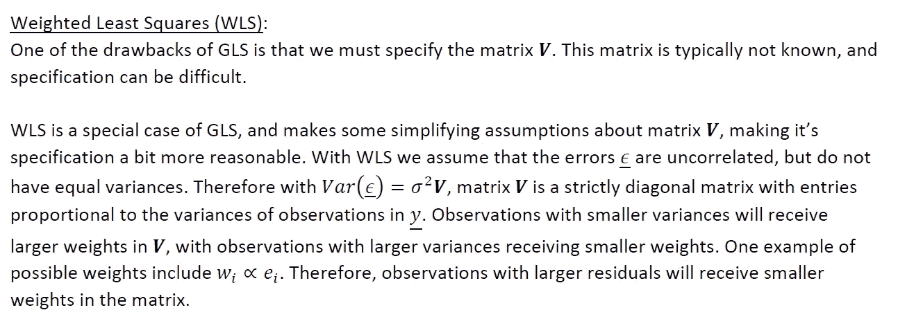

# 广义最小二乘法(GLS):与 OLS 和 WLS 的关系

> 原文：<https://towardsdatascience.com/generalized-least-squares-gls-mathematical-derivations-intuition-2b7466832c2c?source=collection_archive---------5----------------------->

## 通过数学推导和直觉

# 背景和动机

对于任何从事统计学或机器学习研究的人来说，普通最小二乘(OLS)线性回归是第一个也是最“简单”的方法之一。但是，有一组数学限制，在这些限制下，OLS 估计量是最佳线性无偏估计量(BLUE)，即具有最小采样方差的无偏估计量。 *(* [*)关于 OLS、蓝色和高斯-马尔科夫定理的更全面的概述，请参见我以前关于这个主题的文章*](/ols-linear-regression-gauss-markov-blue-and-understanding-the-math-453d7cc630a5) *)*

如果 OLS 是蓝色的数学假设不成立呢？下一个“飞跃”是**广义最小二乘(GLS)** ，其中的 OLS 实际上是一个特例。这篇文章是对 GLS 的介绍，包括以下主题:

1.  回顾 OLS 估计量及其为蓝色所需的条件
2.  广义最小二乘法的数学设置(GLS)
3.  恢复 GLS 估计量
4.  GLS 估计量无偏的证明
5.  恢复 GLS 估计量的方差
6.  浅谈加权最小二乘(WLS)的关系

请注意，在本文中，我是从频率主义范式(与贝叶斯范式相反)出发的，主要是为了方便起见。所以，让我们开始吧:

# 1.OLS 估计量及其为蓝色的条件评述

让我们先快速回顾一下 OLS 估计量

作者图片

作者图片

关于 OLS 估计量的更多信息和它的无偏性的证明，[请参见我以前关于这个主题的文章](/ols-linear-regression-gauss-markov-blue-and-understanding-the-math-453d7cc630a5)。

# 2.广义最小二乘法的数学设置(GLS)

作者图片

# 3.恢复 GLS 估计量

作者图片

# 4.GLS 估计量无偏的证明

作者图片

# 5.恢复 GLS 估计量的方差

作者图片

# 6.浅谈加权最小二乘(WLS)的关系

作者图片

# 总结、最终想法和后续步骤

广义最小二乘(GLS)是一个大话题。这篇文章是一个简短的介绍，旨在从数学上为 GLS“设置场景”。还有更多的内容需要介绍，包括(但不限于):

1.  对 WLS 更深入的探究
2.  指定协方差矩阵 **V** 的方法和途径
3.  可行广义最小二乘的主题
4.  与迭代加权最小二乘法(IRLS)的关系

我计划在以后的文章中深入讨论这些主题。

希望以上有见地。正如我在以前的一些文章中提到的，我认为没有足够的人花时间去做这些类型的练习。对我来说，这种基于理论的洞察力让我在实践中更容易使用方法。我个人的目标是鼓励该领域的其他人采取类似的方法。我打算在未来写一些基础作品，所以请随时在[**【LinkedIn】**](http://www.linkedin.com/in/andrew-rothman-49739630)和 [**上与我联系，并在 Medium**](https://anr248.medium.com/) 上关注我的更新！