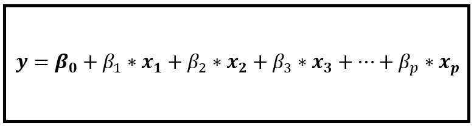
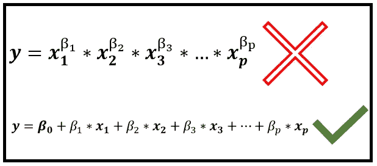
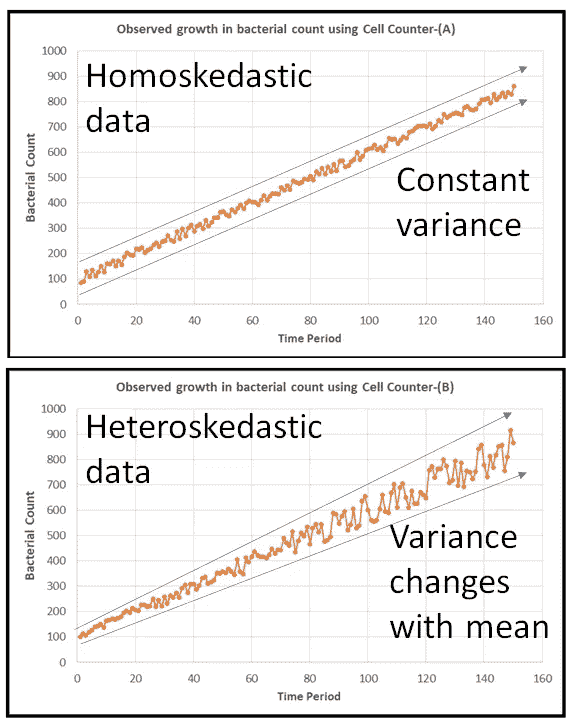
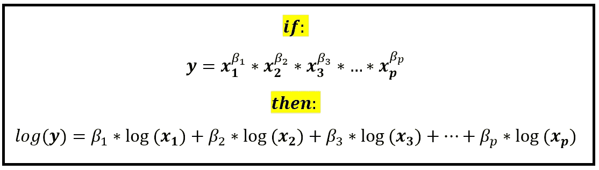
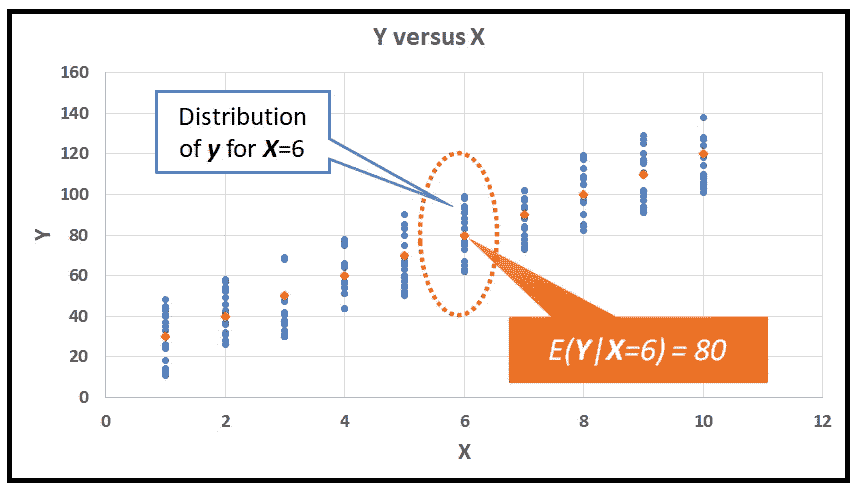
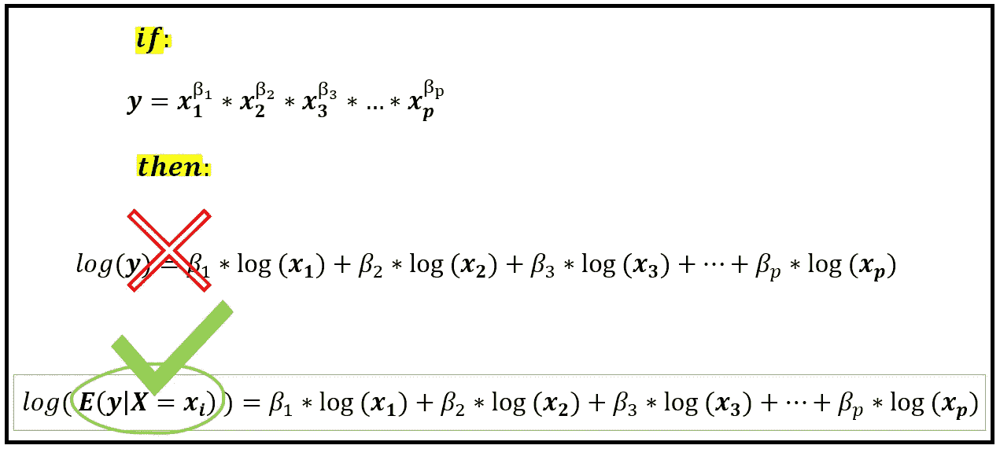
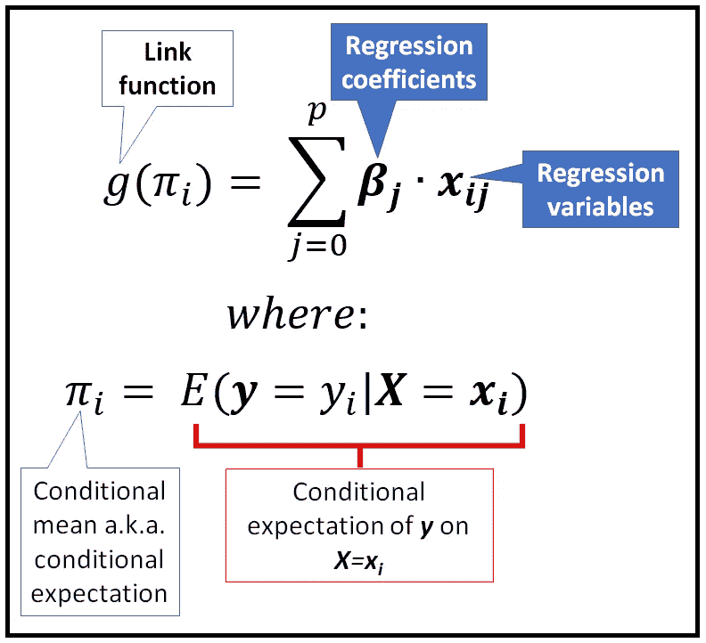
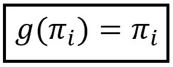
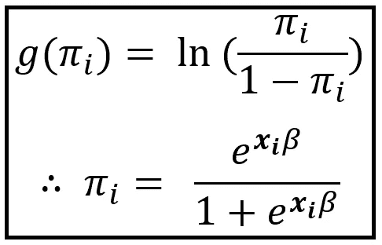
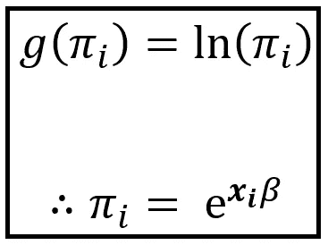

# 广义线性模型

> 原文：<https://towardsdatascience.com/generalized-linear-models-9ec4dfe3dc3f?source=collection_archive---------8----------------------->


[克利夫顿吊桥](https://www.flickr.com/photos/sagesolar/7858490506)(版权:[萨格索尔](https://www.flickr.com/photos/sagesolar/)下 [CC BY 2.0](https://creativecommons.org/licenses/by/2.0/) )

它们是什么？我们为什么需要它们？

广义线性模型(GLMs)诞生于将各种各样的回归模型纳入一个保护伞之下的愿望，这些模型涵盖了从用于实值数据的经典线性回归模型到基于计数的数据模型(如 Logit、Probit 和 Poisson)再到生存分析模型的范围。

## GLM 伞下的模特

GLMs 为您提供了一种通用的方法，使用一个通用的过程来指定和训练以下类别的模型:

1.  经典线性回归(CLR)模型，俗称实值(和潜在负值)数据集的线性回归模型。
2.  方差分析模型。
3.  计数比率模型。例如预测获胜几率、机器故障概率等的模型。这类模型的一些例子是 Logit 模型(用于逻辑回归)、概率单位和有序概率单位模型，以及非常强大的二项式回归模型。
4.  用于解释(和预测)事件计数的模型。例如，用于预测超市、购物中心、急诊室的客流量的模型。这类模型的例子有泊松和负二项式回归模型，以及栅栏模型。
5.  预测零件、机器(和人类)下次故障时间的模型。估算生物(和非生物)寿命的模型。

当上述看似不同的回归模型中的每一个都以广义线性模型的格式表达时(我们将很快解释这种格式是什么)，它给建模者带来了为所有这样的模型应用公共训练技术的巨大好处。

> 对于广义线性模型，人们使用一种通用的训练技术来训练一组不同的回归模型。

此外，GLMs 允许建模者以线性和加法方式 *表达回归变量(又称为协变量、又称为影响变量、又称为解释变量) ***X*** 和响应变量(又称为因变量) ***y*** 、**之间的关系，即使基础关系可能既不是线性的也不是加法的***。

> 广义线性模型让您以线性、相加的方式表达协变量 ***X*** 和响应 ***y*** 之间的关系。

## 与经典线性回归模型的关系

说到线性和可加性，线性回归模型是一种简单而强大的模型，可成功用于建模线性、可加性关系，如下所示:



回归变量 *x_1，x_2，x_3，…x_p* 是加性相关的(图片由[作者](https://sachin-date.medium.com/)

CLR 模型通常是“首选模型”:在为自己的问题选择复杂模型之前，应该仔细比较复杂模型。

CLR 模型具有明显的优势:

在满足某些条件的情况下，它们有一个简洁的“封闭形式”解，这意味着，它们可以通过简单地求解线性代数方程来拟合，即根据数据进行训练。

解释训练模型的系数也很容易。例如，如果训练的 CLR 模型由以下等式表示:


拟合的线性回归模型(图片由[作者](https://sachin-date.medium.com/)提供)

从这个等式中可以清楚地看出这个模型已经发现了什么:露营者人数每增加一个单位，捕获的鱼的数量就会增加 75%左右，而露营小组的儿童人数每增加一个单位，该小组捕获的鱼的数量就会减少相同的数量！此外，在捕捉到任何鱼之前，需要一个至少 3 人的野营小组(=roundup(2.49))。

但是经典的线性回归模型也有一些严格的要求，即:

*   **加性关系:**经典线性模型假设回归变量之间应该存在加性关系。



乘法和加法关系(图片由[作者](https://sachin-date.medium.com/)提供)

*   **同方差数据:**经典线性模型假设数据应该具有恒定方差，即数据应该是同方差的。在现实生活中，数据往往是*而不是*同质的。方差不是常数，有时它是平均值的函数。例如，方差随着平均值的增加而增加。这在货币数据集中很常见。



同方差和异方差数据(图片由[作者](https://sachin-date.medium.com/)提供)

*   **正态分布误差:**经典线性模型假设回归误差(也称为残差)正态分布，均值为零。这个条件在现实生活中也很难满足。
*   **不相关变量:**最后，假设回归变量之间不相关，最好是相互独立的。

因此，如果您的数据集是非线性的、异方差的并且残差不是正态分布的，这在现实世界的数据集中是常见的情况，那么需要对***【y】***和***【X】***进行适当的变换，以便使关系呈线性，同时稳定方差并使误差正常化。

平方根和对数变换通常用于实现这些效果，如下所示:



对数将乘法关系转换为加法关系(图片由[作者](https://sachin-date.medium.com/)提供)

不幸的是，没有一种可用的变换能同时达到所有三种效果，即使关系线性、使异方差最小化和使误差分布正常化。

转换方法还有另一个大问题，如下所示:

回想一下 ***y*** 是一个随机变量，它遵循某种概率分布。所以对于数据集中任何给定的 ***x*** 值的组合，现实世界很可能呈现给你几个 ***y*** 的随机值，而这些可能值中只有一部分会出现在你的训练样本中。在现实世界中， ***y*** 的这些值将围绕 ***y*** 的条件均值随机分布，给定*x 的具体值，y 的条件均值由*E(****y****|****x****)表示这种情况可以说明如下:**

**

*条件期望 E( ***y|x)*** *如红点*所示(图片由[作者](https://sachin-date.medium.com/))*

*在变量转换方法中，我们做了一个不切实际的假设，即在使用 *log()、sqrt()* 等进行转换后， ***y*** 的每个单个值，即上面图中的每个蓝点。，最终会和 ***X*** 成线性关系。这显然是过高的期望。*

*似乎更现实的是，***【y】***的*条件均值(又名期望)，即*E(****y****|****X****，)*经过适当的变换，应该与 ***X*** 成线性关系。**

*换句话说:*

**

*条件期望的对数，表示为协变量的线性组合(图片由[作者](https://sachin-date.medium.com/)提供)*

*广义线性模型做出了上述至关重要的假设，即转换后的条件期望 ***y*** 是回归变量 ***X*** 的线性组合。*

*该转换函数被称为 GLM 的**链接函数**，并由 *g(.)**

*我们举例说明 *g()* 的动作如下:*

**

*广义线性模型的链接函数(图片由[作者](https://sachin-date.medium.com/)提供)*

*因此，GLMs 不是为每个*转换 ***y*** 的每个单个值，而是只为每个 ***x*** 转换 ***y*** 的条件期望。所以不需要假设 ***y*** 的每一个单值都可以表示为回归变量的线性组合。**

> **在广义线性模型中，将因变量 ***y*** 的转换条件期望表示为回归变量 ***X*** 的线性组合。**

**链接功能 *g(。)*可以采取多种形式，我们根据什么形式得到不同的回归模型 *g(。)*不紧不慢。下面是一些流行的形式和它们导致的相应回归模型:**

## **线性回归模型**

**在线性模型中， *g(。)*是下面的 ***身份*** 功能:**

****

**线性回归模型使用的身份函数(图片由[作者](https://sachin-date.medium.com/))**

## **逻辑回归模型(通常是二项式回归模型)**

**在逻辑回归模型中， *g(。)*是下面的 ***Logit*** 功能:**

****

**逻辑回归模型使用的 Logit(对数优势)函数(图片由[作者](https://sachin-date.medium.com/)提供)**

## **泊松回归模型**

**泊松回归模型使用以下*函数:***

******

***泊松回归模型使用的对数函数(图片由[作者](https://sachin-date.medium.com/)提供)***

****g 还有很多其他的变体(。)*如泊松-伽马混合导致负二项式回归模型和正态分布的累积分布函数的逆，从而导致 probit 模型。***

## **如何处理数据中的异方差？**

**最后，让我们看看 GLMs 如何处理异方差数据，即方差不恒定的数据，以及 GLMs 如何处理潜在的非正态残差。**

**glm 通过假设方差是均值的某个函数 *V( )* ，或者更准确地说是条件均值*|****X = X***来说明非恒定方差的可能性。**

**在上面提到的每个模型中，我们假设一个合适的方差函数*V(|****X****=****X****)*。**

> **在广义线性模型中，将数据中的方差表示为平均值 ***的合适函数。*****

**在**线性回归模型**中，我们假设 ***V( ) =某常数*** ，即方差为常数。为什么？因为线性模型假设 ***y*** 是正态分布，一个正态分布有一个恒定的方差。**

```
****Related Post:** [Robust Linear Regression Models for Nonlinear, Heteroscedastic data](/robust-linear-regression-models-for-nonlinear-heteroscedastic-data-14b1a87c1952)**
```

**在 **Logistic 和二项式回归模型** s 中，我们假设， ***V( ) = — /n*** 为一个数据集大小为 *n* 的样本*，*为一个 Logit 所要求分布的 ***y*** 值*。***

```
****Related Post:** [The Binomial Regression Model: Everything you need to know](/the-binomial-regression-model-everything-you-need-to-know-5216f1a483d3)**
```

**在**泊松回归模型**中，我们假设 ***V( ) =。*** 这是因为，泊松回归模型假设*y 具有泊松分布，在泊松分布中，*方差=均值*。***

```
****Related Post:** [An Illustrated Guide to the Poisson Regression Model](/an-illustrated-guide-to-the-poisson-regression-model-50cccba15958)**
```

**在**负二项回归模型**中，我们假设***V()=*+α****，其中 *α* 是一个分散参数，它允许我们处理过度分散或分散不足的数据。***

```
****Related Post:** [Negative Binomial Regression Model: A Step by Step Guide](/negative-binomial-regression-f99031bb25b4)**
```

**…其他型号也是如此。**

**在 GLMs 中，可以证明模型对残差的分布形式不敏感。简而言之，模型不关心模型的误差是正态分布还是以任何其他方式分布，只要您假设的均值-方差关系实际上满足您的数据。**

> **广义线性模型不关心残差是否正态分布，只要数据满足指定的均值-方差关系。**

**这使得 GLMs 成为许多真实世界数据集的实际选择，这些数据集是非线性和异方差的，并且我们不能假设模型的误差总是正态分布的。**

**最后，提醒一句:与经典的线性回归模型类似，GLMs 也假设回归变量彼此不相关。因此，GLMs 不能用于建模通常包含大量自相关观测值的时间序列数据。**

> **广义线性模型不应用于模拟自相关时间序列数据。**

## **摘要**

**广义线性模型将各种不同的回归模型(如经典线性模型、各种数据计数模型和生存模型)汇集在一个估计伞下。**

**以下是关于 GLMs 需要记住的一些事情的概要:**

*   **GLMs 巧妙地避开了经典线性模型的几个强要求，如效应的可加性、数据的同方差性和残差的正态性。**
*   **GLMs 在 GLM 家族的所有模型上强加了一个通用的函数形式，它由一个链接函数*g(|****X****=****X****)*组成，允许您将因变量*的转换条件均值表示为回归变量*的线性组合。****
*   ***GLMs 需要指定合适的方差函数*V(|****X****=****X****)*，用于将数据中的条件方差表示为条件均值的函数。什么形式 *V(。)*取值取决于数据集中因变量 ***y*** 的概率分布。***
*   **glm 并不关心误差项的分布形式，因此对于许多真实世界的数据集来说，glm 是一个实用的选择。**
*   **GLMs 确实假设回归变量 ***X*** 是不相关的，从而使得 GLMs 不适于对自相关时间序列数据建模。**

**快乐造型！**

***感谢阅读！我写关于数据科学的主题，重点是回归和时间序列分析和预测。***

***如果你喜欢这篇文章，请关注我的*[***Sachin Date***](https://timeseriesreasoning.medium.com)*获取回归和时间序列分析方面的技巧、操作方法和编程建议。***