# R 中的广义对图

> 原文：<https://towardsdatascience.com/generalized-pairs-plot-in-r-6bbfde2c98b8?source=collection_archive---------16----------------------->

## 用关联矩阵可视化您的数据


Artur Tumasjan 在 [Unsplash](https://unsplash.com?utm_source=medium&utm_medium=referral) 上拍摄的照片

您的创新想法可能来自对您的数据的详细探索。大多数情况下，数据将包含连续变量和分类变量。你需要从中找到可以解释的模式。如果它可以在一个图表中有条理地显示出来，并且您可以用简单而简短的代码行来实现它，那会怎么样？

## 为什么是 R？

[**R**](https://cran.r-project.org/) 是统计计算 R 基金会支持的统计计算和图形开源编程语言。使用其广泛使用的集成开发环境- [**RStudio**](https://rstudio.com/) 既易学又舒适。

## 安装软件包

首先，我们需要用下面的代码安装所需的包。

```
**install.packages("tidyverse")
install.packages("GGally")
install.packages("ISLR")**
```

**‘tidy verse’**包用于数据争论&数据可视化。广泛使用的**‘gg plot 2’**封装在**‘tidy verse’**中。 **GGally** 通过在**【gg plot 2】**中增加几个函数，降低了将几何对象与转换数据结合的复杂性。在本练习中，我们将使用大西洋中部工资数据 a，其中包含美国大西洋中部地区 3000 名男性工人的工资数据。**“ISLR”**加载此数据集需要包。

## 加载包

这些包需要安装一次，但是每次运行脚本时，你都需要用`**library**`函数加载这些包。

```
**library(tidyverse)
library(GGally)
library(ISLR)**
```

## 浏览数据集

我们将使用`**data**`函数加载数据集，并使用`**glimpse**`和`**head**`函数探索数据集。

```
**data(Wage)****glimpse(Wage)
head(Wage)**
```

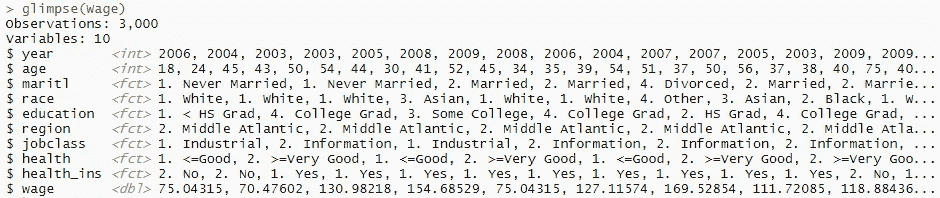

作者图片

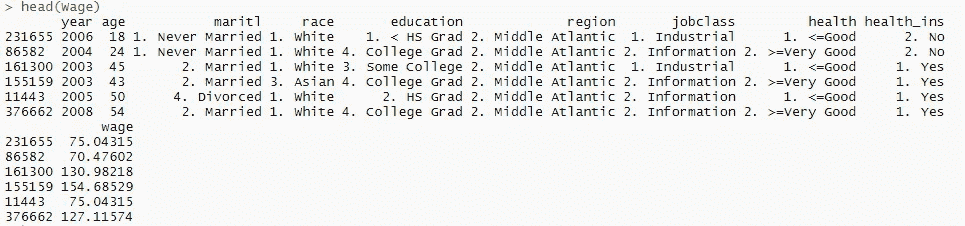

作者图片

让我们只选择**【年龄】【学历】【工作阶级】* & *【工资】*几列来进行我们的工作。*

```
***Wage2 <- Wage %>% 
  subset(select = c("age", "education", "jobclass", "wage"))****glimpse(Wage2)
head(Wage2)***
```

*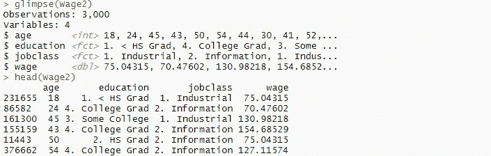*

*作者图片*

*我们可以看到“年龄”和“工资”变量(列)是连续的(`<int>, <dbl>`)，“教育程度”&，“工作阶层”变量(列)是分类的(`<fact>`)。*

## *不同的绘图选项*

*我们这个练习的目的是看看“工资”是如何随着“年龄”、“教育程度”和“工作阶层”而变化的。让我们用 **ggplot2** 包的`**ggplot**` &各自的 *geom* 功能尝试不同的绘图选项。*

****散点图****

```
***# P1 
ggplot(Wage2) +
  geom_point(aes(x = age, y = wage, 
                 color = education), size = 4) +
  labs(x = 'AGE', y = "WAGE") +
  ggtitle("wage ~ age, education ") +** **theme_bw() +
  theme(axis.text.x = element_text(face = 'bold', size = 10),
        axis.text.y = element_text(face = 'bold', size = 10))****# P2
ggplot(Wage2) +
  geom_point(aes(x = age, y = wage, 
                 color = jobclass), size = 4) +
  labs(x = 'AGE', y = "WAGE") +
  ggtitle("wage ~ age, jobclass ") +** **theme_bw() +
  theme(axis.text.x = element_text(face = 'bold', size = 10),
        axis.text.y = element_text(face = 'bold', size = 10))***
```

*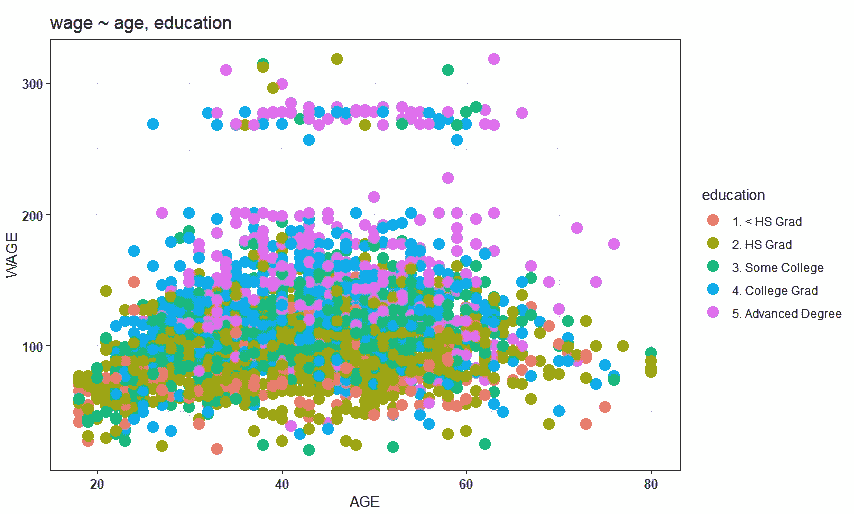*

*作者图片*

*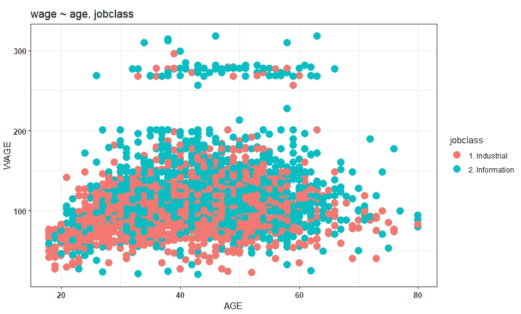*

*作者图片*

****直方图****

```
***# P3
ggplot(Wage2) +
  geom_histogram(aes(x = wage, 
                 fill = education), color = 'lightblue') +
  labs(x = 'WAGE') +
  ggtitle("wage ~ education ") +

  theme_bw() +
  theme(axis.text.x = element_text(face = 'bold', size = 10),
        axis.text.y = element_text(face = 'bold', size = 10))****# P4
ggplot(Wage2) +
  geom_histogram(aes(x = wage, 
                     fill = jobclass), color = 'lightblue') +
  labs(x = 'WAGE') +
  ggtitle("wage ~ jobclass ") +

  theme_bw() +
  theme(axis.text.x = element_text(face = 'bold', size = 10),
        axis.text.y = element_text(face = 'bold', size = 10))***
```

*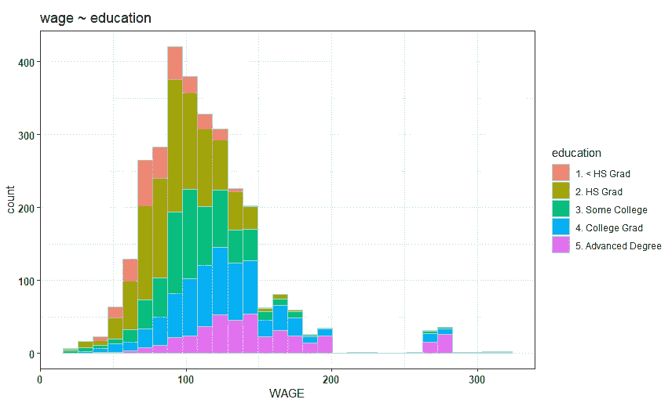*

*作者图片*

*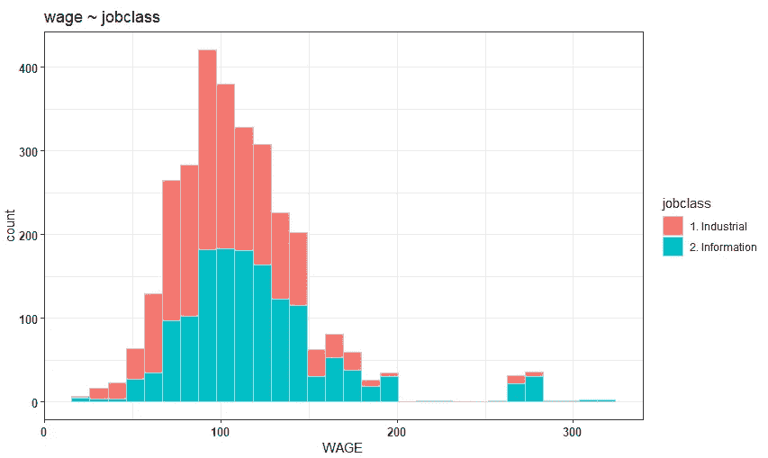*

*作者图片*

****密度图****

```
***# P5
ggplot(Wage2) +
  geom_density(aes(x = wage, 
                     fill = education)) +
  labs(x = 'WAGE') +
  ggtitle("wage ~ education ") +

  theme_bw() +
  theme(axis.text.x = element_text(face = 'bold', size = 10),
        axis.text.y = element_text(face = 'bold', size = 10))****# P6
ggplot(Wage2) +
  geom_density(aes(x = wage, 
                   fill = jobclass)) +
  labs(x = 'WAGE') +
  ggtitle("wage ~ jobclass ") +

  theme_bw() +
  theme(axis.text.x = element_text(face = 'bold', size = 10),
        axis.text.y = element_text(face = 'bold', size = 10))***
```

*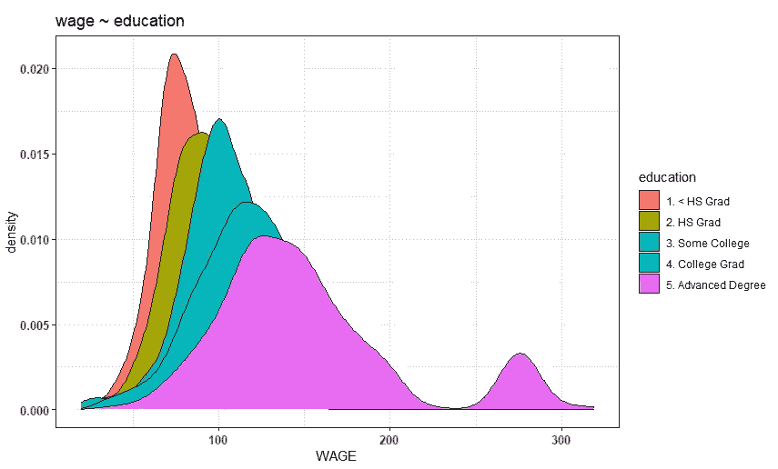*

*作者图片*

*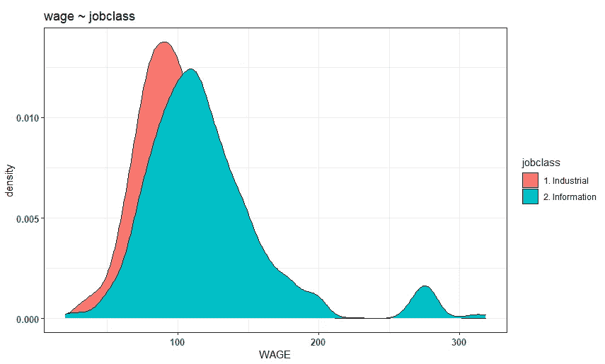*

*作者图片*

****条形剧情****

```
***# P7
ggplot(Wage2) +
  geom_bar(aes(x = education, 
                   fill = jobclass)) +
  labs(x = 'WAGE') +
  ggtitle("wage ~ education ") +

  theme_bw() +
  theme(axis.text.x = element_text(face = 'bold', size = 10),
        axis.text.y = element_text(face = 'bold', size = 10))****# P8
ggplot(Wage2) +
  geom_bar(aes(x = jobclass, 
               fill = education)) +
  labs(x = 'WAGE') +
  ggtitle("wage ~ jobclass ") +

  theme_bw() +
  theme(axis.text.x = element_text(face = 'bold', size = 10),
        axis.text.y = element_text(face = 'bold', size = 10))***
```

*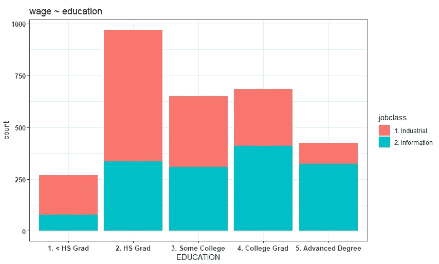*

*作者图片*

*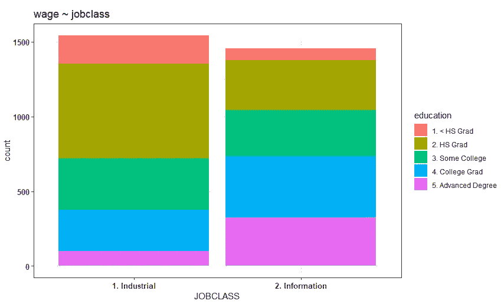*

*作者图片*

****方框图****

```
***# P9
ggplot(Wage2) +
  geom_boxplot(aes(x = education, y = wage,
               fill = education)) +
  labs(x = 'EDUCATION') +
  ggtitle("wage ~ education ") +

  theme_bw() +
  theme(axis.text.x = element_text(face = 'bold', size = 10),
        axis.text.y = element_text(face = 'bold', size = 10))****# P10
ggplot(Wage2) +
  geom_boxplot(aes(x = jobclass, y = wage,
               fill = jobclass)) +
  labs(x = 'JOBCLASS') +
  ggtitle("wage ~ jobclass ") +

  theme_bw() +
  theme(axis.text.x = element_text(face = 'bold', size = 10),
        axis.text.y = element_text(face = 'bold', size = 10))****# P11
ggplot(Wage2) +
  geom_boxplot(aes(x = jobclass, y = wage,
                   fill = education)) +
  labs(x = 'JOBCLASS') +
  ggtitle("wage ~ jobclass, education ") +

  theme_bw() +
  theme(axis.text.x = element_text(face = 'bold', size = 10),
        axis.text.y = element_text(face = 'bold', size = 10))***
```

*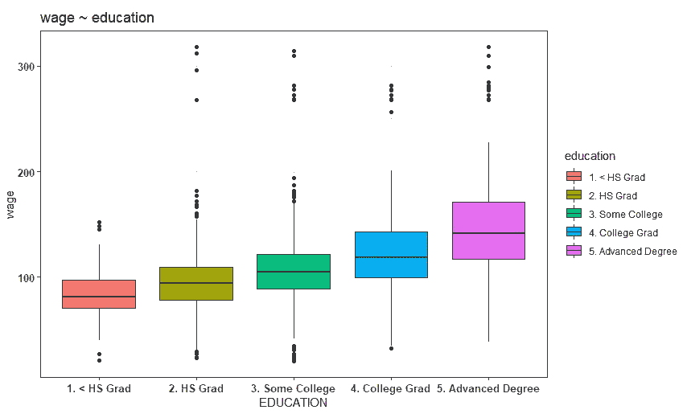*

*作者图片*

*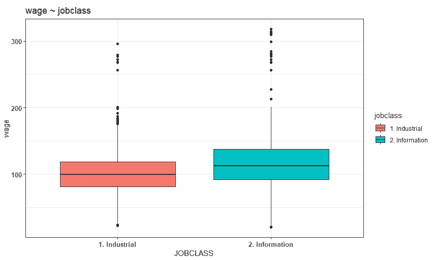*

*作者图片*

*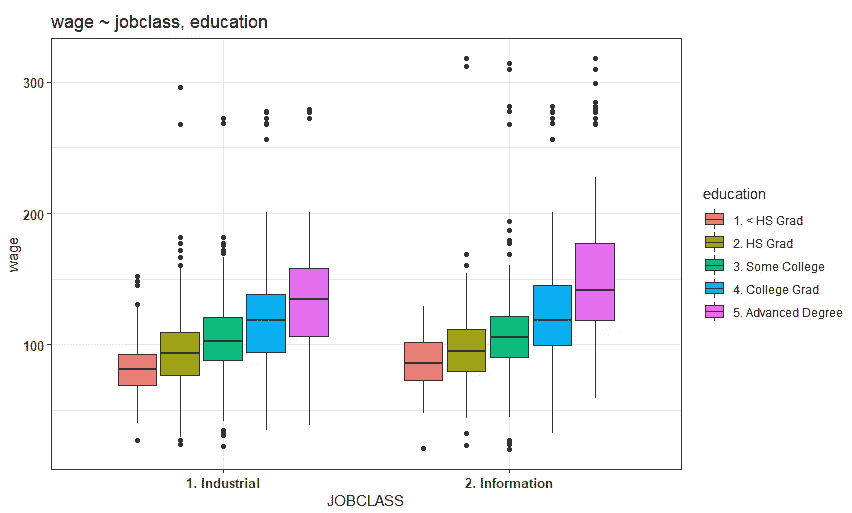*

*作者图片*

****关联矩阵同【GGally】***的【ggpairs】*

*到目前为止，我们已经检查了不同的绘图选项-散点图，直方图，密度图，条形图和箱线图，以找到相对分布。现在该看 R 中的 ***广义对情节了。****

*我们已经加载了*【GGally】*包。函数`**ggpairs**` 会变魔术，把这些情节都带到一个页面里！*

```
***# P12
ggpairs(Wage2) + theme_bw()***
```

*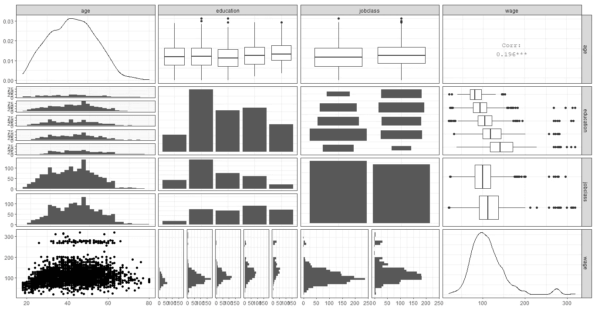*

*作者图片*

***颜色特色由*【教育】****

```
***# P13
ggpairs(Wage2, aes(color = education)) + theme_bw()***
```

*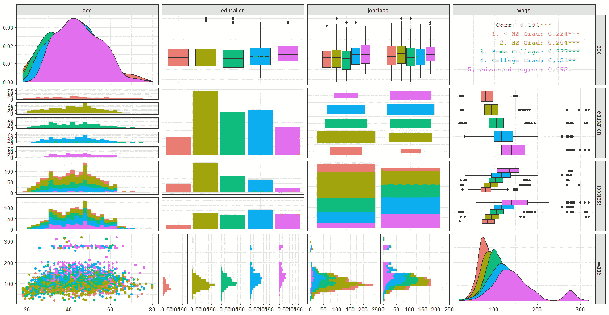*

*作者图片*

***颜色特征由*【job class】***表示*

```
***# P14
ggpairs(Wage2, aes(color = jobclass)) + theme_bw()***
```

*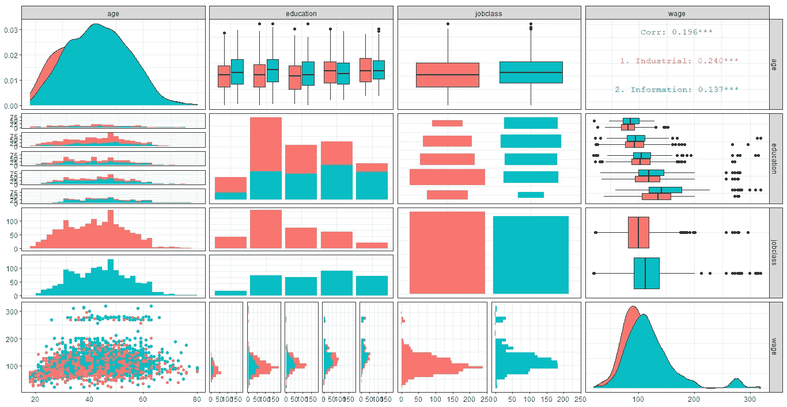*

*作者图片*

*希望这篇实践文章对您有用。我建议你在自己的领域数据中应用这些容易编码的图，并为你的业务创新得出有意义和有趣的见解。*

**祝您的数据之旅顺利……**

**

*约书亚·厄尔在 [Unsplash](https://unsplash.com?utm_source=medium&utm_medium=referral) 上拍摄的照片*

*[](https://www.linkedin.com/in/aykhaled/) [## Ahmed Yahya Khaled-EPMO 经理-企业战略- Robi Axiata 有限公司| LinkedIn

### 打破数据、战略、规划和执行之间的孤岛！这个简介是一个技术和人工智能专业人士目前…

www.linkedin.com](https://www.linkedin.com/in/aykhaled/)*