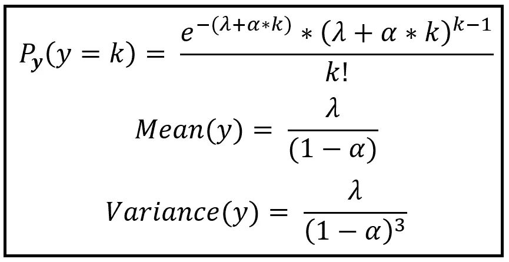

# 真实世界数据集的广义泊松回归

> 原文：<https://towardsdatascience.com/generalized-poisson-regression-for-real-world-datasets-d1ff32607d79?source=collection_archive---------11----------------------->


Phil Dolby 的照片来自 [PxHere](https://pxhere.com/en/photo/275716) 下 [CC BY 2.0](https://creativecommons.org/licenses/by/2.0/)

## 以及用 Python 进行广义泊松回归的分步指南

常规泊松回归模型通常是基于计数的数据集的首选模型。泊松回归模型的主要假设是计数的方差与其平均值相同，即数据是*等分布的*。不幸的是，现实世界的数据很少是等分布的，这促使统计学家使用其他模型进行计算，例如:

*   [负二项式(NB)回归模型](/negative-binomial-regression-f99031bb25b4)以及，
*   广义泊松回归模型

这两个模型都*而不是*做出关于数据集的*方差=均值*假设。这使得它们成为基于计数的数据建模的更好的实用选择。在之前的一篇文章中，我详细介绍了 NB 模型。在本文中，我们将介绍**广义泊松回归模型**。

## 文章的布局

我们将在本文中讨论以下主题:

1.  什么是基于计数的数据集？
2.  什么是等分散、分散不足、分散过度？我们将讨论泊松模型对于分散不足和分散过度的数据集的局限性。
3.  ***领事的广义泊松回归(GP-1)* 模型**和 ***法莫耶的限制广义泊松回归(GP-2)* 模型**介绍。
4.  一个基于 Python 的教程，用于构建和训练 GP-1 和 GP-2 模型，并将它们的性能与标准泊松回归模型进行比较。

## 什么是基于计数的数据？

基于计数的数据集是因变量 ***y*** 代表某个事件发生的次数的数据集。以下是一些例子:

1.  每月发现的系外行星数量。
2.  历年太阳黑子的数量。
3.  每小时走进急诊室的人数。


太阳黑子(来源:[维基共享](https://commons.wikimedia.org/wiki/File:Sunspots-gn-yr-total-smoothed-en.svg)下 CC [BY-SA 4.0](https://creativecommons.org/licenses/by-sa/4.0/) )

在上述每一个数据集中，因变量 ***y*** 代表观察到的计数，而 ***X*** 的选择，解释变量的矩阵，即被认为解释 ***y*** 中的方差的一组变量，主要(可悲地)留给了统计建模者的判断。

## 等分散、欠分散、过分散和泊松模型的局限性

可以从尝试将相关计数变量建模为泊松过程开始。不幸的是，在许多真实世界的数据集中，泊松过程无法令人满意地解释观察计数的可变性。这主要是由于泊松回归模型对数据的*方差=均值*假设。换句话说，泊松模型错误地假设计数是*等分布的*。

[泊松模型](/an-illustrated-guide-to-the-poisson-regression-model-50cccba15958)无法摆脱这一假设，因为该模型基于因变量*是一个服从泊松概率分布的随机变量的假设，可以证明泊松分布的随机变量的方差等于其均值。*

*下面的公式表示了泊松分布随机变量的概率分布函数(也称为 **P** 概率**M**as**F**函数)。可以看出:*

**方差(X) =均值(X) = λ* ，单位时间内发生的事件数。*

**

*假设每单位时间发生λ个事件，看到 k 个事件的概率(图片由[作者](https://sachin-date.medium.com/)提供)*

*下面是一些有趣的概率分布图，由上述公式针对不同的λ值生成:*

**

*不同λ值下看到 k 个事件的概率(图片由[作者](https://sachin-date.medium.com/)提供)*

*顺便提一下，在回归建模中，谈论无条件方差和无条件均值是不常见的。相反，人们更喜欢将方差称为 [*，条件是解释变量* ***X*** *呈现某个特定值****X _ I****用于第 I 次观察*](/3-conditionals-every-data-scientist-should-know-1916d48b078a) 。*

*条件方差可以表示为*方差(****y****|****X = X _ I****)*。条件均值同上。*

*如前所述，现实世界的数据集很多都不是等分散的，所以 ***y*** 的条件方差不等于 ***y*** 的条件均值。其中一些的方差大于平均值，这种现象被称为**过度分散**，而在其他情况下，方差小于平均值，也称为**分散不足**。*

*总的来说:*

> *当您的因变量 ***y*** 的方差大于您的模型假设的方差时，那么从您的模型的角度来看，您的数据集是**过度分散的**。*
> 
> *当您的因变量 ***y*** 的方差小于您的模型假设的方差时，那么从您的模型的角度来看，您的数据集是**欠分散的**。*

*过度(或不足)分散的影响是您的模型将无法充分解释观察到的计数的可变性。相应地，它的预测质量会很差。*

*解决这个问题的一个常见方法是假设方差是平均值的一般函数，即:*

**方差=****f****(均值)**

***常用的一种形式为 *f(。)*** 如下:*

**

*一个常用的方差函数(图片由[作者](https://sachin-date.medium.com/)提供)*

*其中 *p=0，1，2…**

**α* 被称为离差参数，它代表由一些未知变量集合引入的***【y】***的额外可变性，这些变量集合导致*y 的总体方差不同于您的回归模型预期的方差。**

**注意，当 *α=0* 时，*方差=均值*你就得到了标准泊松回归模型。**

**当 *α > 0* 时，我们考虑两种有趣的情况，即当 *p=1 和 p=2 时。*在这两种情况下，我们得到了所谓的**负二项(NB)回归模型**。**

**在 NB 回归模型中，我们假设观察计数 ***y*** 是一个事件率为 ***λ*** 和 ***λ*** *本身是一个伽玛分布随机变量*。**

**负二项式回归模型(通常称为泊松-伽马混合模型)被证明是许多真实世界计数数据集的优秀模型。我在下面的文章中对此做了更详细的介绍:**

```
**[**Negative Binomial Regression: A Step by Step Guide**](/negative-binomial-regression-f99031bb25b4)**
```

**还有许多其他方法可用于推广泊松回归模型，以将其扩展到过度分散和分散不足的数据。在本文中，我们将讨论两个这样的模型。**

## **领事的广义泊松回归模型**

**1989 年，Prem C. Consul 在他的著作《广义泊松分布:性质和应用》[](https://www.amazon.com/dp/B01K0UCF5C)**，*中提出了一种修正泊松分布的概率分布的方法，使其能够处理过分散和欠分散的数据。这个模型后来被称为 **GP-1(广义泊松-1)模型**。GP-1 模型假设因变量 ***y*** 是具有以下概率分布的随机变量:***

****

**GP-1 模型的概率分布、方差和均值函数(图片由[作者](https://sachin-date.medium.com/)提供)**

**如果在上面的等式中设置分散参数 *α* 为 0，GP-1 的 PMF、均值和方差基本上减少到标准泊松分布。**

## **法莫耶的限制性广义泊松分布**

**1993 年，Felix Famoye 引入了他所谓的受限广义泊松回归模型，作为一种将标准泊松模型的范围扩展到处理过度分散和分散不足数据集的方法。这个模型被称为 **GP-2(广义泊松-2)模型**。**

**GP-2 模型假设因变量 ***y*** 是具有以下概率分布的随机变量:**

****

**GP-2 模型的概率分布、方差和均值函数(图片由[作者](https://sachin-date.medium.com/)提供)**

**如前所述，当分散参数 *α* 被设置为 0 时，GP-2 的 PMF、均值和方差函数基本上减少到标准泊松分布的那些。**

**色散参数α使用以下公式估算:**

****

**计算α的公式(图片由[作者](https://sachin-date.medium.com/)提供)**

**在 *statsmodels* 库中， *α* 为您估算，作为 GP-1 和 GP-2 模型的模型拟合过程的一部分。**

## **GP-1 和 GP-2 在 Python 和 Statsmodels 中的实现**

**statsmodels 库包含通过`statsmodels.discrete.discrete_model.GeneralizedPoisson`类实现的 GP-1 和 GP-2 模型。**

**在本节中，我们将展示如何使用 GP-1 和 GP-2 对以下真实世界的计数数据集进行建模。**

## **真实世界的计数数据集**

**下表包含了骑自行车穿过纽约市各种桥梁的人数。从 2017 年 4 月 1 日到 2017 年 10 月 31 日每天测量计数。**

****

**来源:[东河大桥的自行车数量](https://data.cityofnewyork.us/Transportation/Bicycle-Counts-for-East-River-Bridges/gua4-p9wg)(纽约开放数据)(图片由[作者](https://sachin-date.medium.com/)提供)**

**这里是到原始数据集的[链接。](https://data.cityofnewyork.us/Transportation/Bicycle-Counts-for-East-River-Bridges/gua4-p9wg)**

**我们将集中分析每天穿过布鲁克林大桥的骑自行车的人数。这是布鲁克林大桥上自行车数量的时间顺序图:**

****

**每天骑自行车的人在布鲁克林大桥上计数(背景来源:[从曼哈顿岛看到的布鲁克林大桥](https://en.wikipedia.org/wiki/Brooklyn_Bridge#/media/File:Brooklyn_Bridge_Postdlf.jpg)**

# **我们的回归目标**

**我们回归的目标是预测任意一天穿过布鲁克林大桥的骑自行车的人数。**

# **我们的回归策略**

**我们将使用数据集中的一组回归变量，即日、星期几(从日期中得出)、月(从日期中得出)、高温、低温和降水量，来“解释”布鲁克林大桥上观测到的计数的变化。**

****

**观察到的自行车数量的回归矩阵和向量(图片由[作者](https://sachin-date.medium.com/)提供)**

> ***我们回归模型的训练算法会将观察到的计数* **y** *拟合到回归矩阵* **X *。*****

**一旦模型被训练，我们将在一个模型在训练期间根本没有见过的持续测试数据集上测试它的性能。**

## **回归策略—循序渐进**

1.  **我们将首先在这个数据集上训练标准泊松回归模型。标准泊松模型也将作为测试广义泊松模型有效性的“控制”模型。**
2.  **如果数据集中的方差与平均值大致相同，那么除了检查泊松模型的拟合优度之外，就没什么可做的了。**
3.  **如果方差大于或小于泊松均值，那么我们将在数据集上依次训练 GP-1 和 GP-2 模型，并将它们的性能与泊松模型进行比较。**

**我们将从导入所有需要的包开始。**

```
**import pandas as pd
from patsy import dmatrices
import numpy as np
import statsmodels.api as sm
import matplotlib.pyplot as plt**
```

**为计数数据集创建一个熊猫数据框架。这里是数据集的[链接。](https://gist.github.com/sachinsdate/c17931a3f000492c1c42cf78bf4ce9fe)**

```
**df = pd.read_csv('nyc_bb_bicyclist_counts.csv', header=0, infer_datetime_format=True, parse_dates=[0], index_col=[0])**
```

**我们将在 **X** 矩阵中添加一些派生的回归变量。**

```
**ds = df.index.to_series()
df['MONTH'] = ds.dt.month
df['DAY_OF_WEEK'] = ds.dt.dayofweek
df['DAY'] = ds.dt.day**
```

**让我们打印出数据集的前几行，看看它是什么样子:**

```
**print(df.head(10))**
```

****

**(图片由[作者](https://sachin-date.medium.com/)提供)**

**让我们创建训练和测试数据集。**

```
**mask = np.random.rand(len(df)) < 0.8
df_train = df[mask]
df_test = df[~mask]
print('Training data set length='+str(len(df_train)))
print('Testing data set length='+str(len(df_test)))**
```

**在 [Patsy](https://patsy.readthedocs.io/en/latest/quickstart.html) 符号中设置回归表达式。我们告诉 patsy，BB_COUNT 是我们的因变量 ***y*** ，它取决于回归变量 ***X*** : DAY、DAY_OF_WEEK、MONTH、HIGH_T、LOW_T 和 PRECIP。**

```
**expr = 'BB_COUNT ~ DAY  + DAY_OF_WEEK + MONTH + HIGH_T + LOW_T + PRECIP'**
```

**让我们使用 Patsy 为训练和测试数据集绘制出 ***X*** 和 ***y*** 矩阵:**

```
**y_train, X_train = dmatrices(expr, df_train, return_type='dataframe')y_test, X_test = dmatrices(expr, df_test, return_type='dataframe')**
```

**使用 statsmodels GLM 类，对定型数据集定型泊松回归模型。**

```
**poisson_training_results = sm.GLM(y_train, X_train, family=sm.families.Poisson()).fit()**
```

**打印培训总结。**

```
**print(poisson_training_results.summary())**
```

**这会打印出以下内容:**

****

**泊松回归模型的训练总结(图片由[作者](https://sachin-date.medium.com/)提供)**

**我突出显示了输出中的重要部分。**

**我们可以看到，所有回归系数(回归术语中称为 ***β*** 向量)在 95%的置信水平下具有统计显著性，因为它们的 p 值为< 0.05。**

**稍后将使用最大对数似然值(-11872)来比较模型与 GP-1 和 GP-2 模型的性能。**

**让我们打印出数据集的方差和均值:**

```
**print('variance='+str(df['BB_COUNT'].var()))print('mean='+str(df['BB_COUNT'].mean()))**
```

**这会打印出以下内容:**

```
**variance=730530.6601948135mean=2680.042056074766**
```

**方差显然比平均值大得多。数据非常分散，泊松模型的主要假设不成立。**

**因此，我们接下来将构建和训练 GP-1 和 GP-2 模型，看看它们的表现是否会更好。**

**Statsmodels 让您用 3 行代码就可以做到这一点！**

**建立 Consul 的广义毒物回归模型，称为 GP-1:**

```
**gen_poisson_gp1 = sm.GeneralizedPoisson(y_train, X_train, **p=1**)**
```

**拟合(训练)模型:**

```
**gen_poisson_gp1_results = gen_poisson_gp1.fit()**
```

**打印结果:**

```
**print(gen_poisson_gp1_results.summary())**
```

**这会打印出以下内容(我在输出中突出显示了一些有趣的区域):**

****

**GP-1 模型的训练结果(图片由[作者](https://sachin-date.medium.com/)提供)**

**请注意，除了日变量的系数，所有其他回归系数在 95%的置信水平下具有统计显著性，即它们的 p 值> 0.05。回想一下，在泊松模型*中，发现所有*回归系数在 95%的置信水平下具有统计显著性。**

## **GP-1 模型的拟合优度**

**GP-1 模型的最大似然估计为-1350.6，大于零模型的最大似然估计-1475.9。零模型是简单的仅截距模型，即穿过 y 截距的水平线。但是这种差异在统计学上有意义吗？似然比(LR)检验的 p 值显示为 3.12e-51，这是一个非常小的数字。因此，是的，GP-1 模型确实比简单的仅截取模型在数据建模方面做得更好。**

**但是 GP-1 比常规泊松模型做得更好吗？**

**回想一下，常规泊松模型的最大似然估计是-11872。与 GP-1 的 MLE-1350.6 相比。显然，GP-1 产生了更好的拟合优度(它有更大的最大似然估计)。如果我们愿意，我们可以使用两个似然估计值进行 LR 检验，并使用卡方检验评估显著性。在这种情况下，这是不必要的，因为 GP-1 的最大似然比常规泊松模型的大得多。**

## **预言；预测；预告**

**让我们使用 GP-1 预测骑自行车的人数，使用模型在训练期间没有看到的测试数据集:**

```
**gen_poisson_gp1_predictions = gen_poisson_gp1_results.predict(X_test)**
```

**gen_poisson_gp1_predictions 是一个 pandas 系列对象，它包含 X_test 矩阵中每一行的预计骑自行车的人数。记住 y_test 包含实际观察到的计数。**

**让我们绘制预测和实际计数，以直观地评估预测的质量:**

```
**predicted_counts=gen_poisson_gp1_predictions
actual_counts = y_test[**'BB_COUNT'**]fig = plt.figure()fig.suptitle(**'Predicted versus actual bicyclist counts on the Brooklyn bridge'**)predicted, = plt.plot(X_test.index, predicted_counts, **'go-'**, label=**'Predicted counts'**)actual, = plt.plot(X_test.index, actual_counts, **'ro-'**, label=**'Actual counts'**)plt.legend(handles=[predicted, actual])plt.show()**
```

**我们得到了预测的和实际的骑自行车的人数的图表:**

****

**GP-1 模型中预测的和实际的骑自行车的人数对比图(图片由[作者](https://sachin-date.medium.com/)提供)**

**正如你所看到的，除了一些计数，GP-1 模型在预测骑自行车的人数方面做得相当好。**

**如果需要，我们可以通过比较 GP-1 预测的均方根误差(RMSE)与常规泊松模型对相同测试数据集的预测，来比较 GP-1 与常规泊松模型的预测质量。我将把它作为一个练习。**

**最后，让我们也尝试一下**法莫耶的受限广义泊松回归模型**，称为 GP-2:**

**我们将使用同样的 3 步方法来构建和训练模型。注意参数 p=2:**

```
***#Build Famoye's Restricted Generalized Poison regression model, know as GP-2* gen_poisson_gp2 = sm.GeneralizedPoisson(y_train, X_train, **p=2**)

*#Fit the model* gen_poisson_gp2_results = gen_poisson_gp2.fit()

*#print the results* print(gen_poisson_gp2_results.summary())**
```

**我们看到以下培训输出:**

****

**GP-2 模型的训练输出(图片由[作者](https://sachin-date.medium.com/)提供)**

**分析和比较 GP-2 的拟合优度和预测质量的方法与 GP-1 相同。但是请注意，在这种情况下，模型的训练算法无法收敛。因此，我们将不再研究这个模型，而是更倾向于使用 GP-1 而不是标准的泊松模型来对骑自行车的人计数数据进行建模。**

## **源代码**

**以下是完整的源代码:**

**这里是本文中使用的数据集的链接。**

## **摘要**

*   **标准泊松模型假设基于计数的数据的方差与平均值相同。这个假设经常被过度分散或分散不足的真实世界数据集所违背。**
*   **因此，我们需要对基于计数的数据使用其他模型，如负二项式模型或广义泊松回归模型，它们不假设数据是等分散的。这种模型假设方差是均值的函数。**
*   **Consul 的广义泊松回归模型(称为 GP-1)和 Famoye 的受限广义泊松回归模型(GP-2)就是两个这样的 GP 模型，它们可用于对基于真实世界计数的数据集进行建模。**
*   **Python 库 Statsmodels 恰好对构建和训练 GP-1 和 GP-2 模型提供了出色的支持。**

***感谢阅读！我撰写关于数据科学的主题，重点是时间序列分析和预测。***

***如果你喜欢这篇文章，请关注我的*[***Sachin Date***](https://timeseriesreasoning.medium.com)*获取关于时间序列分析和预测主题的提示、操作方法和编程建议。***