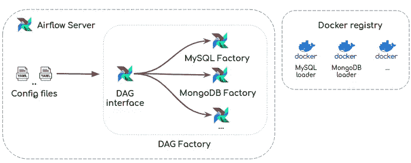
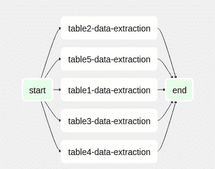

# 用气流概括数据加载过程

> 原文：<https://towardsdatascience.com/generalizing-data-load-processes-with-airflow-a4931788a61f?source=collection_archive---------11----------------------->

## [构建数据仓库:基本架构原则](/building-a-data-warehouse-basic-architectural-principles-66bd7059ffd0)

## 数据加载过程不应该写两遍，它们应该是通用的

由[马克斯·尼尔森](https://unsplash.com/@maxcodes?utm_source=medium&utm_medium=referral)在 [Unsplash](https://unsplash.com?utm_source=medium&utm_medium=referral) 上拍摄的照片

我们使用 Airflow 作为我们的数据管道编排器，以便轻松地编排和监控数据流程。特别是，我们一直致力于 [*数据加载过程*](https://en.wikipedia.org/wiki/Extract,_transform,_load) 以便使它们更容易*。*这些流程允许我们从不同的来源提取数据，并将它们集成到我们的数据湖中——在本例中是 AWS S3。

在我们体验气流的早期，我们会为应该集成到数据湖中的每个数据源创建一个 DAG。然而，过了一段时间，我们最终会得到**许多重复的代码**。基本上，创建用于提取数据的 Dag 的源代码对于它们中的每一个都是相同的。它们之间唯一的区别是数据库连接和将数据增量装载到数据湖的查询。

重复代码的问题是，当必须引入更改时，它们必须在执行数据加载的每个 Dag 中传播，这既耗时又容易出错。

我们决定通过推广我们为数据加载过程创建 Dag 的方式来解决这个问题。为此，我们构建了一个框架，在这个框架中，为编排数据加载过程创建这样的 Dag 更加容易。因此，在这篇文章中，我们想与你分享框架是如何构建的，以及它如何帮助我们简化数据加载过程。

# 我们如何解决它？

我们构建了一个旨在简化数据加载的框架。特别是，编写一个配置文件更容易。基于这样一个文件，框架[动态生成 DAG](https://www.astronomer.io/guides/dynamically-generating-dags/) ，允许从目标源增量提取数据并上传到 AWS S3。

该框架包括三个逻辑层次:*配置文件*、 *DAG 工厂*和*加载器*:

*   **配置文件**是 YAML 文件，其中提供了目标源的配置。这种配置可以包括 DAG 配置参数、数据库凭证、表规范、数据类型等等。这样，集成一个新的源代码就像编写一个简单的配置文件一样简单。
*   ***DAG 工厂*** 基于一种我们称之为 *DAG 工厂的模式。*它们允许封装逻辑[动态创建 Dag](https://www.astronomer.io/guides/dynamically-generating-dags/)。 *DAG 工厂模式*包括 *DAG 接口*和*工厂*。 *DAG 接口*的功能是读取配置文件并将配置参数传递给适当的*工厂，*因此*工厂*可以创建 DAG 工作流，允许从目标源提取数据。我们集成了许多*工厂*，例如数据库引擎类型*，例如*，我们集成了来自 MySQL 和 MongoDB 引擎的数据。所以，在这一点上，我们只实现了 *MySQL 工厂*和 *MongoDB 工厂*。
*   一个 ***加载器*** 是一个 docker 映像，它实现了我们所说的*加载器模式*。基本上，*加载器模式*基于在数据加载过程中实现功能数据工程方法的[。因此，给定一组参数，*加载器*能够从目标源提取数据并上传到 AWS S3。*加载器*是](/implementing-the-functional-data-engineering-paradigm-in-data-load-processes-by-using-airflow-61d3bae486b0)[确定性的](https://en.wikipedia.org/wiki/Deterministic_algorithm)和[幂等的](https://en.wikipedia.org/wiki/Idempotence)，因此它们每次运行时都会产生相同的结果。

你可以在下一张图中找到我们的框架的逻辑结构的图示。

框架逻辑结构

## 配置文件

接下来，给出一个名为“ *databasename* ”的 MySQL 数据库的配置文件示例。在配置文件中，指定了一些配置，如 DAG 名称、默认参数、计划、数据库连接和表及其列数据类型。因此，它们可用于动态生成 DAG。

## DAG 接口

在 DAG 界面中，读取配置文件信息。然后，根据数据库引擎类型，通过调用适当的*工厂*方法来创建 DAG 工作流。此外，必要的参数被传递给*工厂*，以便创建适当的 DAG 工作流。

因此，基于上面指定的配置文件，t

## 工厂

一个*工厂*允许[动态生成一个 DAG 工作流](/creating-a-dynamic-dag-using-apache-airflow-a7a6f3c434f3)，允许提取和加载给定目标源的数据。特别是，DAG 工作流将具有与配置文件中指定的表一样多的任务。任务基于通过使用 [*气流对接操作符*](https://airflow.apache.org/docs/stable/_api/airflow/operators/docker_operator/index.html) *运行适当的*加载器*对接映像。*为此*，配置文件中提供的*参数应该作为环境变量传递给 docker 映像。

> 请记住，该框架旨在执行每日增量加载。所以，它就是为此而设计的。为了支持其他用例，应该引入一些更改。

我们在下一段代码中展示了 MySQL 工厂。

最后，这是由 *MySQL 工厂生成的 DAG 工作流的样子。*记住每个任务都是一个运行 [*MySQL loader*](https://github.com/ajhenaor/pyspark-mysql-to-s3-loader) 的 airflow docker 操作员。

## 装货设备

一个*加载器*是一个 docker 镜像，允许从一个特定的数据库引擎提取数据并上传到我们的数据湖——AWS S3。

在下一段代码中，出现了 [*MySQL 加载器*](https://github.com/ajhenaor/pyspark-mysql-to-s3-loader)**。*我们试图遵循 [Maxime Beauchemin](https://medium.com/u/9f4d525c99e2?source=post_page-----a4931788a61f--------------------------------) 在这篇[文章](https://medium.com/@maximebeauchemin/functional-data-engineering-a-modern-paradigm-for-batch-data-processing-2327ec32c42a)中提出的功能数据工程方法。相应地，*加载器*被设计成上下文无关的；它们使用覆盖方法，并且它们的结果是不可变暂存区的一部分。这使得它们易于复制。*

# *结论*

*我们构建这个框架是基于这样一个信念，即数据加载过程不应该写两次，它们应该是通用的。*

*我们的解决方案深受功能数据工程范例的影响，该范例由 [Maxime Beauchemin](https://medium.com/u/9f4d525c99e2?source=post_page-----a4931788a61f--------------------------------) 在这篇[文章](https://medium.com/@maximebeauchemin/functional-data-engineering-a-modern-paradigm-for-batch-data-processing-2327ec32c42a)中提出。事实上，你可以在这篇[帖子](/implementing-the-functional-data-engineering-paradigm-in-data-load-processes-by-using-airflow-61d3bae486b0)中找到更多关于这种范式如何塑造了*装载机*的设计方式的信息。*

*希望这些信息对你有用！*

*感谢您的阅读！:)*

**如果你想随时更新我的作品，* ***请加入我的*** [***简讯***](https://metadatacommunity.substack.com/) ***！*** *我会努力为你提供信息和资源，让你成为更好的数据从业者！**