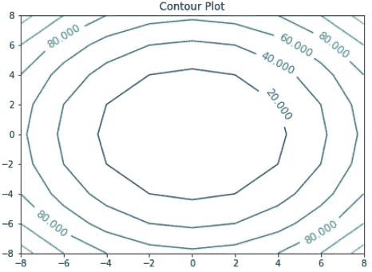
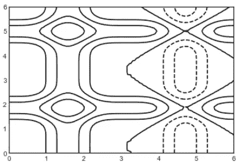
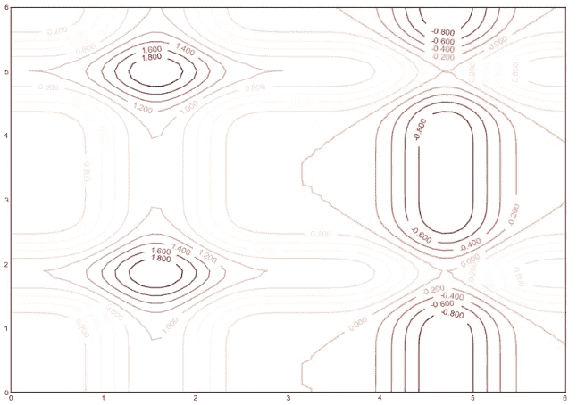
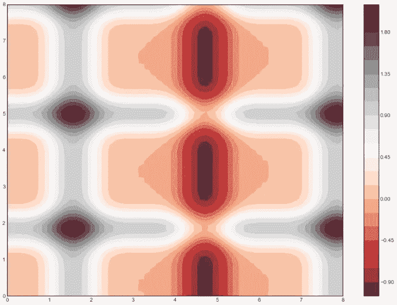
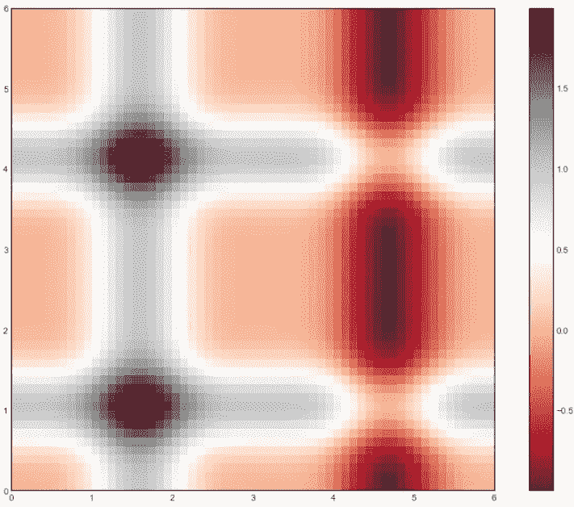
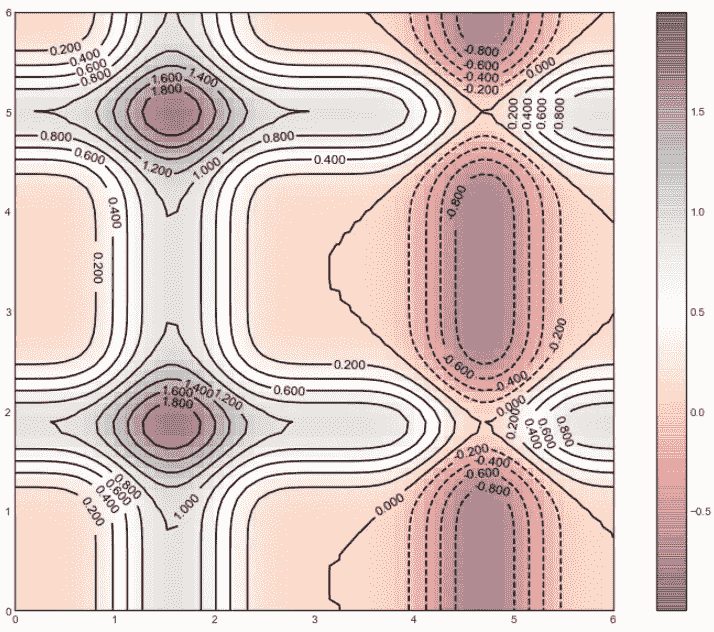

# 使用 Python 的 Matplotlib 生成等值线图

> 原文：<https://towardsdatascience.com/generate-contour-plots-using-pythons-matplotlib-1b5a5be804f2?source=collection_archive---------14----------------------->

## 制作等高线图的简易教程

我相信你以前见过等高线图。至少在天气数据上是这样。它被大量用于展示气象或地理数据。但它也用来表示密度、亮度和电势。它在数据分析和机器学习中被大量使用。它显示了一个响应变量与两个预测变量的关系。

它给出了一个二维视图，其中具有相同响应的所有点由一条线连接。那条线是轮廓线。

等高线图的三个主要元素:

1.  x 轴和 y 轴显示预测值
2.  等高线来表示相同的响应值
3.  提供一系列响应值的彩色条带

## 下面是如何绘制等高线图

首先导入必要的包。

```
import numpy as np
import matplotlib.pyplot as plt
import pylab
```

让我们生成一些 x 和 y 值

```
xp = np.arange(-8, 10, 2)
yp = np.arange(-8, 10, 2)
```

你大概可以想象‘XP’和‘yp’是什么样子。不过，还是看看吧。

```
xp
```

输出:

```
array([-8, -6, -4, -2,  0,  2,  4,  6,  8])
```

输入:

```
yp
```

输出:

```
array([-8, -6, -4, -2,  0,  2,  4,  6,  8])
```

**x 和 y 的长度都是 9。**

这个信息很重要，因为我们需要用这个数生成 z。

首先，初始化一个 9 x 9 形状的随机 z 点

```
zp = np.ndarray((9,9))
zp
```

输出:

```
array([[1.20117830e-311, 1.20117830e-311, 1.20120150e-311,
        1.20120150e-311, 1.20120150e-311, 1.20120150e-311,
        1.20118338e-311, 1.20119781e-311, 1.20120151e-311],
       [1.20120150e-311, 1.20120151e-311, 1.20117830e-311,
        1.20117830e-311, 1.20118045e-311, 1.20120150e-311,
        1.20119863e-311, 1.20119863e-311, 1.20117830e-311],
       [1.20119864e-311, 1.20118316e-311, 1.20117850e-311,
        1.20117830e-311, 1.20118500e-311, 1.20118500e-311,
        1.20118490e-311, 1.20118488e-311, 1.20118316e-311],
       [1.20118500e-311, 1.20118493e-311, 1.20118493e-311,
        1.20118493e-311, 1.20118493e-311, 1.20118339e-311,
        1.20117862e-311, 1.20117835e-311, 1.20118337e-311],
       [1.20118339e-311, 1.20118338e-311, 1.20118347e-311,
        1.20118348e-311, 1.20118339e-311, 1.20118348e-311,
        1.20118316e-311, 1.20118338e-311, 1.20118348e-311],
       [1.20118339e-311, 1.20118348e-311, 1.20118347e-311,
        1.20118348e-311, 1.20118348e-311, 1.20118348e-311,
        1.20118339e-311, 1.20118339e-311, 1.20118333e-311],
       [1.20118348e-311, 1.20118348e-311, 1.20118348e-311,
        1.20117830e-311, 1.20117830e-311, 1.20117853e-311,
        1.20117830e-311, 1.20117830e-311, 1.20117830e-311],
       [1.20117830e-311, 1.20117830e-311, 1.20117830e-311,
        1.20117830e-311, 1.20117830e-311, 1.20117830e-311,
        1.20117830e-311, 1.20117830e-311, 1.20117830e-311],
       [1.20117830e-311, 1.20117830e-311, 1.20117830e-311,
        1.20117830e-311, 1.20117830e-311, 1.20117830e-311,
        1.20117830e-311, 1.20117830e-311, 0.00000000e+000]])
```

现在，我将用自己选择的公式替换这些随机值。你可以使用你想要的或者你需要的公式。

```
for x in range(0, len(xp)):
    for y in range(0, len(yp)):
        zp[x][y] = xp[x]**2 + yp[y]**2
zp
```

输出:

```
array([[128., 100.,  80.,  68.,  64.,  68.,  80., 100., 128.],
       [100.,  72.,  52.,  40.,  36.,  40.,  52.,  72., 100.],
       [ 80.,  52.,  32.,  20.,  16.,  20.,  32.,  52.,  80.],
       [ 68.,  40.,  20.,   8.,   4.,   8.,  20.,  40.,  68.],
       [ 64.,  36.,  16.,   4.,   0.,   4.,  16.,  36.,  64.],
       [ 68.,  40.,  20.,   8.,   4.,   8.,  20.,  40.,  68.],
       [ 80.,  52.,  32.,  20.,  16.,  20.,  32.,  52.,  80.],
       [100.,  72.,  52.,  40.,  36.,  40.,  52.,  72., 100.],
       [128., 100.,  80.,  68.,  64.,  68.,  80., 100., 128.]])
```

因此，我们已经准备好了 x、y 和 z 数据。下面是如何做等高线图。

```
plt.figure(figsize=(7, 5))
plt.title('Contour Plot')
contours = plt.contour(xp, yp, zp)
plt.clabel(contours, inline=1, fontsize=12)
plt.show()
```



## 马鞍面等高线图

我将用一个稍微不同的 z 值公式来完成完全相同的过程。所以这次我就不一步步解释了:

```
xp = np.arange(-3, 4)
yp = np.arange(-3, 4)zp  =np.ndarray((7,7))for x in range(0, len(xp)):
    for y in range(0, len(yp)):
        zp[x][y] = xp[x]*xp[x] - yp[y]*yp[y]plt.figure(figsize=(8, 6))
plt.title('Contour plot for saddle surface - Hyperbolic paraboloid')
contours = plt.contour(xp, yp, zp)
plt.clabel(contours, inline=1, fontsize=12)
plt.show()
```


## 密度图

这是一张密度图。因此，我将制作一个不同的数据集，其中数据点更接近。这是 x 和 y。

```
x = np.linspace(0, 5, 60)
y = np.linspace(0, 5, 48)
```

x 和 y 都是一样的。数据看起来是这样的:

```
array([0\.        , 0.08474576, 0.16949153, 0.25423729, 0.33898305,
       0.42372881, 0.50847458, 0.59322034, 0.6779661 , 0.76271186,
       0.84745763, 0.93220339, 1.01694915, 1.10169492, 1.18644068,
       1.27118644, 1.3559322 , 1.44067797, 1.52542373, 1.61016949,
       1.69491525, 1.77966102, 1.86440678, 1.94915254, 2.03389831,
       2.11864407, 2.20338983, 2.28813559, 2.37288136, 2.45762712,
       2.54237288, 2.62711864, 2.71186441, 2.79661017, 2.88135593,
       2.96610169, 3.05084746, 3.13559322, 3.22033898, 3.30508475,
       3.38983051, 3.47457627, 3.55932203, 3.6440678 , 3.72881356,
       3.81355932, 3.89830508, 3.98305085, 4.06779661, 4.15254237,
       4.23728814, 4.3220339 , 4.40677966, 4.49152542, 4.57627119,
       4.66101695, 4.74576271, 4.83050847, 4.91525424, 5\.        ])
```

和之前一样，我需要一个 z 的函数。这是我选择的函数，

```
def fn(x, y):
    return np.sin(x)**5 + np.cos(y+17)**8
```

现在，该准备 X、Y 和 Z 数据了。我将简单地在 x 和 y 上使用 np.meshgrid 函数，它从一维数组构建二维网格。

```
X, Y = np.meshgrid(x, y)
Z = fn(X, Y)
```

数据准备好了。这是最简单的黑白密度等值线图。

```
plt.contour(X, Y, Z, colors = 'black')
```



让我们添加一个色彩映射表，并指定我们希望在该范围内绘制 15 条等距线。

```
plt.figure(figsize=(8, 6))
contours = plt.contour(X, Y, Z, 15, cmap = 'RdGy')
plt.clabel(contours, inline=True, fontsize=12)
```



matplotlib 中还有一个函数是 contourf。现在，看一个 contourf 的例子。

```
plt.figure(figsize=(14, 10))
plt.contourf(X, Y, Z, 20, cmap = 'RdGy')
plt.colorbar()
```



## “imshow”的一个例子:

```
plt.figure(figsize=(14, 10))
plt.imshow(Z, extent=[0,6,0,6], origin='upper', cmap='RdGy')
plt.colorbar()
```



我们甚至可以把黑白等高线图放在这个 imshow 上面。

```
plt.figure(figsize=(14, 10))
contours = plt.contour(X, Y, Z, 15, colors='black')
plt.clabel(contours, inline=True, fontsize=12)plt.imshow(Z, extent=[0,6,0,6], origin='upper', cmap='RdGy', alpha=0.5)
plt.colorbar()
```



我喜欢！你呢？

## 结论

如果你以前从未画过等高线图，我希望你现在能在必要的时候画出来。它提供了大量的信息，而且看起来也不错！如果您是机器学习建模者，请使用等值线图来可视化不同类别中的范围或数据中的异常。

欢迎在[推特](https://twitter.com/rashida048)上关注我，并喜欢我的[脸书](https://www.facebook.com/rashida.smith.161)页面。

## 更多阅读:

[](/your-everyday-cheatsheet-for-pythons-matplotlib-c03345ca390d) [## Python Matplotlib 的日常备忘单

### 完整的可视化课程

towardsdatascience.com](/your-everyday-cheatsheet-for-pythons-matplotlib-c03345ca390d) [](/a-complete-guide-to-numpy-fb9235fb3e9d) [## Numpy 完全指南

### 日常工作中需要的所有数字方法

towardsdatascience.com](/a-complete-guide-to-numpy-fb9235fb3e9d) [](/all-the-datasets-you-need-to-practice-data-science-skills-and-make-a-great-portfolio-857a348883b5) [## 练习数据科学技能和制作优秀投资组合所需的所有数据集

### 一些有趣的数据集提升你的技能和投资组合

towardsdatascience.com](/all-the-datasets-you-need-to-practice-data-science-skills-and-make-a-great-portfolio-857a348883b5) [](/logistic-regression-model-fitting-and-finding-the-correlation-p-value-z-score-confidence-8330fb86db19) [## 逻辑回归模型拟合和寻找相关性，P 值，Z 值，置信度…

### 静态模型拟合和提取的结果从拟合模型使用 Python 的 Statsmodels 库与…

towardsdatascience.com](/logistic-regression-model-fitting-and-finding-the-correlation-p-value-z-score-confidence-8330fb86db19) [](/clear-understanding-of-a-knn-classifier-with-a-project-for-the-beginners-865f56aaf58f) [## 学习使用 Python 的 Scikit_learn 库通过项目开发 KNN 分类器

### 适合机器学习新手

towardsdatascience.com](/clear-understanding-of-a-knn-classifier-with-a-project-for-the-beginners-865f56aaf58f) [](/unlimited-free-hosting-and-domain-5998e14f7bfe) [## 无限免费虚拟主机和域名

### 非常适合投资组合、开博客或创业

towardsdatascience.com](/unlimited-free-hosting-and-domain-5998e14f7bfe)