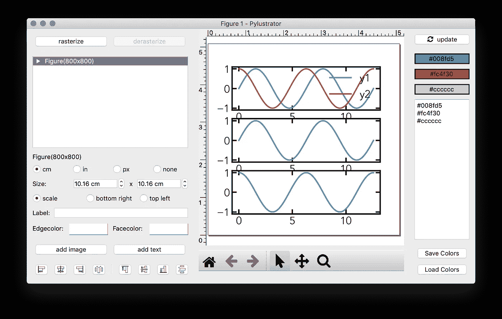
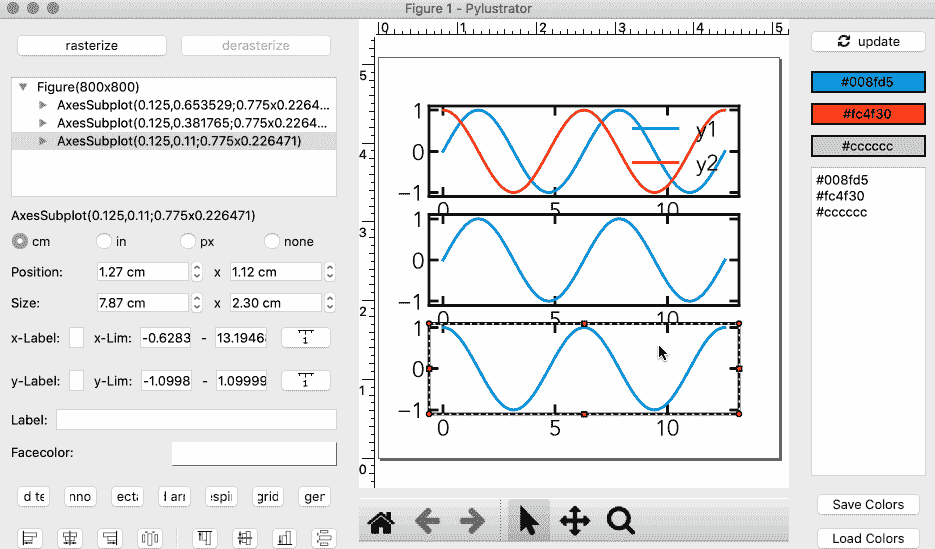
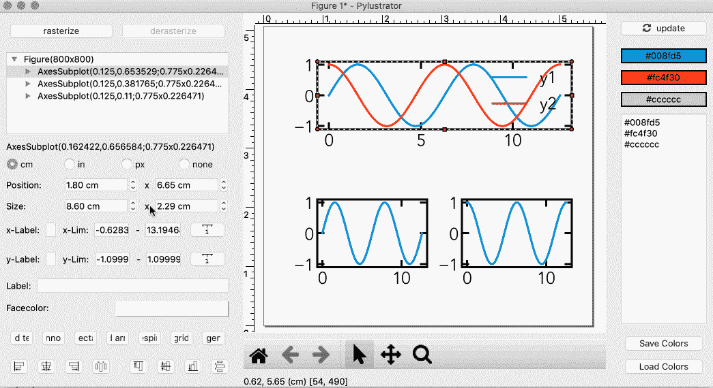
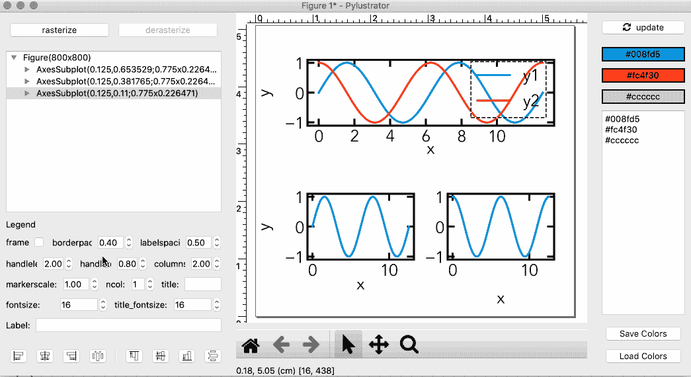
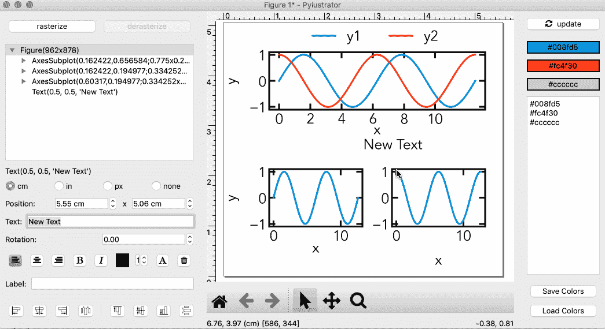
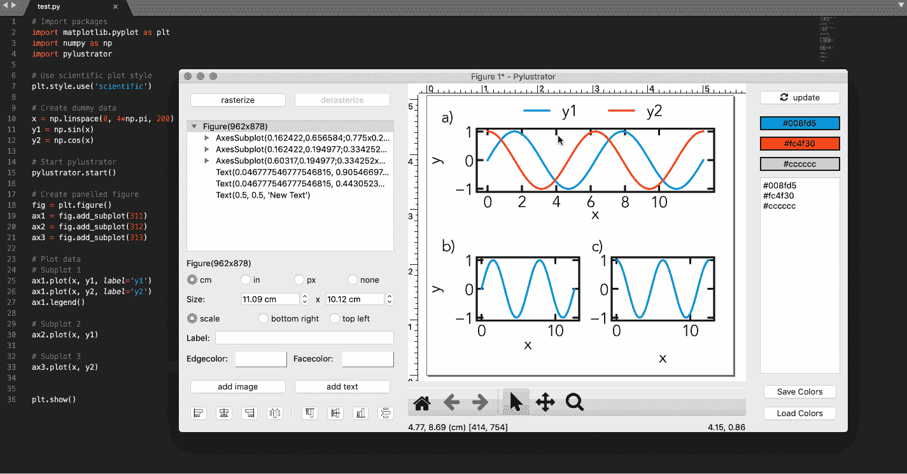
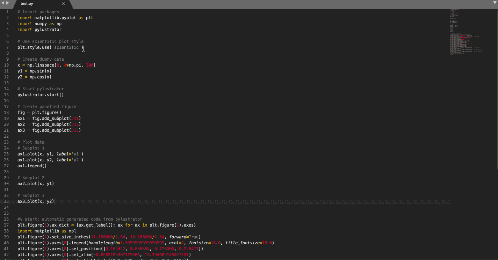

# 使用 Pylustrator 生成易于复制的科学图形

> 原文：<https://towardsdatascience.com/generate-easily-reproducible-scientific-figures-with-pylustrator-9426292e07a4?source=collection_archive---------48----------------------->

## Python 科学绘图

## 使用基于 GUI 的程序生成可重复的 Python 绘图脚本


由[卢卡斯·布拉塞克](https://unsplash.com/@goumbik?utm_source=medium&utm_medium=referral)在 [Unsplash](https://unsplash.com?utm_source=medium&utm_medium=referral) 上拍摄的照片

几个月前，我写了一篇关于用 Python 生成科学出版物图的文章。最近，我发现了这个名为 [Pylustrator](https://pylustrator.readthedocs.io/en/latest/) 的令人难以置信的新包，它大大简化了制作多面板图形的过程，而无需摆弄轴的大小。该软件包还会为您生成 Python 代码，因此您可以重现并与他人分享您的数据。在这篇文章中，我将做一些你可以用`pylustrator`做的事情的基本演示——希望它对你的剧情制作有用！

# **安装**

您可以使用以下命令使用`pip`安装`pylustrator`:

```
pip install pylustrator
```

# **生成地块**

首先，我们将把`matplotlib`、`numpy`(创建一些虚拟日期)和`pylustrator`导入到我们的脚本中:

```
**# Import packages** import matplotlib.pyplot as plt
import numpy as np
import pylustrator
```

我将使用我们在[上一篇文章](/a-guide-to-creating-and-using-your-own-matplotlib-style-30de6c60bac0)中开发的科学的`matplotlib`样式文件作为起点，这样我们就不必重复地改变字体、刻度大小等属性。在`pylustrator`中:

```
**# Use scientific plot style** plt.style.use('scientific')
```

现在，我们可以创建我们的图形——因为我们将在`pylustrator`中完成大部分操作，我们只需要创建最基本的图形，而不考虑格式。首先，让我们创建一些虚拟数据:

```
**# Create dummy data**
x = np.linspace(0, 4*np.pi, 200)
y1 = np.sin(x)
y2 = np.cos(x)
```

在我们开始创建图之前，我们将调用`pylustrator`函数:

```
**# Start pylustrator**
pylustrator.start()
```

现在让我们开始创建我们的基本图形。回想一下，当我们调用`add_subplot(rows, cols, index)`时，三个参数如下:

`rows` —我们的多点图中的行数

`cols` —我们的多点图中的列数

`index` —子情节的索引，从左上角开始，向右下方蜿蜒

```
**# Create panelled figure**
fig = plt.figure()
ax1 = fig.add_subplot(311)
ax2 = fig.add_subplot(312)
ax3 = fig.add_subplot(313)**# Plot data
# Subplot 1**
ax1.plot(x, y1, label='y1')
ax1.plot(x, y2, label='y2')
ax1.legend()**# Subplot 2**
ax2.plot(x, y1)**# Subplot 3**
ax3.plot(x, y2)
```

现在，我们最后必须在脚本末尾添加一个`plt.show()`来显示我们的情节，这样我们就完成了代码的编写！

```
**# Show plot** plt.show()
```

# **运行 Pylustrator**

因为我们已经添加了一行`pylustrator.start()`，我们可以继续运行我们的脚本文件:

```
python <your_filename>.py
```

然后，您应该会看到弹出以下屏幕:



## **调整大小/重新排列图形**

我们可以很容易地改变我们的情节安排，通过点击每个支线剧情，调整我们需要的大小，并四处拖动:



## **编辑刻度间隔**

还有一些菜单可以调整我们的图的刻度间隔:



## **编辑图例**

我们可以单击图例，切换一些选项，并像处理我们的图一样移动它:



## **添加文本注释**

当创建面板图时，您需要用数字或字母标记每个子图，以便在文本中引用它。这也很简单！



# **救国新图**

完成编辑后，我们可以通过使用`Ctrl/Cmd + S`并关闭`pylustrator` GUI 窗口来保存我们的图形。您会注意到代码将被添加到您原来的`.py`文件中。



现在，我们可以从脚本中删除`pylustrator.start()`命令，然后直接运行我们的文件来查看我们编辑过的图形！



酷！你现在可以分发这个`.py`文件，而不需要`pylustrator`，任何人都应该能够重现你的形象！

# **结论**

我们仅仅触及了`pylustrator`的一些特性，但是它看起来是一个不可思议的工具，可以为你的出版物/文章编辑你的 Python 图形。本文中的`plot.py`文件可以在这个 [Github 资源库](https://github.com/venkatesannaveen/python-science-tutorial)中获得。

感谢您的阅读！我感谢任何反馈，你可以在 [Twitter](https://twitter.com/naveenv_92) 上找到我，并在 [LinkedIn](https://www.linkedin.com/in/naveenvenkatesan/) 上与我联系，了解更多更新和文章。

# **参考文献**

格勒姆河(2020 年)。**py literator:用于出版的可复制图形的代码生成**。开放源码软件杂志，5(51)，1989 年。