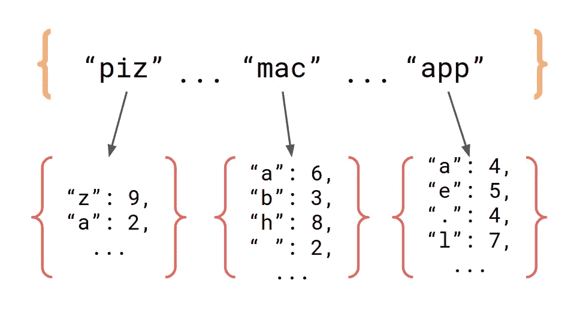
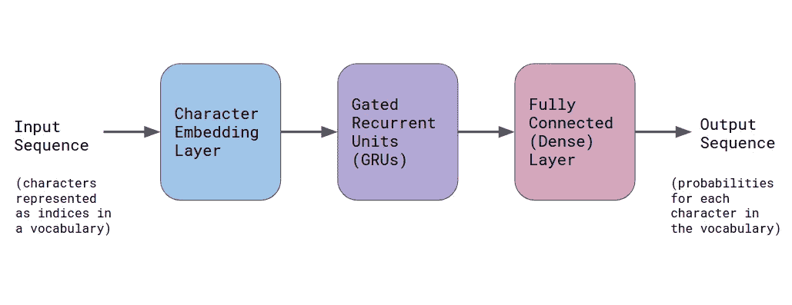

# 使用 Python 生成虚假的唐纳德·特朗普推文

> 原文：<https://towardsdatascience.com/generate-fake-donald-trump-tweets-using-python-8d83885fd5c6?source=collection_archive---------33----------------------->

## 马尔可夫模型和 RNN 文本生成的比较


萨拉·库菲在 [Unsplash](https://unsplash.com?utm_source=medium&utm_medium=referral) 上拍摄的照片

让我们使用机器学习来生成模仿唐纳德·特朗普的语言和风格的虚假推文！许多介绍性的机器学习教程都专注于分类任务，如 MNIST，所以我希望你喜欢这篇关于生成模型的文章。

我们将首先使用一种相对简单的方法来完成这项任务，称为马尔可夫模型，我们将从头开始编写代码(我使用的唯一的库是 NumPy)。然后，我们将看一看更高级的递归神经网络实现。我的希望是，首先通过马尔可夫模型的简单例子，可以更容易理解 RNN 模型是如何工作的。

# 数据

特朗普推特档案包含唐纳德·特朗普的 3 万多条推文。访问网站以 CSV 或 JSON 文件的形式下载给定日期范围内的推文。有一个选项可以下载每条推文的元数据(赞数、转发数、时间戳等)。)，但是现在，我们只需要原始文本。

[](http://www.trumptwitterarchive.com/archive) [## 特朗普推特档案

### 特朗普的所有 30，000 多条推文都可以立即搜索到

www.trumptwitterarchive.com](http://www.trumptwitterarchive.com/archive) 

# 方法 1: N 元马尔可夫模型

## 背景

Markov 模型查看文本中的 n-gram(n 个字符的子字符串),并计算每个 n-gram 出现在训练文本中时各种字母跟随它的频率。这是一种相当简单的语言表达方式，它很容易编程，在我上大学的时候，用 Java 做这件事是《CS 导论》中的一个[作业。](https://www.cs.princeton.edu/courses/archive/spr20/cos126/assignments/markov/checklist.html)

为了更深入地理解这是如何工作的，假设我们的训练文本由一个随机的英语大样本组成，使用的 n 元语法大小为 3。**马尔可夫模型一旦建立，就应该存储一个字典，其中的关键字是 n-gram(文本中出现的所有 3 个字符的子字符串)，值是从字符到频率的映射(给定字符跟随给定 n-gram 的次数)**。例如，如果为模型提供了 n 元单词“mac”，那么模型将知道下一个字母是“h”(像“machine”或“machete”这样的单词)的概率高于下一个字母是“z”(我想不出任何包含“macz”的单词)的概率。另一方面，给定 n-gram“piz”，模型应该给下一个字母是“z”(像“pizza”和“pizzeria”这样的词)比下一个字母是“h”更高的概率。



该模型本质上是一个将 n 字符序列映射到字符频率字典的字典。给定频率后，我们就可以归一化来寻找概率。

在语言语料库上对此进行训练会将训练数据的特征结合到模型中。如果你对它进行莎士比亚方面的训练，它将学会莎士比亚的词汇、表达和典型的莎士比亚戏剧的格式。如果你在 Twitter 数据集上训练它，你会看到标签、Twitter 句柄、URL 等。

n 元语法的大小越大，输出的文本就越“真实”。n 的值很小，就像一个人在到达末尾时忘记了他们是如何开始一个句子的。同时，具有大的 n 值将使模型更有可能从原始文本中再现精确的单词和短语，而不是产生新的句子。

## 加载数据

让我们直接进入马尔可夫模型的代码(完整的代码可以在[这里](https://github.com/thomashikaru/faketrumptweets)找到)。首先，我们读入并稍微预处理特朗普的推文。我们通过将所有推文连接在一起并去掉换行符来创建一个庞大的字符串。我们将保留大写，因为这在 tweet 的上下文中通常是有意义的。

```
f = open("trump_tweets_all.txt")
text = " ".join(f.readlines())
text = " ".join(text.split())
text = text.encode("ascii", errors="ignore").decode()
text.replace("&amp;", "&")
f.close()
```

## 构建模型

接下来，我们必须定义 MarkovModel 类。它的构造函数将接受 n-gram 大小`n`和训练文本。然后，我们在文本中移动大小为`n`的滑动窗口，并构建一个字典，其中每个 n 元语法都映射到它自己的字典，该字典包含从字符到计数的映射。当我们滑动窗口时，我们获取紧跟在当前 n-gram 后面的字符，并更新对应于给定 n-gram 字典中该字符的计数。你在 n-gram 'mac '后面看到一个' h '的次数越多，在' mac' n-gram 的字典中' h '的计数就越高。口头上解释这个有点混乱，那就用视觉形式试试吧。


上图说明了如何根据训练文本构建模型。在这个例子中，n-gram 的大小是 3(绿色字符的数量)。每个 n-gram 的字符计数字典根据下面的字符(用红色突出显示)进行更新。下图解释了我们试图创建的数据结构。当然，在通读了整个训练文本之后，这将是一部巨大的字典！

```
{ 
   "The": {" ": 1, ...},
   "he ": {"U": 1, ...}, 
   "e U": {"n": 1, ...},
   " Un": {"i": 1, ...},
   ...
}
```

马尔可夫模型有一个`get_next_char()`方法，它采用一个 n-gram，并根据它在构造器阶段学习到的概率分布选择下一个字符。当然，我们不希望这个方法总是为同一个 n-gram 返回同一个字符，所以必须有一点随机性，但是它应该遵循从文本中学习到的权重。NumPy 函数`numpy.random.choice()`在这里是个大帮手。

为了生成更长的字符串，我们反复调用`get_next_char()`方法。每当方法返回一个字符时，我们从 n-gram 中截取第一个字符并追加返回的字符。

```
def get_n_chars(self, length, ngram):
    *"""Returns a generated sequence of specified length,
    using the given n-gram as a starting seed."""* s = []
    for i in range(length):
        nextchar = self.get_next_char(ngram)
        ngram = ngram[1:]+nextchar
        s.append(nextchar)
    return ''.join(s)
```

## 结果

下面是模型输出的一些例子(我提供了第一个`n`字符，其余的由它填充)。

**n=13，start string = "Hillary Clint"**

> 希拉里·克林顿一直在如此努力地工作，而且受了如此严重的伤。我们继续生产以下地面以上高度的产品[@ NHC _ 大西洋](http://twitter.com/NHC_Atlantic):随着墨西哥湾沿岸危险条件的到来。请一定要投票给奥巴马。他不需要任何帮助——但是我正在给各种慈善机构捐款。

**n=7，start string = "希拉里"**

> 希拉里举了整整一个小时，这非常重要。明天中午。我会更好。今晚两分钟后加入我在加州的民主党)不要存在腐败！DJT 仍然没有证据表明天然气是为 TT 提供帮助的——但我们正在对如此小的马尔科鲁伯进行一项运动调查

## 观察

很酷地看到，这个模型能够识别所有没有以任何方式硬编码到系统中的语言特征。它只是查看 n-grams 后字符的统计分布，然而它能够正确拼写单词(大多数情况下)，使用标点符号和大写字母，有时甚至创建伪语法句子。

这种方法的一个缺点是，特别是对于小的训练文本，这种方法可能导致从源文本复制长串内容，而不是创建新的组合。理想情况下，我们希望模型能够提取拼写和语法等语言特征，但产生新的单词字符串，而不是简单地重复训练数据的长块(即一次几个单词)。Markov 模型的另一个缺点是，我们提供给 generate 方法的起始字符串必须是在训练文本中找到的 n-gram。如果你喂它一个它从未见过的 n-gram，那么它就不知道如何处理。下一节将介绍一个更高级的文本生成模型。

完整的代码和数据:[https://github.com/thomashikaru/faketrumptweets](https://github.com/thomashikaru/faketrumptweets)

# 方法 2:递归神经网络

## 背景

递归神经网络因其能够解决复杂的机器学习问题而受到广泛关注。RNNs 从根本上不同于其他类型的神经网络，如简单的前馈网络或卷积神经网络，因为网络的当前状态被“记住”并作为下一个时间步骤的输入。参见下面的文章，了解一些有趣的背景和例子。

[](http://karpathy.github.io/2015/05/21/rnn-effectiveness/) [## 递归神经网络的不合理有效性

### 递归神经网络(rnn)有一些神奇的东西。我仍然记得当我训练我的第一个循环…

karpathy.github.io](http://karpathy.github.io/2015/05/21/rnn-effectiveness/) 

## 准备培训示例

我们需要做的第一件事是确定词汇表——训练文本中的独特字符集。如果您包括大写字母、小写字母、数字、空白和特殊字符，这将带给我们大约 90 个独特的字符。然后，文本必须从字符串转换为数字列表，数字和字符之间存在一对一的映射。字符串`"abcba"`可能会变成类似于`[1, 2, 3, 2, 1]`的东西。

每个训练示例将由一个输入序列和一个目标序列组成，每个序列都有 n 个字母。目标序列就是去掉第一个字符并添加下一个字符的输入序列。如果原始文本包含序列`"Donald"`，那么我们可以形成一个输入-目标对`("Donal", "onald")`。看到许多这样的字符对将允许模型学习什么字符通常遵循序列`"Donal"`，并且希望任何其他序列。

我使用 Tensorflow 和 Keras 创建了 RNN，遵循了 Tensorflow 网站的教程[中使用的结构。网络由以下几层组成:单词嵌入层、GRU 层和全连接(“密集”)层。](https://www.tensorflow.org/tutorials/text/text_generation)



模型概述。

## 把...嵌入

嵌入层将输入的字符序列转化为数值，并嵌入到一个高维向量空间中。因此，每个字符首先被映射到一个整数(词汇表中的索引)，然后每个整数被映射到一个向量(在我的代码中，是一个 64 维的向量)。

我们为什么要这样做？字符嵌入很重要，因为它创建了比仅使用索引更有意义的输入数字表示。说字母“a”对应于数字 1，字母“z”对应于数字 26 是完全武断的。理想情况下，出现在相似上下文中的字符应该有相似的向量。嵌入层允许模型在训练期间学习词汇字符的良好矢量表示。

## 苏军总参谋部情报总局

GRU 是基本 RNN 体系结构的一种变体，已经非常有效地应用于许多自然语言任务。在这里和这里可以看到关于 RNNs、LSTMs 和 GRUs [的精彩文章，它们很好地解释了它们是如何工作的以及为什么工作。](/illustrated-guide-to-lstms-and-gru-s-a-step-by-step-explanation-44e9eb85bf21)

## 培养

为了训练这个模型，我们需要为我们的模型附加一个优化器和损失函数。损失函数计算预测输出和正确目标序列之间的分类交叉熵损失，如我们之前制作的训练样本中所定义的。请注意，模型的输出是词汇表中每个字符的概率序列(嗯，技术上是对数概率)。损失函数应该奖励将高对数几率分配给正确字符的模型，惩罚将高对数几率分配给错误字符的模型。

```
def loss(labels, logits):
    return tf.keras.losses.sparse_categorical_crossentropy(labels, logits, from_logits=True)
```

完成后，我们可以建立一个检查点目录，并开始培训！我用笔记本电脑的 CPU 和 Google Colab 上提供的免费 GPU 进行了实验。GPU 的训练速度快了大约 10 倍。Tensorflow 教程建议训练大约 30 个周期，以获得不错的结果。

## 发生

一旦模型被训练，我们使用与马尔可夫模型相似的过程来生成虚假推文。像以前一样，我们需要提供一个开始字符串，尽管它可以是任意长度，不一定是训练文本中存在的子字符串。该模型被反复评估，每次生成一个新的字符。然后，这个新字符作为输入被输入到模型中，模型仍然“记住”它在上一步中看到的文本。最后，我们打印所有生成字符的连接。

```
def generate_text(model, start_string):
    num_generate = 280
    input_eval = [char_to_index[s] for s in start_string]
    input_eval = tf.expand_dims(input_eval, 0)
    text_generated = []
    model.reset_states() for i in range(num_generate):
        predictions = model(input_eval)
        predictions = tf.squeeze(predictions, 0)
        predicted_id = tf.random.categorical(predictions, num_samples=1)[-1, 0].numpy()
        input_eval = tf.expand_dims([predicted_id], 0)
        text_generated.append(index_to_char[predicted_id]) return start_string + ''.join(text_generated)
```

## 结果

以下是 RNN 的一些示例输出(我提供了起始字符串，它填充了其余部分):

**开始弦乐:“美”**

> 美国已经达成了一个代理，谁做了一个非常大的交易改变了男人&这将…纽约必须知道这本书，但它是关于他的。因为他们会找到任何抗议声明。关闭新的，我们给所有参与给我们带来新书十亿美元扔出一个骄傲的坏。伤心！

**开始字符串:“希拉里·克林顿”**

> 希拉里·克林顿在 CNBCNBC 的 today-RESSUDEMINT
> 上离开了夜晚，我们必须测试 200 亿美元将会建造的凯尔索的经济效益。
> 俄罗斯最愚蠢的愤怒和资助。
> @ bassuckstmannieseal&@ dn some 1 z @ CNN 找链接人肯定是川普国际早安美国】[http://t.co/AhYnMlbaement](http://t.co/AhYnMlbaement)

## 观察

考虑到 RNN 比马尔可夫模型复杂得多，结果似乎并不令人印象深刻。然而，重要的是要记住，rnn 通常是在数百兆字节的数据上训练的，远远超过这个训练集中的大约 3 万条特朗普推文。此外，通过调整超参数或将多个 RNN 图层添加到模型中，您可能会获得更好的结果。您可以试验不同的序列长度值、嵌入维数或 gru 数。

RNNs 的一个缺点是训练速度很慢。出于许多实际目的，GPU 对于实现合理的训练时间是必要的，即使这样也需要一些耐心。考虑使用 Google Colab，其中包括对 GPU 的有限免费访问，来试验 RNNs。你可以在云端训练，让你的机器不会过热！

完整的代码和数据:[https://github.com/thomashikaru/faketrumptweets](https://github.com/thomashikaru/faketrumptweets)

# 结论

如果你想自己学习这些话题，我建议你找一个像这样的迷你项目，你可以真正地投入其中并享受其中。这将有助于你保持动力，你将从自己的项目实践中学到比被动阅读或观看教程更多的东西。

在更严格的设置中，我们可能希望使用某种度量来评估我们的生成器，但这实际上是相当具有挑战性的。评估文本输出的质量比评估分类器复杂得多，在分类器中，您只需要将预测与标签进行比较。[这篇伟大的文章](/evaluating-text-output-in-nlp-bleu-at-your-own-risk-e8609665a213)讨论了一些用于评估 NLP 中文本输出的指标。

感谢阅读！欢迎留下您的反馈，祝您学习顺利！

## 参考资料:

[1] Andrej Karpathy，[递归神经网络的不合理有效性](http://karpathy.github.io/2015/05/21/rnn-effectiveness/) (2015)。

[2] Tensorflow，[文本生成与 RNN](https://www.tensorflow.org/tutorials/text/text_generation) (2020)。

[3]普林斯顿大学计算机科学系，[自然语言的马尔可夫模型](https://www.cs.princeton.edu/courses/archive/spr20/cos126/assignments/markov/index.html) e (2020)。

[4] M. Phi，[LSTM 和 GRU 的图解指南:一步一步的解释](/illustrated-guide-to-lstms-and-gru-s-a-step-by-step-explanation-44e9eb85bf21) (2018)，中等。

[5] M. Phi，[循环神经网络图解指南](/illustrated-guide-to-recurrent-neural-networks-79e5eb8049c9) (2018)，中。