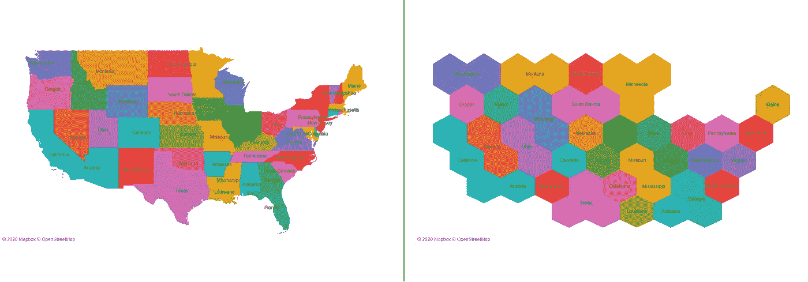
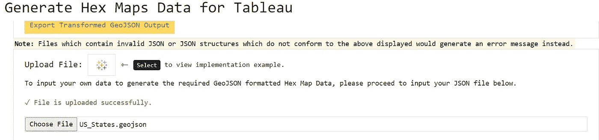
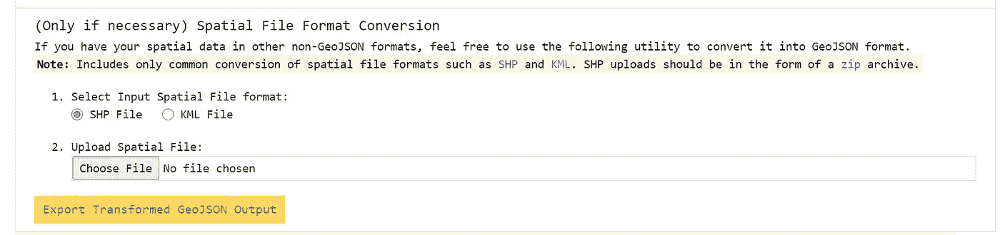
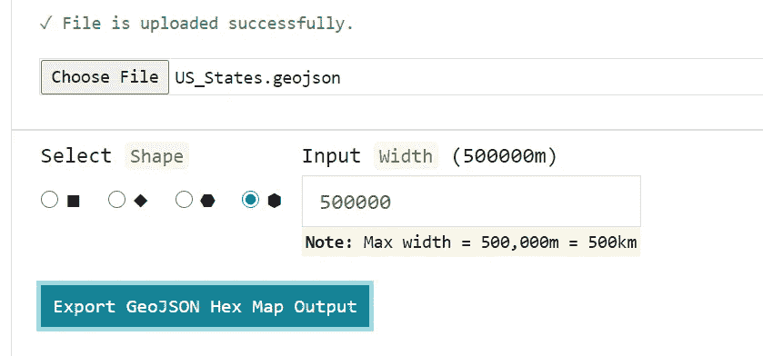
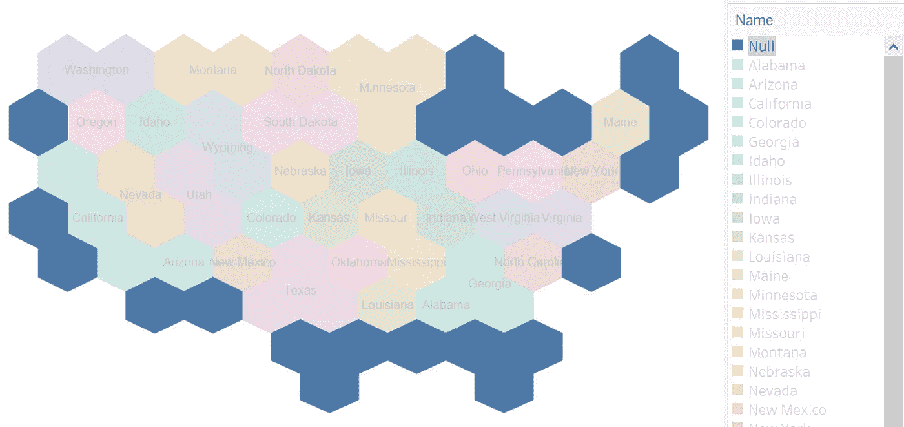
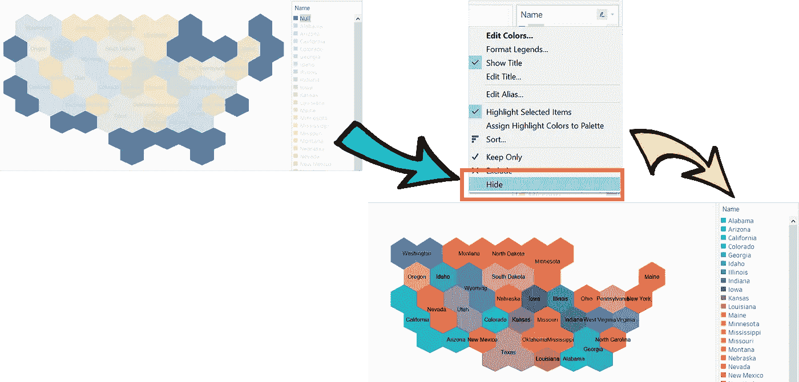

# 从现有空间数据生成十六进制地图只需不到 3 个步骤

> 原文：<https://towardsdatascience.com/generate-hex-maps-from-your-existing-spatial-data-in-less-than-3-steps-a6f39d778d84?source=collection_archive---------20----------------------->

## 空间可视化——结合使用 [Turf](https://turfjs.org/) 和 [Hextile](https://github.com/datagovsg/hextile) JavaScript 库来生成十六进制地图

看过许多文章后，我注意到许多人试图为他们当前的空间数据集生成十六进制地图，要么是为了美观(例如仪表板可视化)，要么是为了最大限度地减少重叠几何特征造成的空间失真。嗯，我有好消息告诉这些人，因为我最近发现结合使用两个 JavaScript 库可以让用户立即呈现所需的输出，消除了在 Tableau 中添加任何额外计算字段的麻烦。为了方便用户和将来的使用，这个新功能已经被部署到我在 https://tableau-data-utility.onrender.com/[的网络应用上。因此，下面是数据转换和结果可视化的快速预览:](https://tableau-data-utility.onrender.com/)

图片作者| ( **左**)美国各州多边形地图| ( **右**)美国各州十六进制地图

上图**不涉及 Tableau** 中的任何计算。方法是简单地将 GeoJSON 格式的文件预处理成另一个 GeoJSON 文件，该文件渲染六边形而不是多边形。

只需导航至[https://tableau-data-utility.onrender.com/](https://tableau-data-utility.onrender.com/)并将您的空间数据输入 web 应用程序:

作者图片| US_States.geojson 文件已成功上传至浏览器工具

按作者分类的图像|如果您的空间数据集采用其他格式，如 SHP 或 KML，则在同一页面上还有一个实用工具可用于将您的空间数据输出为所需的 GeoJSON 格式

图片作者|最后，上传 GeoJSON 数据后，选择可用的形状选项-正方形、菱形、六边形和反六边形|继续调整宽度(以米为单位),然后选择“导出 GeoJSON 十六进制地图输出”

作为参考，US_States.geojson 的文件可以在我的 [GitHub](https://gist.github.com/incubated-geek-cc/5da3adbb2a1602abd8cf18d91016d451/raw/acaf26c65998bd5f53d6172dc6616c448584b19c/US_States.geojson) 上找到，带有上述参数的输出文件—倒六边形+宽度(500，000m)也可以在我的 [GitHub](https://gist.github.com/incubated-geek-cc/d6a8571fe6b5ba433f5b431bab630c21/raw/8bb5201e3b091ce125d6233e4dc38dc02fbb59f5/US_States_hexagon_90_500000_hexmap.geojson) 上找到。只需保存文件，并在 Tableau 或 Leafletjs(无论你喜欢哪个 GeoJSON 平台)中渲染它，这就是你得到十六进制地图可视化所要做的一切！

基本上，浏览器工具使用库 [Turf](https://turfjs.org/) 和 [Hextile](https://github.com/datagovsg/hextile) 在后端完成所有繁重的工作，生成十六进制格式的数据。需要注意的是，要确定没有映射到地图任何特定部分的六边形:

按作者分类的图像|空值是指未映射到原始空间文件任何部分的六边形

图片作者|因此，隐藏空值以最大限度地减少生成的地图中的冗余六边形是明智的做法|通常，空值的出现是因为计算出的六边形的质心都不在原始空间数据的任何多边形内

请访问[https://tableau-data-utility.onrender.com/](https://tableau-data-utility.onrender.com/)随意尝试其他国家省或州的其他数据集——请注意，目前 web 应用程序的标题上有几个选项卡:

作者图片|选择“空间数据到十六进制地图”以访问正确的工具

请随意使用其他 Tableau 数据实用工具——我发布的另一个[教程](/leverage-on-d3-js-v4-to-build-a-network-graph-for-tableau-with-ease-cc274cba69ce)中的网络图到 CSV，以及本[教程](/underrated-combined-functionalities-of-tableau-point-linestring-polygon-mapping-b4c0568a4de2)中的空间数据到 CSV。

希望这有助于简化和减少 Tableau 数据处理中的麻烦！

感谢您的阅读。

 [## 通过我的推荐链接加入灵媒——李思欣·崔

### 获得李思欣·崔和其他作家在媒体上的所有帖子！😃您的会员费直接…

geek-cc.medium.com](https://geek-cc.medium.com/membership)