# 用 Python 生成有意义的词云

> 原文：<https://towardsdatascience.com/generate-meaningful-word-clouds-in-python-5b85f5668eeb?source=collection_archive---------3----------------------->

## 辅导的

## 从文本中提取有意义的单词并在 python 中创建单词云艺术的方法。

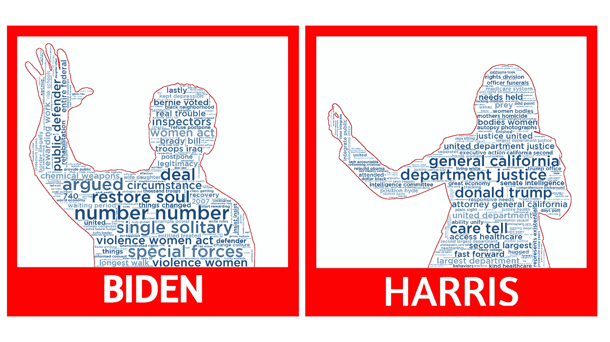

布莱恩·迪金森的插图

你肯定见过一个字云。一般来说，这是一张充满单词的照片，其大小取决于单词在你想要分析的文本中出现的频率。我对此并不知情，但很明显，有人(不确定)对文字云有强烈的反对和支持。我读到过[他们是糟糕的](https://www.linkedin.com/pulse/20141008200328-72012765-your-word-cloud-is-bad-and-you-should-feel-bad/)、[蹩脚的](/word-clouds-are-lame-263d9cbc49b7)，把他们等同于现代的饼状图，甚至把他们[比作新的乌鱼](http://www.zeldman.com/daily/0405d.shtml)。哎哟。一条鲻鱼？走吧。


布莱恩·迪金森插图

我也看过一些[改善 word](https://medium.com/multiple-views-visualization-research-explained/improving-word-clouds-9d4a04b0722b) 云的方法和[有用的时候](https://prowritingaid.com/art/425/What-the-Heck-is-a-Word-Cloud-and-Why-Would-I-Use-One.aspx)去使用它们。不管你属于哪个阵营，我发现在演示中利用引人注目的图形或视觉效果，可以吸引你的观众，促使他们做出反应，可以开始对话，可以产生影响，并为更详细的分析打开大门。视觉上引人注目的文字云艺术可以吸引读者。也就是说，我不会深入研究单词云的利弊，你可以查看上面的链接。

我们将使用几种不同的方法从文本中提取一些有意义的单词。然后，我们将使用 Python 库 WordCloud、pandas 和 NumPy 生成一些单词云。

WordCloud 是 Python 中的单词云生成器。您可以通过以下命令之一安装 WordCloud。
`pip install wordcloud
conda install -c conda-forge wordcloud` 在这里查看安装细节[，在这里](https://pypi.org/project/wordcloud/)可以通读 WordCloud 文档[。](http://amueller.github.io/word_cloud/)

## 数据

我们将使用的数据是 2020 年总统大选的民主党初选辩论。你可以在这里通过 Kaggle 找到完整的数据集[。数据已经被清理和过滤。Github](https://www.kaggle.com/brandenciranni/democratic-debate-transcripts-2020) [repo](https://github.com/bryan-md/wordcloud) 包含了清洁步骤。

**1|导入库和数据**

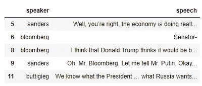

在创建词云之前，文本停用词应该专门更新到文本的领域。例如，如果我们正在为一家航空公司完成来自客户推文的词云，我们可能会得到像“*飞机*”、“*飞行*”、“*旅行*”这样的词，它们可能对您正在完成的任何分析都没有任何意义。

在这个数据集中，包含了额外的停用词，因为它们在文本中出现了很多，但对分析没有贡献。例如，像'*参议员*'、*众议员*'、*人民*'、*事实*这样的词都是许多候选人在句子中使用的词，如*'我同意参议员桑德斯……*'或*'事实是……'*、*'美国人民想要..'*并不一定有助于词义的词为词云。

**2.1|方法 1 —使用 WordCloud 处理** 创建文字云最简单快捷的方法就是简单地使用 word cloud 处理文字。

文本需要在一个长字符串中，以便 WordCloud 对其进行处理。我们将数据过滤到“ *biden* ”，创建一个他的回答列表，并连接该列表以创建一个长的文本字符串。然后我们创建单词云对象，使用 *generate()* 方法，并传递我们的文本字符串。最后，我们使用 *plt.imshow* 来显示图像。

我们来看看文档中的参数:
***停用词*** :该参数取一组将从词云中剔除的字符串(词)。我们在这里使用了更新的停用词列表。

***背景 _ 颜色*** :设置背景颜色，默认为黑色

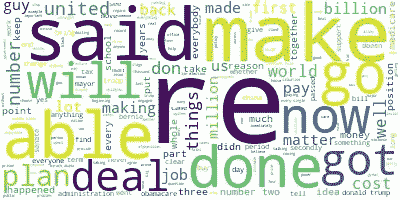

结果…看起来有点像胡言乱语，看起来没有太多信息。单词' *re* '、*表示*'、 *make* '、*表示*似乎是出现频率最高的单词。这些在乔·拜登的信息中似乎并不太重要，而像'*成本*'、*医疗保险*'和'*世界*'这样的词在背景中。一种选择是继续更新停用词。这个过程的一个挑战是知道何时停止。什么时候你知道你有足够多的单词而不用去掉有用的单词？我并不是对这种方法不屑一顾，我以前用过。

我们可以使用 *process_text()* 和 *words_* 方法分别显示文本中的字数和相对数。

```
# output
[('re', 148), ('make', 117), ('ve', 106), ('said', 95), ('able', 88)]
[('re', 1.0), ('make', 0.7905405405405406), ('ve', 0.7162162162162162), ('said', 0.6418918918918919), ('able', 0.5945945945945946)]
```

你可以瞥一眼其他候选词，你会注意到类似的结果，无意义的词出现在列表的较高位置。让我们调整一些额外的 WordCloud 参数来改善显示的单词。
***min _ word _ length:***是一个词必须包含的最小字母数
***搭配 _threshold:*** 是一个催款似然得分。文本中的二元模型必须达到大于此参数的分数，才能算作二元模型。默认值设置为 30。

我们将添加最小单词长度 4 和 collocation _ threshold 3 来包含更多二元模型。最后，也许是最重要的，我将使用一组不同的停用词。原始设置是从 WordCloud 导入的。我将导入并使用 SpaCy 库中提供的停用词，并用我自己的停用词更新列表。没有真正的理由使用 SpaCy 的列表，除了我在过去使用过它，并取得了良好的效果。您可以使用许多不同的[停用词库](https://medium.com/towards-artificial-intelligence/stop-the-stopwords-using-different-python-libraries-ffa6df941653)。

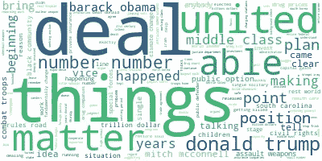

左:原始词云|右:更新的停用词和参数

我们看到了相当大的进步！我们得到了一些不同的词，包括像“*唐纳德·特朗普*”、“*巴拉克·奥巴马*”、“*公共选择*”和“*中产阶级*”这样的词。更多的调整/更新停用词可能会改善这一点。

**2.2|方法 2——利用词频** 前一种方法使用一串文本。如果不一定能接触到全文或者想直接使用词频怎么办？一个替代 *generate()* 方法的 WordCloud 是*generate _ from _ frequency()*方法，它将获取一个单词及其频率的字典，并根据计数创建一个单词云。让我们试一试。

我们仍然有全文，所以我们将利用 CountVectorizer 来创建一个字数矩阵。如果你已经有一本计数字典或者一袋单词矩阵，你可以跳过这一步。

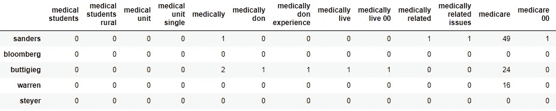

单词包数据框的片段

现在我们只需要提取这个数据帧中的一行，创建一个字典，并将其放入 WordCloud 对象中。

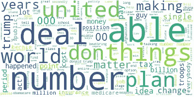

左图:使用词云的旧词云|右图:使用词频的新词云

新的词云看起来和以前的版本有些相似。有相似的顶频词，也有一些区别。当使用*generate _ from _ frequency*方法时，它会忽略一些参数，包括*搭配*和*停用词*参数。CountVectorizer 处理文本，包括停用词和词汇化。如果我们想对单词做额外的调整，需要在将它们放入 WordCloud 对象之前完成。我们可以看到'唐纳德'被词条化为'唐',在这个版本中没有二元模型。

从 frequencies 创建单词云的另一个选项是利用 collections Counter 对象来创建一个字典，您可以在 word cloud 中使用它。这需要对文本进行预处理，包括对单词进行标记，然后使用 counter 对象对每个单词进行计数。如果您需要整个文本，那么使用 WordCloud 对象来完成这个任务会更容易。

**2.3|方法 3—对数比值比** 从最后两个词云中，我们得到了包含这些候选人所说内容的相当好的词组。如果你查看来自多个候选人的热门单词，你会发现相似的单词开始出现在所有人的面前——但是特定于某个人的单词或短语呢？例如，如果你看过这些辩论，你可能会注意到艾米·克洛布查尔提到*“领先的民主党人”*，拜登喜欢数他的分数(*“第一”，“第二”)..*)相当经常。我们可以看到某个候选人提到的重要单词或短语，但其他人没有。

回到我们为飞机公司分析客户推文的例子。我们可能希望捕捉客户提及的细分市场。与其他旅客相比，我们的商务旅客是怎么想的？许多词可能是相同的，如'*座位*'和'*体验*'，但它们可能与同样提到'*座位*'和'*体验*'的紧急旅行者有不同的想法和优先顺序。区分这些词有助于更好地了解这些不同的客户群。

简而言之，我们希望看到某个候选人(比如说皮特·布蒂吉格)的哪些词相对于所有其他候选人来说最常见。我们会对每个候选人都这样做。

为此，我们将使用为每个单词计算的[对数比值比](https://en.wikipedia.org/wiki/Odds_ratio)的度量，如下所示:

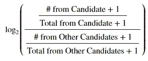

[加法平滑](https://en.wikipedia.org/wiki/Additive_smoothing)用于避免被零除

我们使用单词包数据帧，并使用上面的计算转换每一行。结果是一个数据框，显示了特定候选人说出的每个单词的对数概率。

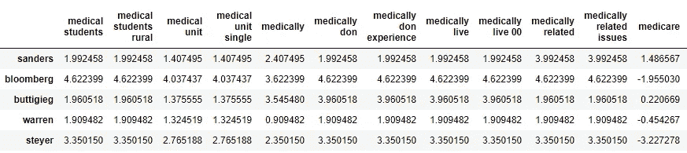

转换后的单词包数据帧与对数比值比的片段

我们试图找出每个候选人最独特的词。以下是四个候选人的前 10 个单词，你能把它们和正确的候选人匹配起来吗？

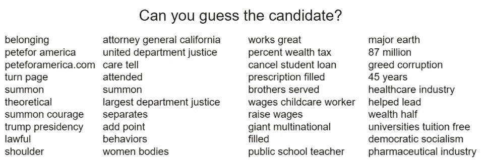

从左至右:皮特·布蒂吉格、卡玛拉·哈里斯、伊丽莎白·沃伦、伯尼·桑德斯

按照上面通过词频生成词云的相同步骤，我们现在可以创建一个新的词云。

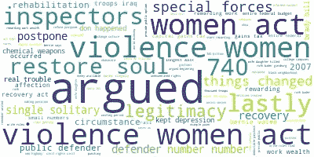

这个方法的伟大之处在于 n 元文法是用这个方法生成的。我们看到了拜登关于*重塑美国灵魂的信息，以及他提到的针对女性的暴力法案。*还有其他方法可以使用，比如加权对数优势比& tf-idf。

那么我们用哪个文本呢？前提是用文字创造出令人惊叹的视觉对比分析。我将两者结合起来，给出一个候选人常用词和常用词的一般概念。

**2.4|组合词典** 我们有两种不同的词典/词频(方法 1 & 3)，我们可以单独使用或组合使用它们来创建一个无所不包的词云。合并后，我们将再做一个调整。你会注意到一个单词可能会有不同的拼写。像*保健*和*保健*。我们将把这些加在一起，以便更好地表达这个词。

这可能看起来有点疯狂。这段代码将第二个字典中最常用单词的频率设置为第一个字典中最常用单词的频率。
我们现在合并字典，将“healthcare”和“health care”合并成一个关键字，以便更好地表示。下面显示了前 5 个条目和词云。

```
[('number number', 56),
 ('argued', 44),
 ('special forces', 41),
 ('single solitary', 41),
 ('restore soul', 40)]
```

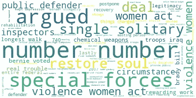

很好，我们看到了候选人频繁使用的两个世界的融合，以及候选人独有的常用词。我们有我们的文本接下来将创建我们的自定义单词云。

**3 |准备照片** 这一步不是用 python 完成的。你需要找到一个图像来使用。有很多免费的图片收藏网站可以选择，比如:Unsplash、Pixabay、Pexels 和 T10。
一旦你找到一张照片，它需要被转换成黑色&白色。照片的黑色部分将是文字显示的地方，白色区域将显示为白色。你可以在 Photoshop 等照片编辑软件中完成这一点，也可以在网上用免费的照片编辑软件如 [Pixlr](https://pixlr.com/) 来完成。我用这两种方法很容易地将背景从图片的主体中分离出来。有些照片比其他照片需要多一点时间。

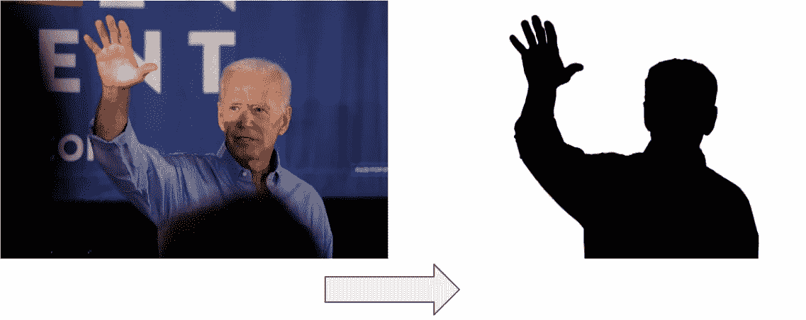

左图由[量具 Skidmore](https://www.flickr.com/people/gageskidmore/) CC BY-SA 2.0 提供

> 专业提示:在创建照片时，确保背景确实是白色的，而不是透明的。透明像素值将被导入为 0 或黑色，不会给你一个蒙版图像。

**3 |导入照片并创建单词云** 有多种方法可以给你的单词云中的单词上色。我将详细介绍两个，您可以在 Github repo 中看到第三个。第一个是利用彩色地图。

好了，让我们来看一下这段代码。第一行导入您的黑白图像，第二行在创建图像时调整任何细微的颜色差异。我让 Adobe Illustrator 给我一个介于 240 和< 255 之间的更大范围的“白色”像素值，创建一个无法工作的图像。所以这条线把所有大于 3 的像素值都变成白色，剩下的都是原来的值。然后，我们用一些新参数创建 WordCloud 对象。

***font_path*** :这是一个你想为单词使用的字体的路径。您可以将此路径指向操作系统的字体文件夹。*(即。c:\ Windows \ Fonts \ font . TFF)*
***contour _ color***:图像轮廓的颜色
***max _ words***:图像中使用的最大字数
***mask*** :您的图像矩阵
***color map***:用于文字的颜色图


乔·拜登的单词云和蓝色地图

看起来棒极了！虽然浅色很难辨认。我们可以改变背景或选择不同的颜色或色彩映射表。另一个选择是选择我们想要使用的颜色图中较暗的部分。我们将添加两行，从 matplotlib 导入一个色图作为颜色矩阵，然后选择矩阵中较暗的部分。

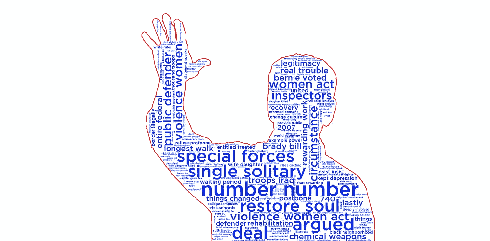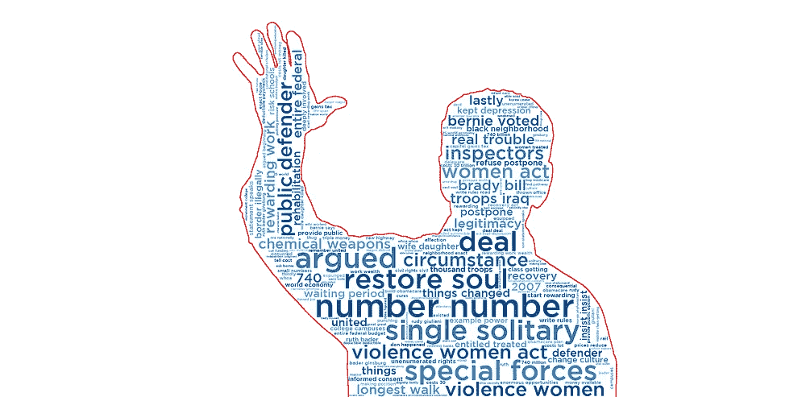

用自定义颜色创建的左侧图像。用 matplotlib 色彩映射表创建的右图

你可以看到成品看起来相当不错。右边的图像是上面代码中颜色较深的图像。我也用它来创建标题图像。左边的图像是自定义颜色。你可以在 Github [repo](https://github.com/bryan-md/wordcloud) 中找到这个词云的代码。您可以使用 *to_file()* 方法保存图像，并传递一个保存文件的位置。`wordcloud.to_file(“path_to\\wordcloud_image.png”)`

**3.1 |创建一个图像着色的文字云** 另一个选择是使用照片本身的颜色给文字着色。你需要像以前一样准备照片，但是只去掉背景，留下你希望文字覆盖的图像部分。

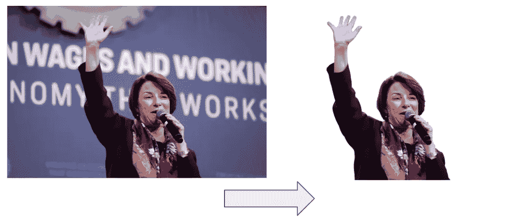

左图由[量具滑轨莫尔](https://www.flickr.com/people/gageskidmore/) CC BY-SA 2.0 提供

我们再次创建遮罩(不改变任何值)。对 WordCloud 的参数做了一些改动。为了增加可读性，对字体和背景的大小和颜色做了一些改变。
***ImageColorGenerator***用于为文字云创建颜色，而 *recolor()* 方法用于改变文字的颜色。

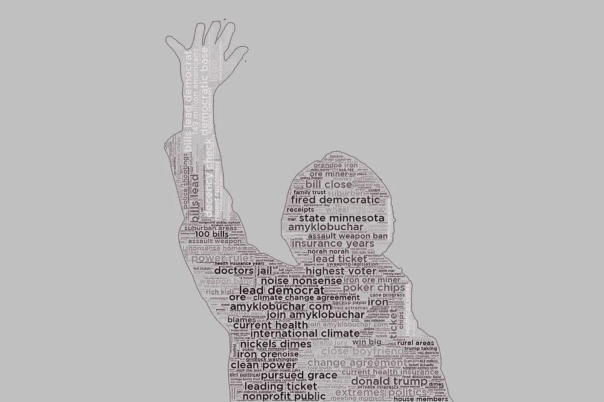

艾米·克洛布查尔的词汇云

我们探索了几种不同的方法，利用不同的停用词从全文和词频中提取一些有意义的文本。我们还研究了利用对数比值比从部分文本中寻找常用词。我们还使用不同的遮罩、字体和颜色绘制了几种类型的单词云。希望这能帮助你为项目创造一些有用的视觉效果。

点击这里查看 Github [库，上面所有例子的代码都在这里。](https://github.com/bryan-md/wordcloud)

如果你对学习和实现其他 NLP 技术以从文本中提取见解感到好奇，请查看 Neptune.ai 的这篇[博客文章](https://neptune.ai/blog/exploratory-data-analysis-natural-language-processing-tools)，它涵盖了超过 7 种其他 NLP 技术，包括情感分析和词性标注。

如果这有帮助，让我知道！我很想听听你对词云的想法，看看你的一些成果。