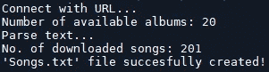
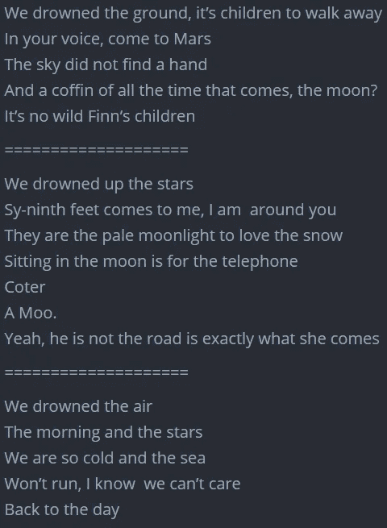

# 两分钟内生成尼克·凯夫的歌词

> 原文：<https://towardsdatascience.com/generate-nick-caves-lyrics-in-2-mins-e265f8fc78e2?source=collection_archive---------66----------------------->

## 在这篇文章中，我们将使用 GPT-2 语言模型来开发一个简单的歌曲歌词生成器，以尼克·凯夫为例，他是我最喜欢的艺术家之一。

# GPT-2

GPT-2 是一个大型的基于转换器的语言模型，有 15 亿个参数。它的训练有一个简单的目标:给定某个文本中所有的前一个单词，预测下一个单词。由 800 万个网页组成的数据集的多样性，导致这个简单的目标包含跨不同领域的许多任务的自然发生的演示。有关详细信息，请访问[open ai 出版物](https://cdn.openai.com/better-language-models/language_models_are_unsupervised_multitask_learners.pdf)。让我们集中精力练习吧！

# 解析歌词

首先，我们需要使用众所周知的`BeautifulSoup`库解析来自*尼克·凯夫* [官方网页](https://www.nickcave.com/lyrics/)的歌词。

解析尼克·凯夫的歌曲

运行上面的代码后，我们在`songs.txt`文件中保存了来自 20 张专辑的 201 首歌曲。

# 火车模型

## 构建标记器

使用`[aitextgen](https://github.com/minimaxir/aitextgen)` [库](https://github.com/minimaxir/aitextgen)在下载的歌曲上训练一个自定义标记器。这将保存两个文件:`aitextgen-vocab.json`和`aitextgen-merges.txt`，它们是重新构建分词器所需要的。

## 列车 GPT-2 变压器模型

使用创建的 tokenizer 启动 aitextgen

创建 TokenDatasets，构建用于训练的数据集，以适当的大小处理它们。

训练时间到了！

# 生成歌曲

从“我们淹死了”开始生成 3 个段落，并将它们保存到文件中。您可以修改`max_length`和`temperature`参数。温度是随机性相关的超参数。当其值较小时(如 0，2)，GPT-2 模型更有信心，但也更保守。当温度是一个大值(例如 1)时，GPT-2 模型产生更多的差异，也产生更多的错误。在我看来，当你想生成一件艺术品时，第二种选择要好得多；).

下面你可以看到样本结果。看起来挺有前途的，尤其是考虑到需要多少编码量:)。

感谢阅读！