# 利用深度学习生成新颖的艺术作品

> 原文：<https://towardsdatascience.com/generate-novel-artistic-artworks-with-deep-learning-f2f61da69e6e?source=collection_archive---------42----------------------->

## 深度学习与艺术:神经类型转移

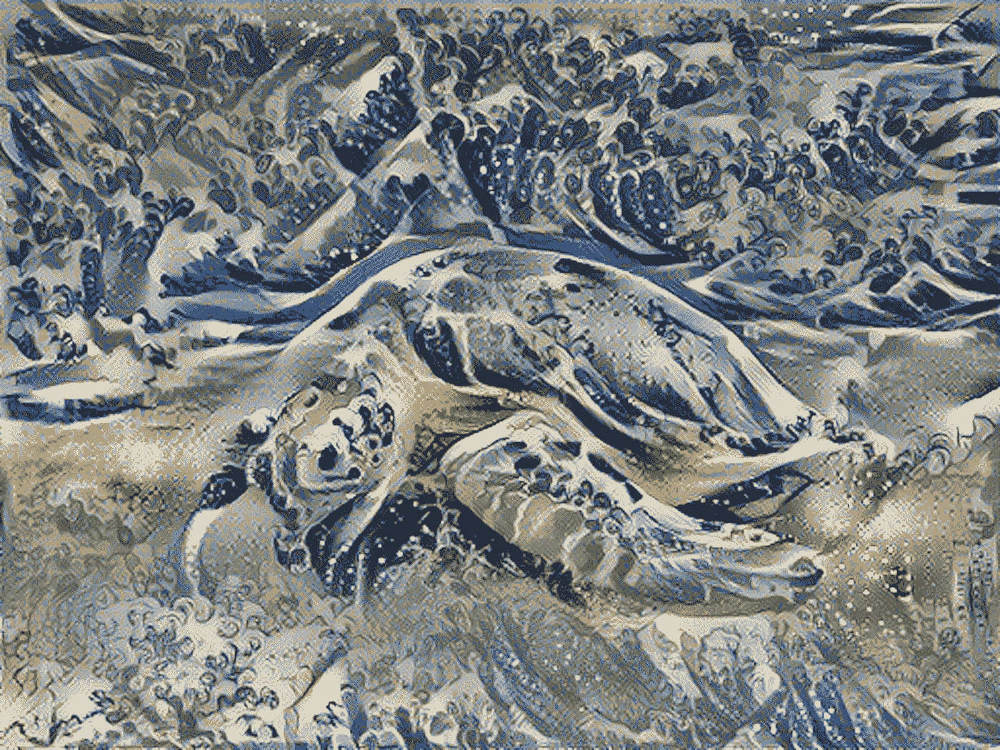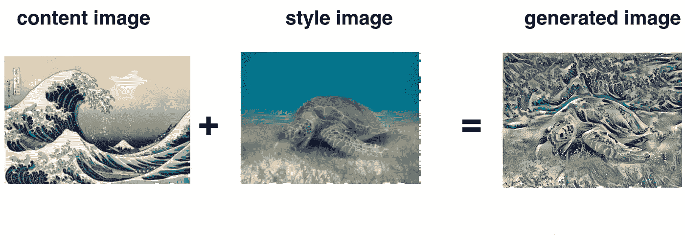

**神经类型转移的一个例子**

# 1.问题陈述

在这篇文章中，我将继续使用深度学习以另一幅图像的风格创作图像(曾经希望你能像毕加索或梵高一样画画吗？).这就是所谓的**神经风格转移**！这是一种在[莱昂·A·加蒂斯的论文中概述的技术，一种艺术风格的神经算法](https://arxiv.org/abs/1508.06576)，这是一本很棒的读物，你绝对应该去看看。

但是，什么是神经风格转移呢？

神经风格转移是一种优化技术，用于拍摄三幅图像，一幅**内容**图像，一幅**风格参考**图像(如著名画家的艺术作品)，以及您想要设计风格的**输入**图像——并将它们混合在一起，以便输入图像被转换为看起来像内容图像，但以风格图像的风格“绘制”,从而桥接深度学习和艺术的轨道！

例如，让我们来看看这只海龟和葛饰北斋的*神奈川*外的巨浪:

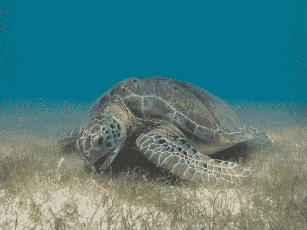

[绿海龟图片](https://commons.wikimedia.org/wiki/File:Green_Sea_Turtle_grazing_seagrass.jpg)——P . Lindgren【CC By-SA 3.0([https://creative Commons . org/licenses/By-SA/3.0)】](https://creativecommons.org/licenses/by-sa/3.0)%5D)，来自维基共享资源。

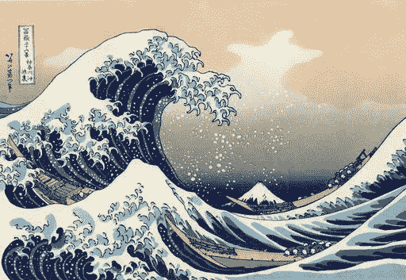

[https://en.wikipedia.org/wiki/The_Great_Wave_off_Kanagawa](https://en.wikipedia.org/wiki/The_Great_Wave_off_Kanagawa)

现在，如果 Hokusai 决定用这种风格来画这只海龟，会是什么样子呢？类似这样的？

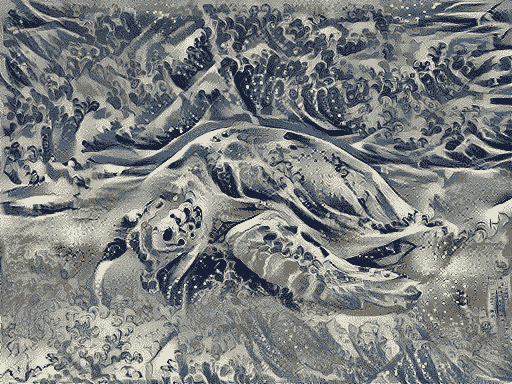

这是魔法还是只是深度学习？幸运的是，这不涉及任何巫术:风格转移是一种有趣的技术，展示了神经网络的能力和内部表示。

神经风格转移的原理是定义两个距离函数，一个描述两幅图像的内容如何不同的𝐿𝑐𝑜𝑛𝑡𝑒𝑛𝑡，另一个描述两幅图像在风格方面的差异的𝐿𝑠𝑡𝑦𝑙𝑒.然后，给定三个图像，期望的样式图像、期望的内容图像和输入图像(用内容图像初始化)，我们尝试变换输入图像，以最小化内容图像的内容距离和样式图像的样式距离。总之，我们将获取基本输入图像、我们想要匹配的内容图像和我们想要匹配的样式图像。我们将通过反向传播最小化内容和样式距离(损失)来转换基本输入图像，创建一个匹配内容图像的内容和样式图像的样式的图像。

在本文中，我们将生成一幅巴黎卢浮宫博物馆的图像(内容图像 C)，混合了印象派运动领袖克洛德·莫内的一幅画(风格图像 S)。

# 2.迁移学习

神经风格转移(NST)使用先前训练的卷积网络，并在此基础上构建。使用在不同任务上训练的网络并将其应用于新任务的想法被称为[迁移学习](https://www.coursera.org/learn/convolutional-neural-networks/lecture/4THzO/transfer-learning)。

根据[NST 的原始论文](https://arxiv.org/abs/1508.06576)，我将使用 VGG 网络。具体来说， **VGG-19** ，19 层版本的 VGG 网络。该模型已经在非常大的 ImageNet 数据库上被训练，因此已经学会识别各种低级特征(在较浅的层)和高级特征(在较深的层)。

下面的代码从 VGG 模型中加载参数(更多信息请参考 Github repo):

```
pp = pprint.PrettyPrinter(indent=4)
model = load_vgg_model(“pretrained-model/imagenet-vgg-verydeep-19.mat”)
pp.pprint(model)
```

模型存储在 python 字典中。python 字典包含每个图层的键-值对，其中“键”是该图层的变量名，“值”是该图层的张量。

# 3.神经类型转移

我们将分三步构建神经类型转移(NST)算法:

*   构建内容成本函数 *J_content* (C，G)。
*   构建风格成本函数 *J_style* (S，G)。
*   放在一起得到 J(G) = α * *J_content* (C，G) + β * *J_style* (S，G)。

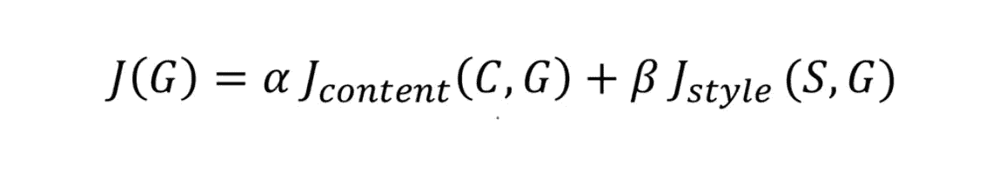

**神经风格转移算法的总成本函数**

## 3.1 计算内容成本

在我们运行的例子中，内容图像 C 将是巴黎卢浮宫博物馆的图片(缩放到 400 x 300)

```
content_image = scipy.misc.imread(“images/louvre.jpg”)
imshow(content_image);
```

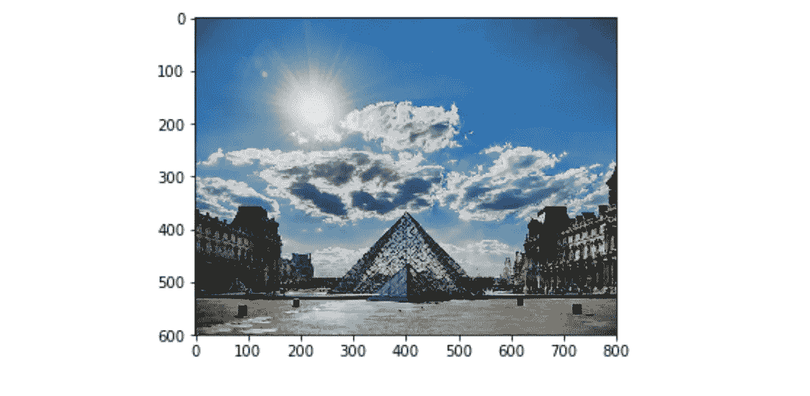

内容图片(C)显示了卢浮宫博物馆的金字塔，周围环绕着古老的巴黎建筑，背景是晴朗的天空和几朵云。

## **3.1.1 将生成的图像 G 的内容与图像 C 进行匹配**

如前所述，ConvNet 的较浅层倾向于检测较低级别的特征，如边缘和简单纹理；更深的层倾向于检测更高级的特征，例如更复杂的纹理以及对象类别。

我们希望**生成的图像 G** 具有与输入图像 C 相似的**内容**。假设你已经选择了一些层的激活来代表图像的内容。实际上，如果你在网络的中间选择一个图层，你会得到最令人满意的视觉效果——既不太浅也不太深。

**注意**:在你完成了这篇文章的例子之后，你可以自由地尝试不同的层，看看结果如何变化。

首先，我们将图像 C 设置为预训练的 VGG 网络的输入，并运行前向传播。让一个 **ᶜ** 成为你选择的层中的隐藏层激活。这将是一个 *nH × nW × nC* 张量。

使用图像 G 重复此过程—将 G 设置为输入，并运行正向传播。让一个 **ᴳ** 被相应的隐藏层激活。

然后我们将定义**内容成本函数**为:

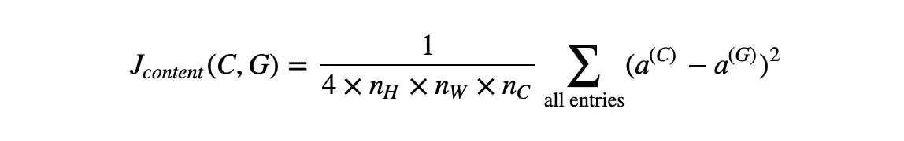

内容成本函数

这里， *nH* 、 *nW、*和 *nC* 分别是您选择的隐藏层的高度、宽度和通道数。这些术语出现在成本中的规范化术语中。

为了清楚起见，请注意， **ᶜ** 和 **ᴳ** 是对应于隐藏层激活的 3D 体积。为了计算成本 *J_content* (C，G)，也可以方便地将这些 3D 体积展开成 2D 矩阵，如下所示。

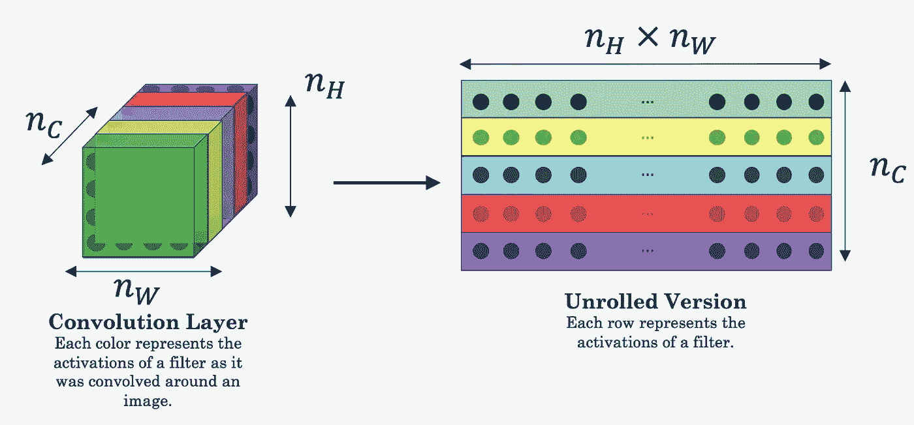

**将激活层的 3D 体积展开成 2D 矩阵。**

从技术上来说，计算 *J_content* 并不需要这个展开步骤，但是当您稍后需要执行类似的操作来计算样式成本 *J_style* 时，这将是一个很好的实践。

> **实现**

`***compute_content_cost()***`函数使用 TensorFlow 计算**内容成本**。

实现该功能的 3 个步骤是:

1.  从`a_G`中检索尺寸。
2.  展开`a_C`和`a_G`，如上图所示。
3.  计算内容成本。

总之，内容成本采用神经网络的隐藏层激活，并测量 a **ᶜ** 和 a **ᴳ** 有多不同。当我们稍后最小化内容成本时，这将有助于确保 **G** 拥有与 **C** 相似的内容。

## 3.2 计算风格成本

对于我们的运行示例，我们将使用以下样式图像:

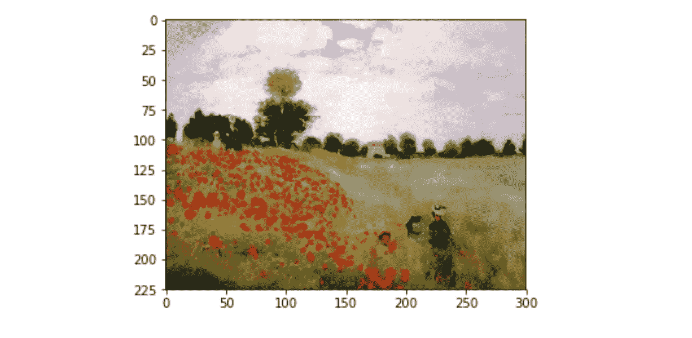

由印象派运动的领袖克洛德·莫内以 [*印象派*](https://en.wikipedia.org/wiki/Impressionism) 的风格作画。

## 风格矩阵

样式矩阵也被称为 **Gram 矩阵**。线性代数中，一组向量(v₁,…，v *n* )的格拉姆矩阵 g 是点积矩阵，其项为 G *ij =* vᵢᵀ vⱼ= np.dot(vᵢ，vⱼ)

换句话说，G *ij* 比较 vᵢ和 vⱼ.有多相似如果它们非常相似，你会期望它们有一个大的点积，因此 G *ij* 会很大。

请注意，这里使用的变量名中有一个不幸的冲突。我们遵循文献中使用的通用术语。 ***G*** 用于表示样式矩阵(或克矩阵)； ***G*** 也表示生成的图像。对于这个例子，我们将用***G****gram*来指代 Gram 矩阵，用 ***G*** 来表示生成的图像。

在神经风格传递(NST)中，您可以通过将“展开的”过滤器矩阵与其转置相乘来计算风格矩阵:

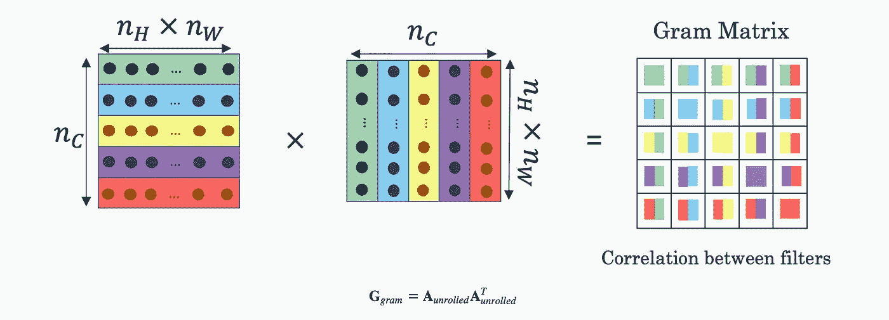

***G****G*测量两个滤波器之间的**相关性**:

结果是一个维数矩阵( *nC，nC* )，其中 *nC* 是滤波器(通道)的数量。值***G****gram(I，j)* 测量滤波器 *i* 的激活与滤波器 *j* 的激活有多相似。

***克*** *克*也衡量**图案或纹理的流行程度:**

对角线元素***G****gram(I，i)* 测量过滤器 *i* 的“活动”程度。例如，假设过滤器 *i* 正在检测图像中的垂直纹理。然后***G****gram(I，i)* 度量图像整体上垂直纹理有多常见。如果***G****gram(I，i)* 大，这意味着图像有很多垂直纹理。

> **实现**

## 风格成本

目标是最小化**样式**图像 S 的 gram 矩阵和**生成的**图像 g 的 Gram 矩阵之间的距离。

现在，我们只使用一个单独的隐藏层*一个* ˡ.该层的相应样式成本定义为:

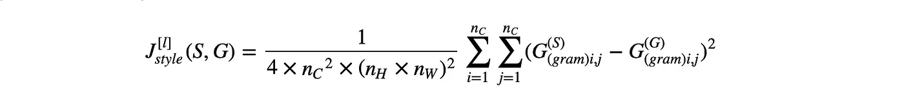

**款式成本**

> **实施** `**compute_layer_style_cost()**`

实现该功能的 3 个步骤是:

1.  从隐藏层激活中检索尺寸`a_G`。
2.  将隐藏层激活`a_S`和`a_G`展开成 2D 矩阵，如上图所示。
3.  用我们之前写的函数计算图像 S 和 G 的样式矩阵。
4.  计算风格成本。

## 样式重量

到目前为止，我们只从一层捕捉到了风格。如果我们从几个不同的层“合并”风格成本，我们会得到更好的结果。每一层将被赋予权重( *λˡ* ) )，以反映每一层对风格的贡献。默认情况下，我们会给每个层相同的权重，权重加起来是 1。完成这个例子后，可以随意试验不同的权重，看看它如何改变生成的图像 ***G*** 。

您可以组合不同图层的样式成本，如下所示:


其中 *λˡ* 的值在`STYLE_LAYERS`中给出。

```
STYLE_LAYERS = [
 (‘conv1_1’, 0.2),
 (‘conv2_1’, 0.2),
 (‘conv3_1’, 0.2),
 (‘conv4_1’, 0.2),
 (‘conv5_1’, 0.2)]
```

> **实现** `**compute_style_cost()**`

该函数多次调用`compute_layer_style_cost(...)`函数，并使用`STYLE_LAYERS`中的值对结果进行加权。

**对**的描述`**compute_style_cost**`

对于每一层:

*   选择当前层的激活(输出张量)。
*   从当前图层中获取**样式图像 S** 的样式。
*   从当前图层获取**生成的图像 G** 的样式。
*   计算当前层的**样式成本**
*   将加权风格成本加到总风格成本上( *J_style* )

完成循环后:

*   返还整体风格成本。

**注意**:在上面 for 循环的内循环中，`a_G`是一个张量，还没有求值。当我们在下面的 model_nn()中运行张量流图时，它将在每次迭代中被评估和更新。

总之，图像的风格可以使用隐藏层激活的 Gram 矩阵来表示。通过组合来自多个不同层的这种表示，我们甚至可以获得更好的结果。这与内容表示形成对比，在内容表示中通常只使用一个隐藏层就足够了。此外，最小化样式成本会导致图像 ***G*** 跟随图像 ***S*** 的样式。

## 3.3 定义优化的总成本

最后，让我们创建一个最小化样式和内容成本的成本函数。公式是:


**NST 的总成本函数**

> **实现**

总成本是内容成本 *J_content* (C，G)和样式成本 *J_style* (S，G)的线性组合。

*α* 和 *β* 是控制内容和风格之间相对权重的超参数。

# 4.解决最优化问题

最后，让我们把所有的东西放在一起实现神经风格转移！

以下是该程序必须要做的事情:

1.  创建交互式会话
2.  加载内容图像
3.  加载样式图像
4.  随机初始化要生成的图像
5.  加载 VGG19 型号
6.  构建张量流图:

*   通过 VGG19 模型运行内容映像，并计算内容成本
*   通过 VGG19 模型运行样式图像，并计算样式成本
*   计算总成本
*   定义优化器和学习率

7.初始化张量流图并运行它进行大量迭代，在每一步更新生成的图像。

让我们详细介绍一下各个步骤。

## 互动会议

我们之前已经实现了总成本 *J(G)* 。我们现在将设置 TensorFlow 来针对 ***G*** 进行优化。

为此，我们的程序必须重置图形并使用一个“[交互会话](https://www.tensorflow.org/api_docs/python/tf/InteractiveSession)”。与常规会话不同，“交互式会话”将自己安装为默认会话来构建图表。这允许我们运行变量，而不需要经常引用会话对象(调用`sess.run()`)，这简化了代码。

```
# Reset the graph
tf.reset_default_graph()# Start interactive session
sess = tf.InteractiveSession()
```

## 内容图像

让我们加载、重塑和规范化我们的**内容**图像(卢浮宫博物馆图片):

```
content_image = scipy.misc.imread(“images/w_hotel.jpg”)
content_image = reshape_and_normalize_image(content_image)
```

## 风格图像

让我们载入、重塑并正常化我们的**风格**形象(克洛德·莫内的画):

```
style_image = scipy.misc.imread(“images/starry_night.jpg”)
style_image = reshape_and_normalize_image(style_image)
```

## 生成的图像与内容图像相关

现在，我们将**生成的**图像初始化为从`content_image`创建的噪声图像。

**生成的**图像与**内容**图像略有关联。通过将**生成的**图像的像素初始化为主要是噪声但与**内容**图像稍微相关，这将有助于**生成的**图像的内容更快速地匹配**内容**图像的内容。

请随意在`nst_utils.py`中查看 Github 回购中的`generate_noise_image(...)`细节。

```
generated_image = generate_noise_image(content_image)
imshow(generated_image[0]);
```

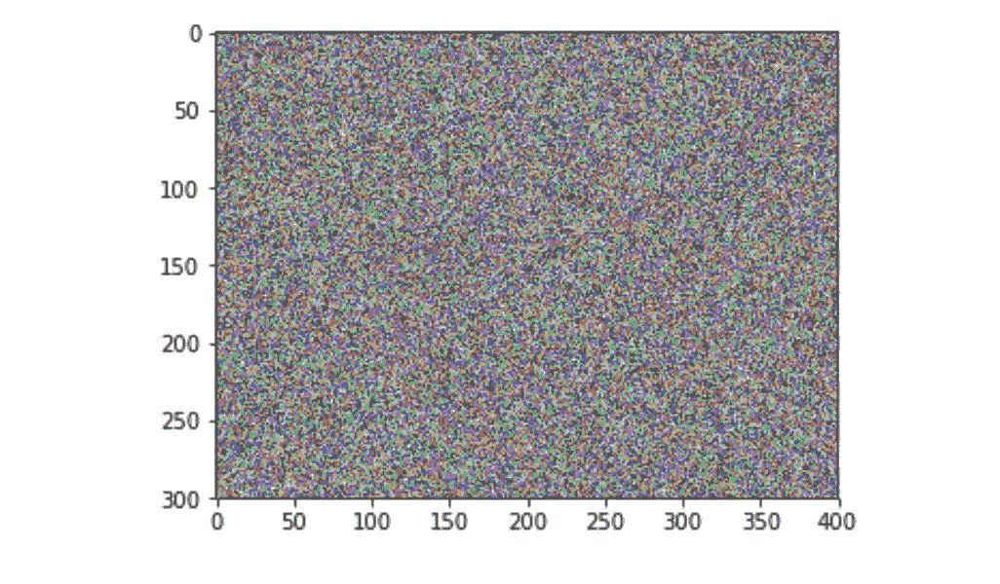

**生成 _ 噪声 _ 图像(内容 _ 图像)**

## 加载预训练的 VGG19 模型

接下来，如前所述，我们将加载 VGG19 模型。

```
model = load_vgg_model(“pretrained-model/imagenet-vgg-verydeep-19.mat”)
```

## 内容成本

为了让程序计算内容成本，我们现在将指定`a_C`和`a_G`为适当的隐藏层激活。我们将使用层`conv4_2`来计算内容成本。下面的代码执行以下操作:

1.  将内容图像指定为 VGG 模型的输入。
2.  设置`a_C`为张量，激活`conv4_2`层的隐藏层。
3.  将`a_G`设置为激活同一层隐藏层的张量。
4.  使用`a_C`和`a_G`计算内容成本。

**注**:此时，`a_G`是张量，还没有求值。当我们运行下面`model_nn()`中的张量流图时，将在每次迭代中对其进行评估和更新。

```
# Assign the content image to be the input of the VGG model. 
sess.run(model[‘input’].assign(content_image))# Select the output tensor of layer conv4_2
out = model[‘conv4_2’]# Set a_C to be the hidden layer activation from the layer we have selected
a_C = sess.run(out)# Set a_G to be the hidden layer activation from same layer. Here, a_G references model[‘conv4_2’] 
# and isn’t evaluated yet. Later in the code, we’ll assign the image G as the model input, so that
# when we run the session, this will be the activations drawn from the appropriate layer, with G as input.
a_G = out# Compute the content cost
J_content = compute_content_cost(a_C, a_G)
```

## 风格成本

```
# Assign the input of the model to be the “style” image 
sess.run(model[‘input’].assign(style_image))# Compute the style cost
J_style = compute_style_cost(model, STYLE_LAYERS)
```

## 总成本

现在我们有了**内容成本** ( *J_content)* 和**样式成本** ( *J_style* )，通过调用`total_cost()`计算总成本 J。

```
J = total_cost(J_content, J_style, alpha=10, beta=40)
```

## 【计算机】优化程序

这里，我使用 Adam 优化器来最小化总成本`J`。

```
# define optimizer
optimizer = tf.train.AdamOptimizer(2.0)# define train_step
train_step = optimizer.minimize(J)
```

> ***实施*** `***model_nn()***`

函数**初始化**张量流图的变量，**将输入图像(初始生成的图像)分配给**作为 VGG19 模型的输入，**运行**张量(它是在该函数上面的代码中创建的)大量步骤。

运行以下代码片段来生成艺术图像。每 20 次迭代应该花费大约 3 分钟的 CPU 时间，但是在大约 140 次迭代之后，您开始观察到有吸引力的结果。神经类型转移通常使用 GPU 来训练。

```
model_nn(sess, generated_image)
```

你完了！运行此程序后，您应该会看到下图右侧所示的内容:

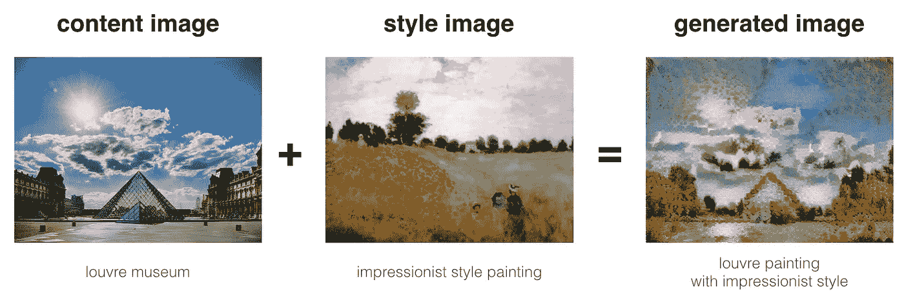

以下是其他几个例子:

*   具有梵高风格(星夜)的波斯波利斯(伊朗)古城的美丽遗迹

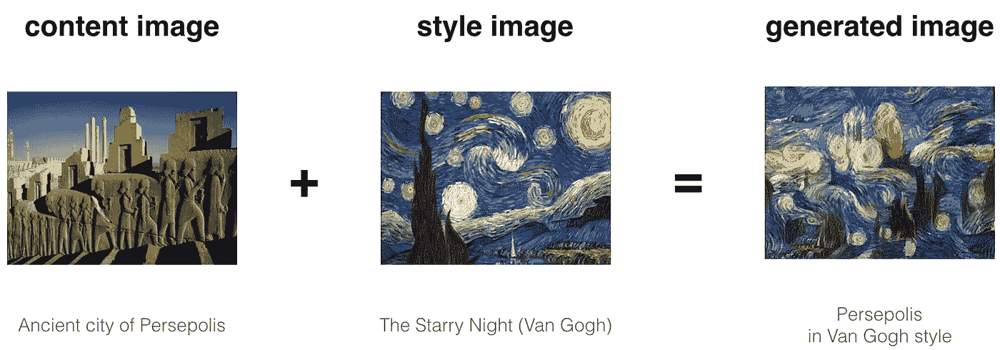

*   Pasargadae 的居鲁士大帝墓，采用来自伊斯法罕的陶瓷 Kashi 风格。

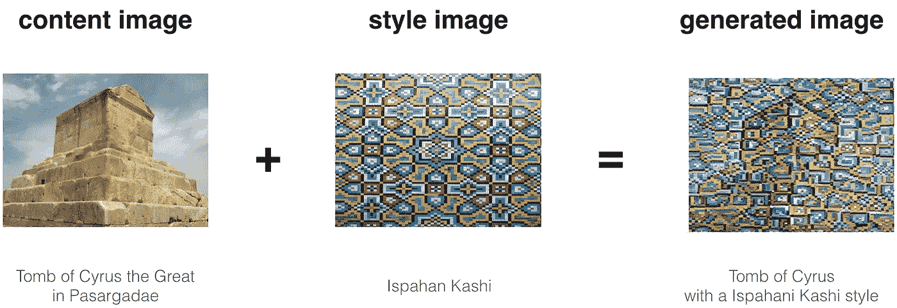

*   具有抽象蓝色流体绘画风格的湍流的科学研究。

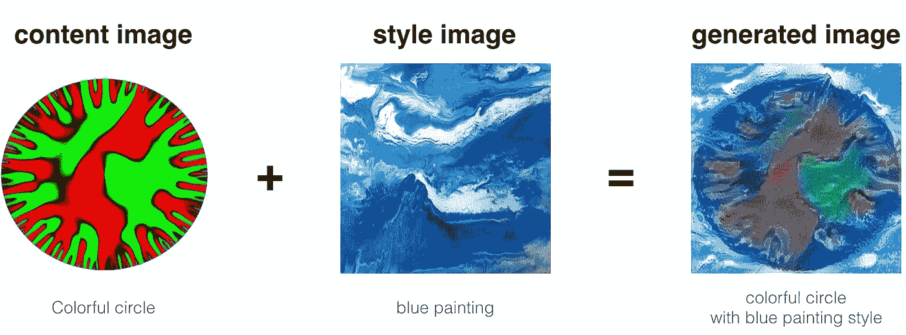

# 6.结论

你现在能够使用神经风格转移来生成艺术图像。神经风格转移是一种算法，即给定一个**内容图像 C** 和一个**风格图像 S** ，可以生成一个艺术图像。

它使用基于预训练的 ConvNet 的表示(隐藏层激活)。使用一个隐藏层的激活来计算**内容成本函数**;一层的**样式成本函数**使用该层激活的 Gram 矩阵来计算。使用几个隐藏层获得整体风格成本函数。

最后，优化总成本函数导致合成新图像。

# 7.引用和参考文献

**Github 回购**:[https://github.com/TheClub4/artwork-neural-style-transfer](https://github.com/TheClub4/artwork-neural-style-transfer)

特别感谢[**deep learning . ai**](https://www.deeplearning.ai/)。图片由 **deeplearning.ai** 提供。

神经风格转移算法源于 Gatys 等人(2015 年)。Harish Narayanan 和 Github 用户“log0”也有可读性很高的文章，我们从中获得了灵感。在该实现中使用的预训练网络是 VGG 网络，这是由于 Simonyan 和 Zisserman (2015)。预训练的权重来自 MathConvNet 团队的工作。

*   利昂·a·加蒂斯、亚历山大·s·埃克、马蒂亚斯·贝赫(2015 年)。[艺术风格的神经算法](https://arxiv.org/abs/1508.06576)
*   [用于艺术风格转移的卷积神经网络。](https://harishnarayanan.org/writing/artistic-style-transfer/)
*   Log0， [TensorFlow 实现的“一种艺术风格的神经算法”。](http://www.chioka.in/tensorflow-implementation-neural-algorithm-of-artistic-style)
*   卡伦·西蒙扬和安德鲁·齐泽曼(2015)。[用于大规模图像识别的极深度卷积网络](https://arxiv.org/pdf/1409.1556.pdf)
*   [MatConvNet。](http://www.vlfeat.org/matconvnet/pretrained/)