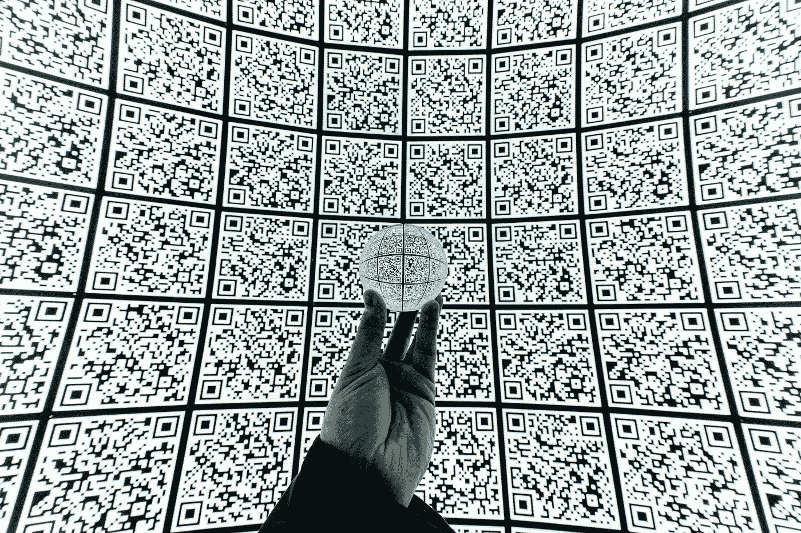
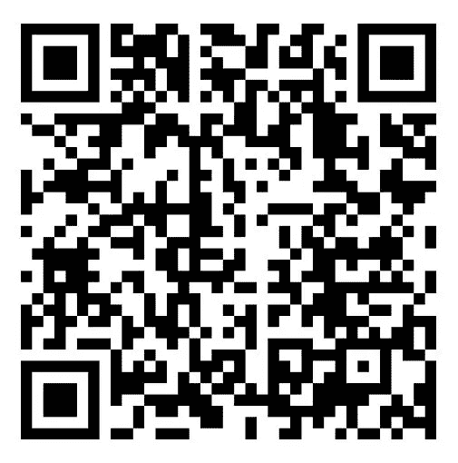

# 用 Python 生成 5 行二维码

> 原文：<https://towardsdatascience.com/generate-qrcode-with-python-in-5-lines-42eda283f325?source=collection_archive---------6----------------------->

## 或许在你的简历中使用它来链接到你的网站或 LinkedIn 个人资料



米蒂亚·伊万诺夫在 [Unsplash](https://unsplash.com?utm_source=medium&utm_medium=referral) 上拍摄的照片

[快速响应](https://en.wikipedia.org/wiki/QR_code)码或 QR 码是一种二维条形码，由白色背景上的黑色小方块组成。由于其存储更多信息的能力和快速可读性，它比由黑条和空白组成的传统条形码更受欢迎。

Python 提供了一个 [QRCode 包](https://pypi.org/project/qrcode/)，这使得实现这个功能变得非常容易。我们将从下载以下 python 包开始。

```
pip install pillow
pip install qrcode
```

为了这个演示的目的，我使用了我的一篇文章的页面链接([10 行中的人脸检测](/face-detection-in-10-lines-for-beginners-1787aa1d9127))。我们将创建一个二维码来存储这篇文章的链接。

现在，让我们看看实现它有多简单。

```
import qrcode# Link for website
input_data = "[https://towardsdatascience.com/face-detection-in-10-lines-for-beginners-1787aa1d9127](/face-detection-in-10-lines-for-beginners-1787aa1d9127)"#Creating an instance of qrcode
qr = qrcode.QRCode(
        version=1,
        box_size=10,
        border=5)qr.add_data(input_data)
qr.make(fit=True)img = qr.make_image(fill='black', back_color='white')
img.save('qrcode001.png')
```

上面使用的 *QRCode* 函数接受以下参数:

***版本*** :此参数定义生成的二维码的大小。它接受 1 到 40 范围内的整数值。该值越高，生成的 QR 码图像的尺寸越大。

***box_size*** :该参数定义每个方框的大小，以像素为单位。

***边框*** :边框定义了边框的粗细。在这个例子中，值 5 意味着边框等于 5 个小黑盒的厚度。

***add_data*** 方法用于传递我们输入的文本，在我们的例子中是文章的超链接。将 ***make*** 函数与 ***(fit=True)*** 配合使用，可确保二维码的整个维度都得到利用，即使我们的输入数据可以放入更少的框中。

最后一步是将其转换为图像文件并存储。为此，使用 ***make_image*** 功能，我们可以指定前景和背景颜色。我分别使用了黑色和白色，但是你可以根据你的喜好来改变它们。 ***保存*** 功能将图像保存为当前目录下的. png 文件。这里的[](https://github.com/arindomjit/QR_Code_Generator)*也给出了代码和依赖关系的详细信息，以供参考。*

*这是我们为链接生成的二维码！*

**

*图片:[阿林多姆·巴塔查尔吉](https://medium.com/u/c5b77fc1811c?source=post_page-----42eda283f325--------------------------------)*

*总之，我们研究了如何将文本值转换成相应的 QR 码。也许你可以为你自己的网址或 LinkedIn 个人资料创建一个二维码，并把它放在你的名片或简历中。干杯！*

*[](/face-detection-in-10-lines-for-beginners-1787aa1d9127) [## 面向初学者的 10 行人脸检测

### 使用 Python OpenCV 在图像和视频中检测人脸的介绍。

towardsdatascience.com](/face-detection-in-10-lines-for-beginners-1787aa1d9127) [](https://medium.com/swlh/artificial-neural-networks-for-absolute-beginners-a75bc1522e1d) [## 绝对初学者的神经网络

### 用简单的英语介绍感知器

medium.com](https://medium.com/swlh/artificial-neural-networks-for-absolute-beginners-a75bc1522e1d) 

**参考文献&延伸阅读:**

【1】[https://pypi.org/project/qrcode/](https://pypi.org/project/qrcode/)
【2】【https://en.wikipedia.org/wiki/QR_code】T21*