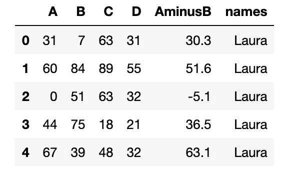
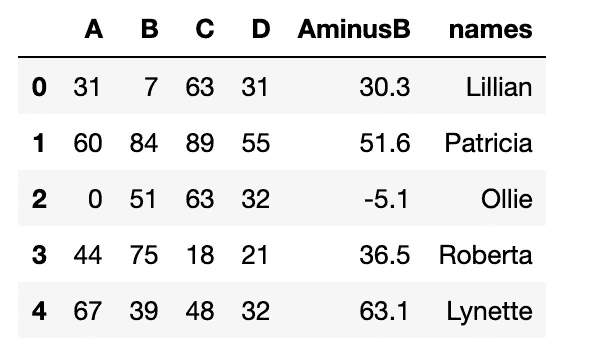

# 生成样本数据集—数据科学家的必备技能。

> 原文：<https://towardsdatascience.com/generate-your-sample-dataset-a-must-have-skill-for-data-scientists-36ded8600b79?source=collection_archive---------9----------------------->

制作 powerpoint 幻灯片和从理论上谈论你将如何处理数据是一回事。但创建一个样本数据集并展示一个已经在工作的仪表板、可视化或数据模型是另一回事。虽然可以在互联网上找到许多样本数据集，但它们通常并不完全符合您的需求。因此，在本文结束时，您将知道如何为您的特定目的创建一个漂亮的样本 CSV 数据集。一旦在 Jupyter 笔记本中设置了代码，您就可以反复使用它。


## 我们将如何生成样本数据集？

作为最终结果，一个样本 CSV 数据集与各种变量，如数字，货币，日期，名称和字符串，是可取的。这些变量有不同的类型，彼此独立或相关。首先，理解我们如何使用基本的“随机”函数来生成样本数据集是至关重要的。之后，我们将在一个数据框中组合变量。出于我们的目的，数据帧将最终导出为 CSV 格式。CSV 是一种非常容易与各种工具连接的格式，足以用于采样目的。

## 我们使用的工具


创建样本数据集的工具。

好的方面是，我们主要需要访问 python，使用它的一些库和工具。首先，我们使用 Jupyter Notebook，这是一个用于实时编码的开源应用程序，它允许我们用代码讲述一个故事。在我们的例子中，它简化了修改的过程，并且以后只使用很少的代码元素。此外，我们使用 NumPy，尤其是 NumPy 的随机函数来生成我们的变量。虽然这是一种选择，但是一个非常方便的名为 pydbgen 的库可以帮助我们加速样本数据集的生成。此外，我们导入了[熊猫](http://pandas.pydata.org/)，这将我们的数据放在一个易于使用的结构中，用于数据分析和数据转换。

# 随机数据的基本函数

1.  **“随机”模块** 用 Python 创建随机数用的最多的模块大概就是 random.random()函数的 random 模块了。当导入模块并调用函数时，将生成一个介于 0.0 和 1.0 之间的浮点数，如下面的代码所示。

```
>>>import random>>>random.random()
0.18215964678315466
```

此外，还有设置种子的选项。这使我们能够复制代码中生成的随机数。

```
>>> random.seed(123)
>>> random.random()
0.052363598850944326>>> random.seed(123)
>>> random.random()
0.052363598850944326
```

如果您想为浮点数或整数考虑一个特定的范围，您可以如下定义函数的参数。

```
>>> random.randint(10,100)
21>>> random.uniform(10,100)
79.20607497283636
```

**2。日期** 在熟悉 random 方法的同时，我们现在可以应用这些知识在我们的样本数据集中创建随机日期。

```
>>> import numpy as np>>> monthly_days = np.arange(0, 30)
>>> base_date = np.datetime64('2020-01-01')
>>> random_date = base_date + np.random.choice(monthly_days)>>> print(random_date)
2020-01-07
```

有无数的变化来调整这段代码。将月天数范围更改为双月或每年。当然，基准日期应该符合您的要求。

**3。字符串** 当我们的样本数据集有了随机数和日期后，是时候看看字符串了。当查看下面的 randomString 函数时，变量“letters”包含小写的整个字母表。在“随机”方法的帮助下，一个随机数被创建并分配给 letter。就这么简单！

```
import random
import stringdef randomString(stringLength=15):
    letters = string.ascii_lowercase
    return ''.join(random.choice(letters) for i in range(stringLength))print ("The generated string is", randomString())The generated string is celwcujpdcdppzx
```

**4。名字** 虽然我们的样本数据集以前是基于随机方法的，但是仅仅通过随机地把东西放在一起是不可能生成有意义的表达式的。因此，我们使用 [PyPi](https://pypi.org/project/names/) 上可用的[名称](https://github.com/treyhunner/names)包。这个包非常方便，提供了各种选项，如下面的代码片段所示。

```
>>> import names
>>> names.get_full_name()
‘Margaret Wigfield’>>> names.get_first_name(gender='female')
'Patricia'
```

**5。地点、电话号码、地址或文本** 在简短介绍了随机化的原则后用“random”作为基本方法，可能值得注意的是，有完整的软件包可以满足您的大部分需求。通过 pip 安装很简单，你可以在 Github 库上找到所有需要的信息。有两个非常有用的方法绝对值得一提:

*   [骗子](https://github.com/joke2k/faker)
*   [pydbgen](https://github.com/tirthajyoti/pydbgen) (对某些数据类型部分使用 Faker)

**6。机器学习的样本数据怎么样** 当涉及到机器学习问题时，这项工作并不是通过生成任何随机数据来完成的。大多数情况下，您希望样本数据集的变量/特征之间存在某种关联或关系。Scikit 让你在几秒钟内创建这样的数据集。看看下面的示例代码:

```
import pandas as pd
from sklearn.datasets import make_regression# Generate fetures, outputs, and true coefficient of 100 samples
features, output, coef = make_regression(n_samples = 100,
                                         # three features
                                         n_features = 3,
                                         # two features are useful,
                                         n_informative = 2,
                                         # one target
                                         n_targets = 1,
                                         # 0.0 standard deviation
                                         noise = 0.0,
                                         # show the true coefficient 
                                         coef = True)
```


```
# View the features of the first 10 rows
pd.DataFrame(features, columns=['Customer A', 'Customer B', 'Customer C']).head(10)# View the output of the first 10 rows
pd.DataFrame(output, columns=['Sales']).head(10)# View the actual, true coefficients used to generate the data
pd.DataFrame(coef, columns=['Coefficient Values'])
```

# 生成并导出您的 CSV 样本数据集

在探索、试验和生成我们的样本数据集之后，我们最终想要导出并使用它们。虽然文件格式没有限制，但由于我们没有大量的数据，并且希望将数据集插入到各种工具中，因此简单的 CSV 文件非常方便。但是首先必须创建一个数据帧。

```
import pandas as pd
import numpy as np
import random#using numpy's randint
df = pd.DataFrame(np.random.randint(0,100,size=(15, 4)), columns=list('ABCD'))# create a new column 
df['AminusB'] = df['A'] - (0.1 * df['B'])
df['names'] = 'Laura'df.head(5)
```



虽然我们已经生成了一些随机的相关和不相关的数字，但是每行中的名称列是相同的。为了获得随机名称，我们必须对行进行迭代，并使用我们的随机名称生成器。

```
import namesfor index, row in df.iterrows():
      df.at[index,'names'] = names.get_first_name(gender='female')

df.head(5)
```



请注意，您可以使用任何其他包或方法来创建示例 CSV 数据集，而不是名称。没有任何限制。现在，让我们将其导出为 CSV 格式，我们可以开始了。

```
#Export to csvexport_csv = df.to_csv (r'/Users/SampleDataset.csv', header=True) #Don't forget to add '.csv' at the end of the path
```

你成功了——祝贺你！现在，更令人兴奋的部分开始了，您可以开始处理您生成的 CSV 样本数据集。祝你好运。

**************************************************************

您可能也喜欢阅读的文章:

[预测性维护:机器学习 vs 基于规则](/predictive-maintenance-machine-learning-vs-rule-based-algorithms-cb48414df448)

[动手:客户细分](/hands-on-customer-segmentation-9aeed83f5763)

[设置您的数据环境](/hands-on-setup-your-data-environment-with-docker-dca629607148)

[数据误导&统计](/misleading-with-data-statistics-c6d506bdb9cf)

[了解如何预测客户流失](/hands-on-predict-customer-churn-5c2a42806266)

***************************************************************