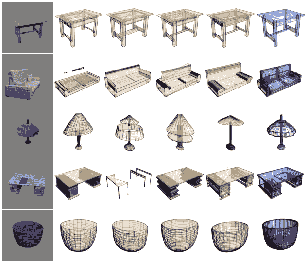
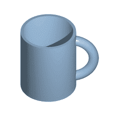
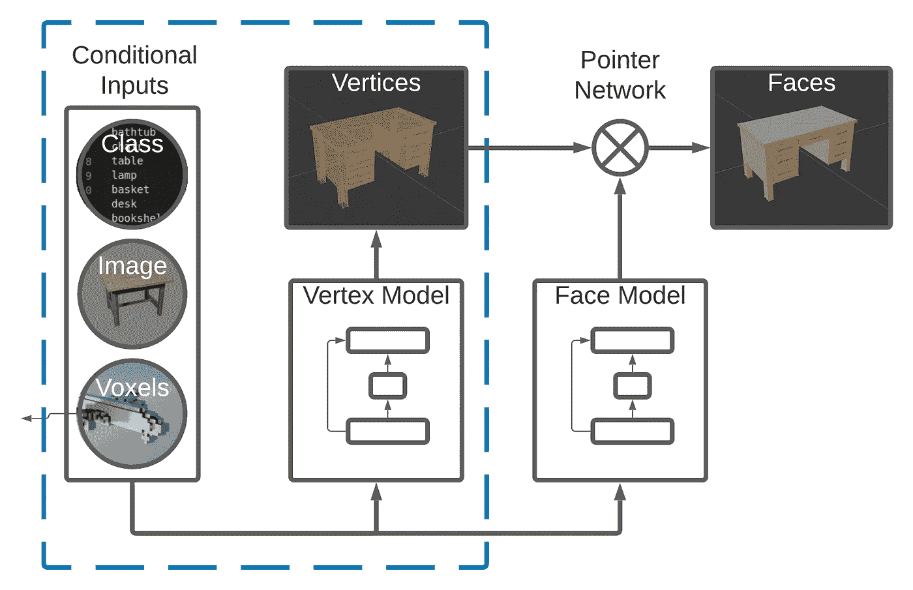
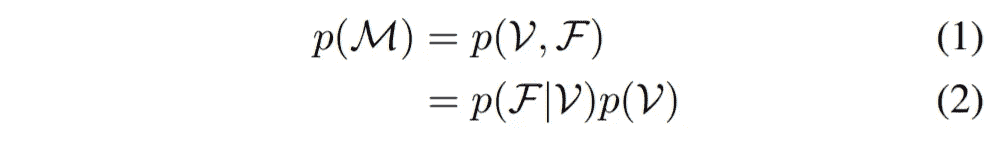
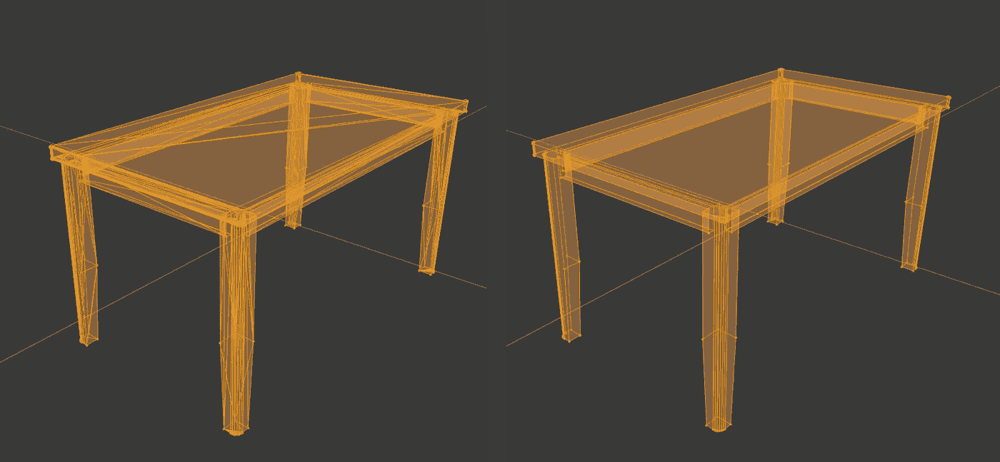
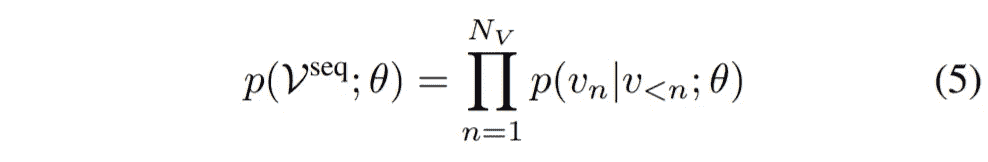

# 用 PolyGen 和 PyTorch 生成三维模型

> 原文：<https://towardsdatascience.com/generating-3d-models-with-polygen-and-pytorch-4895f3f61a2e?source=collection_archive---------5----------------------->



(论文中的图 6)使用 top-p=0.9 的 nucleus 采样和地面真实网格(蓝色)生成的图像条件样本(黄色)。

# 介绍

有一个新兴的深度学习研究领域，专注于将 DL 技术应用于 3D 几何和计算机图形应用，正如这个[冗长的近期研究集合](https://github.com/timzhang642/3D-Machine-Learning)所证明的那样。如果你对这个主题感兴趣，看看吧。真是个兔子洞。对于希望自己尝试一些 3D 深度学习的 PyTorch 用户来说，[高岭土库](https://github.com/NVIDIAGameWorks/kaolin)值得一看。对于 TensorFlow 用户，还有 [TensorFlow 图形](https://www.tensorflow.org/graphics)。一个特别热门的子领域是 3D 模型的生成。创造性地组合 3D 模型，从图像中快速生成 3D 模型，以及为其他机器学习应用和模拟创建合成数据只是 3D 模型生成的无数用例中的一小部分。

然而，在 3D 深度学习研究领域，为您的数据选择一种合适的表示方法是成功的一半。在计算机视觉中，数据的结构非常简单:图像由密集的像素组成，这些像素整齐而均匀地排列成一个精确的网格。3D 数据的世界没有这样的一致性。3D 模型可以表示为体素、点云、网格、多视图图像集等等。这些输入表示也有各自的缺点。例如，体素尽管计算成本高，但输出分辨率低。点云没有对表面或它们的法线进行编码，所以拓扑不能仅仅从点云推断出来。网格也不唯一地编码拓扑，因为任何网格都可以细分以产生相似的表面。这些缺点促使 DeepMind 的研究人员创建了 [PolyGen](https://arxiv.org/abs/2002.10880) ，这是一种用于网格的神经生成模型，它联合估计模型的面和顶点，以直接生成网格。官方实现可在 [DeepMind GitHub](https://github.com/deepmind/deepmind-research/tree/master/polygen) 上获得。

# 研究

现在经典的 [PointNet](https://arxiv.org/abs/1612.00593) 论文提供了建模点云数据的蓝图，比如 3D 模型的顶点。它是一种通用算法，不会对 3D 模型的面或占用进行建模，因此单独使用 PointNet 不可能生成唯一的防水网格。 [3D-R2N2](https://arxiv.org/abs/1604.00449) 采用的体素方法将我们都熟悉的 2D 卷积扩展到 3D，并从 RGB 图像中自然产生无缝网格。然而，在更高的空间分辨率下，体素表示在计算上变得昂贵，有效地限制了它可以产生的网格的大小。

[Pixel2Mesh](https://arxiv.org/abs/1804.01654) 可以通过变形模板网格(通常是椭球体)从单幅图像中预测 3D 模型的顶点和面。目标模型必须与模板网格同胚，因此使用凸模板网格(如椭球体)会在高度非凸的对象(如椅子和灯)上引入许多虚假面。[拓扑修改网络](https://arxiv.org/abs/1909.00321) (TMN)通过引入两个新阶段对 Pixel2Mesh 进行迭代:一个拓扑修改阶段，用于修剪增加模型重建误差的错误面；一个边界细化阶段，用于平滑由面修剪引入的锯齿状边界。如果你感兴趣，我强烈建议你也去看看[地图集](https://arxiv.org/abs/1802.05384)和[分层表面预测](https://arxiv.org/abs/1704.00710)。



同胚现象的经典例子(来源:[维基百科](https://en.wikipedia.org/wiki/Homeomorphism))

虽然变形和细化模板网格的常见方法表现良好，但它始于关于模型拓扑的主要假设。在它的核心，一个 3D 模型只是一个 3D 空间中的顶点的集合，由单独的面组合和连接在一起。有没有可能避开中间的表示，直接预测这些顶点和面？

# 多种价元素



PolyGen 架构(本文主要关注蓝色虚线框内的部分)。

PolyGen 采用了一种相当独特的方法来完成模型生成任务，将 3D 模型表示为严格有序的顶点和面序列，而不是图像、体素或点云。这种严格的排序使他们能够应用基于注意力的序列建模方法来生成 3D 网格，就像伯特或 GPT 模型对文本所做的那样。

PolyGen 的总体目标有两个:首先为 3D 模型生成一组可信的顶点(可能受图像、体素或类别标签的限制)，然后逐个生成一系列面，这些面将顶点连接在一起，并为该模型提供一个可信的表面。组合模型将网格上的分布 *p(M)* 表示为两个模型之间的联合分布:顶点模型 *p(V)* 表示顶点，面部模型 *p(F|V)* 表示以顶点为条件的面部。



顶点模型是一个解码器，它试图预测序列中的下一个标记，以前面的标记为条件(并且可选地以图像、体素字段或类标签为条件)。人脸模型包括一个编码器，后面跟着一个解码器[指针网络](https://arxiv.org/abs/1506.03134)，表示顶点序列上的分布。该指针网络有效地一次“选择”一个顶点，以添加到当前的面序列中，并构建模型的面。该模型同时以先前的面序列和整个顶点序列为条件。因为 PolyGen 架构非常复杂，并且依赖于各种各样的概念，这篇文章将仅限于顶点模型。如果这篇文章获得了关注，我将在后续文章中介绍人脸模型。

# 预处理顶点

流行的 [ShapeNetCore](https://shapenet.cs.stanford.edu/shrec16/) 数据集中的每个模型都可以表示为顶点和面的集合。每个顶点由一个(x，y，z)坐标组成，该坐标描述了 3D 网格中的一个点。每个面都是一个索引列表，这些索引指向构成该面的角的顶点。对于三角形面，这个列表有 3 个索引长。对于 n 边形面，该列表是可变长度的。原始数据集相当大，所以为了节省时间，我提供了数据集[的一个更轻量级的预处理子集，这里是](https://masonmcgough-data-bucket.s3-us-west-2.amazonaws.com/ShapeNetCore_PolyGenSubset.zip)供您试验。该子集仅由来自 5 个形状类别的模型组成，并且在被转换成 n 边形(如下所述)后具有少于 800 个顶点。

为了使序列建模方法起作用，数据必须以一种受约束的、确定性的方式来表示，以尽可能地消除可变性。出于这个原因，作者对数据集进行了一些简化。首先，他们将所有输入模型从三角形(连接 3 个顶点的面)转换为 n 边形(连接 n 个顶点的面)，通过使用 [Blender 的平面抽取修改器](https://docs.blender.org/manual/en/latest/modeling/modifiers/generate/decimate.html)合并面。由于大型网格并不总是具有唯一的三角剖分，因此这使得相同拓扑的表示更加紧凑，并减少了三角剖分的不确定性。出于篇幅原因，我不会在这篇文章中详细讨论 Blender 脚本，但是许多资源，包括[官方文档](https://docs.blender.org/manual/en/latest/advanced/scripting/introduction.html)和[GitHub](https://github.com/njanakiev/blender-scripting)上的优秀示例集，都很好地涵盖了这个主题。我提供的数据集已经过预抽取。



在平面模式的 Blender 中应用抽取修改器前后的 3D 模型，角度限制为 1.0 度。

要继续学习，请随意[下载这个样本 cube.obj 文件](https://masonmcgough-data-bucket.s3-us-west-2.amazonaws.com/cube.obj)。这个模型是一个有 8 个顶点和 6 个面的基本立方体。下面的简单代码片段从单个。对象文件。

```
def load_obj(filename):
  """Load vertices from .obj wavefront format file."""
  vertices = []
  with open(filename, 'r') as mesh:
    for line in mesh:
      data = line.split()
      if len(data) > 0 and data[0] == 'v':
        vertices.append(data[1:])
  return np.array(vertices, dtype=np.float32)verts = load_obj(cube_path)
print('Cube Vertices')
print(verts)
```

其次，顶点从 z 轴(本例中为垂直轴)开始按升序排序，然后是 y 轴，最后是 x 轴。这样，模型顶点是自下而上表示的。在普通多边形模型中，顶点然后被连接成一维序列向量，对于较大的模型来说，这可能会以非常长的序列向量结束。作者在论文的附录 E 中描述了几个减轻这一负担的修改。

为了对顶点序列进行排序，我们可以使用字典排序。这与在字典中对单词进行排序时采用的方法相同。要对两个单词进行排序，你应该先看第一个字母，如果有并列的话，再看第二个，依此类推。对于单词“aardvark”和“apple”，第一个字母是“a”和“a”，所以我们移到第二个字母“a”和“p”来告诉我们“aardvark”在“apple”之前。在这种情况下，我们的“字母”依次是 z、y 和 x 坐标。

```
verts_keys = [verts[..., i] for i in range(verts.shape[-1])]
sort_idxs = np.lexsort(verts_keys)
verts_sorted = verts[sort_idxs]
```

最后，将顶点坐标归一化，然后量化，将其转换为离散的 8 位值。这种方法已经在[像素递归神经网络](https://arxiv.org/abs/1601.06759)和[波网](https://deepmind.com/blog/article/wavenet-generative-model-raw-audio)中用于模拟音频信号，使它们能够在顶点值上施加分类分布。在最初的 [WaveNet](https://arxiv.org/pdf/1609.03499.pdf) 论文中，作者评论说“分类分布更灵活，可以更容易地模拟任意分布，因为它不对它们的形状做任何假设。”这种品质对于建模复杂的依赖关系(如 3D 模型中顶点之间的对称性)非常重要。

```
# normalize vertices to range [0.0, 1.0]
lims = [-1.0, 1.0]
norm_verts = (verts - lims[0]) / (lims[1] - lims[0])# quantize vertices to integers in range [0, 255]
n_vals = 2 ** 8
delta = 1\. / n_vals
quant_verts = np.maximum(np.minimum((norm_verts // delta), n_vals - 1), 0).astype(np.int32)
```

# 顶点模型

顶点模型由一个解码器网络组成，该网络具有转换器模型的所有标准特征:输入嵌入、18 个转换器解码器层的堆栈、层标准化，以及最后在所有可能的序列令牌上表达的 softmax 分布。给定长度为 *N* 的展平顶点序列 *Vseq* ，其目标是在给定模型参数的情况下最大化数据序列的对数似然性:



与 LSTM 不同，transformer 模型能够以并行方式处理顺序输入，同时仍然支持来自序列一部分的信息为另一部分提供上下文。这都要归功于他们的注意力模块。3D 模型的顶点包含各种各样的对称性和远距离点之间的复杂依赖关系。例如，想象一个典型的桌子，模型对角的桌腿是彼此的镜像版本。注意力模块允许对这些类型的模式进行建模。

## 输入嵌入

嵌入层是序列建模中使用的一种常见技术，用于将有限数量的表征转换为特征集。在一个语言模型中，“国家”和“民族”这两个词的含义可能非常相似，但与“苹果”这两个词的含义非常遥远。当单词用独特的符号表示时，就没有固有的相似或不同的概念。嵌入层将这些标记转换成矢量表示，在矢量表示中可以模拟有意义的距离感。

多边形将同样的原理应用于顶点。该模型利用了三种类型的嵌入图层:坐标图层用于指示输入令牌是 x、y 还是 z 坐标，值图层用于指示令牌的值，位置图层用于编码顶点的顺序。每一个都向模型传递一条关于令牌的信息。因为我们的顶点是一次在一个轴上输入的，所以坐标嵌入为模型提供了重要的坐标信息，让它知道给定值对应哪种类型的坐标。

```
coord_tokens = np.concatenate(([0], np.arange(len(quant_verts)) % 3 + 1, (n_padding + 1) * [0]))
```

值嵌入对我们之前创建的量化顶点值进行编码。我们还需要一些序列控制点:额外的开始和停止标记来分别标记序列的开始和结束，以及填充标记直到最大序列长度。

```
TOKENS = {
  '<pad>': 0,
  '<sos>': 1,
  '<eos>': 2
}max_verts = 12 # set low for prototyping
max_seq_len = 3 * max_verts + 2 # num coords + start & stop tokens
n_tokens = len(TOKENS)
seq_len = len(quant_verts) + 2
n_padding = max_seq_len - seq_lenval_tokens = np.concatenate((
  [TOKENS['<sos>']],
  quant_verts + n_tokens,
  [TOKENS['<eos>']],
  n_padding * [TOKENS['<pad>']]
))
```

由于并行化而丢失的给定序列位置 *n* 的位置信息通过位置嵌入来恢复。也可以使用位置编码，一种不需要学习的封闭形式的表达式。在经典的 transformer 论文“[注意力是你所需要的全部](https://arxiv.org/abs/1706.03762)”中，作者定义了一种由不同频率的正弦和余弦函数组成的位置编码。他们通过实验确定位置嵌入的表现和位置编码一样好，但是位置编码的优势是可以外推得到比训练中遇到的序列更长的序列。关于位置编码的精彩视觉解释，请看这篇博文。

```
pos_tokens = np.arange(len(quant_tokens), dtype=np.int32)
```

生成所有这些令牌序列后，最后要做的是创建一些嵌入层并组合它们。每个嵌入层都需要知道预期的输入字典的大小和要输出的嵌入维度。每一层的嵌入维数是 256，这意味着我们可以用加法将它们组合起来。字典的大小取决于一个输入可以拥有的唯一值的数量。对于值嵌入，它是量化值的数量加上控制标记的数量。对于坐标嵌入，对于每个坐标 x、y 和 z 是一个，对于以上任何一个都是一个(控制标记)。最后，对于每个可能的位置或最大序列长度，位置嵌入需要一个。

```
n_embedding_channels = 256# initialize value embedding layer
n_embeddings_value = 2 ** n_bits + n_tokens
value_embedding = torch.nn.Embedding(n_embeddings_value,
  n_embedding_channels, padding_idx=TOKENS['<pad>'])# initialize coordinate embedding layer
n_embeddings_coord = 4
coord_embedding = torch.nn.Embedding(n_embeddings_coord,
  n_embedding_channels)# initialize position embedding layer
n_embeddings_pos = max_seq_len
pos_embedding = torch.nn.Embedding(n_embeddings_pos,
  n_embedding_channels)# pass through layers
value_embed = self.value_embedding(val_tokens)
coord_embed = self.coord_embedding(coord_tokens)
pos_embed = self.pos_embedding(pos_tokens)# merge
x = value_embed + coord_embed + pos_embed
```

## 序列屏蔽

transformer 模型如此并行化的另一个结果是什么？对于在时间 *n* 的给定输入令牌，模型实际上可以“看到”序列中稍后的目标值，当您试图仅根据先前的序列值来调整模型时，这就成了一个问题。为了防止模型关注无效的未来目标值，可以在自我关注层中的 softmax 步骤之前用`-Inf`屏蔽未来位置。

```
n_seq = len(val_tokens)
mask_dims = (n_seq, n_seq)
target_mask = torch.from_numpy(
  (val_tokens != TOKENS['<pad>'])[..., np.newaxis] \
  & (np.triu(np.ones(mask_dims), k=1).astype('uint8') == 0))
```

PolyGen 还大量使用无效预测遮罩来确保它生成的顶点和面序列编码有效的 3D 模型。例如，必须执行诸如“z 坐标不递减”和“停止标记只能出现在完整的顶点(z、y 和 x 标记的三元组)”之类的规则，以防止模型产生无效的网格。作者在论文的附录 F 中提供了他们使用的掩蔽的详细列表。这些约束仅在预测时强制执行，因为它们实际上会损害训练性能。

## 细胞核取样

与许多序列预测模型一样，该模型是自回归的，这意味着给定时间步长的输出是下一个时间步长的可能值的分布。一次预测一个标记的整个序列，模型在每一步浏览来自先前时间步骤的所有标记以选择其下一个标记。解码策略决定了它如何从这个分布中选择下一个令牌。

如果使用次优解码策略，生成模型有时会陷入重复循环，或者会产生质量差的序列。我们都见过生成的文本看起来像废话。PolyGen 采用一种叫做*核取样*的解码策略来产生高质量的序列。原始论文在文本生成上下文中应用了这种方法，但是它也可以应用于顶点。前提很简单:仅从 softmax 分布中共享 top-p 概率质量的令牌中随机抽取下一个令牌。这在推理时应用，以产生网格，同时避免序列退化。关于核采样的 PyTorch 实现，请参考[本要点](https://gist.github.com/thomwolf/1a5a29f6962089e871b94cbd09daf317)。

## 条件输入

除了无条件生成模型，PolyGen 还支持使用类别标签、图像和体素的输入条件。这些可以指导生成具有特定类型、外观或形状的网格。类别标签通过嵌入进行投影，然后添加到每个关注块的自我关注层之后。对于图像和体素，编码器创建一组嵌入，然后用于与变换器解码器的交叉注意。

# 结论

PolyGen 模型描述了一个强大、高效和灵活的框架，用于有条件地生成 3D 网格。序列生成可以在各种条件和输入类型下完成，从图像到体素到简单的类标签，甚至除了起始标记什么都不是。顶点模型表示网格顶点上的分布，它只是联合分布难题的一部分。我打算在以后的文章中介绍人脸模型。与此同时，我鼓励您查看来自 DeepMind 的 [TensorFlow 实现，并尝试一下条件模型生成！](https://github.com/deepmind/deepmind-research/tree/master/polygen)