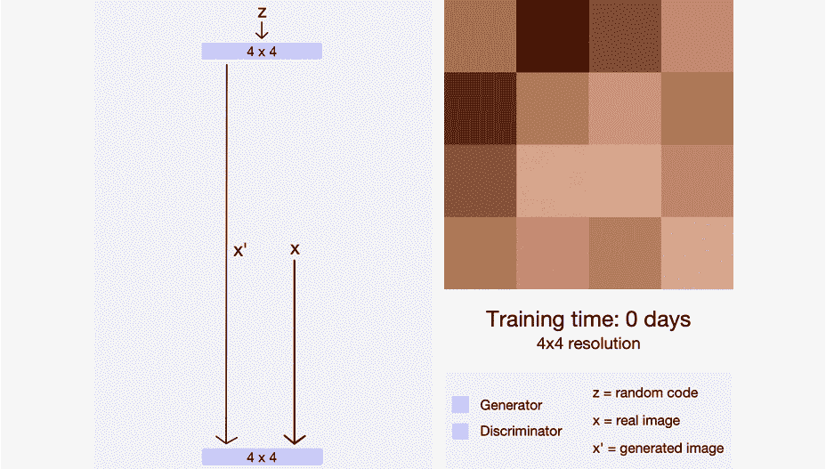

# 使用 StyleGAN2 生成动画角色

> 原文：<https://towardsdatascience.com/generating-anime-characters-with-stylegan2-6f8ae59e237b?source=collection_archive---------1----------------------->

## 了解如何生成这个很酷的动画人脸插值


生成的 StyleGAN 插值[图片由作者提供]

# **生成对抗网络**

生成对抗网络是一种能够生成新内容的生成模型。由于其有趣的应用，如生成合成训练数据、创建艺术、风格转换、图像到图像的翻译等，该主题在机器学习社区中变得非常流行。


甘建筑[图片由作者提供]

GAN 由两个网络组成，*发生器、*和*鉴别器*。生成器将尝试生成假样本，并欺骗鉴别器，使其相信这是真样本。鉴别器将尝试从真样本和假样本中检测生成的样本。这个有趣的对抗性概念是由 Ian Goodfellow 在 2014 年提出的。已经有很多资源可用于学习 GAN，因此我将不解释 GAN 以避免冗余。

我推荐阅读约瑟夫·罗卡的这篇优美的文章来了解甘。

[](/understanding-generative-adversarial-networks-gans-cd6e4651a29) [## 理解生成敌对网络(GANs)

### 一步一步地建立导致 GANs 的推理。

towardsdatascience.com](/understanding-generative-adversarial-networks-gans-cd6e4651a29) 

# **StyleGAN2**

StyleGAN 论文《[一种基于风格的 GANs](https://arxiv.org/abs/1812.04948) 架构》，由 NVIDIA 于 2018 年发布。该论文为 GAN 提出了一种新的生成器架构，允许他们控制所生成样本的不同层次的细节，从粗略细节(如头部形状)到精细细节(如眼睛颜色)。

StyleGAN 还结合了来自 [Progressive GAN](https://arxiv.org/abs/1710.10196) 的想法，其中网络最初在较低的分辨率(4x4)上训练，然后在稳定后逐渐增加更大的层。这样做，训练时间变得快了很多，训练也稳定了很多。



渐进成长的甘[【来源:莎拉·沃尔夫】](/progan-how-nvidia-generated-images-of-unprecedented-quality-51c98ec2cbd2)

StyleGAN 通过添加一个*映射网络*对其进行了进一步改进，该映射网络将输入向量编码到一个中间潜在空间 ***w*** 中，然后这些潜在空间将有单独的值用于控制不同级别的细节。


StyleGAN 生成器架构[图片由作者提供]

**为什么要添加映射网络？**
甘的问题之一是它的纠缠潜在表象(输入向量， ***z*** )。例如，假设我们有二维潜在代码，它代表脸的大小和眼睛的大小。在这种情况下，脸的大小与眼睛的大小密切相关(眼睛越大，脸也越大)。另一方面，我们可以通过存储面部和眼睛的比例来简化这一点，这将使我们的模型更简单，因为非纠缠的表示更容易被模型解释。

对于纠缠表示，数据分布可能不一定遵循我们想要对输入向量 z 进行采样的正态分布。例如，数据分布会有一个像这样的缺角，它表示眼睛和脸的比例变得不真实的区域。


[【来源:论文】](https://arxiv.org/pdf/1812.04948.pdf)

如果我们从正态分布中对 z 进行采样，我们的模型也会尝试生成缺失区域，其中的比率是不现实的，并且因为没有具有这种特征的训练数据，所以生成器生成的图像会很差。因此，映射网络旨在解开潜在表示并扭曲潜在空间，以便能够从正态分布中采样。


[【来源:论文】](https://arxiv.org/pdf/1812.04948.pdf)

此外，在每个级别上具有单独的输入向量 ***w*** ，允许生成器控制不同级别的视觉特征。前几层(4x4，8x8)将控制更高层次(更粗糙)的细节，如头型、姿势和发型。最后几层(512x512，1024x1024)将控制细节的精细程度，如头发和眼睛的颜色。


粗糙层次细节的变化(头型、发型、姿势、眼镜)[【来源:论文】](https://arxiv.org/pdf/1812.04948.pdf)


精细层次细节的变化(头发颜色)[【来源:纸张】](https://arxiv.org/pdf/1812.04948.pdf)

关于 StyleGAN 架构的全部细节，我推荐你阅读 NVIDIA 关于其实现的官方论文。这是论文中完整架构的插图。


[【来源:GANs Paper 基于风格的架构】](https://arxiv.org/pdf/1812.04948.pdf)

# **随机变化**

StyleGAN 还允许您通过在相应的层给出噪声来控制不同细节级别的随机变化。随机变化是图像上的微小随机性，不会改变我们的感知或图像的身份，如不同的梳理头发，不同的头发放置等。你可以在下面的动画图像中看到变化的效果。


粗略随机变化[【来源:论文】](https://www.youtube.com/watch?time_continue=241&v=kSLJriaOumA&feature=emb_title)


精细随机变异[【来源:论文】](https://www.youtube.com/watch?time_continue=241&v=kSLJriaOumA&feature=emb_title)

StyleGAN 还做了其他几个改进，我不会在这些文章中讨论，比如 AdaIN 规范化和其他规范化。你可以阅读[官方文件](https://arxiv.org/pdf/1812.04948.pdf)、[乔纳森·惠的这篇文章](https://medium.com/@jonathan_hui/gan-stylegan-stylegan2-479bdf256299)，或者拉尼·霍雷夫的[这篇文章](/explained-a-style-based-generator-architecture-for-gans-generating-and-tuning-realistic-6cb2be0f431)来了解更多细节。

# **截断绝招**

当训练样本中存在未充分表示的数据时，生成器可能无法学习样本，并且生成的样本很差。为了避免这种情况，StyleGAN 使用了一种“截断技巧”，即截断中间潜在向量 *w* ，迫使其接近平均值。

𝚿 (psi)是用于截断和重新采样高于阈值的潜在向量的阈值。因此，随着更高的𝚿，你可以在生成的图像上获得更高的多样性，但它也有更高的机会生成怪异或破碎的脸。根据 [Gwern](https://www.gwern.net/Faces#stylegan-2) ，对于该网络，0.5 至 0.7 的𝚿值似乎给出了具有足够多样性的良好图像。不过，请随意试验阈值。


在 0.3 磅/平方英寸(左)和 0.7 磅/平方英寸(中)和 1.3 磅/平方英寸(右)下生成的 3×3 网格图像

# **生成动漫人物**

我将使用 Aaron Gokaslan 预先训练的动画 StyleGAN2，这样我们可以直接加载模型并生成动画脸。所以，打开你的 Jupyter 笔记本或者 Google Colab，让我们开始编码吧。

***注:*** *如果卡住了*可以参考我的 [*Colab 笔记本*](https://colab.research.google.com/drive/15EGSIv_jZxDvYWODNwEG-I4pV9i3RwlN?usp=sharing)

*所以首先要克隆 styleGAN 回购。*

```
*$ git clone https://github.com/NVlabs/stylegan2.git*
```

**如果你使用的是 Google Colab，你可以在命令前面加上“！”作为命令运行它:！https://github.com/NVlabs/stylegan2.git*git 克隆[](https://github.com/NVlabs/stylegan2.git)*

*接下来，我们需要下载预先训练的权重并加载模型。当您使用 Google Colab 时，请确保您正在运行 GPU 运行时，因为模型被配置为使用 GPU。*

*该代码修改自[本笔记本](https://github.com/ak9250/stylegan-art/blob/master/styleganportraits.ipynb)*

*现在，我们需要生成随机向量， *z，*作为生成器的输入。让我们创建一个函数来从给定的种子生成潜在代码 z。*

*然后，我们可以创建一个函数来获取生成的随机向量 z 并生成图像。*

*现在，我们可以尝试生成一些图像，看看结果。*

*该函数将返回一个数组`PIL.Image`。在 Google Colab 中，你可以通过打印变量直接显示图像。这是第一个生成的图像。*

**

*作者图片*

*让我们用图像网格来显示它，这样我们就可以一次看到多个图像。*

*然后我们可以在一个 3x3 的网格中显示生成的图像。*

**

*作者图片*

*GAN 的一个优点是它有一个平滑连续的潜在空间，不像 VAE(自动变分编码器)那样有间隙。因此，当您在潜在空间中取两个点(这将生成两个不同的面)时，您可以通过在这两个点之间取一条线性路径来创建两个面的过渡或插值。*

**

*潜在空间的插值[【来源:约瑟夫·罗卡】](/understanding-variational-autoencoders-vaes-f70510919f73)*

*让我们用代码实现它，并创建一个函数在 z 向量的两个值之间进行插值。*

*我们来看看插值结果。你可以看到第一个图像逐渐过渡到第二个图像。*

**

*作者图片*

*现在我们已经完成了插值。我们终于可以尝试制作上面缩略图中的插值动画了。我们将使用`moviepy`库来创建视频或 GIF 文件。*

*当你运行代码时，它会生成一个插值的 GIF 动画。您还可以使用顶部的变量修改持续时间、网格大小或 fps。*

**

*生成的 StyleGAN2 插值 GIF[图片由作者提供]*

*如果你能走到这一步，恭喜你！您已经使用 StyleGAN2 生成了动画人脸，并学习了 GAN 和 StyleGAN 架构的基础知识。*

# ***接下来是什么？***

*现在我们已经完成了，你还能做些什么来进一步改进呢？这里有一些你可以做的事情。*

***其他数据集** 显然，StyleGAN 不仅限于动漫数据集，还有许多可用的预训练数据集可供您使用，如真实人脸、猫、艺术和绘画的图像。查看此 [GitHub repo](https://github.com/justinpinkney/awesome-pretrained-stylegan2) 了解可用的预训练重量。另一方面，您也可以使用自己选择的数据集来训练 StyleGAN。*

***有条件的 GAN** 目前，我们无法真正控制我们想要生成的特征，如头发颜色、眼睛颜色、发型和配饰。条件 GAN 允许您在输入向量 z 旁边给出一个标签，从而将生成的图像调整为我们想要的样子。或者，你可以试着通过回归或手动来理解潜在空间。如果你想往这个方向发展， [Snow Halcy repo](https://github.com/halcy/AnimeFaceNotebooks) 也许能帮到你，就像他在这个 J [upyter 笔记本](https://colab.research.google.com/github/halcy/AnimeFaceNotebooks/blob/master/colab/Stylegan2_Playground.ipynb)里做的那样，甚至让它互动起来。*

# ***确认***

*我要感谢[*Gwern Branwen*](https://www.gwern.net/About)*他的[广泛的文章](https://www.gwern.net/Faces#stylegan-2)和我在文章中强烈提到的关于用 StyleGAN 生成动画脸的解释。我强烈建议你访问他的网站，因为他的作品是知识的宝库。此外，请访问这个网站，该网站托管了生成动画人脸的 StyleGAN 模型和生成动画情节的 GPT 模型。**

**如果你喜欢我的文章，请随意查看我的其他文章！**

**[](/animating-yourself-as-a-disney-character-with-ai-78af337d4081) [## 用人工智能让你自己成为一个迪斯尼角色

### 先睹为快数字艺术的未来

towardsdatascience.com](/animating-yourself-as-a-disney-character-with-ai-78af337d4081) [](/generating-novel-content-without-dataset-544107da4cc8) [## 在没有数据集的情况下生成新内容

### 重写 GAN 中的规则:上下文相关的复制和粘贴特性

towardsdatascience.com](/generating-novel-content-without-dataset-544107da4cc8) 

# 参考

[1]t .卡拉斯、s .莱恩和 t .艾拉(2019 年)。一种基于风格的生成对抗网络生成器体系结构。在*IEEE 计算机视觉和模式识别会议论文集*(第 4401–4410 页)中。

[2]h[ttps://www . gwern . net/Faces # style gan-2](https://www.gwern.net/Faces#stylegan-2)

[3][https://towards data science . com/how-to-train-style gan-to-generate-realistic-faces-d 4 afca 48 e 705](/how-to-train-stylegan-to-generate-realistic-faces-d4afca48e705)

[4][https://towards data science . com/progan-how-NVIDIA-generated-images-of-previous-quality-51c 98 EC 2 CBD 2](/progan-how-nvidia-generated-images-of-unprecedented-quality-51c98ec2cbd2)**