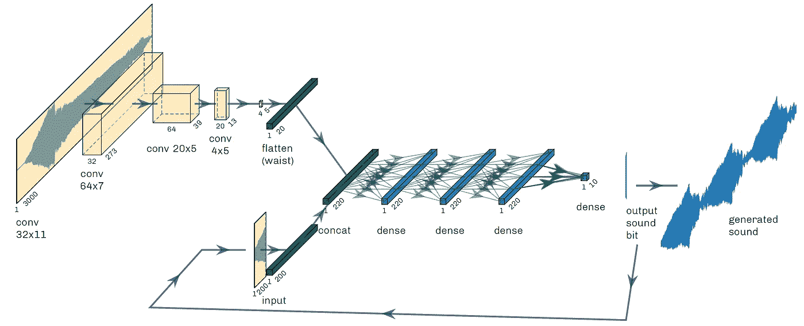
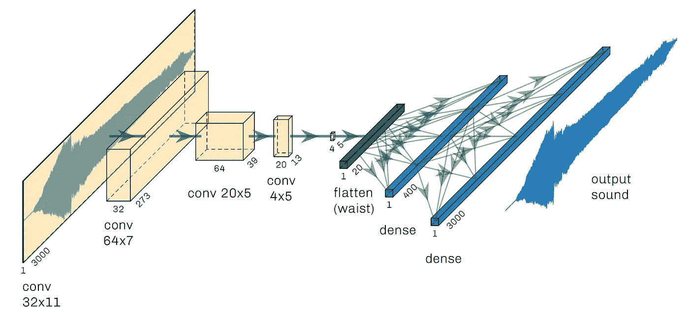
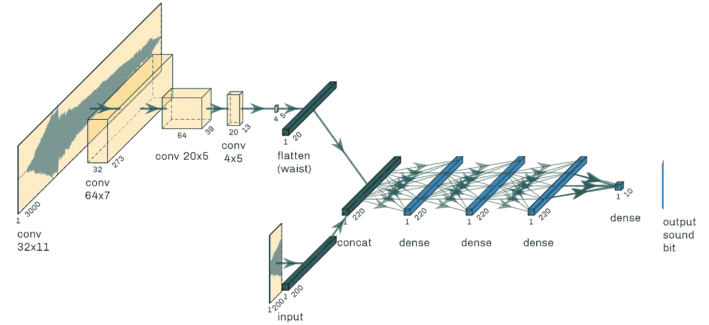

# 用神经网络产生啁啾

> 原文：<https://towardsdatascience.com/generating-chirps-with-neural-networks-41628e72efb2?source=collection_archive---------44----------------------->

## 将模型嫁接在一起并迭代调用生成器

鸟鸣的声音变化多样，优美，令人放松。在前 Covid 时代，我制作了一个[聚焦定时器](https://tomatotimer.app/)，它会在休息时播放一些录制的鸟鸣声，我总是想知道是否能产生这样的声音。经过反复试验，我找到了一个概念验证的架构，它既可以成功地再现单个啁啾声，又可以调整参数来改变生成的声音。

由于生成鸟鸣似乎是一个有点新奇的应用，我认为这种方法值得分享。一路走来，我还学会了如何将 TensorFlow 模型拆开，并将它们的一部分嫁接在一起。下面的代码块展示了这是如何实现的。完整的代码可以在[这里](https://jovian.ml/jason-o-jensen/generating-bird-sounds-proof-of-concept)找到。

# 理论上的方法

发电机将由两部分组成。第一部分将把整个声音和关于其整体形状的关键信息编码成少量的参数。

第二部分将获取一小段声音，以及关于整体形状的信息，并预测下一小段声音。

第二部分可以使用调整后的参数对其自身进行迭代调用，以产生全新的啁啾！

# 编码参数

一个[自动编码器](/deep-inside-autoencoders-7e41f319999f)结构用于导出声音的关键参数。在从一系列扩展(解码)层完全再现声音之前，这种结构采用整个声波，并通过一系列(编码)层将其减少到少量组件(腰部)。一旦经过训练，自动编码器模型在腰部被切断，因此它所做的只是将完整的声音降低到关键参数。

为了验证概念，使用了单个啁啾；这唧唧声:

使用啁啾的声波表示。

它来自康奈尔大学的鸟鸣指南:北美必备套装。用于[鸟鸣铬实验](https://experiments.withgoogle.com/bird-sounds)的同一套。

仅使用单一声音的一个问题是，自动编码器可能会简单地在解码层的偏差中隐藏关于声音的所有信息，从而使腰部的权重全部为零。为了减轻这一点，在训练过程中通过改变声音的振幅和稍微移动来改变声音。

自动编码器的编码器部分由一系列卷积层组成，这些卷积层将 3000 多长的声波压缩成大约 20 个数字，有望保留沿途的重要信息。由于声音由许多不同的正弦波组成，允许许多不同大小的卷积滤波器通过声音在理论上可以捕获关于复合波的关键信息。选择 20 的腰围尺寸主要是因为这似乎是一个可调节参数的可克服的数目。

在第一种方法中，各层被顺序堆叠。在未来的版本中，使用类似于 [inception-net 块](https://nicolovaligi.com/history-inception-deep-learning-architecture.html)的结构来并行运行不同大小的卷积可能是有利的。

模型的解码器部分由两个密集层组成，一个长度为 400，另一个长度为 3000，与输入声音的长度相同。最后一层的激活函数是 tanh，因为声波表示的值在-1 和 1 之间。

这看起来是这样的:

自动编码器网络的表示。用 [PlotNeuralNet](https://github.com/HarisIqbal88/PlotNeuralNet) 制作。

这是代码:

# 培训发电机

发生器的结构从自动编码器网络的编码部分开始。腰部的输出与一些新的输入相结合，这些新的输入表示即将被预测的声波之前的声波比特。在这种情况下，声波的前 200 个值被用作输入，然后预测下 10 个值。

组合的输入被输入到一系列密集层中。连续的密集层允许网络学习先前的值、关于声音的整体形状的信息和随后的值之间的关系。最终的致密层长度为 10，并且用双曲正切函数激活。

这是这个网络的样子:

带有自动编码器网络嫁接部分的发电机网络。用 [PlotNeuralNet](https://github.com/HarisIqbal88/PlotNeuralNet) 制作。

来自自动编码器网络的层被冻结，使得额外的训练资源不花费在它们上面。

# 发出一些声音

训练这个网络只需要几分钟，因为数据变化不大，因此相对容易学习，特别是对于自动编码器网络。最后一个亮点是从训练好的模型中产生两个新的网络。

第一个只是自动编码器的编码器部分，但现在是分开的。我们需要这部分来产生一些初始的好参数。

第二个模型与发生器网络相同，但自动编码器网络的部分被新的输入源所取代。这样做是为了使经过训练的发生器不再需要整个声波作为输入，而只需要捕获声音关键信息的编码参数。将这些分离出来作为新的输入，我们可以在产生啁啾时自由地操纵它们。

以下声音是在没有修改参数的情况下生成的，它们非常接近原始声音，但不是完美的再现。发电机网络只能达到 60%到 70%之间的精度，因此预计会有一些变化。

不修改编码参数而生成的声音。

# 修改参数

产生鸟鸣的好处部分在于可以产生主题的新变化。这可以通过修改编码器网络产生的参数来实现。在上面的例子中，编码器产生了这些参数:

不是所有的 20 个节点都产生非零参数，但是有足够多的节点可以实验。有 12 个可调参数，可以在两个方向上调整到任意程度，这是一个非常复杂的问题。由于这是一个概念验证，因此在每种情况下，只需调整一个参数，就可以产生一些选择声音:

每次修改其中一个编码参数后产生的声音。

以下是三个例子的声波表示:

产生啁啾的声波表示。

# 后续步骤

使用神经网络来产生鸟的声音似乎是可能的，尽管其可行性还有待观察。上述方法仅使用单一声音，因此下一步将尝试在多种不同声音上训练模型。从一开始就不清楚这是否可行。然而，如果构建的模型在多种声音上失败，仍然可以在不同的声音上训练不同的模型，并简单地将它们堆叠起来以产生不同的声音。

一个更大的问题是，并非所有产生的声音都是可行的，尤其是在修改参数时。相当一部分产生的声音更像电脑发出的哔哔声，而不是鸟鸣声。有些听起来像一台愤怒的计算机，它真的不想让你做你刚刚试图做的事情。减轻这种情况的一种方法是训练一个单独的模型来检测鸟的声音(也许沿着[这些线](/was-that-a-chirp-making-a-bird-audio-detection-convnet-on-pytorch-88400450bb19))，并使用它来拒绝或接受产生的输出。

计算成本也是当前方法的一个限制因素；生成啁啾声比播放声音需要多一个数量级的时间，如果是为了动态生成美丽的声景，这并不理想。这里想到的主要缓解措施是增加每次预测的长度，可能会以准确性为代价。当然，人们也可以简单地花时间预先生成可接受的声音场景。

# 结论

自动编码器网络和短期预测网络的组合可以被嫁接在一起，以产生具有一些可调节参数的鸟声发生器，这些参数可以被操纵以产生新的和有趣的鸟声。

和许多项目一样，部分动机是在过程中学习。特别是，我不知道如何把训练好的模型拆开，然后把它们的一部分移植到一起。上面使用的模型可以作为一个例子来指导其他想要尝试这种方法的学习者。