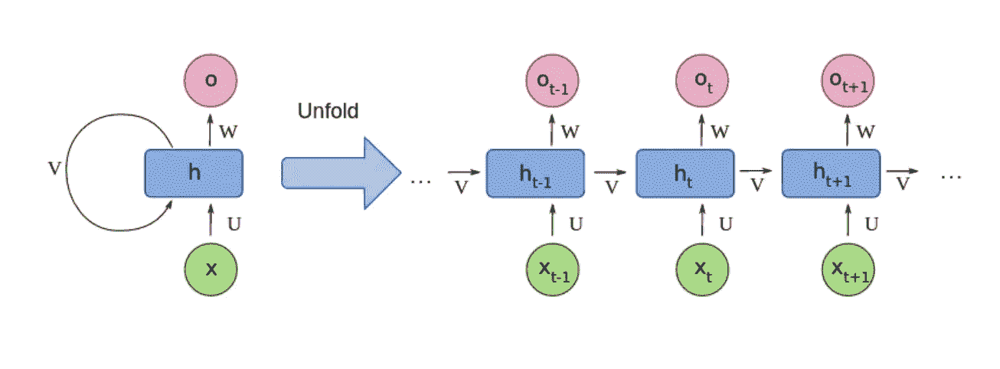
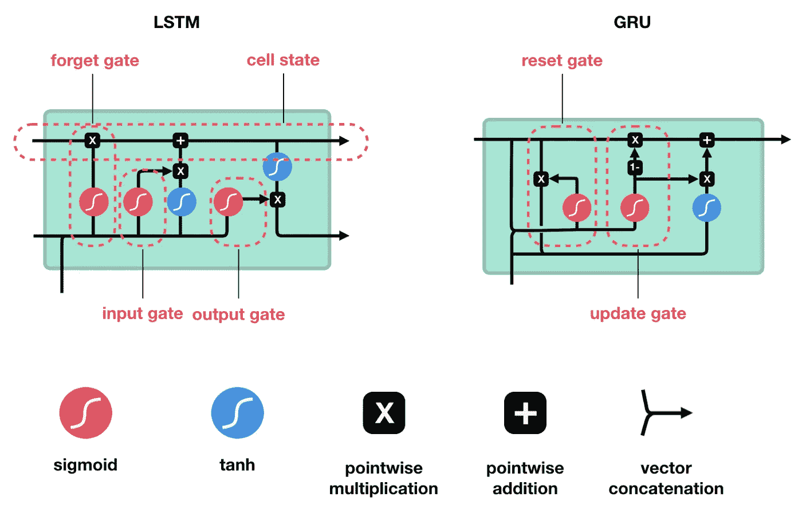
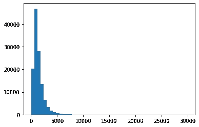
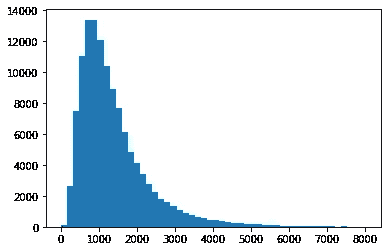
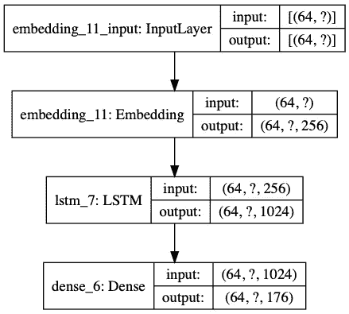
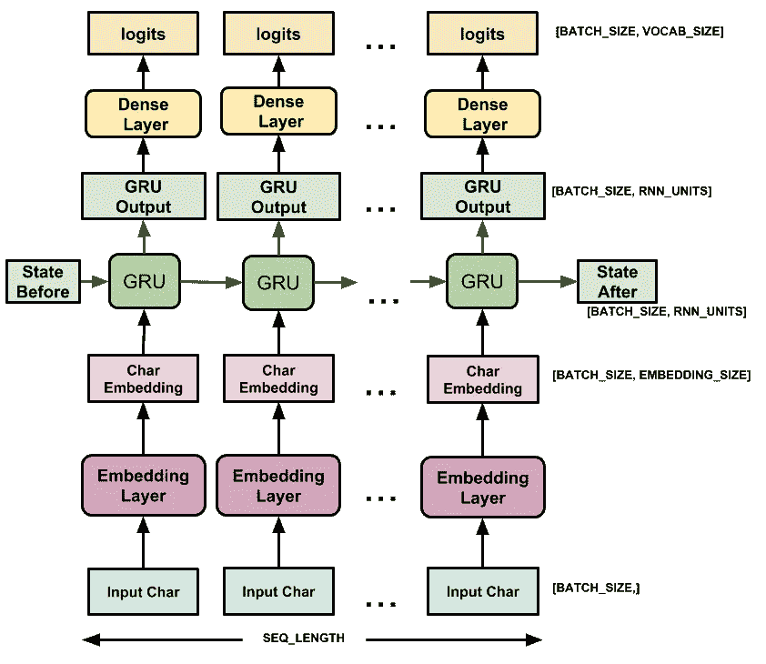
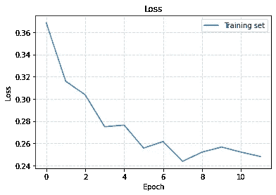
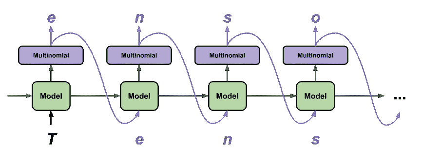

# 使用张量流和 LSTM 递归神经网络生成烹饪食谱:一步一步指南

> 原文：<https://towardsdatascience.com/generating-cooking-recipes-using-tensorflow-and-lstm-recurrent-neural-network-a7bf242acad3?source=collection_archive---------32----------------------->


照片由 [home_full_of_recipes](https://www.instagram.com/home_full_of_recipes/) 拍摄(Instagram 频道)

# TL；速度三角形定位法(dead reckoning)

我用 TensorFlow 在 *~100k* 食谱数据集上训练了一个人物级别的 LSTM *(长短期记忆)**，它建议我做*“奶油苏打加洋葱”*、*、【松饼草莓汤】、*、*、*、*、【三文鱼牛肉慕斯和墨西哥胡椒斯蒂尔顿沙拉】**

*在这里，你可能会找到更多我最后得到的例子:*

*   *🎨 [**烹饪食谱生成器演示**](https://trekhleb.github.io/machine-learning-experiments/#/experiments/RecipeGenerationRNN)——在你的浏览器中交互式地尝试该模型。*
*   *🏋🏻‍ [**LSTM 模型训练流程**](https://github.com/trekhleb/machine-learning-experiments/blob/master/experiments/recipe_generation_rnn/recipe_generation_rnn.ipynb)——看看模型是怎么训练出来的。*
*   *[🤖交互式机器学习实验](https://github.com/trekhleb/machine-learning-experiments) 知识库——查看更多“物体检测”、“草图识别”、“图像分类”等实验。*

*本文包含了 LSTM 模型如何在 Python 上使用 [TensorFlow 2](https://www.tensorflow.org/) 和 [Keras API](https://www.tensorflow.org/guide/keras) 进行实际训练的细节。*

**

*来自[机器学习实验](https://trekhleb.github.io/machine-learning-experiments/#/experiments/RecipeGenerationRNN)的屏幕记录*

# *我们的模型最终会学到什么*

*经过几个小时的训练，我们的角色级 RNN 模型将学习英语语法和标点符号的基本概念(我希望我能这么快学会英语！).它还将学习如何生成配方的不同部分，如*📗【配方名称】*，*🥕【配方成分】*和*📝【食谱说明】*。有时候食谱名称、配料和说明会很有趣，有时候很愚蠢，有时候很有趣。*

*下面是几个生成的配方示例:*

```
*📗 [NAME]Orange Club Tea Sandwich Cookies🥕 [INGREDIENTS]• 1 cup (2 sticks) unsalted butter, softened
• 1 cup confectioners' sugar
• 1/2 cup flaxseed meal
• 1/2 cup shelled pumpkin seeds (pecans, blanched and sliced)
• 2 teaspoons vanilla extract📝 [INSTRUCTIONS]▪︎ Preheat oven to 350 degrees F.
▪︎ Combine cake mix, milk, egg and sugar in a large bowl. Stir until combined and smooth but not sticky. Using a spatula, sprinkle the dough biscuits over the bottom of the pan. Sprinkle with sugar, and spread evenly. Bake for 20 minutes. Remove from the oven and cool on a rack. To serve, add the chocolate.*
```

*或者另一个:*

```
*📗 [NAME]Mushrooms with Lentil Stewed Shallots and Tomatoes🥕 [INGREDIENTS]• 1 tablespoon olive oil
• 3 cloves garlic, smashed
• Kosher salt
• 1 1/2 pounds lean ground turkey
• 1 cup coarsely peeled tart apples
• 2 tablespoons chopped garlic
• 1 teaspoon ground cumin
• 1/2 teaspoon cayenne pepper
• 1 teaspoon chopped fresh thyme
• 3/4 cup chopped fresh basil
• 1/2 small carrot, halved lengthwise and cut into 1/2-inch pieces
• 1 roasted red pepper, halved and sliced vertically diced and separated into rough chops
• 3 tablespoons unsalted butter
• 2 cups shredded mozzarella
• 1/4 cup grated parmesan cheese
• 1/4 cup prepared basil pesto📝 [INSTRUCTIONS]▪︎ Stir the olive oil, garlic, thyme and 1 teaspoon salt in a saucepan; bring to a simmer over medium heat. Remove from the heat. Add the basil and toast the soup for 2 minutes.
▪︎ Meanwhile, heat 4 to 4 inches vegetable oil in the skillet over medium-high heat. Add the olive oil, garlic, 1/2 teaspoon salt and 1/2 teaspoon pepper and cook, stirring often, until cooked through, a*
```

*⚠️ *本文中的食谱只是为了娱乐和学习目的而制作的。食谱是* ***而不是*** *用于实际烹饪！**

# *先验知识*

*假设你已经熟悉[递归神经网络](https://en.wikipedia.org/wiki/Recurrent_neural_network)的概念，特别是[长短期记忆(LSTM)](https://en.wikipedia.org/wiki/Long_short-term_memory) 架构。*

*ℹ️，如果这些概念对你来说是新的，我强烈推荐你参加 Coursera 的深度学习专业课程。浏览一下 Andrej Karpathy 的文章*中的[循环神经网络](http://karpathy.github.io/2015/05/21/rnn-effectiveness/)的不合理的有效性可能也是有益的。**

*在高层次上，**递归神经网络(RNN)** 是一类深度神经网络，最常用于基于序列的数据，如语音、声音、文本或音乐。它们用于机器翻译、语音识别、语音合成等。rnn 的关键特征是它们是有状态的，并且它们具有内部存储器，其中可以存储序列的一些上下文。例如，如果序列的第一个单词是`He`，RNN 可能向`speaks`建议下一个单词，而不仅仅是`speak`(以形成`He speaks`短语)，因为关于第一个单词`He`的先验知识已经在内存中。*

**

*图片来源:[递归神经网络](https://en.wikipedia.org/wiki/Recurrent_neural_network)维基百科上的文章*

**

*图片来源:[LSTM 和 GRU](/illustrated-guide-to-lstms-and-gru-s-a-step-by-step-explanation-44e9eb85bf21)关于数据科学的图文并茂的文章*

*令人兴奋的是，RNN(尤其是 LSTM)不仅能记住*单词对单词*的依存关系，还能记住*字符对字符*的依存关系！序列由什么组成并不重要:可能是单词，也可能是字符。重要的是它们形成了一个时间分布的序列。例如，我们有一个字符序列`['H', 'e']`。如果我们问 LSTM 下一步可能会做什么，它可能会建议一个`<stop_word>`(意思是，组成单词`He`的序列已经完成，我们可以停止)，或者它也可能会建议一个字符`l`(意思是，它试图为我们建立一个`Hello`序列)。这种类型的 rnn 被称为**字符级 rnn**(与**单词级 rnn**相对)。*

*在本教程中，我们将依靠 RNN 网络的记忆功能，我们将使用一个角色级别的 LSTM 版本来生成烹饪食谱。*

# *探索数据集*

*让我们浏览几个可用的数据集，并探讨它们的优缺点。我希望数据集满足的一个要求是，它不仅应该有一个配料列表，还应该有烹饪说明。我还希望它有一个措施和每种成分的数量。*

*以下是我发现的几个烹饪食谱数据集:*

*   *🤷[食谱配料数据集](https://www.kaggle.com/kaggle/recipe-ingredients-dataset/home) *(没有配料比例)**
*   *🤷 [Recipe1M+](http://pic2recipe.csail.mit.edu/) *(食谱很多但需要注册才能下载)**
*   *🤷[美食家——带评级和营养的食谱](https://www.kaggle.com/hugodarwood/epirecipes?select=full_format_recipes.json) *(仅约 20k 份食谱，最好能找到更多)**
*   *👍🏻[食谱框](https://eightportions.com/datasets/Recipes/)*(~ 12.5 万份食谱搭配食材比例，不错)**

*让我们尝试使用“配方箱”数据集。菜谱的数量看起来足够多，而且它既包含配料又包含烹饪说明。看看 RNN 是否能够了解配料和说明之间的联系是很有趣的。*

# *为训练设置 TensorFlow/Python 沙盒*

*在本教程中，您可以使用几个选项来试验代码:*

1.  *你可以在你的浏览器 *(不需要本地设置)*中使用 [GoogleColab 进行实验。](https://colab.research.google.com/github/trekhleb/machine-learning-experiments/blob/master/experiments/recipe_generation_rnn/recipe_generation_rnn.ipynb)*
2.  *你可以在你的浏览器中使用 [Jupyter 笔记本](https://mybinder.org/v2/gh/trekhleb/machine-learning-experiments/master?filepath=experiments/recipe_generation_rnn/recipe_generation_rnn.ipynb) *(不需要本地设置)*。*
3.  *你可以在本地建立一个 Jupyter 笔记本。*

*我会建议使用 GoogleColab 选项，因为它不需要对您进行任何本地设置(您可以在您的浏览器中进行实验)，并且它还提供了强大的 GPU 支持，可以使模型训练更快。您也可以尝试训练参数。*

# *导入依赖关系*

*让我们从导入一些我们以后会用到的包开始。*

```
**# Packages for training the model and working with the dataset.*
**import** tensorflow **as** tf
**import** matplotlib.pyplot **as** plt
**import** numpy **as** np
**import** json*# Utility/helper packages.*
**import** platform
**import** time
**import** pathlib
**import** os*
```

*首先，让我们确保我们的环境设置正确，并且我们使用的是 Tensorflow 的 *2nd* 版本。*

```
*print('Python version:', platform.python_version())
print('Tensorflow version:', tf.__version__)
print('Keras version:', tf.keras.__version__)*
```

**➔输出:**

```
*Python version: 3.7.6
Tensorflow version: 2.1.0
Keras version: 2.2.4-tf*
```

# *加载数据集*

*让我们使用[TF . keras . utils . get _ file](https://www.tensorflow.org/api_docs/python/tf/keras/utils/get_file)加载数据集。使用`get_file()`实用程序很方便，因为它为您处理现成的缓存。这意味着您将只下载一次数据集文件，即使您再次在笔记本中启动相同的代码块，它也会使用缓存，并且代码块的执行速度会更快。*

*如果缓存文件夹不存在，则创建它:*

```
*CACHE_DIR = './tmp'
pathlib.Path(CACHE_DIR).mkdir(exist_ok=**True**)*
```

*下载并解包数据集:*

```
*dataset_file_name = 'recipes_raw.zip'
dataset_file_origin = 'https://storage.googleapis.com/recipe-box/recipes_raw.zip'dataset_file_path = tf.keras.utils.get_file(
    fname=dataset_file_name,
    origin=dataset_file_origin,
    cache_dir=CACHE_DIR,
    extract=**True**,
    archive_format='zip'
)print(dataset_file_path)*
```

*以下是下载后数据集文件的路径:*

**➔输出:**

```
*./tmp/datasets/recipes_raw.zip*
```

*让我们打印缓存文件夹，看看到底下载了什么:*

```
*!ls -la ./tmp/datasets/*
```

**➔输出:**

```
*total 521128
drwxr-xr-x  7        224 May 13 18:10 .
drwxr-xr-x  4        128 May 18 18:00 ..
-rw-r--r--  1      20437 May 20 06:46 LICENSE
-rw-r--r--  1   53355492 May 13 18:10 recipes_raw.zip
-rw-r--r--  1   49784325 May 20 06:46 recipes_raw_nosource_ar.json
-rw-r--r--  1   61133971 May 20 06:46 recipes_raw_nosource_epi.json
-rw-r--r--  1   93702755 May 20 06:46 recipes_raw_nosource_fn.json*
```

*如您所见，数据集由 3 个文件组成。稍后，我们需要将这些文件中的信息合并成一个数据集。*

*让我们从`json`文件中加载数据集数据，并从中预览示例。*

```
***def** **load_dataset**(silent=False):
    *# List of dataset files we want to merge.*
    dataset_file_names = [
        'recipes_raw_nosource_ar.json',
        'recipes_raw_nosource_epi.json',
        'recipes_raw_nosource_fn.json',
    ]

    dataset = [] **for** dataset_file_name **in** dataset_file_names:
        dataset_file_path = f'{CACHE_DIR}/datasets/{dataset_file_name}' **with** open(dataset_file_path) **as** dataset_file:
            json_data_dict = json.load(dataset_file)
            json_data_list = list(json_data_dict.values())
            dict_keys = [key **for** key **in** json_data_list[0]]
            dict_keys.sort()
            dataset += json_data_list *# This code block outputs the summary for each dataset.*
            **if** silent == **False**:
                print(dataset_file_path)
                print('===========================================')
                print('Number of examples: ', len(json_data_list), '\n')
                print('Example object keys:\n', dict_keys, '\n')
                print('Example object:\n', json_data_list[0], '\n')
                print('Required keys:\n')
                print('  title: ', json_data_list[0]['title'], '\n')
                print('  ingredients: ', json_data_list[0]['ingredients'], '\n')
                print('  instructions: ', json_data_list[0]['instructions'])
                print('\n\n') **return** dataset dataset_raw = load_dataset()*
```

**➔输出:**

```
*./tmp/datasets/recipes_raw_nosource_ar.json
===========================================
Number of examples:  39802 Example object keys:
 ['ingredients', 'instructions', 'picture_link', 'title'] Example object:
 {'title': 'Slow Cooker Chicken and Dumplings', 'ingredients': ['4 skinless, boneless chicken breast halves ADVERTISEMENT', '2 tablespoons butter ADVERTISEMENT', '2 (10.75 ounce) cans condensed cream of chicken soup ADVERTISEMENT', '1 onion, finely diced ADVERTISEMENT', '2 (10 ounce) packages refrigerated biscuit dough, torn into pieces ADVERTISEMENT', 'ADVERTISEMENT'], 'instructions': 'Place the chicken, butter, soup, and onion in a slow cooker, and fill with enough water to cover.\nCover, and cook for 5 to 6 hours on High. About 30 minutes before serving, place the torn biscuit dough in the slow cooker. Cook until the dough is no longer raw in the center.\n', 'picture_link': '55lznCYBbs2mT8BTx6BTkLhynGHzM.S'} Required keys: title:  Slow Cooker Chicken and Dumplings  ingredients:  ['4 skinless, boneless chicken breast halves ADVERTISEMENT', '2 tablespoons butter ADVERTISEMENT', '2 (10.75 ounce) cans condensed cream of chicken soup ADVERTISEMENT', '1 onion, finely diced ADVERTISEMENT', '2 (10 ounce) packages refrigerated biscuit dough, torn into pieces ADVERTISEMENT', 'ADVERTISEMENT'] instructions:  Place the chicken, butter, soup, and onion in a slow cooker, and fill with enough water to cover.
Cover, and cook for 5 to 6 hours on High. About 30 minutes before serving, place the torn biscuit dough in the slow cooker. Cook until the dough is no longer raw in the center. ./tmp/datasets/recipes_raw_nosource_epi.json
===========================================
Number of examples:  25323 Example object keys:
 ['ingredients', 'instructions', 'picture_link', 'title'] Example object:
 {'ingredients': ['12 egg whites', '12 egg yolks', '1 1/2 cups sugar', '3/4 cup rye whiskey', '12 egg whites', '3/4 cup brandy', '1/2 cup rum', '1 to 2 cups heavy cream, lightly whipped', 'Garnish: ground nutmeg'], 'picture_link': None, 'instructions': 'Beat the egg whites until stiff, gradually adding in 3/4 cup sugar. Set aside. Beat the egg yolks until they are thick and pale and add the other 3/4 cup sugar and stir in rye whiskey. Blend well. Fold the egg white mixture into the yolk mixture and add the brandy and the rum. Beat the mixture well. To serve, fold the lightly whipped heavy cream into the eggnog. (If a thinner mixture is desired, add the heavy cream unwhipped.) Sprinkle the top of the eggnog with the nutmeg to taste.\nBeat the egg whites until stiff, gradually adding in 3/4 cup sugar. Set aside. Beat the egg yolks until they are thick and pale and add the other 3/4 cup sugar and stir in rye whiskey. Blend well. Fold the egg white mixture into the yolk mixture and add the brandy and the rum. Beat the mixture well. To serve, fold the lightly whipped heavy cream into the eggnog. (If a thinner mixture is desired, add the heavy cream unwhipped.) Sprinkle the top of the eggnog with the nutmeg to taste.', 'title': 'Christmas Eggnog '} Required keys: title:  Christmas Eggnog  ingredients:  ['12 egg whites', '12 egg yolks', '1 1/2 cups sugar', '3/4 cup rye whiskey', '12 egg whites', '3/4 cup brandy', '1/2 cup rum', '1 to 2 cups heavy cream, lightly whipped', 'Garnish: ground nutmeg']   instructions:  Beat the egg whites until stiff, gradually adding in 3/4 cup sugar. Set aside. Beat the egg yolks until they are thick and pale and add the other 3/4 cup sugar and stir in rye whiskey. Blend well. Fold the egg white mixture into the yolk mixture and add the brandy and the rum. Beat the mixture well. To serve, fold the lightly whipped heavy cream into the eggnog. (If a thinner mixture is desired, add the heavy cream unwhipped.) Sprinkle the top of the eggnog with the nutmeg to taste.
Beat the egg whites until stiff, gradually adding in 3/4 cup sugar. Set aside. Beat the egg yolks until they are thick and pale and add the other 3/4 cup sugar and stir in rye whiskey. Blend well. Fold the egg white mixture into the yolk mixture and add the brandy and the rum. Beat the mixture well. To serve, fold the lightly whipped heavy cream into the eggnog. (If a thinner mixture is desired, add the heavy cream unwhipped.) Sprinkle the top of the eggnog with the nutmeg to taste../tmp/datasets/recipes_raw_nosource_fn.json
===========================================
Number of examples:  60039 Example object keys:
 ['ingredients', 'instructions', 'picture_link', 'title'] Example object:
 {'instructions': 'Toss ingredients lightly and spoon into a buttered baking dish. Top with additional crushed cracker crumbs, and brush with melted butter. Bake in a preheated at 350 degrees oven for 25 to 30 minutes or until delicately browned.', 'ingredients': ['1/2 cup celery, finely chopped', '1 small green pepper finely chopped', '1/2 cup finely sliced green onions', '1/4 cup chopped parsley', '1 pound crabmeat', '1 1/4 cups coarsely crushed cracker crumbs', '1/2 teaspoon salt', '3/4 teaspoons dry mustard', 'Dash hot sauce', '1/4 cup heavy cream', '1/2 cup melted butter'], 'title': "Grammie Hamblet's Deviled Crab", 'picture_link': None} Required keys: title:  Grammie Hamblet's Deviled Crab  ingredients:  ['1/2 cup celery, finely chopped', '1 small green pepper finely chopped', '1/2 cup finely sliced green onions', '1/4 cup chopped parsley', '1 pound crabmeat', '1 1/4 cups coarsely crushed cracker crumbs', '1/2 teaspoon salt', '3/4 teaspoons dry mustard', 'Dash hot sauce', '1/4 cup heavy cream', '1/2 cup melted butter']   instructions:  Toss ingredients lightly and spoon into a buttered baking dish. Top with additional crushed cracker crumbs, and brush with melted butter. Bake in a preheated at 350 degrees oven for 25 to 30 minutes or until delicately browned.*
```

*让我们统计一下合并文件后的示例总数:*

```
*print('Total number of raw examples: ', len(dataset_raw))*
```

**➔输出:**

```
*Total number of raw examples:  125164*
```

# *预处理数据集*

# *过滤掉不完整的例子*

*有可能有些菜谱没有一些必填字段(*名称*、*配料*或*说明*)。我们需要从这些不完整的例子中清理出我们的数据集。*

*以下函数将帮助我们筛选出既没有标题也没有配料或说明的食谱:*

```
***def** **recipe_validate_required_fields**(recipe):
    required_keys = ['title', 'ingredients', 'instructions']

    **if** **not** recipe:
        **return** **False**

    **for** required_key **in** required_keys:
        **if** **not** recipe[required_key]:
            **return** **False**

        **if** type(recipe[required_key]) == list **and** len(recipe[required_key]) == 0:
            **return** **False**

    **return** **True***
```

*现在让我们使用`recipe_validate_required_fields()`函数进行过滤:*

```
*dataset_validated = [recipe **for** recipe **in** dataset_raw **if** recipe_validate_required_fields(recipe)]print('Dataset size BEFORE validation', len(dataset_raw))
print('Dataset size AFTER validation', len(dataset_validated))
print('Number of incomplete recipes', len(dataset_raw) - len(dataset_validated))*
```

**➔输出:**

```
*Dataset size BEFORE validation 125164
Dataset size AFTER validation 122938
Number of incomplete recipes 2226*
```

*正如你可能看到的，我们的`2226`食谱有些不完整。*

# *将配方对象转换为字符串*

*RNN 不理解物体。因此，我们需要将 recipes 对象转换为字符串，然后转换为数字(索引)。让我们从将 recipes 对象转换成字符串开始。*

*为了帮助我们的 RNN 更快地学习文章的结构，让我们给它添加 3 个“地标”。我们将使用这些独特的“标题”、“配料”和“说明”标志来分隔每个食谱的逻辑部分。*

```
*STOP_WORD_TITLE = '📗 '
STOP_WORD_INGREDIENTS = '\n🥕\n\n'
STOP_WORD_INSTRUCTIONS = '\n📝\n\n'*
```

*下面的函数将 recipe 对象转换为字符串(字符序列),以便以后在 RNN 输入中使用。*

```
***def** **recipe_to_string**(recipe):
    *# This string is presented as a part of recipes so we need to clean it up.*
    noize_string = 'ADVERTISEMENT'

    title = recipe['title']
    ingredients = recipe['ingredients']
    instructions = recipe['instructions'].split('\n')

    ingredients_string = ''
    **for** ingredient **in** ingredients:
        ingredient = ingredient.replace(noize_string, '')
        **if** ingredient:
            ingredients_string += f'• {ingredient}\n'

    instructions_string = ''
    **for** instruction **in** instructions:
        instruction = instruction.replace(noize_string, '')
        **if** instruction:
            instructions_string += f'▪︎ {instruction}\n'

    **return** f'{STOP_WORD_TITLE}{title}\n{STOP_WORD_INGREDIENTS}{ingredients_string}{STOP_WORD_INSTRUCTIONS}{instructions_string}'*
```

*让我们将`recipe_to_string()`函数应用于`dataset_validated`:*

```
*dataset_stringified = [recipe_to_string(recipe) **for** recipe **in** dataset_validated]print('Stringified dataset size: ', len(dataset_stringified))*
```

**➔输出:**

```
*Stringified dataset size:  122938*
```

*让我们先来预览几个食谱:*

```
***for** recipe_index, recipe_string **in** enumerate(dataset_stringified[:3]):
    print('Recipe #{}\n---------'.format(recipe_index + 1))
    print(recipe_string)
    print('\n')*
```

**➔输出:**

```
*Recipe #1
---------
📗 Slow Cooker Chicken and Dumplings🥕• 4 skinless, boneless chicken breast halves 
• 2 tablespoons butter 
• 2 (10.75 ounce) cans condensed cream of chicken soup 
• 1 onion, finely diced 
• 2 (10 ounce) packages refrigerated biscuit dough, torn into pieces 📝▪︎ Place the chicken, butter, soup, and onion in a slow cooker, and fill with enough water to cover.
▪︎ Cover, and cook for 5 to 6 hours on High. About 30 minutes before serving, place the torn biscuit dough in the slow cooker. Cook until the dough is no longer raw in the center.Recipe #2
---------
📗 Awesome Slow Cooker Pot Roast🥕• 2 (10.75 ounce) cans condensed cream of mushroom soup 
• 1 (1 ounce) package dry onion soup mix 
• 1 1/4 cups water 
• 5 1/2 pounds pot roast 📝▪︎ In a slow cooker, mix cream of mushroom soup, dry onion soup mix and water. Place pot roast in slow cooker and coat with soup mixture.
▪︎ Cook on High setting for 3 to 4 hours, or on Low setting for 8 to 9 hours.Recipe #3
---------
📗 Brown Sugar Meatloaf🥕• 1/2 cup packed brown sugar 
• 1/2 cup ketchup 
• 1 1/2 pounds lean ground beef 
• 3/4 cup milk 
• 2 eggs 
• 1 1/2 teaspoons salt 
• 1/4 teaspoon ground black pepper 
• 1 small onion, chopped 
• 1/4 teaspoon ground ginger 
• 3/4 cup finely crushed saltine cracker crumbs 📝▪︎ Preheat oven to 350 degrees F (175 degrees C). Lightly grease a 5x9 inch loaf pan.
▪︎ Press the brown sugar in the bottom of the prepared loaf pan and spread the ketchup over the sugar.
▪︎ In a mixing bowl, mix thoroughly all remaining ingredients and shape into a loaf. Place on top of the ketchup.
▪︎ Bake in preheated oven for 1 hour or until juices are clear.*
```

*出于好奇，让我们从数据集的中间预览一下菜谱，看看它是否具有预期的数据结构:*

```
*print(dataset_stringified[50000])*
```

**➔输出:**

```
*📗 Herbed Bean Ragoût 🥕• 6 ounces haricots verts (French thin green beans), trimmed and halved crosswise
• 1 (1-pound) bag frozen edamame (soybeans in the pod) or 1 1/4 cups frozen shelled edamame, not thawed
• 2/3 cup finely chopped onion
• 2 garlic cloves, minced
• 1 Turkish bay leaf or 1/2 California bay leaf
• 2 (3-inch) fresh rosemary sprigs
• 1/2 teaspoon salt
• 1/4 teaspoon black pepper
• 1 tablespoon olive oil
• 1 medium carrot, cut into 1/8-inch dice
• 1 medium celery rib, cut into 1/8-inch dice
• 1 (15- to 16-ounces) can small white beans, rinsed and drained
• 1 1/2 cups chicken stock or low-sodium broth
• 2 tablespoons unsalted butter
• 2 tablespoons finely chopped fresh flat-leaf parsley
• 1 tablespoon finely chopped fresh chervil (optional)
• Garnish: fresh chervil sprigs📝▪︎ Cook haricots verts in a large pot of boiling salted water until just tender, 3 to 4 minutes. Transfer with a slotted spoon to a bowl of ice and cold water, then drain. Add edamame to boiling water and cook 4 minutes. Drain in a colander, then rinse under cold water. If using edamame in pods, shell them and discard pods. Cook onion, garlic, bay leaf, rosemary, salt, and pepper in oil in a 2- to 4-quart heavy saucepan over moderately low heat, stirring, until softened, about 3 minutes. Add carrot and celery and cook, stirring, until softened, about 3 minutes. Add white beans and stock and simmer, covered, stirring occasionally, 10 minutes. Add haricots verts and edamame and simmer, uncovered, until heated through, 2 to 3 minutes. Add butter, parsley, and chervil (if using) and stir gently until butter is melted. Discard bay leaf and rosemary sprigs.
▪︎ Cook haricots verts in a large pot of boiling salted water until just tender, 3 to 4 minutes. Transfer with a slotted spoon to a bowl of ice and cold water, then drain.
▪︎ Add edamame to boiling water and cook 4 minutes. Drain in a colander, then rinse under cold water. If using edamame in pods, shell them and discard pods.
▪︎ Cook onion, garlic, bay leaf, rosemary, salt, and pepper in oil in a 2- to 4-quart heavy saucepan over moderately low heat, stirring, until softened, about 3 minutes. Add carrot and celery and cook, stirring, until softened, about 3 minutes.
▪︎ Add white beans and stock and simmer, covered, stirring occasionally, 10 minutes. Add haricots verts and edamame and simmer, uncovered, until heated through, 2 to 3 minutes. Add butter, parsley, and chervil (if using) and stir gently until butter is melted. Discard bay leaf and rosemary sprigs.*
```

# *过滤掉大量食谱*

*食谱长短不一。在将配方序列输入 RNN 之前，我们需要有一个*硬编码序列长度*限制。我们需要找出什么样的配方长度可以覆盖大多数的配方用例，同时我们希望它尽可能的短，以加快训练过程。*

```
*recipes_lengths = []
**for** recipe_text **in** dataset_stringified:
    recipes_lengths.append(len(recipe_text))plt.hist(recipes_lengths, bins=50)
plt.show()*
```

**➔输出:**

**

*配方长度(代码生成的图像)*

*大多数食谱的长度小于`5000`个字符。让我们放大来看更详细的图片:*

```
*plt.hist(recipes_lengths, range=(0, 8000), bins=50)
plt.show()*
```

**➔输出:**

**

*配方长度(代码生成的图像)*

*看起来食谱的字符限制将覆盖大多数情况。我们可以试着用这个最大食谱长度限制来训练 RNN。*

```
*MAX_RECIPE_LENGTH = 2000*
```

*因此，我们来过滤掉所有长于`MAX_RECIPE_LENGTH`的菜谱:*

```
***def** **filter_recipes_by_length**(recipe_test):
    **return** len(recipe_test) <= MAX_RECIPE_LENGTH dataset_filtered = [recipe_text **for** recipe_text **in** dataset_stringified **if** filter_recipes_by_length(recipe_text)]print('Dataset size BEFORE filtering: ', len(dataset_stringified))
print('Dataset size AFTER filtering: ', len(dataset_filtered))
print('Number of eliminated recipes: ', len(dataset_stringified) - len(dataset_filtered))*
```

**➔输出:**

```
*Dataset size BEFORE filtering:  122938
Dataset size AFTER filtering:  100212
Number of eliminated recipes:  22726*
```

*在过滤过程中，我们丢失了`22726`配方，但现在配方的数据更加密集。*

# *汇总数据集参数*

```
*TOTAL_RECIPES_NUM = len(dataset_filtered)print('MAX_RECIPE_LENGTH: ', MAX_RECIPE_LENGTH)
print('TOTAL_RECIPES_NUM: ', TOTAL_RECIPES_NUM)*
```

**➔输出:**

```
*MAX_RECIPE_LENGTH:  2000
TOTAL_RECIPES_NUM:  100212*
```

*最后，我们以`~100k`食谱告终。每个配方都有`2000`字符长度。*

# *创造词汇*

*递归神经网络不理解字符或单词。相反，它理解数字。因此，我们需要将食谱文本转换成数字。*

*在这个实验中，我们将使用基于多层 LSTM(长短期记忆)网络的**字符级**语言模型(与**单词级**语言模型相对)。这意味着我们将为字符创建唯一的索引，而不是为单词创建唯一的索引。通过这样做，我们让网络预测序列中的下一个*字符*，而不是下一个*单词*。*

*ℹ️你可以在 Andrej Karpathy 的文章[中找到更多关于字符级 RNNs 的解释:](http://karpathy.github.io/2015/05/21/rnn-effectiveness/)*

*为了从食谱文本中创建词汇表，我们将使用[TF . keras . preprocessing . text . tokenizer](https://www.tensorflow.org/api_docs/python/tf/keras/preprocessing/text/Tokenizer)。*

*我们还需要来一些独特的字符，将被视为一个*停止字符*，将表明一个食谱的结束。我们需要它来生成菜谱，因为如果没有这个停止字符，我们就不知道正在生成的菜谱的结尾在哪里。*

```
*STOP_SIGN = '␣'tokenizer = tf.keras.preprocessing.text.Tokenizer(
    char_level=**True**,
    filters='',
    lower=**False**,
    split=''
)*# Stop word is not a part of recipes, but tokenizer must know about it as well.*
tokenizer.fit_on_texts([STOP_SIGN])tokenizer.fit_on_texts(dataset_filtered)tokenizer.get_config()*
```

**➔输出:**

```
*{'num_words': None,
 'filters': '',
 'lower': False,
 'split': '',
 'char_level': True,
 'oov_token': None,
 'document_count': 100213, 'word_counts': '{"\\u2423": 1, "\\ud83d\\udcd7": 100212, " ": 17527888, "S": 270259, "l": 3815150, "o": 5987496, "w": 964459, "C": 222831, "k": 890982, "e": 9296022, "r": 4760887, "h": 2922100, "i": 4911812, "c": 2883507, "n": 5304396, "a": 6067157, "d": 3099679, "D": 63999, "u": 2717050, "m": 1794411, "p": 2679164, "g": 1698670, "s": 4704222, "\\n": 1955281, "\\ud83e\\udd55": 100212, "\\u2022": 922813, "4": 232607, ",": 1130487, "b": 1394803, "t": 5997722, "v": 746785, "2": 493933, "(": 144985, "1": 853931, "0": 145119, ".": 1052548, "7": 31098, "5": 154071, ")": 144977, "f": 1042981, "y": 666553, "\\ud83d\\udcdd": 100212, "\\u25aa": 331058, "\\ufe0e": 331058, "P": 200597, "6": 51398, "H": 43936, "A": 134274, "3": 213519, "R": 101253, "x": 201286, "/": 345257, "I": 81591, "L": 46138, "8": 55352, "9": 17697, "B": 123813, "M": 78684, "F": 104359, "j": 110008, "-": 219160, "W": 61616, "\\u00ae": 10159, "N": 12808, "q": 69654, "T": 101371, ";": 72045, "\'": 26831, "Z": 2428, "z": 115883, "G": 52043, ":": 31318, "E": 18582, "K": 18421, "X": 385, "\\"": 6445, "O": 28971, "Y": 6064, "\\u2122": 538, "Q": 3904, "J": 10269, "!": 3014, "U": 14132, "V": 12172, "&": 1039, "+": 87, "=": 113, "%": 993, "*": 3243, "\\u00a9": 99, "[": 30, "]": 31, "\\u00e9": 6727, "<": 76, ">": 86, "\\u00bd": 166, "#": 168, "\\u00f1": 891, "?": 327, "\\u2019": 111, "\\u00b0": 6808, "\\u201d": 6, "$": 84, "@": 5, "{": 8, "}": 9, "\\u2013": 1228, "\\u0096": 7, "\\u00e0": 26, "\\u00e2": 106, "\\u00e8": 846, "\\u00e1": 74, "\\u2014": 215, "\\u2044": 16, "\\u00ee": 415, "\\u00e7": 171, "_": 26, "\\u00fa": 48, "\\u00ef": 43, "\\u201a": 20, "\\u00fb": 36, "\\u00f3": 74, "\\u00ed": 130, "\\u25ca": 4, "\\u00f9": 12, "\\u00d7": 6, "\\u00ec": 8, "\\u00fc": 29, "\\u2031": 4, "\\u00ba": 19, "\\u201c": 4, "\\u00ad": 25, "\\u00ea": 27, "\\u00f6": 9, "\\u0301": 11, "\\u00f4": 8, "\\u00c1": 2, "\\u00be": 23, "\\u00bc": 95, "\\u00eb": 2, "\\u0097": 2, "\\u215b": 3, "\\u2027": 4, "\\u00e4": 15, "\\u001a": 2, "\\u00f8": 2, "\\ufffd": 20, "\\u02da": 6, "\\u00bf": 264, "\\u2153": 2, "|": 2, "\\u00e5": 3, "\\u00a4": 1, "\\u201f": 1, "\\u00a7": 5, "\\ufb02": 3, "\\u00a0": 1, "\\u01b0": 2, "\\u01a1": 1, "\\u0103": 1, "\\u0300": 1, "\\u00bb": 6, "`": 3, "\\u0092": 2, "\\u215e": 1, "\\u202d": 4, "\\u00b4": 2, "\\u2012": 2, "\\u00c9": 40, "\\u00da": 14, "\\u20ac": 1, "\\\\": 5, "~": 1, "\\u0095": 1, "\\u00c2": 2}', 'word_docs': '{"\\u2423": 1, "k": 97316, "0": 61954, "o": 100205, "r": 100207, "d": 100194, "u": 100161, "S": 89250, "\\u25aa": 100212, "D": 40870, "1": 99320, "g": 99975, "n": 100198, "b": 99702, "t": 100202, ".": 100163, " ": 100212, "7": 24377, "3": 79135, "\\ud83d\\udcd7": 100212, "i": 100207, "5": 65486, "f": 98331, "c": 100190, "4": 82453, "a": 100205, "2": 96743, "v": 97848, "C": 83328, "s": 100204, "\\n": 100212, "6": 35206, "\\ud83d\\udcdd": 100212, ",": 98524, "\\ufe0e": 100212, "l": 100206, "e": 100212, "y": 96387, ")": 67614, "p": 100046, "H": 31908, "\\ud83e\\udd55": 100212, "m": 99988, "w": 99227, "(": 67627, "A": 60900, "h": 100161, "\\u2022": 100212, "P": 79364, "R": 54040, "9": 14114, "8": 37000, "L": 32101, "x": 72133, "I": 46675, "/": 89051, "j": 47438, "F": 57940, "B": 64278, "M": 48332, "-": 74711, "T": 53758, "\\u00ae": 5819, "N": 9981, "W": 38981, "q": 36538, ";": 33863, "G": 35355, "\'": 18120, "z": 42430, "Z": 2184, ":": 18214, "E": 12161, "K": 14834, "X": 321, "\\"": 2617, "O": 20103, "Y": 5148, "\\u2122": 448, "Q": 3142, "J": 8225, "!": 2428, "U": 10621, "V": 9710, "&": 749, "+": 32, "=": 48, "%": 717, "*": 1780, "\\u00a9": 91, "]": 26, "[": 25, "\\u00e9": 2462, ">": 33, "<": 27, "\\u00bd": 81, "#": 139, "\\u00f1": 423, "?": 207, "\\u2019": 64, "\\u00b0": 3062, "\\u201d": 3, "@": 4, "$": 49, "{": 7, "}": 8, "\\u2013": 491, "\\u0096": 7, "\\u00e0": 22, "\\u00e2": 45, "\\u00e8": 335, "\\u00e1": 38, "\\u2014": 95, "\\u2044": 9, "\\u00ee": 122, "\\u00e7": 120, "_": 8, "\\u00fa": 25, "\\u00ef": 24, "\\u201a": 10, "\\u00fb": 29, "\\u00f3": 40, "\\u00ed": 52, "\\u25ca": 2, "\\u00f9": 6, "\\u00d7": 4, "\\u00ec": 4, "\\u00fc": 19, "\\u2031": 2, "\\u00ba": 9, "\\u201c": 2, "\\u00ad": 11, "\\u00ea": 4, "\\u00f6": 4, "\\u0301": 6, "\\u00f4": 5, "\\u00c1": 2, "\\u00be": 18, "\\u00bc": 55, "\\u00eb": 2, "\\u0097": 1, "\\u215b": 2, "\\u2027": 3, "\\u00e4": 8, "\\u001a": 1, "\\u00f8": 1, "\\ufffd": 4, "\\u02da": 3, "\\u00bf": 191, "\\u2153": 1, "|": 2, "\\u00e5": 1, "\\u00a4": 1, "\\u201f": 1, "\\u00a7": 3, "\\ufb02": 1, "\\u0300": 1, "\\u01a1": 1, "\\u00a0": 1, "\\u01b0": 1, "\\u0103": 1, "\\u00bb": 2, "`": 3, "\\u0092": 2, "\\u215e": 1, "\\u202d": 1, "\\u00b4": 1, "\\u2012": 1, "\\u00c9": 15, "\\u00da": 5, "\\u20ac": 1, "\\\\": 5, "~": 1, "\\u0095": 1, "\\u00c2": 1}', 'index_docs': '{"1": 100212, "165": 1, "25": 97316, "41": 61954, "5": 100205, "8": 100207, "11": 100194, "14": 100161, "33": 89250, "31": 100212, "58": 40870, "26": 99320, "18": 99975, "6": 100198, "19": 99702, "4": 100202, "21": 100163, "66": 24377, "37": 79135, "51": 100212, "7": 100207, "40": 65486, "22": 98331, "13": 100190, "34": 82453, "3": 100205, "29": 96743, "27": 97848, "35": 83328, "9": 100204, "16": 100212, "62": 35206, "53": 100212, "20": 98524, "32": 100212, "10": 100206, "2": 100212, "28": 96387, "43": 67614, "15": 100046, "64": 31908, "52": 100212, "17": 99988, "23": 99227, "42": 67627, "44": 60900, "12": 100161, "24": 100212, "39": 79364, "50": 54040, "71": 14114, "60": 37000, "63": 32101, "38": 72133, "54": 46675, "30": 89051, "47": 47438, "48": 57940, "45": 64278, "55": 48332, "36": 74711, "49": 53758, "76": 5819, "73": 9981, "59": 38981, "57": 36538, "56": 33863, "61": 35355, "68": 18120, "46": 42430, "84": 2184, "65": 18214, "69": 12161, "70": 14834, "92": 321, "79": 2617, "67": 20103, "80": 5148, "90": 448, "81": 3142, "75": 8225, "83": 2428, "72": 10621, "74": 9710, "86": 749, "105": 32, "100": 48, "87": 717, "82": 1780, "103": 91, "115": 26, "116": 25, "78": 2462, "106": 33, "108": 27, "98": 81, "97": 139, "88": 423, "93": 207, "101": 64, "77": 3062, "137": 3, "141": 4, "107": 49, "133": 7, "131": 8, "85": 491, "136": 7, "119": 22, "102": 45, "89": 335, "109": 38, "95": 95, "126": 9, "91": 122, "96": 120, "120": 8, "111": 25, "112": 24, "123": 10, "114": 29, "110": 40, "99": 52, "144": 2, "129": 6, "138": 4, "134": 4, "117": 19, "145": 2, "125": 9, "146": 2, "121": 11, "118": 4, "132": 4, "130": 6, "135": 5, "153": 2, "122": 18, "104": 55, "154": 2, "155": 1, "149": 2, "147": 3, "127": 8, "156": 1, "157": 1, "124": 4, "139": 3, "94": 191, "158": 1, "159": 2, "150": 1, "166": 1, "167": 1, "142": 3, "151": 1, "171": 1, "169": 1, "168": 1, "160": 1, "170": 1, "140": 2, "152": 3, "161": 2, "172": 1, "148": 1, "162": 1, "163": 1, "113": 15, "128": 5, "173": 1, "143": 5, "174": 1, "175": 1, "164": 1}', 'index_word': '{"1": " ", "2": "e", "3": "a", "4": "t", "5": "o", "6": "n", "7": "i", "8": "r", "9": "s", "10": "l", "11": "d", "12": "h", "13": "c", "14": "u", "15": "p", "16": "\\n", "17": "m", "18": "g", "19": "b", "20": ",", "21": ".", "22": "f", "23": "w", "24": "\\u2022", "25": "k", "26": "1", "27": "v", "28": "y", "29": "2", "30": "/", "31": "\\u25aa", "32": "\\ufe0e", "33": "S", "34": "4", "35": "C", "36": "-", "37": "3", "38": "x", "39": "P", "40": "5", "41": "0", "42": "(", "43": ")", "44": "A", "45": "B", "46": "z", "47": "j", "48": "F", "49": "T", "50": "R", "51": "\\ud83d\\udcd7", "52": "\\ud83e\\udd55", "53": "\\ud83d\\udcdd", "54": "I", "55": "M", "56": ";", "57": "q", "58": "D", "59": "W", "60": "8", "61": "G", "62": "6", "63": "L", "64": "H", "65": ":", "66": "7", "67": "O", "68": "\'", "69": "E", "70": "K", "71": "9", "72": "U", "73": "N", "74": "V", "75": "J", "76": "\\u00ae", "77": "\\u00b0", "78": "\\u00e9", "79": "\\"", "80": "Y", "81": "Q", "82": "*", "83": "!", "84": "Z", "85": "\\u2013", "86": "&", "87": "%", "88": "\\u00f1", "89": "\\u00e8", "90": "\\u2122", "91": "\\u00ee", "92": "X", "93": "?", "94": "\\u00bf", "95": "\\u2014", "96": "\\u00e7", "97": "#", "98": "\\u00bd", "99": "\\u00ed", "100": "=", "101": "\\u2019", "102": "\\u00e2", "103": "\\u00a9", "104": "\\u00bc", "105": "+", "106": ">", "107": "$", "108": "<", "109": "\\u00e1", "110": "\\u00f3", "111": "\\u00fa", "112": "\\u00ef", "113": "\\u00c9", "114": "\\u00fb", "115": "]", "116": "[", "117": "\\u00fc", "118": "\\u00ea", "119": "\\u00e0", "120": "_", "121": "\\u00ad", "122": "\\u00be", "123": "\\u201a", "124": "\\ufffd", "125": "\\u00ba", "126": "\\u2044", "127": "\\u00e4", "128": "\\u00da", "129": "\\u00f9", "130": "\\u0301", "131": "}", "132": "\\u00f6", "133": "{", "134": "\\u00ec", "135": "\\u00f4", "136": "\\u0096", "137": "\\u201d", "138": "\\u00d7", "139": "\\u02da", "140": "\\u00bb", "141": "@", "142": "\\u00a7", "143": "\\\\", "144": "\\u25ca", "145": "\\u2031", "146": "\\u201c", "147": "\\u2027", "148": "\\u202d", "149": "\\u215b", "150": "\\u00e5", "151": "\\ufb02", "152": "`", "153": "\\u00c1", "154": "\\u00eb", "155": "\\u0097", "156": "\\u001a", "157": "\\u00f8", "158": "\\u2153", "159": "|", "160": "\\u01b0", "161": "\\u0092", "162": "\\u00b4", "163": "\\u2012", "164": "\\u00c2", "165": "\\u2423", "166": "\\u00a4", "167": "\\u201f", "168": "\\u00a0", "169": "\\u01a1", "170": "\\u0103", "171": "\\u0300", "172": "\\u215e", "173": "\\u20ac", "174": "~", "175": "\\u0095"}', 'word_index': '{" ": 1, "e": 2, "a": 3, "t": 4, "o": 5, "n": 6, "i": 7, "r": 8, "s": 9, "l": 10, "d": 11, "h": 12, "c": 13, "u": 14, "p": 15, "\\n": 16, "m": 17, "g": 18, "b": 19, ",": 20, ".": 21, "f": 22, "w": 23, "\\u2022": 24, "k": 25, "1": 26, "v": 27, "y": 28, "2": 29, "/": 30, "\\u25aa": 31, "\\ufe0e": 32, "S": 33, "4": 34, "C": 35, "-": 36, "3": 37, "x": 38, "P": 39, "5": 40, "0": 41, "(": 42, ")": 43, "A": 44, "B": 45, "z": 46, "j": 47, "F": 48, "T": 49, "R": 50, "\\ud83d\\udcd7": 51, "\\ud83e\\udd55": 52, "\\ud83d\\udcdd": 53, "I": 54, "M": 55, ";": 56, "q": 57, "D": 58, "W": 59, "8": 60, "G": 61, "6": 62, "L": 63, "H": 64, ":": 65, "7": 66, "O": 67, "\'": 68, "E": 69, "K": 70, "9": 71, "U": 72, "N": 73, "V": 74, "J": 75, "\\u00ae": 76, "\\u00b0": 77, "\\u00e9": 78, "\\"": 79, "Y": 80, "Q": 81, "*": 82, "!": 83, "Z": 84, "\\u2013": 85, "&": 86, "%": 87, "\\u00f1": 88, "\\u00e8": 89, "\\u2122": 90, "\\u00ee": 91, "X": 92, "?": 93, "\\u00bf": 94, "\\u2014": 95, "\\u00e7": 96, "#": 97, "\\u00bd": 98, "\\u00ed": 99, "=": 100, "\\u2019": 101, "\\u00e2": 102, "\\u00a9": 103, "\\u00bc": 104, "+": 105, ">": 106, "$": 107, "<": 108, "\\u00e1": 109, "\\u00f3": 110, "\\u00fa": 111, "\\u00ef": 112, "\\u00c9": 113, "\\u00fb": 114, "]": 115, "[": 116, "\\u00fc": 117, "\\u00ea": 118, "\\u00e0": 119, "_": 120, "\\u00ad": 121, "\\u00be": 122, "\\u201a": 123, "\\ufffd": 124, "\\u00ba": 125, "\\u2044": 126, "\\u00e4": 127, "\\u00da": 128, "\\u00f9": 129, "\\u0301": 130, "}": 131, "\\u00f6": 132, "{": 133, "\\u00ec": 134, "\\u00f4": 135, "\\u0096": 136, "\\u201d": 137, "\\u00d7": 138, "\\u02da": 139, "\\u00bb": 140, "@": 141, "\\u00a7": 142, "\\\\": 143, "\\u25ca": 144, "\\u2031": 145, "\\u201c": 146, "\\u2027": 147, "\\u202d": 148, "\\u215b": 149, "\\u00e5": 150, "\\ufb02": 151, "`": 152, "\\u00c1": 153, "\\u00eb": 154, "\\u0097": 155, "\\u001a": 156, "\\u00f8": 157, "\\u2153": 158, "|": 159, "\\u01b0": 160, "\\u0092": 161, "\\u00b4": 162, "\\u2012": 163, "\\u00c2": 164, "\\u2423": 165, "\\u00a4": 166, "\\u201f": 167, "\\u00a0": 168, "\\u01a1": 169, "\\u0103": 170, "\\u0300": 171, "\\u215e": 172, "\\u20ac": 173, "~": 174, "\\u0095": 175}'}*
```

*为了得到一个完整的词汇表，我们需要将`+1`加到已经注册的字符数上，因为[索引](https://www.tensorflow.org/api_docs/python/tf/keras/preprocessing/text/Tokenizer) `[0](https://www.tensorflow.org/api_docs/python/tf/keras/preprocessing/text/Tokenizer)` [是一个保留索引，不会分配给任何单词](https://www.tensorflow.org/api_docs/python/tf/keras/preprocessing/text/Tokenizer)。*

```
*VOCABULARY_SIZE = len(tokenizer.word_counts) + 1print('VOCABULARY_SIZE: ', VOCABULARY_SIZE)*
```

**➔输出:**

```
*VOCABULARY_SIZE:  176*
```

*让我们尝试一下记号化器字典，看看如何将字符转换成索引，反之亦然:*

```
*print(tokenizer.index_word[5])
print(tokenizer.index_word[20])*
```

**➔输出:**

```
*o
,*
```

*让我们尝试将字符转换为索引:*

```
*tokenizer.word_index['r']*
```

**➔输出:**

```
*8*
```

*为了说明哪种字符构成了我们数据集中的所有食谱，我们可以将它们打印成一个数组:*

```
*array_vocabulary = tokenizer.sequences_to_texts([[word_index] **for** word_index **in** range(VOCABULARY_SIZE)])
print([char **for** char **in** array_vocabulary])*
```

**➔输出:**

```
*['', ' ', 'e', 'a', 't', 'o', 'n', 'i', 'r', 's', 'l', 'd', 'h', 'c', 'u', 'p', '\n', 'm', 'g', 'b', ',', '.', 'f', 'w', '•', 'k', '1', 'v', 'y', '2', '/', '▪', '︎', 'S', '4', 'C', '-', '3', 'x', 'P', '5', '0', '(', ')', 'A', 'B', 'z', 'j', 'F', 'T', 'R', '📗', '🥕', '📝', 'I', 'M', ';', 'q', 'D', 'W', '8', 'G', '6', 'L', 'H', ':', '7', 'O', "'", 'E', 'K', '9', 'U', 'N', 'V', 'J', '®', '°', 'é', '"', 'Y', 'Q', '*', '!', 'Z', '–', '&', '%', 'ñ', 'è', '™', 'î', 'X', '?', '¿', '—', 'ç', '#', '½', 'í', '=', '’', 'â', '©', '¼', '+', '>', '$', '<', 'á', 'ó', 'ú', 'ï', 'É', 'û', ']', '[', 'ü', 'ê', 'à', '_', '\xad', '¾', '‚', '�', 'º', '⁄', 'ä', 'Ú', 'ù', '́', '}', 'ö', '{', 'ì', 'ô', '\x96', '”', '×', '˚', '»', '@', '§', '\\', '◊', '‱', '“', '‧', '\u202d', '⅛', 'å', 'fl', '`', 'Á', 'ë', '\x97', '\x1a', 'ø', '⅓', '|', 'ư', '\x92', '´', '‒', 'Â', '␣', '¤', '‟', '\xa0', 'ơ', 'ă', '̀', '⅞', '€', '~', '\x95']*
```

*这些都是我们的 RNN 模型将要处理的角色。它将尝试学习如何将这些字符组合成看起来像食谱的序列。*

*让我们看看如何使用`tokenizer`函数将文本转换成索引:*

```
*tokenizer.texts_to_sequences(['📗 yes'])*
```

**➔输出:**

```
*[[51, 1, 28, 2, 9]]*
```

# *对数据集进行矢量化*

*现在，一旦我们有了词汇表(`character --code`和`code --character`关系)，我们就可以将食谱从文本转换成数字(RNN 将数字作为输入，而不是文本)。*

```
*dataset_vectorized = tokenizer.texts_to_sequences(dataset_filtered)print('Vectorized dataset size', len(dataset_vectorized))*
```

**➔输出:**

```
*Vectorized dataset size 100212*
```

*这是第一个矢量化食谱的开头:*

```
*print(dataset_vectorized[0][:10], '...')*
```

**➔输出:**

```
*[51, 1, 33, 10, 5, 23, 1, 35, 5, 5] ...*
```

*让我们看看如何将矢量化的食谱转换回文本表示:*

```
***def** **recipe_sequence_to_string**(recipe_sequence):
    recipe_stringified = tokenizer.sequences_to_texts([recipe_sequence])[0]
    print(recipe_stringified)recipe_sequence_to_string(dataset_vectorized[0])*
```

**➔输出:**

```
*📗 Slow Cooker Chicken and Dumplings🥕• 4 skinless, boneless chicken breast halves 
• 2 tablespoons butter 
• 2 (10.75 ounce) cans condensed cream of chicken soup 
• 1 onion, finely diced 
• 2 (10 ounce) packages refrigerated biscuit dough, torn into pieces 📝▪︎ Place the chicken, butter, soup, and onion in a slow cooker, and fill with enough water to cover.
▪︎ Cover, and cook for 5 to 6 hours on High. About 30 minutes before serving, place the torn biscuit dough in the slow cooker. Cook until the dough is no longer raw in the center.*
```

# *给序列添加填充*

*我们需要所有的食谱都有相同的训练长度。为此，我们将使用[TF . keras . preprocessing . sequence . pad _ sequences](https://www.tensorflow.org/api_docs/python/tf/keras/preprocessing/sequence/pad_sequences)实用程序在每个配方的末尾添加一个停止字，并使它们具有相同的长度。*

*让我们检查一下食谱的长度:*

```
***for** recipe_index, recipe **in** enumerate(dataset_vectorized[:10]):
    print('Recipe #{} length: {}'.format(recipe_index + 1, len(recipe)))*
```

**➔输出:**

```
*Recipe #1 length: 546
Recipe #2 length: 401
Recipe #3 length: 671
Recipe #4 length: 736
Recipe #5 length: 1518
Recipe #6 length: 740
Recipe #7 length: 839
Recipe #8 length: 667
Recipe #9 length: 1264
Recipe #10 length: 854*
```

*让我们把所有的食谱都加上一个`STOP_SIGN`:*

```
*dataset_vectorized_padded_without_stops = tf.keras.preprocessing.sequence.pad_sequences(
    dataset_vectorized,
    padding='post',
    truncating='post',
    *# We use -1 here and +1 in the next step to make sure*
    *# that all recipes will have at least 1 stops sign at the end,*
    *# since each sequence will be shifted and truncated afterwards*
    *# (to generate X and Y sequences).*
    maxlen=MAX_RECIPE_LENGTH-1,
    value=tokenizer.texts_to_sequences([STOP_SIGN])[0]
)dataset_vectorized_padded = tf.keras.preprocessing.sequence.pad_sequences(
    dataset_vectorized_padded_without_stops,
    padding='post',
    truncating='post',
    maxlen=MAX_RECIPE_LENGTH+1,
    value=tokenizer.texts_to_sequences([STOP_SIGN])[0]
)**for** recipe_index, recipe **in** enumerate(dataset_vectorized_padded[:10]):
    print('Recipe #{} length: {}'.format(recipe_index, len(recipe)))*
```

**➔输出:**

```
*Recipe #0 length: 2001
Recipe #1 length: 2001
Recipe #2 length: 2001
Recipe #3 length: 2001
Recipe #4 length: 2001
Recipe #5 length: 2001
Recipe #6 length: 2001
Recipe #7 length: 2001
Recipe #8 length: 2001
Recipe #9 length: 2001*
```

*填充后，数据集中的所有食谱现在都具有相同的长度，RNN 也将能够知道每个食谱在哪里停止(通过观察`STOP_SIGN`的出现)。*

*以下是填充后第一个配方的外观示例。*

```
*recipe_sequence_to_string(dataset_vectorized_padded[0])*
```

**➔输出:**

```
*📗 Slow Cooker Chicken and Dumplings🥕• 4 skinless, boneless chicken breast halves 
• 2 tablespoons butter 
• 2 (10.75 ounce) cans condensed cream of chicken soup 
• 1 onion, finely diced 
• 2 (10 ounce) packages refrigerated biscuit dough, torn into pieces 📝▪︎ Place the chicken, butter, soup, and onion in a slow cooker, and fill with enough water to cover.
▪︎ Cover, and cook for 5 to 6 hours on High. About 30 minutes before serving, place the torn biscuit dough in the slow cooker. Cook until the dough is no longer raw in the center.
␣␣␣␣␣␣␣␣␣␣␣␣␣␣␣␣␣␣␣␣␣␣␣␣␣␣␣␣␣␣␣␣␣␣␣␣␣␣␣␣␣␣␣␣␣␣␣␣␣␣␣␣␣␣␣␣␣␣␣␣␣␣␣␣␣␣␣␣␣␣␣␣␣␣␣␣␣␣␣␣␣␣␣␣␣␣␣␣␣␣␣␣␣␣␣␣␣␣␣␣␣␣␣␣␣␣␣␣␣␣␣␣␣␣␣␣␣␣␣␣␣␣␣␣␣␣␣␣␣␣␣␣␣␣␣␣␣␣␣␣␣␣␣␣␣␣␣␣␣␣␣␣␣␣␣␣␣␣␣␣␣␣␣␣␣␣␣␣␣␣␣␣␣␣␣␣␣␣␣␣␣␣␣␣␣␣␣␣␣␣␣␣␣␣␣␣␣␣␣␣␣␣␣␣␣␣␣␣␣␣␣␣␣␣␣␣␣␣␣␣␣␣␣␣␣␣␣␣␣␣␣␣␣␣␣␣␣␣␣␣␣␣␣␣␣␣␣␣␣␣␣␣␣␣␣␣␣␣␣␣␣␣␣␣␣␣␣␣␣␣␣␣␣␣␣␣␣␣␣␣␣␣␣␣␣␣␣␣␣␣␣␣␣␣␣␣␣␣␣␣␣␣␣␣␣␣␣␣␣␣␣␣␣␣␣␣␣␣␣␣␣␣␣␣␣␣␣␣␣␣␣␣␣␣␣␣␣␣␣␣␣␣␣␣␣␣␣␣␣␣␣␣␣␣␣␣␣␣␣␣␣␣␣␣␣␣␣␣␣␣␣␣␣␣␣␣␣␣␣␣␣␣␣␣␣␣␣␣␣␣␣␣␣␣␣␣␣␣␣␣␣␣␣␣␣␣␣␣␣␣␣␣␣␣␣␣␣␣␣␣␣␣␣␣␣␣␣␣␣␣␣␣␣␣␣␣␣␣␣␣␣␣␣␣␣␣␣␣␣␣␣␣␣␣␣␣␣␣␣␣␣␣␣␣␣␣␣␣␣␣␣␣␣␣␣␣␣␣␣␣␣␣␣␣␣␣␣␣␣␣␣␣␣␣␣␣␣␣␣␣␣␣␣␣␣␣␣␣␣␣␣␣␣␣␣␣␣␣␣␣␣␣␣␣␣␣␣␣␣␣␣␣␣␣␣␣␣␣␣␣␣␣␣␣␣␣␣␣␣␣␣␣␣␣␣␣␣␣␣␣␣␣␣␣␣␣␣␣␣␣␣␣␣␣␣␣␣␣␣␣␣␣␣␣␣␣␣␣␣␣␣␣␣␣␣␣␣␣␣␣␣␣␣␣␣␣␣␣␣␣␣␣␣␣␣␣␣␣␣␣␣␣␣␣␣␣␣␣␣␣␣␣␣␣␣␣␣␣␣␣␣␣␣␣␣␣␣␣␣␣␣␣␣␣␣␣␣␣␣␣␣␣␣␣␣␣␣␣␣␣␣␣␣␣␣␣␣␣␣␣␣␣␣␣␣␣␣␣␣␣␣␣␣␣␣␣␣␣␣␣␣␣␣␣␣␣␣␣␣␣␣␣␣␣␣␣␣␣␣␣␣␣␣␣␣␣␣␣␣␣␣␣␣␣␣␣␣␣␣␣␣␣␣␣␣␣␣␣␣␣␣␣␣␣␣␣␣␣␣␣␣␣␣␣␣␣␣␣␣␣␣␣␣␣␣␣␣␣␣␣␣␣␣␣␣␣␣␣␣␣␣␣␣␣␣␣␣␣␣␣␣␣␣␣␣␣␣␣␣␣␣␣␣␣␣␣␣␣␣␣␣␣␣␣␣␣␣␣␣␣␣␣␣␣␣␣␣␣␣␣␣␣␣␣␣␣␣␣␣␣␣␣␣␣␣␣␣␣␣␣␣␣␣␣␣␣␣␣␣␣␣␣␣␣␣␣␣␣␣␣␣␣␣␣␣␣␣␣␣␣␣␣␣␣␣␣␣␣␣␣␣␣␣␣␣␣␣␣␣␣␣␣␣␣␣␣␣␣␣␣␣␣␣␣␣␣␣␣␣␣␣␣␣␣␣␣␣␣␣␣␣␣␣␣␣␣␣␣␣␣␣␣␣␣␣␣␣␣␣␣␣␣␣␣␣␣␣␣␣␣␣␣␣␣␣␣␣␣␣␣␣␣␣␣␣␣␣␣␣␣␣␣␣␣␣␣␣␣␣␣␣␣␣␣␣␣␣␣␣␣␣␣␣␣␣␣␣␣␣␣␣␣␣␣␣␣␣␣␣␣␣␣␣␣␣␣␣␣␣␣␣␣␣␣␣␣␣␣␣␣␣␣␣␣␣␣␣␣␣␣␣␣␣␣␣␣␣␣␣␣␣␣␣␣␣␣␣␣␣␣␣␣␣␣␣␣␣␣␣␣␣␣␣␣␣␣␣␣␣␣␣␣␣␣␣␣␣␣␣␣␣␣␣␣␣␣␣␣␣␣␣␣␣␣␣␣␣␣␣␣␣␣␣␣␣␣␣␣␣␣␣␣␣␣␣␣␣␣␣␣␣␣␣␣␣␣␣␣␣␣␣␣␣␣␣␣␣␣␣␣␣␣␣␣␣␣␣␣␣␣␣␣␣␣␣␣␣␣␣␣␣␣␣␣␣␣␣␣␣␣␣␣␣␣␣␣␣␣␣␣␣␣␣␣␣␣␣␣␣␣␣␣␣␣␣␣␣␣␣␣␣␣␣␣␣␣␣␣␣␣␣␣␣␣␣␣␣␣␣␣␣␣␣␣␣␣␣␣␣␣␣␣␣␣␣␣␣␣␣␣␣␣␣␣␣␣␣␣␣␣␣␣␣␣␣␣␣␣␣␣␣␣␣␣␣␣␣␣␣␣␣␣␣␣␣␣␣␣␣␣␣␣␣␣␣␣␣␣␣␣␣␣␣␣␣␣␣␣␣␣␣␣␣␣␣␣␣␣␣␣␣␣␣␣␣␣␣␣␣␣␣␣␣␣␣␣␣␣␣␣␣␣␣␣␣␣␣␣␣␣␣␣␣␣␣␣␣␣␣␣␣␣␣␣␣␣␣␣␣␣␣␣␣␣␣␣␣␣␣␣␣␣␣␣␣␣␣␣␣␣␣␣␣␣␣␣␣␣␣␣␣␣␣␣␣␣␣␣␣␣␣␣␣␣␣␣␣␣␣␣␣␣␣␣␣␣␣␣␣␣␣␣␣␣␣*
```

*现在所有的食谱都以一个或多个`␣`符号结尾。我们希望我们的 LSTM 模型知道，每当它看到`␣`停止字符时，它就意味着食谱结束了。一旦网络学会了这个概念，它就会在每个新生成的菜谱的末尾加上停止字符。*

# *创建张量流数据集*

*到目前为止，我们是像处理 NumPy 数组一样处理数据集的。如果我们将数据集 NumPy 数组转换成 [TensorFlow 数据集](https://www.tensorflow.org/api_docs/python/tf/data/Dataset)，在训练过程中会更方便。它将赋予我们使用`batch()`、`shuffle()`、`repeat()`、`prefecth()`等助手功能的能力。：*

```
*dataset = tf.data.Dataset.from_tensor_slices(dataset_vectorized_padded)print(dataset)*
```

**➔输出:**

```
*<TensorSliceDataset shapes: (2001,), types: tf.int32>*
```

*让我们这次通过使用 TensorFlow 数据集 API 来看看数据集中的第一个配方是什么样的:*

```
***for** recipe **in** dataset.take(1):
    print('Raw recipe:\n', recipe.numpy(), '\n\n\n')
    print('Stringified recipe:\n')
    recipe_sequence_to_string(recipe.numpy())*
```

**➔输出:**

```
*Raw recipe:
 [ 51   1  33 ... 165 165 165] Stringified recipe:📗 Slow Cooker Chicken and Dumplings🥕• 4 skinless, boneless chicken breast halves 
• 2 tablespoons butter 
• 2 (10.75 ounce) cans condensed cream of chicken soup 
• 1 onion, finely diced 
• 2 (10 ounce) packages refrigerated biscuit dough, torn into pieces 📝▪︎ Place the chicken, butter, soup, and onion in a slow cooker, and fill with enough water to cover.
▪︎ Cover, and cook for 5 to 6 hours on High. About 30 minutes before serving, place the torn biscuit dough in the slow cooker. Cook until the dough is no longer raw in the center.
␣␣␣␣␣␣␣␣␣␣␣␣␣␣␣␣␣␣␣␣␣␣␣␣␣␣␣␣␣␣␣␣␣␣␣␣␣␣␣␣␣␣␣␣␣␣␣␣␣␣␣␣␣␣␣␣␣␣␣␣␣␣␣␣␣␣␣␣␣␣␣␣␣␣␣␣␣␣␣␣␣␣␣␣␣␣␣␣␣␣␣␣␣␣␣␣␣␣␣␣␣␣␣␣␣␣␣␣␣␣␣␣␣␣␣␣␣␣␣␣␣␣␣␣␣␣␣␣␣␣␣␣␣␣␣␣␣␣␣␣␣␣␣␣␣␣␣␣␣␣␣␣␣␣␣␣␣␣␣␣␣␣␣␣␣␣␣␣␣␣␣␣␣␣␣␣␣␣␣␣␣␣␣␣␣␣␣␣␣␣␣␣␣␣␣␣␣␣␣␣␣␣␣␣␣␣␣␣␣␣␣␣␣␣␣␣␣␣␣␣␣␣␣␣␣␣␣␣␣␣␣␣␣␣␣␣␣␣␣␣␣␣␣␣␣␣␣␣␣␣␣␣␣␣␣␣␣␣␣␣␣␣␣␣␣␣␣␣␣␣␣␣␣␣␣␣␣␣␣␣␣␣␣␣␣␣␣␣␣␣␣␣␣␣␣␣␣␣␣␣␣␣␣␣␣␣␣␣␣␣␣␣␣␣␣␣␣␣␣␣␣␣␣␣␣␣␣␣␣␣␣␣␣␣␣␣␣␣␣␣␣␣␣␣␣␣␣␣␣␣␣␣␣␣␣␣␣␣␣␣␣␣␣␣␣␣␣␣␣␣␣␣␣␣␣␣␣␣␣␣␣␣␣␣␣␣␣␣␣␣␣␣␣␣␣␣␣␣␣␣␣␣␣␣␣␣␣␣␣␣␣␣␣␣␣␣␣␣␣␣␣␣␣␣␣␣␣␣␣␣␣␣␣␣␣␣␣␣␣␣␣␣␣␣␣␣␣␣␣␣␣␣␣␣␣␣␣␣␣␣␣␣␣␣␣␣␣␣␣␣␣␣␣␣␣␣␣␣␣␣␣␣␣␣␣␣␣␣␣␣␣␣␣␣␣␣␣␣␣␣␣␣␣␣␣␣␣␣␣␣␣␣␣␣␣␣␣␣␣␣␣␣␣␣␣␣␣␣␣␣␣␣␣␣␣␣␣␣␣␣␣␣␣␣␣␣␣␣␣␣␣␣␣␣␣␣␣␣␣␣␣␣␣␣␣␣␣␣␣␣␣␣␣␣␣␣␣␣␣␣␣␣␣␣␣␣␣␣␣␣␣␣␣␣␣␣␣␣␣␣␣␣␣␣␣␣␣␣␣␣␣␣␣␣␣␣␣␣␣␣␣␣␣␣␣␣␣␣␣␣␣␣␣␣␣␣␣␣␣␣␣␣␣␣␣␣␣␣␣␣␣␣␣␣␣␣␣␣␣␣␣␣␣␣␣␣␣␣␣␣␣␣␣␣␣␣␣␣␣␣␣␣␣␣␣␣␣␣␣␣␣␣␣␣␣␣␣␣␣␣␣␣␣␣␣␣␣␣␣␣␣␣␣␣␣␣␣␣␣␣␣␣␣␣␣␣␣␣␣␣␣␣␣␣␣␣␣␣␣␣␣␣␣␣␣␣␣␣␣␣␣␣␣␣␣␣␣␣␣␣␣␣␣␣␣␣␣␣␣␣␣␣␣␣␣␣␣␣␣␣␣␣␣␣␣␣␣␣␣␣␣␣␣␣␣␣␣␣␣␣␣␣␣␣␣␣␣␣␣␣␣␣␣␣␣␣␣␣␣␣␣␣␣␣␣␣␣␣␣␣␣␣␣␣␣␣␣␣␣␣␣␣␣␣␣␣␣␣␣␣␣␣␣␣␣␣␣␣␣␣␣␣␣␣␣␣␣␣␣␣␣␣␣␣␣␣␣␣␣␣␣␣␣␣␣␣␣␣␣␣␣␣␣␣␣␣␣␣␣␣␣␣␣␣␣␣␣␣␣␣␣␣␣␣␣␣␣␣␣␣␣␣␣␣␣␣␣␣␣␣␣␣␣␣␣␣␣␣␣␣␣␣␣␣␣␣␣␣␣␣␣␣␣␣␣␣␣␣␣␣␣␣␣␣␣␣␣␣␣␣␣␣␣␣␣␣␣␣␣␣␣␣␣␣␣␣␣␣␣␣␣␣␣␣␣␣␣␣␣␣␣␣␣␣␣␣␣␣␣␣␣␣␣␣␣␣␣␣␣␣␣␣␣␣␣␣␣␣␣␣␣␣␣␣␣␣␣␣␣␣␣␣␣␣␣␣␣␣␣␣␣␣␣␣␣␣␣␣␣␣␣␣␣␣␣␣␣␣␣␣␣␣␣␣␣␣␣␣␣␣␣␣␣␣␣␣␣␣␣␣␣␣␣␣␣␣␣␣␣␣␣␣␣␣␣␣␣␣␣␣␣␣␣␣␣␣␣␣␣␣␣␣␣␣␣␣␣␣␣␣␣␣␣␣␣␣␣␣␣␣␣␣␣␣␣␣␣␣␣␣␣␣␣␣␣␣␣␣␣␣␣␣␣␣␣␣␣␣␣␣␣␣␣␣␣␣␣␣␣␣␣␣␣␣␣␣␣␣␣␣␣␣␣␣␣␣␣␣␣␣␣␣␣␣␣␣␣␣␣␣␣␣␣␣␣␣␣␣␣␣␣␣␣␣␣␣␣␣␣␣␣␣␣␣␣␣␣␣␣␣␣␣␣␣␣␣␣␣␣␣␣␣␣␣␣␣␣␣␣␣␣␣␣␣␣␣␣␣␣␣␣␣␣␣␣␣␣␣␣␣␣␣␣␣␣␣␣␣␣␣␣␣␣␣␣␣␣␣␣␣␣␣␣␣␣␣␣␣␣␣␣␣␣␣␣␣␣␣␣␣␣␣␣␣␣␣␣␣␣␣␣␣␣␣␣␣␣␣␣␣␣␣␣␣␣␣␣␣␣␣␣␣␣␣␣␣␣␣␣␣␣␣␣␣␣␣␣␣␣␣␣␣␣␣␣␣␣␣␣␣␣␣␣␣␣␣␣␣␣␣␣␣␣␣␣␣␣␣␣␣␣␣␣␣␣␣␣␣␣␣␣␣␣␣␣␣␣␣␣␣␣␣␣␣␣␣␣␣␣␣␣␣␣␣␣␣␣␣␣␣␣␣␣␣␣␣␣␣␣␣␣␣␣␣␣*
```

# *`input`和`target`文本上的拆分示例*

*对于每个序列，我们需要复制并移动它，以形成`input`和`target`文本。例如，假设`sequence_length`是`4`，我们的文本是`Hello`。输入序列是`Hell`，目标序列是`ello`。*

```
***def** **split_input_target**(recipe):
    input_text = recipe[:-1]
    target_text = recipe[1:]

    **return** input_text, target_textdataset_targeted = dataset.map(split_input_target)print(dataset_targeted)*
```

**➔输出:**

```
*<MapDataset shapes: ((2000,), (2000,)), types: (tf.int32, tf.int32)>*
```

*您可能会从上面的行中注意到，现在数据集中的每个示例都由两个元组组成:输入和目标。让我们打印一个例子:*

```
***for** input_example, target_example **in** dataset_targeted.take(1):
    print('Input sequence size:', repr(len(input_example.numpy())))
    print('Target sequence size:', repr(len(target_example.numpy())))
    print()

    input_stringified = tokenizer.sequences_to_texts([input_example.numpy()[:50]])[0]
    target_stringified = tokenizer.sequences_to_texts([target_example.numpy()[:50]])[0]

    print('Input:  ', repr(''.join(input_stringified)))
    print('Target: ', repr(''.join(target_stringified)))*
```

**➔输出:**

```
*Input sequence size: 2000
Target sequence size: 2000Input:   '📗   S l o w   C o o k e r   C h i c k e n   a n d   D u m p l i n g s \n \n 🥕 \n \n •   4   s k i n l e'
Target:  '  S l o w   C o o k e r   C h i c k e n   a n d   D u m p l i n g s \n \n 🥕 \n \n •   4   s k i n l e s'*
```

*RNN 将这些向量的每个索引作为一个时间步长进行处理。对于时间步长`0`的输入，模型接收`📗`的索引，并尝试预测`` `(一个空格字符)的索引作为下一个字符。在下一个时间步，它做同样的事情，但是 RNN 除了考虑当前输入字符外，还考虑前一步的上下文。*

```
***for** i, (input_idx, target_idx) **in** enumerate(zip(input_example[:10], target_example[:10])):
    print('Step {:2d}'.format(i + 1))
    print('  input: {} ({:s})'.format(input_idx, repr(tokenizer.sequences_to_texts([[input_idx.numpy()]])[0])))
    print('  expected output: {} ({:s})'.format(target_idx, repr(tokenizer.sequences_to_texts([[target_idx.numpy()]])[0])))*
```

**➔输出:**

```
*Step  1
  input: 51 ('📗')
  expected output: 1 (' ')
Step  2
  input: 1 (' ')
  expected output: 33 ('S')
Step  3
  input: 33 ('S')
  expected output: 10 ('l')
Step  4
  input: 10 ('l')
  expected output: 5 ('o')
Step  5
  input: 5 ('o')
  expected output: 23 ('w')
Step  6
  input: 23 ('w')
  expected output: 1 (' ')
Step  7
  input: 1 (' ')
  expected output: 35 ('C')
Step  8
  input: 35 ('C')
  expected output: 5 ('o')
Step  9
  input: 5 ('o')
  expected output: 5 ('o')
Step 10
  input: 5 ('o')
  expected output: 25 ('k')*
```

# *将数据集分成几批*

*我们在数据集中有`~100k`个食谱，每个食谱有两个由`2000`字符组成的元组。*

```
*print(dataset_targeted)*
```

**➔输出:**

```
*<MapDataset shapes: ((2000,), (2000,)), types: (tf.int32, tf.int32)>*
```

*让我们打印常量值:*

```
*print('TOTAL_RECIPES_NUM: ', TOTAL_RECIPES_NUM)
print('MAX_RECIPE_LENGTH: ', MAX_RECIPE_LENGTH)
print('VOCABULARY_SIZE: ', VOCABULARY_SIZE)*
```

**➔输出:**

```
*TOTAL_RECIPES_NUM:  100212
MAX_RECIPE_LENGTH:  2000
VOCABULARY_SIZE:  176*
```

*如果我们在训练过程中将完整的数据集提供给模型，然后尝试一次对所有示例进行反向传播，我们可能会耗尽内存，并且每个训练时期可能需要太长时间来执行。为了避免这种情况，我们需要将数据集分成几批。*

```
**# Batch size.*
BATCH_SIZE = 64*# Buffer size to shuffle the dataset (TF data is designed to work*
*# with possibly infinite sequences, so it doesn't attempt to shuffle*
*# the entire sequence in memory. Instead, it maintains a buffer in*
*# which it shuffles elements).*
SHUFFLE_BUFFER_SIZE = 1000dataset_train = dataset_targeted \
  *# Shuffling examples first.*
  .shuffle(SHUFFLE_BUFFER_SIZE) \
  *# Splitting examples on batches.*
  .batch(BATCH_SIZE, drop_remainder=**True**) \
  *# Making a dataset to be repeatable (it will never ends).* 
  .repeat()print(dataset_train)*
```

**➔输出:**

```
*<RepeatDataset shapes: ((64, 2000), (64, 2000)), types: (tf.int32, tf.int32)>*
```

*从上面的行中，您可能会注意到我们的数据集现在由相同的两个`2000`字符元组组成，但是现在它们被`64`分组到批处理中。*

```
***for** input_text, target_text **in** dataset_train.take(1):
    print('1st batch: input_text:', input_text)
    print()
    print('1st batch: target_text:', target_text)*
```

**➔输出:**

```
*1st batch: input_text: tf.Tensor(
[[ 51   1  54 ... 165 165 165]
 [ 51   1  64 ... 165 165 165]
 [ 51   1  44 ... 165 165 165]
 ...
 [ 51   1  69 ... 165 165 165]
 [ 51   1  55 ... 165 165 165]
 [ 51   1  70 ... 165 165 165]], shape=(64, 2000), dtype=int32)1st batch: target_text: tf.Tensor(
[[  1  54   4 ... 165 165 165]
 [  1  64   5 ... 165 165 165]
 [  1  44   6 ... 165 165 165]
 ...
 [  1  69   3 ... 165 165 165]
 [  1  55   3 ... 165 165 165]
 [  1  70   2 ... 165 165 165]], shape=(64, 2000), dtype=int32)*
```

# *建立模型*

*我们将使用 [tf.keras.Sequential](https://www.tensorflow.org/api_docs/python/tf/keras/Sequential) 来定义模型。在本实验中，我们将使用以下图层类型:*

*   *[TF . keras . layers . embedding](https://www.tensorflow.org/api_docs/python/tf/keras/layers/Embedding)—输入层(一个可训练的查找表，将每个字符的数字映射到一个具有`embedding_dim`维度的向量)，*
*   *[tf.keras.layers.LSTM](https://www.tensorflow.org/api_docs/python/tf/keras/layers/LSTM) —一种大小为`units=rnn_units`的 RNN(这里也可以使用 [GRU](https://www.tensorflow.org/api_docs/python/tf/keras/layers/GRU) 图层)，*
*   *[TF . keras . layers . dense](https://www.tensorflow.org/api_docs/python/tf/keras/layers/Dense)—输出层，带有`VOCABULARY_SIZE`输出。*

# *弄清楚嵌入层是如何工作的*

*让我们快速迂回一下，看看嵌入层是如何工作的。它接受几个字符索引序列(批处理)作为输入。它将每个序列的每个字符编码成一个长度为`tmp_embedding_size`的向量。*

```
*tmp_vocab_size = 10
tmp_embedding_size = 5
tmp_input_length = 8
tmp_batch_size = 2tmp_model = tf.keras.models.Sequential()
tmp_model.add(tf.keras.layers.Embedding(
  input_dim=tmp_vocab_size,
  output_dim=tmp_embedding_size,
  input_length=tmp_input_length
))
*# The model will take as input an integer matrix of size (batch, input_length).*
*# The largest integer (i.e. word index) in the input should be no larger than 9 (tmp_vocab_size).*
*# Now model.output_shape == (None, 10, 64), where None is the batch dimension.*
tmp_input_array = np.random.randint(
  low=0,
  high=tmp_vocab_size,
  size=(tmp_batch_size, tmp_input_length)
)
tmp_model.compile('rmsprop', 'mse')
tmp_output_array = tmp_model.predict(tmp_input_array)print('tmp_input_array shape:', tmp_input_array.shape)
print('tmp_input_array:')
print(tmp_input_array)
print()
print('tmp_output_array shape:', tmp_output_array.shape)
print('tmp_output_array:')
print(tmp_output_array)*
```

**➔输出:**

```
*tmp_input_array shape: (2, 8)
tmp_input_array:
[[2 4 7 5 1 6 9 7]
 [3 6 8 1 4 0 1 2]]tmp_output_array shape: (2, 8, 5)
tmp_output_array:
[[[-0.02229502 -0.02800617 -0.0120693  -0.01681594 -0.00650246]
  [-0.03046973 -0.03920818  0.04956308  0.04417323 -0.00446874]
  [-0.0215276   0.01532575 -0.02229529  0.02834387  0.02725342]
  [ 0.04567988  0.0141306   0.00877035 -0.02601192  0.00380837]
  [ 0.02969306  0.02994296 -0.00233263  0.00716375 -0.00847433]
  [ 0.04598364 -0.00704358 -0.01386416  0.01195388 -0.00309662]
  [-0.00137572  0.01275543 -0.02348721 -0.04825885  0.00527108]
  [-0.0215276   0.01532575 -0.02229529  0.02834387  0.02725342]] [[ 0.01082945  0.03824175 -0.00450991 -0.02865709  0.02502238]
  [ 0.04598364 -0.00704358 -0.01386416  0.01195388 -0.00309662]
  [ 0.02275398  0.03806095 -0.03491788  0.04705564  0.00167596]
  [ 0.02969306  0.02994296 -0.00233263  0.00716375 -0.00847433]
  [-0.03046973 -0.03920818  0.04956308  0.04417323 -0.00446874]
  [-0.02909902  0.04426369  0.00150937  0.04579213  0.02559013]
  [ 0.02969306  0.02994296 -0.00233263  0.00716375 -0.00847433]
  [-0.02229502 -0.02800617 -0.0120693  -0.01681594 -0.00650246]]]*
```

# *LSTM 模型*

*让我们组装模型。*

*ℹ️您可以使用 TensorFlow 文档中的 RNN 笔记本来检查[文本生成，以了解有关模型组件的更多详细信息。](https://www.tensorflow.org/tutorials/text/text_generation)*

```
***def** **build_model**(vocab_size, embedding_dim, rnn_units, batch_size):
    model = tf.keras.models.Sequential() model.add(tf.keras.layers.Embedding(
        input_dim=vocab_size,
        output_dim=embedding_dim,
        batch_input_shape=[batch_size, **None**]
    )) model.add(tf.keras.layers.LSTM(
        units=rnn_units,
        return_sequences=**True**,
        stateful=**True**,
        recurrent_initializer=tf.keras.initializers.GlorotNormal()
    )) model.add(tf.keras.layers.Dense(vocab_size))

    **return** modelmodel = build_model(
  vocab_size=VOCABULARY_SIZE,
  embedding_dim=256,
  rnn_units=1024,
  batch_size=BATCH_SIZE
)model.summary()*
```

**➔输出:**

```
*Model: "sequential_13"
_________________________________________________________________
Layer (type)                 Output Shape              Param #   
=================================================================
embedding_13 (Embedding)     (64, None, 256)           45056     
_________________________________________________________________
lstm_9 (LSTM)                (64, None, 1024)          5246976   
_________________________________________________________________
dense_8 (Dense)              (64, None, 176)           180400    
=================================================================
Total params: 5,472,432
Trainable params: 5,472,432
Non-trainable params: 0
_________________________________________________________________*
```

*让我们来看看这个模型:*

```
*tf.keras.utils.plot_model(
    model,
    show_shapes=**True**,
    show_layer_names=**True**,
    to_file='model.png'
)*
```

**➔输出:**

**

*网络架构(代码生成的映像)*

*对于每个字符，模型查找嵌入，以嵌入作为输入运行 LSTM 一个时间步长，并应用密集层来生成预测下一个字符的对数似然的逻辑:*

**

*图片来源:[用 RNN](https://www.tensorflow.org/tutorials/text/text_generation) 笔记本生成文本。*

*上图展示了 GRU 网络，但是你可以很容易地用 LSTM 代替 GRU。*

# *在训练前尝试模型*

*让我们试验一下未经训练的模型，看看它的界面(我们需要什么样的输入，我们将有什么样的输出),并看看在训练之前模型预测了什么:*

```
***for** input_example_batch, target_example_batch **in** dataset_train.take(1):
    example_batch_predictions = model(input_example_batch)
    print(example_batch_predictions.shape, "# (batch_size, sequence_length, vocab_size)")*
```

**➔输出:**

```
*(64, 2000, 176) # (batch_size, sequence_length, vocab_size)*
```

*为了从模型中获得实际的预测，我们需要从输出分布中取样，以获得实际的字符索引。这种分布是由字符词汇表上的逻辑定义的。*

```
*print('Prediction for the 1st letter of the batch 1st sequense:')
print(example_batch_predictions[0, 0])*
```

**➔输出:**

```
*Prediction for the 1st letter of the batch 1st sequense:
tf.Tensor(
[-9.0643829e-03 -1.9503604e-03  9.3381782e-04  3.7442446e-03
 -2.0541784e-03 -7.4054599e-03 -7.1884273e-03  2.6014952e-03
  4.8721582e-03  3.0045470e-04  2.6016519e-04 -4.1374690e-03
  5.3856964e-03  2.6284808e-03 -5.6002503e-03  2.6019611e-03
 -1.9491187e-03 -3.1097094e-04  6.3465843e-03  1.4640498e-03
  2.4560774e-03 -3.1256995e-03  1.4104056e-03  2.5478401e-04
  5.4266443e-03 -4.1188141e-03  3.6904984e-03 -5.8337618e-03
  3.6372752e-03 -3.1899021e-05  3.2178329e-03  1.5033322e-04
  5.2770867e-04 -8.1920059e-04 -2.2364906e-03 -2.3271297e-03
  4.4109682e-03  4.2381673e-04  1.0532180e-03 -1.4208974e-03
 -3.2446394e-03 -4.5869066e-03  4.3250201e-04 -4.3490473e-03
  3.7889536e-03 -9.2122913e-04  7.8936084e-04 -9.7079907e-04
  1.7070504e-03 -2.5260956e-03  6.7904620e-03  1.5470090e-03
 -9.4337866e-04 -1.5072266e-03  6.8939931e-04 -1.0795534e-03
 -3.1912089e-03  2.3665284e-03  1.7737487e-03 -2.3504677e-03
 -6.8649277e-04  9.6421910e-04 -4.1204207e-03 -3.8750230e-03
  1.9077851e-03  4.7145790e-05 -2.9846188e-03  5.8050319e-03
 -5.6210475e-04 -2.5910907e-04  5.2890396e-03 -5.8653783e-03
 -6.0040038e-06  2.3905798e-03 -2.9405006e-03  2.0132761e-03
 -3.5594390e-03  4.0282350e-04  4.7719614e-03 -2.4438011e-03
 -1.1028582e-03  2.0007135e-03 -1.6961874e-03 -4.2196750e-03
 -3.5689408e-03 -4.1934610e-03 -8.5307617e-04  1.5773368e-04
 -1.4612130e-03  9.5826073e-04  4.0543079e-04 -2.3562380e-04
 -1.5394683e-03  3.6650903e-03  3.5997448e-03  2.2390878e-03
 -6.8982318e-04  1.4068574e-03 -2.0531749e-03 -1.5443334e-03
 -1.8235333e-03 -3.2099178e-03  1.6660831e-03  1.2230751e-03
  3.8084832e-03  6.9559496e-03  5.7684043e-03  3.1751506e-03
  7.4234616e-04  1.1971325e-04 -2.7798198e-03  2.1485630e-03
  4.0362971e-03  6.4410735e-05  1.7432809e-03  3.2334479e-03
 -6.1469898e-03 -2.2205685e-03 -1.0864032e-03 -2.0876178e-07
  2.3065242e-03 -1.5816523e-03 -2.1492387e-03 -4.4033155e-03
  1.1003019e-03 -9.7132073e-04 -6.3941808e-04  3.0277157e-03
  2.9096641e-03 -2.4778468e-03 -2.9532036e-03  7.7463314e-04
  2.7473709e-03 -7.6333171e-04 -8.1811845e-03 -1.3959130e-03
  3.2840301e-03  6.0461317e-03 -1.3022404e-04 -9.4000692e-04
 -2.0096730e-04  3.3895797e-03  2.9710699e-03  1.9046264e-03
  2.5092331e-03 -2.0799250e-04 -2.2211851e-04 -3.4621451e-05
  1.9962704e-03 -2.3159904e-03  2.9832027e-03  3.3852295e-03
  3.4411502e-04 -1.9019389e-03 -3.6734296e-04 -1.4232489e-03
  2.6938838e-03 -2.8015859e-03 -5.7366290e-03  8.0239226e-04
 -6.2909431e-04  1.1508183e-03 -1.5899434e-04 -5.9326587e-04
 -4.1618512e-04  5.2454891e-03  1.2823739e-03 -1.7550631e-03
 -3.0120560e-03 -3.8433261e-03 -9.6873334e-04  1.9963509e-03
  1.8154597e-03  4.7434499e-03  1.7146189e-03  1.1544267e-03], shape=(176,), dtype=float32)*
```

*对于每个输入字符，`example_batch_predictions`数组包含下一个字符可能是什么的概率向量。如果向量中位置`15`处的概率是`0.3`，位置`25`处的概率是`1.1`，这意味着我们最好选择索引为`25`的字符作为下一个字符。*

*由于我们希望我们的网络生成不同的配方(即使对于相同的输入)，我们不能只选择最大概率值。在这种情况下，我们将以网络一遍又一遍地预测相同的配方而告终。我们要做的是通过使用[TF . random . categorial()](https://www.tensorflow.org/api_docs/python/tf/random/categorical)函数从预测中提取**样本**(就像上面打印的一样)。会给网络带来一些模糊性。例如，假设我们有字符`H`作为输入，然后，通过从分类分布中取样，我们的网络不仅可以预测单词`He`，还可以预测单词`Hello`和`Hi`等。*

# *了解`tf.random.categorical`如何运作*

```
**# logits is 2-D Tensor with shape [batch_size, num_classes].*
*# Each slice [i, :] represents the unnormalized log-probabilities for all classes.*
*# In the example below we say that the probability for class "0"*
*# (element with index 0) is low but the probability for class "2" is much higher.*
tmp_logits = [
  [-0.95, 0, 0.95],
];*# Let's generate 5 samples. Each sample is a class index. Class probabilities* 
*# are being taken into account (we expect to see more samples of class "2").*
tmp_samples = tf.random.categorical(
    logits=tmp_logits,
    num_samples=5
)print(tmp_samples)*
```

**➔输出:**

```
*tf.Tensor([[2 1 2 2 1]], shape=(1, 5), dtype=int64)*
```

# *从 LSTM 预测中取样*

```
*sampled_indices = tf.random.categorical(
    logits=example_batch_predictions[0],
    num_samples=1
)sampled_indices = tf.squeeze(
    input=sampled_indices,
    axis=-1
).numpy()sampled_indices.shape*
```

**➔输出:**

```
*(2000,)*
```

*让我们来看看菜谱前`100`个字符的一些预测示例:*

```
*sampled_indices[:100]*
```

**➔输出:**

```
*array([ 64,  21,  91, 126, 170,  42, 146,  54, 125, 164,  60, 171,   9,
        87, 129,  28, 146, 103,  41, 101, 147,   3, 134, 171,   8, 170,
       105,   5,  44, 173,   5, 105,  17, 138, 165,  32,  88,  96, 145,
        83,  33,  65, 172, 162,   8,  29, 147,  58,  81, 153, 150,  56,
       156,  38, 144, 134,  13,  40,  17,  50,  27,  35,  39, 112,  63,
       139, 151, 133,  68,  29,  91,   2,  70, 112, 135,  31,  26, 156,
       118,  71,  49, 104,  75,  27, 164,  41, 117, 124,  18, 137,  59,
       160, 158, 119, 173,  50,  78,  45, 121, 118])*
```

*我们现在可以看到我们未经训练的模型实际上预测了什么:*

```
*print('Input:\n', repr(''.join(tokenizer.sequences_to_texts([input_example_batch[0].numpy()[:50]]))))
print()
print('Next char prediction:\n', repr(''.join(tokenizer.sequences_to_texts([sampled_indices[:50]]))))*
```

**➔输出:**

```
*Input:
 '📗   R e s t a u r a n t - S t y l e   C o l e s l a w   I \n \n 🥕 \n \n •   1   ( 1 6   o u n c e )   p'Next char prediction:
 'H . î ⁄ ă ( “ I º Â 8 ̀ s % ù y “ © 0 ’ ‧ a ì ̀ r ă + o A € o + m × ␣ ︎ ñ ç ‱ ! S : ⅞ ´ r 2 ‧ D Q Á'*
```

*正如您可能看到的，该模型提出了一些无意义的预测，但这是因为它尚未经过训练。*

# *训练模型*

*我们希望训练我们的模型来生成尽可能与真实食谱相似的食谱。我们将使用数据集中的所有数据进行训练。在这种情况下，不需要提取测试或验证子集。*

# *附加一个优化器和一个损失函数*

*我们将使用[TF . keras . optimizer . Adam](https://www.tensorflow.org/api_docs/python/tf/keras/optimizers/Adam)优化器和[TF . keras . loss . sparse _ categorial _ cross entropy()](https://www.tensorflow.org/api_docs/python/tf/keras/losses/sparse_categorical_crossentropy)损失函数来训练模型:*

```
**# An objective function.*
*# The function is any callable with the signature scalar_loss = fn(y_true, y_pred).*
**def** **loss**(labels, logits):
    entropy = tf.keras.losses.sparse_categorical_crossentropy(
      y_true=labels,
      y_pred=logits,
      from_logits=**True**
    )

    **return** entropyexample_batch_loss = loss(target_example_batch, example_batch_predictions)print("Prediction shape: ", example_batch_predictions.shape, " # (batch_size, sequence_length, vocab_size)")
print("scalar_loss.shape:      ", example_batch_loss.shape)
print("scalar_loss:      ", example_batch_loss.numpy().mean())*
```

**➔输出:**

```
*Prediction **shape: **   (64, 2000, 176)  *# (batch_size, sequence_length, vocab_size)*
**scalar_loss.shape: **  (64, 2000)
**scalar_loss: **        5.1618285*
```

*让我们最后编译这个模型:*

```
*adam_optimizer = tf.keras.optimizers.Adam(learning_rate=0.001)model.compile(
    optimizer=adam_optimizer,
    loss=loss
)*
```

# *配置回调*

## *提前停止回调*

*对于模型训练过程，我们可以配置一个[TF . keras . callbacks . early stopping](https://www.tensorflow.org/api_docs/python/tf/keras/callbacks/EarlyStopping)回调。如果模型在几个时期内没有改善，它将自动停止训练:*

```
*early_stopping_callback = tf.keras.callbacks.EarlyStopping(
    patience=5,
    monitor='loss',
    restore_best_weights=**True**,
    verbose=1
)*
```

## *模型检查点回调*

*让我们还配置一个[TF . keras . callbacks . model check point](https://www.tensorflow.org/api_docs/python/tf/keras/callbacks/ModelCheckpoint)检查点，它将允许我们定期将训练好的权重保存到文件中，以便我们可以在以后从权重中恢复模型。*

```
**# Create a checkpoints directory.*
checkpoint_dir = 'tmp/checkpoints'
os.makedirs(checkpoint_dir, exist_ok=**True**)checkpoint_prefix = os.path.join(checkpoint_dir, 'ckpt_{epoch}')
checkpoint_callback=tf.keras.callbacks.ModelCheckpoint(
    filepath=checkpoint_prefix,
    save_weights_only=**True**
)*
```

# *执行培训*

*让我们为`500`个时期训练我们的模型，每个时期有`1500`个步骤。对于每个历元步，将取出一批`64`配方，并对那些长度为`2000`的`64`配方逐步执行梯度下降。*

*如果您正在试验训练参数，可能有必要将历元数减少到，比如说`20`以及每个历元的步数，然后看看模型在该条件下的表现。如果模型提高了性能，您可以向训练过程添加更多数据(步骤和时期)。当你调整参数时，它可能会节省你一些时间。*

```
*EPOCHS = 500
INITIAL_EPOCH = 1
STEPS_PER_EPOCH = 1500print('EPOCHS:          ', EPOCHS)
print('INITIAL_EPOCH:   ', INITIAL_EPOCH)
print('STEPS_PER_EPOCH: ', STEPS_PER_EPOCH)*
```

**➔输出:**

```
*EPOCHS:           500
INITIAL_EPOCH:    1
STEPS_PER_EPOCH:  1500*
```

*让我们开始培训:*

```
*history = model.fit(
    x=dataset_train,
    epochs=EPOCHS,
    steps_per_epoch=STEPS_PER_EPOCH,
    initial_epoch=INITIAL_EPOCH,
    callbacks=[
        checkpoint_callback,
        early_stopping_callback
    ]
)*# Saving the trained model to file (to be able to re-use it later).*
model_name = 'recipe_generation_rnn_raw.h5'
model.save(model_name, save_format='h5')*
```

# *可视化培训进度*

```
***def** **render_training_history**(training_history):
    loss = training_history.history['loss'] plt.title('Loss')
    plt.xlabel('Epoch')
    plt.ylabel('Loss')
    plt.plot(loss, label='Training set')
    plt.legend()
    plt.grid(linestyle='--', linewidth=1, alpha=0.5)
    plt.show()render_training_history(history)*
```

**➔输出:**

**

*培训流程(代码生成的图像)*

*ℹ️ *在上面的图表中，只显示了前 10 个时期。**

*从图表中我们可以看出，在培训期间，模特的表现越来越好。这意味着该模型学习预测下一个字符，使得最终序列看起来类似于一些真实的食谱文本。*

# *生成配方*

# *从最新的检查点恢复模型*

*为了使这个预测步骤简单，我们将恢复保存的模型，并以批处理大小 1 重新构建它。由于 RNN 状态是从一个时间步长传递到另一个时间步长的，该模型一旦建立就只接受固定的批量大小。为了使用不同的`batch_size`运行模型，我们需要重建模型并从检查点恢复权重。*

```
*tf.train.latest_checkpoint(checkpoint_dir)*
```

**➔输出:**

```
*'tmp/checkpoints/ckpt_1'*
```

*让我们重建批量为`1`的模型，并向其加载训练好的权重:*

```
*simplified_batch_size = 1model_simplified = build_model(vocab_size, embedding_dim, rnn_units, simplified_batch_size)
model_simplified.load_weights(tf.train.latest_checkpoint(checkpoint_dir))
model_simplified.build(tf.TensorShape([simplified_batch_size, **None**]))model_simplified.summary()*
```

**➔输出:**

```
*Model: "sequential_6"
_________________________________________________________________
Layer (type)                 Output Shape              Param #   
=================================================================
embedding_6 (Embedding)      (1, None, 256)            45056     
_________________________________________________________________
lstm_5 (LSTM)                (1, None, 1024)           5246976   
_________________________________________________________________
dense_5 (Dense)              (1, None, 176)            180400    
=================================================================
Total params: 5,472,432
Trainable params: 5,472,432
Non-trainable params: 0
_________________________________________________________________*
```

*让我们仔细检查输入形状是否简化了:*

```
*model_simplified.input_shape*
```

**➔输出:**

```
*(1, None)*
```

# *预测循环*

*为了使用我们训练过的模型来生成配方，我们需要实现一个所谓的预测循环。下面的代码块使用循环生成文本:*

*   *它首先选择一个起始字符串，初始化 RNN 状态，并设置要生成的字符数。*
*   *它使用起始字符串和 RNN 状态获得下一个字符的预测分布。*
*   *然后，它使用分类分布来计算预测字符的索引。它使用这个预测的字符作为模型的下一个输入。*
*   *模型返回的 RNN 状态被反馈到模型中，因此它现在有更多的上下文，而不是只有一个字符。预测下一个字符后，修改后的 RNN 状态再次反馈到模型中，这是它从先前预测的字符中获得更多上下文时的学习方式。*

**

*图片来源:[用 RNN](https://www.tensorflow.org/tutorials/text/text_generation) 笔记本生成文本。*

*这里的`temperature`参数定义了生成的配方有多模糊或者有多出乎意料。温度越低，文本越容易预测。更高的温度导致更令人惊讶的文本。你需要尝试找到最佳设置。我们将在下面不同的温度下做一些实验。*

```
***def** **generate_text**(model, start_string, num_generate = 1000, temperature=1.0):
    *# Evaluation step (generating text using the learned model)*

    padded_start_string = STOP_WORD_TITLE + start_string *# Converting our start string to numbers (vectorizing).*
    input_indices = np.array(tokenizer.texts_to_sequences([padded_start_string])) *# Empty string to store our results.*
    text_generated = [] *# Here batch size == 1.*
    model.reset_states()
    **for** char_index **in** range(num_generate):
        predictions = model(input_indices)
        *# remove the batch dimension*
        predictions = tf.squeeze(predictions, 0) *# Using a categorical distribution to predict the character returned by the model.*
        predictions = predictions / temperature
        predicted_id = tf.random.categorical(
            predictions,
            num_samples=1
        )[-1, 0].numpy() *# We pass the predicted character as the next input to the model*
        *# along with the previous hidden state.*
        input_indices = tf.expand_dims([predicted_id], 0)

        next_character = tokenizer.sequences_to_texts(input_indices.numpy())[0] text_generated.append(next_character) **return** (padded_start_string + ''.join(text_generated))*
```

# *为预测回路计算出合适的温度*

*现在，让我们使用`generate_text()`来实际生成一些新的食谱。`generate_combinations()`功能会检查第一个配方字母和温度的所有可能组合。它生成`56`不同的组合来帮助我们弄清楚模型的表现以及使用什么温度更好。*

```
***def** **generate_combinations**(model):
    recipe_length = 1000
    try_letters = ['', '\n', 'A', 'B', 'C', 'O', 'L', 'Mushroom', 'Apple', 'Slow', 'Christmass', 'The', 'Banana', 'Homemade']
    try_temperature = [1.0, 0.8, 0.4, 0.2] **for** letter **in** try_letters:
        **for** temperature **in** try_temperature:
            generated_text = generate_text(
                model,
                start_string=letter,
                num_generate = recipe_length,
                temperature=temperature
            )
            print(f'Attempt: "{letter}" + {temperature}')
            print('-----------------------------------')
            print(generated_text)
            print('\n\n')*
```

*为了避免这篇文章太长，下面将只列出一些`56`的组合。*

```
*generate_combinations(model_simplified)*
```

**➔输出:**

```
*Attempt: "A" + 1.0
-----------------------------------
📗 Azzeric Sweet Potato Puree🥕• 24 large baking potatoes, such as Carn or Marinara or 1 (14-ounce) can pot wine
• 1/4 pound unsalted butter, cut into small pieces
• 1/2 cup coarsely chopped scallions📝▪︎ Bring a large pot of water to a boil, place a large nonstick skillet over medium-high heat, add All Naucocal Volves. Reduce heat to medium and cook the potatoes until just cooked through, bubbles before adding the next layer, about 10 to 12 minutes. Remove ground beans and reserve. Reserve the crumb mixture for about 6 greased. Let cool 2 minutes. Strain soak into a glass pitcher. Let cool in ice. Add short-goodfish to the batter and stir to dissolve. Pour in the cheese mixture and whisk until smooth. Set aside for 20 seconds more. Remove dumplings and cheese curds. Spread 1/3 cup of the mixture on each circle for seal ballo. Transfer mixture into a greased 9-by-11-inch baking dish and chill for 20 minutes.
▪︎ Bake, covered, for 30 minutes. Serve warm.
␣␣␣␣␣␣␣␣␣␣␣␣␣␣␣␣␣␣␣␣␣␣␣␣␣␣␣␣␣␣Attempt: "A" + 0.4
-----------------------------------
📗 Apricot "Cookie" Cakes🥕• 1 cup all-purpose flour
• 1 cup corn flour
• 1 cup sugar
• 1 tablespoon baking powder
• 1 teaspoon salt
• 1 teaspoon ground cinnamon
• 1 cup grated Parmesan
• 1 cup pecans, chopped
• 1/2 cup chopped pecans
• 1/2 cup raisins📝▪︎ Preheat oven to 350 degrees F.
▪︎ Butter and flour a 9 by 13-inch baking dish. In a medium bowl, whisk together the flour, sugar, baking powder, baking soda and salt. In a small bowl, whisk together the eggs, sugar, and eggs. Add the flour mixture to the butter mixture and mix until just combined. Stir in the raisins and pecans and transfer to the prepared pan. Spread the batter over the top of the crust. Bake for 15 minutes. Reduce the oven temperature to 350 degrees F, and bake until the cupcakes are set and the top is golden brown, about 20 minutes more. Transfer the cake to a wire rack to cool to room temperature. Refrigerate until ready to serve.
␣␣␣␣␣␣␣␣␣␣␣␣␣␣␣␣␣␣␣␣␣␣␣␣␣␣␣␣␣␣␣␣␣␣␣␣␣␣␣␣␣␣␣␣␣␣␣␣␣␣␣␣␣␣␣␣␣␣␣␣␣␣␣␣␣␣␣␣␣␣␣␣␣␣␣␣␣␣␣␣␣Attempt: "A" + 0.2
-----------------------------------
📗 Alternative to the Fondant🥕• 1 cup sugar
• 1 cup water
• 1 cup heavy cream
• 1 teaspoon vanilla extract
• 1/2 cup heavy cream
• 1/2 cup heavy cream
• 1 teaspoon vanilla extract
• 1/2 cup chopped pecans📝▪︎ In a saucepan over medium heat, combine the sugar, sugar, and corn syrup. Cook over medium heat until the sugar is dissolved. Remove from the heat and stir in the vanilla. Refrigerate until cold. Stir in the chocolate chips and the chocolate chips. Serve immediately.
␣␣␣␣␣␣␣␣␣␣␣␣␣␣␣␣␣␣␣␣␣␣␣␣␣␣␣␣␣␣␣␣␣␣␣␣␣␣␣␣␣␣␣␣␣␣␣␣␣␣␣␣␣␣␣␣␣␣␣␣␣␣␣␣␣␣␣␣␣␣␣␣␣␣␣␣␣␣␣␣␣␣␣␣␣␣␣␣␣␣␣␣␣␣␣␣␣␣␣␣␣␣␣␣␣␣␣␣␣␣␣␣␣␣␣␣␣␣␣␣␣␣␣␣␣␣␣␣␣␣␣␣␣␣␣␣␣␣␣␣␣␣␣␣␣␣␣␣␣␣␣␣␣␣␣␣␣␣␣␣␣␣␣␣␣␣␣␣␣␣␣␣␣␣␣␣␣␣␣␣␣␣␣␣␣␣␣␣␣␣␣␣␣␣␣␣␣␣␣␣␣␣␣␣␣␣␣␣␣␣␣␣␣␣␣␣␣␣␣␣␣␣␣␣␣␣␣␣␣␣␣␣␣␣␣␣␣␣␣␣␣␣␣␣␣␣␣␣␣␣␣␣␣␣␣␣␣␣␣␣␣␣␣␣␣␣␣␣␣␣␣␣␣␣␣␣␣␣␣␣␣␣␣␣␣␣␣␣␣␣␣␣␣␣␣␣␣␣␣␣␣␣␣␣␣␣␣␣␣␣␣␣␣␣␣␣␣␣␣␣␣␣␣␣␣␣␣␣␣␣␣␣␣␣␣␣␣␣␣␣␣␣␣␣␣␣␣␣␣␣␣␣␣␣␣␣␣␣␣␣␣␣␣␣␣␣␣␣␣␣␣␣␣␣␣␣␣␣␣␣␣␣␣␣␣␣␣␣␣␣␣␣␣␣␣␣␣␣␣␣␣␣␣␣␣␣␣␣␣␣␣␣␣␣␣␣␣␣␣␣␣␣␣␣␣␣␣␣␣␣␣␣␣␣␣␣␣␣␣␣␣␣␣␣␣␣␣␣␣␣␣␣␣␣␣␣␣␣␣␣␣␣␣␣␣␣␣␣␣␣␣␣␣␣␣␣␣␣␣␣␣␣␣␣␣␣␣␣␣␣␣␣␣␣␣␣␣␣␣␣␣␣␣␣␣␣␣␣␣␣␣␣␣␣␣␣␣␣␣␣Attempt: "B" + 0.4
-----------------------------------
📗 Battered French Toast with Bacon, Bacon, and Caramelized Onions and Pecorino🥕• 1/2 pound squid (shredded carrots)
• 1 small onion, diced
• 1 small green pepper, seeded and cut into strips
• 1 red bell pepper, stemmed, seeded and cut into 1/4-inch dice
• 1 small onion, chopped
• 1 green bell pepper, chopped
• 1 cup chicken stock
• 1 cup heavy cream
• 1/2 cup shredded sharp Cheddar
• 1 teaspoon ground cumin
• 1 teaspoon salt
• 1 teaspoon freshly ground black pepper📝▪︎ Preheat the oven to 350 degrees F.
▪︎ For the bacon mixture: In a large bowl, combine the cheese, sour cream, mustard, salt, pepper, and hot sauce. Stir together and mix well. Fold in the milk and set aside.
▪︎ For the filling: In a large bowl, mix the flour and salt and pepper, to taste. Add the beaten eggs and mix to combine. Set aside.
▪︎ For the topping: Mix the cream cheese with the mayonnaise, salt and pepper in a medium bowl. Add the chicken and toss to coat the other side. Transfer the mixture to the preparedAttempt: "C" + 1.0
-----------------------------------
📗 Crema battered Salmon🥕• 1 cup fresh cranberries (from 4 tablespoons left of 4 egg whites)
• 3 teaspoons sugar
• 1 tablespoon unsalted butter
• 2 tablespoons truffle oil
• Coarse salt
• Freshly ground black pepper📝▪︎ Place cornmeal in a small serving bowl, and combine it. Drizzle milk over the plums and season with salt and pepper. Let stand for about 5 minutes, until firm. Serve immediately.
␣␣␣␣␣␣␣␣␣␣␣␣␣␣␣␣␣␣␣␣␣␣␣␣␣␣␣␣␣␣␣␣␣␣␣␣␣␣␣␣␣␣␣␣␣␣␣␣␣␣␣␣␣␣␣␣␣␣␣␣␣␣␣␣␣␣␣␣␣␣␣␣␣␣␣␣␣␣␣␣␣␣␣␣␣␣␣␣␣␣␣␣␣␣␣␣␣␣␣␣␣␣␣␣␣␣␣␣␣␣␣␣␣␣␣␣␣␣␣␣␣␣␣␣␣␣␣␣␣␣␣␣␣␣␣␣␣␣␣␣␣␣␣␣␣␣␣␣␣␣␣␣␣␣␣␣␣␣␣␣␣␣␣␣␣␣␣␣␣␣␣␣␣␣␣␣␣␣␣␣␣␣␣␣␣␣␣␣␣␣␣␣␣␣␣␣␣␣␣␣␣␣␣␣␣␣␣␣␣␣␣␣␣␣␣␣␣␣␣␣␣␣␣␣␣␣␣␣␣␣␣␣␣␣␣␣␣␣␣␣␣␣␣␣␣␣␣␣␣␣␣␣␣␣␣␣␣␣␣␣␣␣␣␣␣␣␣␣␣␣␣␣␣␣␣␣␣␣␣␣␣␣␣␣␣␣␣␣␣␣␣␣␣␣␣␣␣␣␣␣␣␣␣␣␣␣␣␣␣␣␣␣␣␣␣␣␣␣␣␣␣␣␣␣␣␣␣␣␣␣␣␣␣␣␣␣␣␣␣␣␣␣␣␣␣␣␣␣␣␣␣␣␣␣␣␣␣␣␣␣␣␣␣␣␣␣␣␣␣␣␣␣␣␣␣␣␣␣␣␣␣␣␣␣␣␣␣␣␣␣␣␣␣␣␣␣␣␣␣␣␣␣␣␣␣␣␣␣␣␣␣␣␣␣␣␣␣␣␣␣␣␣␣␣␣␣␣␣␣␣␣␣␣␣␣␣␣␣␣␣␣␣␣␣␣␣␣␣␣␣␣␣␣␣␣␣␣␣␣␣␣␣␣␣␣␣␣␣␣␣␣␣␣␣␣␣␣␣␣␣␣␣␣␣␣␣␣␣␣␣␣␣␣␣␣␣␣␣␣␣␣␣␣␣␣␣␣␣␣␣␣␣␣␣␣␣␣␣␣␣␣␣␣␣␣␣␣␣␣␣␣␣␣␣␣␣␣␣␣␣␣␣␣␣␣␣␣␣␣␣␣␣␣␣␣␣␣␣␣␣␣␣␣␣␣␣␣␣␣␣␣␣␣␣␣␣␣␣␣␣␣␣␣␣␣␣␣␣␣␣␣␣␣␣␣␣␣␣Attempt: "C" + 0.8
-----------------------------------
📗 Classic Iseasteroles🥕• 3 cups milk
• 3/4 cup coconut milk
• 1/2 cup malted maple syrup
• 1/2 teaspoon salt
• 3 cups sugar
• 4 1-inch strawberries, sliced into 1/4-inch pieces
• 1/2 teaspoon ground cinnamon📝▪︎ Place the cherries in a small saucepan; sprinkle with the sugar. Bring to a simmer over medium-low heat, then remove from the heat. Let stand until the coconut fluffy, about 15 to 20 minutes. Drain the coconut oil in a stream, whisking until combined. Add the cream, espresso and cocoa powder and stir to combine. Cover and refrigerate until ready to serve. Makes 10 to 12 small springs in the same fat from the surface of the bowl, which using paper colors, and freeze overnight.
▪︎ Meanwhile, combine the cream, sugar, vanilla and salt in a medium saucepan. Cook over medium heat until the sugar dissolves and the sugar melts and begins to boil, about 5 minutes. Remove from the heat and stir in the vanilla.
▪︎ To serve, carefully remove the pops from the casserole and put them inAttempt: "C" + 0.4
-----------------------------------
📗 Cinnamon Corn Cakes with Coconut Flour and Saffron Sauce🥕• 3 cups shredded sharp Cheddar
• 1 cup grated Parmesan
• 2 cups shredded sharp Cheddar
• 1 cup grated Parmesan
• 1 cup shredded part-skim mozzarella cheese
• 1 cup grated Parmesan
• 1 cup grated Parmesan
• 1 cup grated Parmesan
• 1 teaspoon kosher salt
• 1/2 teaspoon freshly ground black pepper📝▪︎ Preheat the oven to 400 degrees F. Line a baking sheet with a silpat and preheat the oven to 350 degrees F.
▪︎ In a large bowl, combine the masa harina, cumin, cayenne, and salt and pepper. Dredge the pasta in the flour and then dip in the egg mixture, then dip in the eggs, then dip in the egg mixture and then dredge in the breadcrumbs. Place the breaded cheese on a sheet tray. Bake until the crust is golden brown and the filling is bubbling, about 25 to 30 minutes. Remove from the oven and serve hot.
␣␣␣␣␣␣␣␣␣␣␣␣␣␣␣␣␣␣␣␣␣␣␣␣␣␣␣␣␣␣␣␣␣␣␣␣␣␣␣␣␣␣␣␣␣␣␣␣␣␣␣␣␣␣␣␣␣␣␣␣␣␣␣␣␣␣␣␣␣␣␣␣␣␣␣␣␣␣␣␣␣␣␣␣␣␣␣␣␣␣␣␣␣␣␣␣␣␣␣␣␣␣␣␣␣␣␣␣␣␣␣␣␣␣␣␣␣␣␣␣␣␣␣␣␣␣␣␣␣ Attempt: "L" + 0.4
-----------------------------------
📗 Lighted Flan with Chocolate and Pecans🥕• 2 cups milk
• 1 cup sugar
• 1 teaspoon vanilla extract
• 1 cup heavy cream
• 1/2 cup heavy cream
• 1 tablespoon powdered sugar
• 1 teaspoon vanilla extract
• 1/2 cup heavy cream
• 1/2 teaspoon ground cinnamon
• 1/2 teaspoon ground nutmeg
• 1/2 cup chopped pecans📝▪︎ Watch how to make this recipe.
▪︎ In a small saucepan, combine the sugar, salt, and a pinch of salt. Cook over medium heat, stirring occasionally, until the sugar has dissolved. Remove from the heat and set aside to cool. Remove the cherries from the refrigerator and place in the freezer for 1 hour.
▪︎ In a blender, combine the milk, sugar, vanilla, salt and water. Blend until smooth. Pour the mixture into a 9-by-13-inch glass baking dish and set aside.
▪︎ In a small saucepan, combine the remaining 2 cups sugar, the vanilla, and 2 cups water. Bring the mixture to a boil, and then reduce the heat to low. Cook until the sugar is dissolved, about 5 minutes. Remove from the heat anAttempt: "L" + 0.2
-----------------------------------
📗 Lighted Fondanta with Chocolate and Cream Cheese Frosting🥕• 1 cup heavy cream
• 1 tablespoon sugar
• 1 tablespoon vanilla extract
• 1 teaspoon vanilla extract
• 1 cup heavy cream
• 1 cup heavy cream
• 1/2 cup sugar
• 1 teaspoon vanilla extract
• 1 teaspoon vanilla extract
• 1/2 cup chopped pistachios📝▪︎ Preheat the oven to 350 degrees F.
▪︎ In a large bowl, combine the cream cheese, sugar, eggs, vanilla, and salt. Stir until smooth. Pour the mixture into the prepared baking dish. Sprinkle with the remaining 1/2 cup sugar and bake for 15 minutes. Reduce the heat to 350 degrees F and bake until the crust is golden brown, about 15 minutes more. Remove from the oven and let cool completely. Spread the chocolate chips on the parchment paper and bake until the chocolate is melted and the top is golden brown, about 10 minutes. Set aside to cool.
▪︎ In a medium bowl, whisk together the egg yolks, sugar, and vanilla until smooth. Stir in the cream and continue to beat until the chocolateAttempt: "Mushroom" + 1.0
-----------------------------------
📗 Mushroom and Bacon Soup with Jumbo Sugar Coating🥕• 2 tablespoons vegetable oil
• 1 2/3 pounds red cabbage, shredded, about 4 cups of excess pasted dark ends of fat, and pocked or firm
• 2 red bell peppers, cored, seeded and diced
• 1 poblano pepper, chopped
• 3 medium carrots, finely chopped
• 1/2 medium pinch saffron
• 4 cups water
• 2 cups mushrooms or 1/2 cup frozen Sojo Bean red
• Salt and freshly ground black pepper
• 1 pound andouille sausage
• 1 gallon vegetable broth
• Chopped fresh parsley, cilantro leaves, for garnish📝▪︎ In a large Dutch oven for gas burner, heat oil over moderate heat. Add the leeks to the pot, scraping the bottom of the skillet. Add the beans and sausage and sprinkle the reserved potatoes with some orange juice cooked sausage (such as The Sauce.) Add roasted vegetables and pinto beans, mozzarella, basil and bamboo shoots. Simmer rice until soup is absorbed, 15 to 20 minutes.
▪︎ Bring another pan of water to a boil and cook shrimp for 5 minutes. While onionsAttempt: "Mushroom" + 0.8
-----------------------------------
📗 Mushrooms with Lentil Stewed Shallots and Tomatoes🥕• 1 tablespoon olive oil
• 3 cloves garlic, smashed
• Kosher salt
• 1 1/2 pounds lean ground turkey
• 1 cup coarsely peeled tart apples
• 2 tablespoons chopped garlic
• 1 teaspoon ground cumin
• 1/2 teaspoon cayenne pepper
• 1 teaspoon chopped fresh thyme
• 3/4 cup chopped fresh basil
• 1/2 small carrot, halved lengthwise and cut into 1/2-inch pieces
• 1 roasted red pepper, halved and sliced vertically diced and separated into rough chops
• 3 tablespoons unsalted butter
• 2 cups shredded mozzarella
• 1/4 cup grated parmesan cheese
• 1/4 cup prepared basil pesto📝▪︎ Stir the olive oil, garlic, thyme and 1 teaspoon salt in a saucepan; bring to a simmer over medium heat. Remove from the heat. Add the basil and toast the soup for 2 minutes.
▪︎ Meanwhile, heat 4 to 4 inches vegetable oil in the skillet over medium-high heat. Add the olive oil, garlic, 1/2 teaspoon salt and 1/2 teaspoon pepper and cook, stirring often, until cooked through, aAttempt: "Mushroom" + 0.4
-----------------------------------
📗 Mushroom Ravioli with Chickpeas and Shiitake Mushrooms and Sun-Dried Tomatoes🥕• 1 pound zucchini
• 1 cup chicken broth
• 1 cup fresh basil leaves
• 1/2 cup chopped fresh basil leaves
• 1/2 cup grated Parmesan
• 1 teaspoon salt
• 1/2 teaspoon freshly ground black pepper
• 1 teaspoon chopped fresh thyme
• 1 teaspoon fresh lemon juice
• 2 cups chicken broth
• 1/2 cup grated Parmesan
• 1/2 cup grated Parmigiano-Reggiano📝▪︎ Preheat oven to 450 degrees F.
▪︎ Place the bread cubes in a large bowl. Add the basil, parsley, olive oil, parsley, thyme, basil, salt and pepper and toss to coat. Spread the mixture out on a baking sheet and bake until the sausages are cooked through, about 20 minutes. Serve immediately.
▪︎ In a small saucepan, bring the chicken stock to a boil. Reduce the heat to low and cook the soup until the liquid is absorbed. Remove from the heat and stir in the parsley, shallots and season with salt and pepper. Serve immediately.
␣␣␣␣␣␣␣␣␣␣␣␣␣␣␣␣␣␣␣␣␣␣␣␣␣␣␣␣␣␣␣␣␣␣␣␣␣␣␣␣␣␣␣␣␣␣␣␣␣Attempt: "Mushroom" + 0.2
-----------------------------------
📗 Mushroom and Spicy Sausage Stuffing🥕• 1 tablespoon olive oil
• 1 medium onion, chopped
• 2 cloves garlic, minced
• 1 cup frozen peas
• 1 cup frozen peas
• 1/2 cup chopped fresh parsley
• 1/2 cup grated Parmesan
• 1/2 cup grated Parmesan
• 1 teaspoon salt
• 1/2 teaspoon freshly ground black pepper
• 1 cup shredded mozzarella
• 1/2 cup grated Parmesan
• 1 cup shredded mozzarella
• 1 cup shredded mozzarella cheese📝▪︎ Preheat the oven to 350 degrees F.
▪︎ Bring a large pot of salted water to a boil. Add the pasta and cook until al dente, about 6 minutes. Drain and reserve.
▪︎ Meanwhile, heat the olive oil in a large skillet over medium-high heat. Add the shallots and saute until tender, about 3 minutes. Add the garlic and cook for 1 minute. Add the sausage and cook until the shallots are tender, about 3 minutes. Add the sausage and cook until tender, about 2 minutes. Add the garlic and cook, stirring, until the garlic is lightly browned, about 1 minute. Add the sausage and cook until the s*
```

# *交互式模型演示*

*你可以使用🎨 [**烹饪食谱生成器演示**](https://trekhleb.github.io/machine-learning-experiments/#/experiments/RecipeGenerationRNN) 使用这个模型，输入文本和温度参数，就可以在浏览器中生成一些随机的食谱。*

**

*来自[机器学习实验](https://trekhleb.github.io/machine-learning-experiments/#/experiments/RecipeGenerationRNN)的屏幕记录*

# *需要改进的地方*

*这超出了本文的范围，但是模型仍然有以下问题需要解决:*

*   *我们需要删除配料部分的重复内容。*
*   *食谱部分(名称、配料和烹饪步骤)大部分时间是不连贯的，这意味着我们可能会在配料部分看到`mushrooms`，但它们不会在食谱名称或烹饪步骤中提及。*

> *更多更新和新文章[请在 Twitter 上关注我](https://twitter.com/Trekhleb)*