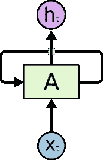
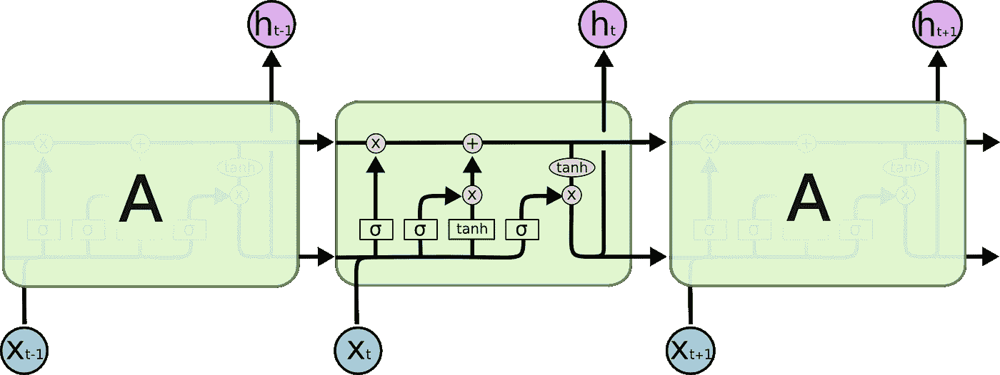
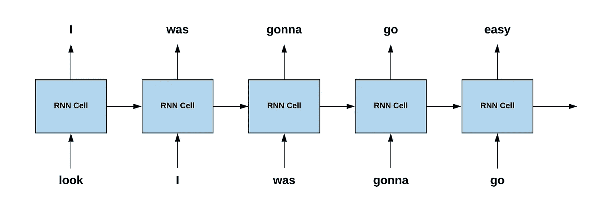

# 使用神经网络生成 Eminem 歌词

> 原文：<https://towardsdatascience.com/generating-eminem-lyrics-using-neural-networks-96e7f9c45e8a?source=collection_archive---------28----------------------->

## 我如何使用递归神经网络实现歌词生成器


[阿姆](https://www.facebook.com/eminem/photos/a.84897990078/10151927547475079/?type=3&theater)途经[脸书](https://www.facebook.com/)

深度学习不仅仅是对猫和狗进行分类或预测泰坦尼克号乘客是否幸存，这不是什么秘密。无论是将文本从一种语言翻译成另一种语言，同时保留语义(像人类一样)，还是比以往任何时候都更准确地识别人脸，深度学习已经取得了无数奇迹。

这篇文章是使用 TensorFlow 实现 Eminem 歌词生成器(更正式地说，是无监督文本生成器)的分步指南。先来偷看一下主要内容:

# 内容:

1.  **递归神经网络简介**
2.  **使用 RNNs 生成文本**
3.  **实施**
4.  **结论**

# 递归神经网络简介



一个典型的 RNN via [Colah 的博客](https://colah.github.io/posts/2015-08-Understanding-LSTMs/)

在本节中，我们将对 RNNs 及其几种风格进行高度概括。

神经网络的基本操作是通过由许多嵌套加权和组成的非常复杂的数学函数将输入(自变量)映射到输出(因变量)。这很好，但对于序列或系列数据，因变量在序列或系列中任何给定点的值(通常称为时间步长)不仅是定义它的自变量的函数，也是该序列中因变量的先前值。这可以用任何特定的文本片段的例子来最好地解释，其中任何给定的单词都取决于它添加到句子以及上下文中之前的单词的含义，这给文本添加了语法意义(是的，正是我们要如何生成文本)。

这种建模是通过递归神经网络实现的。这里，输出与输入的加权和一起，还有一个来自先前输出的额外存储单元。前面提到的图表清楚地描绘了 RNN 的架构。在任何给定的时间步长，输入都经过隐藏层，其输出是通过将先前的隐藏层值与当前输出相结合来计算的。该计算值也被保存以在下一个时间步中被组合，因此是“存储元素”。

rnn 工作正常，但是有一些问题，

*   消失梯度问题
*   长期依赖

对这些问题的解释超出了本文的范围，但简而言之，消失梯度意味着在计算权重校正的梯度时，当我们返回时间步长时，梯度往往会减小，最终“消失”。而长期依赖性是普通(普通)RNNs 不能记住更长序列的限制。这些问题由 RNNs 的“后代”——长短期记忆网络或 LSTMs 解决。这些基本上有一个更复杂的单元，具有一个*门控结构*,确保保存更长的序列，并解决消失梯度问题。LSTM 的一个众所周知的特色是门控循环单元(GRU ),它是 LSTM 的一个增强，用于更快的计算。



LSTM 通过[科拉的博客](https://colah.github.io/posts/2015-08-Understanding-LSTMs/)

[Colah 的博客](https://colah.github.io/posts/2015-08-Understanding-LSTMs/)是迄今为止对 RNNs 最好的解释之一(在我看来)。如果您有兴趣了解 RNNs 背后的数学原理，可以考虑阅读一下。

# 使用 RNNs 的文本生成

在这一节中，我们将讨论如何在我们的文本生成问题中使用 RNNs，并对实际工作原理有一个粗浅的了解。

模型的训练输入是给定歌词中的单词，目标是歌词中的下一个单词。以下是相同的图示描述:



文本生成英尺。说唱上帝

## 所以，这到底是怎么回事？

众所周知，神经网络可以学习输入和输出之间的一般模式。我的意思是，当我训练一个神经网络来预测“look”的“I”和“go”的“easy”+许多不同歌曲的 RNNs 的记忆元素时，神经网络倾向于学习这些歌词中相似的模式。这种模式正是阿姆写作的方式，也就是他写歌的风格，如果你仔细观察的话，这是独一无二的(我们也有自己独特的风格)。现在，经过训练后，如果我们让模型自己预测单词，它将根据他的歌词生成由单词组成的文本，并遵循他的写歌风格(还不如放弃自己的阿姆热门歌曲谁知道呢！).这概括了模型的主要思想。

# 履行

我们终于开始真正的交易了。密码！

我已经手动收集了阿姆的 15 首歌曲到文本文件中，我们认为每首歌曲都是一个单独的训练样本

首先，我们读取文件并清理数据，使其能够被模型处理:

歌词的最小预处理

正如上一节所解释的，我们训练模型来预测歌词中的下一个词，给定前一个词和最近的一些上下文。有两种方法可以实现这一点:

1.  取歌曲的第一个词，获得输出，计算预测的损失，使用该预测来预测下一个词，等等。在这种方法中，如果第一个预测的字不正确，那么丢失将导致大量丢失值的级联，因为输入远远不正确。
2.  取歌曲的第一个词，获得输出，计算预测的损失，在下一个时间步，我们不使用预测的词作为输入，而是使用实际的词作为输入。这确保了没有级联损失，并且每个时间步长的损失是相互独立的。这种方法被称为**‘老师强迫’。**

为了更好更快的收敛，我们将继续进行教师强制。为此，我们将原始歌词作为输入，并将原始歌词的偏移量 1 作为目标。这意味着，如果输入是“看，我要去”，那么目标将是“我要去容易”(偏移 1)。

分离输入和输出

接下来，我们将执行一般的 NLP 步骤，以确保我们对模型的输入是数字。我们将单词标记为整数，然后将序列填充或截断为固定长度，因为模型的所有输入都应该是固定长度的。

标记化和填充

作为一个可行性工具，我们有一个词汇表，可以在令牌和相应的单词之间互换。此外，我们定义了一些常量，可以根据型号和硬件资源的可用性进行调整(我已经考虑了最小值)。

词汇和其他超参数

现在，我们将最终建立模型

训练文本生成器的最简模式

我已经训练了一个极简模型来展示这个概念，它可能会根据要求进行调整。模型调优再次超出了本文的范围。然而，我将描述基本组件。

*   ***稀疏分类交叉熵损失*** 可以与具有一个热编码输出序列的*分类交叉熵*互换使用(在这种情况下，这将是一个巨大的数组，因此计算量大)。

关于 tensorflow 预定义损失的更多信息:[https://www.tensorflow.org/api_docs/python/tf/keras/losses](https://www.tensorflow.org/api_docs/python/tf/keras/losses)。

关于损失函数的更多信息:[https://towardsdatascience . com/common-loss-functions-in-machine-learning-46 af 0 ffc 4d 23](/common-loss-functions-in-machine-learning-46af0ffc4d23)

*   ***亚当*** ***优化器*** 增加收敛速度。

更多关于 tensorflow 优化器:[https://www . tensor flow . org/API _ docs/python/TF/keras/optimizer](https://www.tensorflow.org/api_docs/python/tf/keras/optimizers)。

关于亚当优化器的更多信息:【https://arxiv.org/abs/1412.6980[。](https://arxiv.org/abs/1412.6980)

更多关于优化者的一般信息:【https://ruder.io/optimizing-gradient-descent/ 

以下是模型培训中的一些冗长内容:

```
Epoch 45/50
1/1 [==============================] - 0s 2ms/step - loss: 0.0386
Epoch 46/50
1/1 [==============================] - 0s 1ms/step - loss: 0.0381
Epoch 47/50
1/1 [==============================] - 0s 1ms/step - loss: 0.0375
Epoch 48/50
1/1 [==============================] - 0s 2ms/step - loss: 0.0369
Epoch 49/50
1/1 [==============================] - 0s 6ms/step - loss: 0.0364
Epoch 50/50
1/1 [==============================] - 0s 2ms/step - loss: 0.0359
```

对于极简主义者来说相当不错！现在让我们测试结果。

由于我们已经使用教师强制进行训练，对于未知输出的预测，我们需要使用第一种方法，因为我们不知道“实际”输出，我们所拥有的只是下一个预测的单词。我们称之为“推理步骤”。

推理步骤，“无需”教师强迫

将“slim”作为输入传递给生成器，我得到了以下输出:

```
shady is alright because i am frozen would know sometimes things have tried ideas gonna stand upi am frozen would know sometimes things have tried ideas gonna stand upi am frozen would know sometimes things have tried ideas gonna stand up
```

# 结论

正如我前面提到的，这个模型是用最少的参数和 15 首歌来训练的。一个模型很有可能用如此少量的数据过度拟合，并且它显示；一些短语被重复多次。这可以通过适当的调优和更大的数据语料库来解决。

这篇文章的主要内容是文本生成的概念。该模型是通用的，并且可以在任何类型的语料库(比如一本书)上被训练，以生成期望流派或模式的文本。

[这里的](https://github.com/rojagtap/eminem_lyrics_generator)是指向 github 代码库的链接。随意分叉它，微调模型，训练更多的数据，提出拉请求(如果可以的话)。

# 参考

1.  [https://colah.github.io/posts/2015-08-Understanding-LSTMs/](https://colah.github.io/posts/2015-08-Understanding-LSTMs/)
2.  [https://www.tensorflow.org/api_docs/python/tf/keras](https://www.tensorflow.org/api_docs/python/tf/keras)
3.  [https://ruder.io/optimizing-gradient-descent/](https://ruder.io/optimizing-gradient-descent/)
4.  [https://arxiv.org/abs/1412.6980](https://arxiv.org/abs/1412.6980)