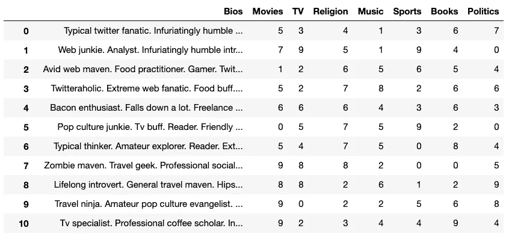

# 我为数据科学制作了 1000 多份假的约会资料

> 原文：<https://towardsdatascience.com/generating-fake-dating-profiles-for-data-science-cd3b929972bc?source=collection_archive---------15----------------------->

## 我如何使用 Python Web Scraping 创建约会档案

由 [Yogas 设计](https://unsplash.com/@yogasdesign?utm_source=medium&utm_medium=referral)在 [Unsplash](https://unsplash.com?utm_source=medium&utm_medium=referral) 上拍摄的照片

D ata 是世界上最新、最珍贵的资源之一。公司收集的大部分数据都是私有的，很少与公众分享。这些数据可能包括一个人的浏览习惯、财务信息或密码。对于 Tinder 或 Hinge 等专注于约会的公司来说，这些数据包含用户的个人信息，他们自愿在约会档案中披露这些信息。因为这个简单的事实，这些信息是保密的，公众无法访问。

但是，如果我们想创建一个使用这些特定数据的项目，该怎么办呢？如果我们想创建一个使用机器学习和人工智能的新约会应用程序，我们需要大量属于这些公司的数据。但是可以理解的是，这些公司将用户数据保密，远离公众。那么我们如何完成这样的任务呢？

嗯，基于交友档案中缺乏用户信息，我们需要为交友档案生成虚假的用户信息。我们需要这些伪造的数据，以便尝试将机器学习用于我们的约会应用。这个应用程序的想法起源可以在以前的文章中读到:

 [## 可以用机器学习来寻找爱情吗？

medium.com](https://medium.com/@marcosan93/applying-machine-learning-to-find-love-3558dafcc4a1) 

前一篇文章讨论了我们潜在的约会应用程序的布局或格式。我们将使用一种叫做 [*K-Means 聚类*](https://www.geeksforgeeks.org/k-means-clustering-introduction/) 的机器学习算法，根据他们对几个类别的回答或选择，对每个约会档案进行聚类。此外，我们会考虑他们在简历中提到的另一个因素，这也是对个人资料进行聚类的一个因素。这种形式背后的理论是，一般来说，人们更容易与拥有相同信仰(*政治、宗教*)和兴趣(*体育、电影等)的人相处。*)。

有了约会应用的想法，我们可以开始收集或伪造我们的假资料数据，以输入我们的机器学习算法。如果以前已经创建了类似的东西，那么至少我们会学到一些关于自然语言处理( *NLP* )和 K-Means 聚类中的无监督学习的知识。

# 伪造假档案

我们需要做的第一件事是找到一种方法来为每个用户配置文件创建一个假的个人资料。没有可行的方法可以在合理的时间内编写成千上万的假 bios。为了构建这些假的 bios，我们将需要依靠第三方网站来为我们生成假的 bios。有很多网站会为我们生成虚假的个人资料。然而，我们不会显示我们选择的网站，因为我们将实施网络抓取技术。

## 使用 BeautifulSoup

我们将使用 [BeautifulSoup](https://pypi.org/project/beautifulsoup4/) 来浏览假的生物发生器网站，以便抓取生成的多个不同的 bios，并将它们存储到熊猫数据帧中。这将使我们能够多次刷新页面，以便为我们的约会档案生成必要数量的假 bios。

我们做的第一件事是导入所有必要的库来运行我们的 web-scraper。我们将解释 BeautifulSoup 正常运行的特殊库包，例如:

*   允许我们访问我们需要抓取的网页。
*   为了在网页刷新之间等待，需要使用`time`。
*   `tqdm`只是为了我们的缘故才需要作为装货港。
*   `bs4`需要使用 BeautifulSoup。

## 抓取网页

代码的下一部分涉及为用户 bios 抓取网页。我们首先创建一个从 0.8 到 1.8 的数字列表。这些数字表示我们在两次请求之间等待刷新页面的秒数。我们创建的下一个东西是一个空列表，用于存储我们将从页面中抓取的所有 bios。

接下来，我们创建一个将刷新页面 1000 次的循环，以生成我们想要的 bios 数量(大约 5000 个不同的 bios)。这个循环被`tqdm`所环绕，以创建一个加载或进度条来显示我们还剩多少时间来完成这个站点的抓取。

在循环中，我们使用`requests`来访问网页并检索其内容。使用`try`语句是因为有时用`requests`刷新网页不会返回任何结果，并且会导致代码失败。在那些情况下，我们将简单地`pass`到下一个循环。try 语句中是我们实际获取 bios 并将它们添加到我们之前实例化的空列表中的地方。在当前页面中收集了 bios 之后，我们使用`time.sleep(random.choice(seq))`来决定要等多久才能开始下一个循环。这样做是为了使我们的刷新基于从我们的数字列表中随机选择的时间间隔而被随机化。

一旦我们从网站上获得了所有需要的 bios，我们将把 bios 列表转换成熊猫数据框架。

# 为其他类别生成数据

为了完成我们的假约会档案，我们需要填写宗教、政治、电影、电视节目等其他类别。下一部分非常简单，因为它不需要我们从网上抓取任何东西。本质上，我们将生成一个随机数列表，应用于每个类别。

我们要做的第一件事是为我们的约会档案建立分类。这些类别然后被存储到一个列表中，然后被转换成另一个熊猫数据帧。接下来，我们将遍历我们创建的每个新列，并使用`numpy`为每行生成一个从 0 到 9 的随机数。行数由我们在之前的数据帧中能够检索到的 bios 数量决定。

包含每个假约会简介的个人资料和类别的数据框架

一旦我们有了每个类别的随机数，我们就可以将生物数据框架和类别数据框架连接在一起，以完成我们的假约会资料的数据。最后，我们可以将最终的数据帧导出为一个`.pkl`文件，以备后用。

# 走向

现在我们已经有了我们的假约会档案的所有数据，我们可以开始探索我们刚刚创建的数据集。使用 NLP ( *自然语言处理*)，我们将能够深入了解每个约会档案的 bios。在对数据进行了一些探索之后，我们实际上可以开始使用 K-Mean 聚类进行建模，以将每个配置文件相互匹配。请关注下一篇文章，它将讨论如何使用 NLP 来探索 bios 以及 K-Means 集群。

 [## 我在约会档案上使用了机器学习 NLP

medium.com](https://medium.com/swlh/using-nlp-machine-learning-on-dating-profiles-1d9328484e85) 

# 资源

 [## Marcos an 93/人工智能媒婆

github.com](https://github.com/marcosan93/AI-Matchmaker)  [## 可以用机器学习来寻找爱情吗？

medium.com](https://medium.com/@marcosan93/applying-machine-learning-to-find-love-3558dafcc4a1)