# 用混合器和动画节点生成分形

> 原文：<https://towardsdatascience.com/generating-fractals-with-blender-and-animation-nodes-3ae79d02bf40?source=collection_archive---------11----------------------->

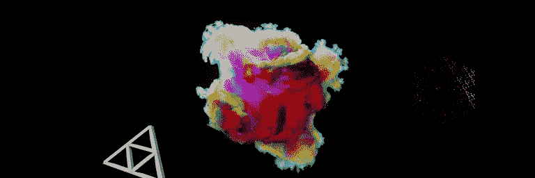

这是一个使用 Blender 生成分形视觉效果的教程、例子和资源的集合。我将涵盖递归、n-flakes、L-系统、Mandelbrot/Julia 集和导子等主题。

**为什么:**如果你对分形图案着迷，对 Blender 中的过程化生成感兴趣，想对动画-节点和着色器节点有更好的理解和动手体验。

**谁:**此处所有内容均基于 Blender 2.8.2 和[动画-节点 v2.1](https://animation-nodes.com/#download) 。我还依赖了一些简短的代码片段(Python ≥ 3.6)。

# 分形

> “美丽复杂，却又如此简单”

分形是具有分形维数的形状。这源于我们在它们扩展时测量它们的方式。理论分形在不同的尺度上是无限自相似的。

对于我们的设置，我们不关心纯理论分形，因为除非在非常特殊的情况下，否则在 Blender 中是无法实现的。我们最关心的是*精细结构*(不同尺度的细节)和自相似的自然外观(由明显更小的自身副本组成)。

了解分形更多信息的其他建议资源:

*   [【YouTube】分形上的 3 blue 1 brown](https://www.youtube.com/watch?v=gB9n2gHsHN4)
*   [【本书】benot b . Mandelbrot 著《自然的分形几何》](https://www.goodreads.com/book/show/558059.The_Fractal_Geometry_of_Nature)
*   [【书】分形:肯尼斯·法尔科内的简短介绍](https://www.goodreads.com/book/show/17803172-fractals)
*   przemyslaw Prusinkiewicz 的《植物的算法之美》

# n-薄片

[n-flake(或 polyflake)](https://en.wikipedia.org/wiki/N-flake) 是一种分形，通过用自身的多个缩放副本替换初始形状来构建，通常放置在对应于顶点和中心的位置。然后对每个新形状递归重复该过程。

## 递归

这是我们探索分形的一个很好的起点，因为它允许我们通过一个简单的动画节点设置来涵盖**递归**和其他重要概念。

这就引出了我们的主要问题:动画节点(目前)不支持纯递归。我们需要一些变通办法。一种选择是始终依赖纯 Python 脚本，正如我在[上一篇文章](/blender-2-8-grease-pencil-scripting-and-generative-art-cbbfd3967590)中解释的那样，但我希望这篇文章的重点更多地放在动画节点上，所以我们可以做的是通过迭代和循环队列来近似递归。

这个想法是依靠[循环输入](https://animation-nodes-manual.readthedocs.io/en/latest/user_guide/subprograms/loop.html) *重新分配*选项来保存一个结果队列，我们可以在下一次迭代中处理这些结果。

让我们考虑正多边形的 n 片情况。给定若干线段`n`(多边形的边数)、半径`r`和中心`c`，我们计算以`c`为中心、半径`r`的`n`-多边形的点。对于每个新计算的点`p`,我们重复这个过程(即，找到以`p`为中心的多边形),但是通过一些预定义的因子调整半径`r`。

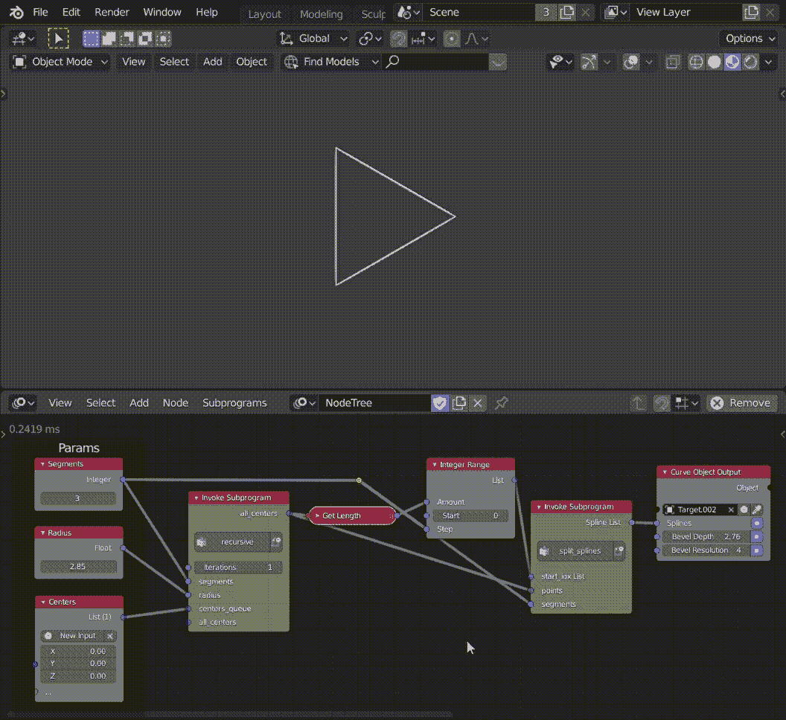

n 多边形动画-实际的节点设置

所有主要的逻辑都在下面的循环中，它负责计算多边形点和新的半径，并重新分配它，以便下一次迭代可以处理它们。理解这一部分是很重要的:在第一次迭代中，循环处理给予`Invoke Subprogram`节点的任何东西，而对于所有后续的迭代，循环将处理它在前一次迭代中更新的值。每次这些都被清理，这就是为什么我们维护两个队列(`centers_queue` 和`all_centers`)，前者是我们还没有处理的中心，后者是到目前为止计算的所有中心的集合，它将被用作输出来创建我们的样条列表。

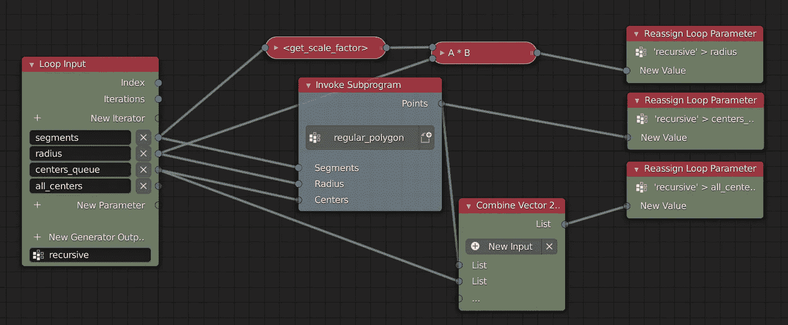

带有缩放和重新分配逻辑的主循环

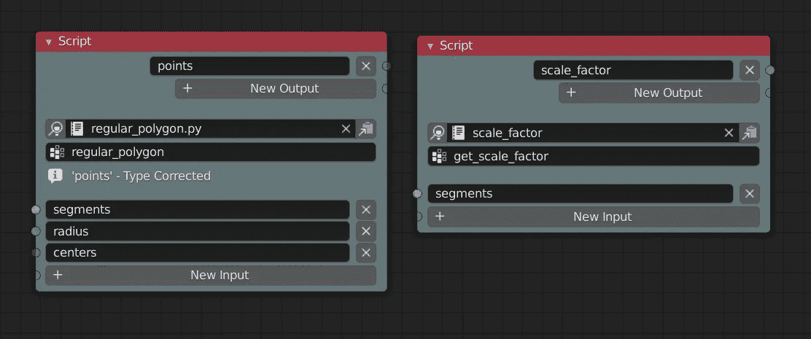

这两个子程序都是 Python 脚本。这些例子让我觉得编码更简洁，不需要翻译成纯粹的节点。

计算正多边形的点:

```
points = []
# compute regular polygon points for each given center
for center in centers:
    angle = 2*pi/segments  # angle in radians
    for i in range(segments):
        x = center[0] + radius*cos(angle*i)
        y = center[1] + radius*sin(angle*i)
        z = center[2]  # constant z values
        points.append((x, y, z))
    #points.append(points[-segments])  #  close the loop
```

获取比例因子:

```
from math import cos, pi# compute scale factor for any n-flake
# [https://en.wikipedia.org/wiki/N-flake](https://en.wikipedia.org/wiki/N-flake)
cumulative = 0
for i in range(0, segments//4):
    cumulative += cos(2*pi*(i+1) / segments)
scale_factor = 1 / (2*(1 + cumulative))
```

额外的循环设置是分割点，以便将每个多边形转化为单独的样条线。

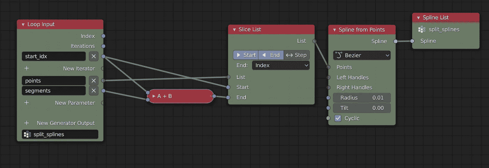

## 转向 3D 规则多面体

我们可以很容易地调整这种设置来处理常规的固体。这一次，我们不是自己计算形状顶点，而是依赖于场景中已经存在的对象，获取它的顶点并递归地变换它们。我们利用矩阵属性和`Compose Matrix`节点来最小化所需的工作量或节点。这是设置

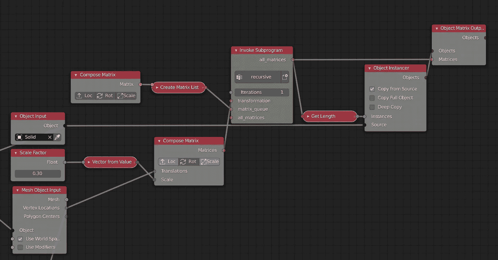

Out `matrix_queue`用恒等式变换矩阵(无平移、无旋转和单位比例)初始化，而我们的`transformation`列表是我们的目标/输入对象顶点位置，由任意比例因子组成，当用于变换另一个矩阵时，这相当于说“在那里移动一切，并按给定因子缩放”。
这里是执行转换循环和重新分配操作的改编递归部分。

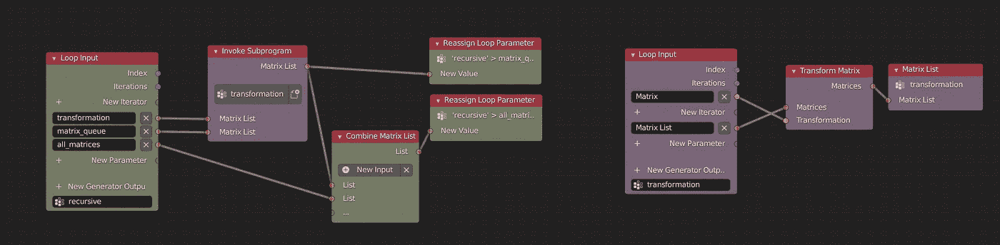

柏拉图立体的示例结果(介于四次和五次迭代之间)。

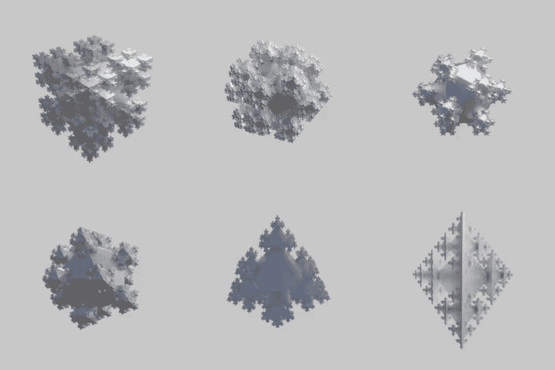

我讨厌二十面体

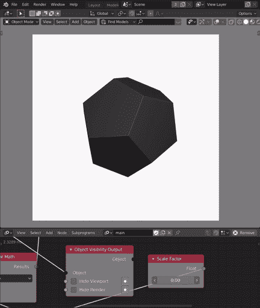

然后，可以更新原始平移矩阵，使得新实体不精确地放置在前身顶点上，而是放置在穿过前身中心和新顶点的线的任何点上，如侧面动画中所示。

虽然之前的转换矩阵仅仅是顶点的位置，但是我们现在做了一些矢量数学来将这些点从原始位置转移。如果我们从它们中减去物体中心，我们就得到感兴趣的方向向量。然后，我们可以将它除以任意值，以相应地放置新的递归实体。

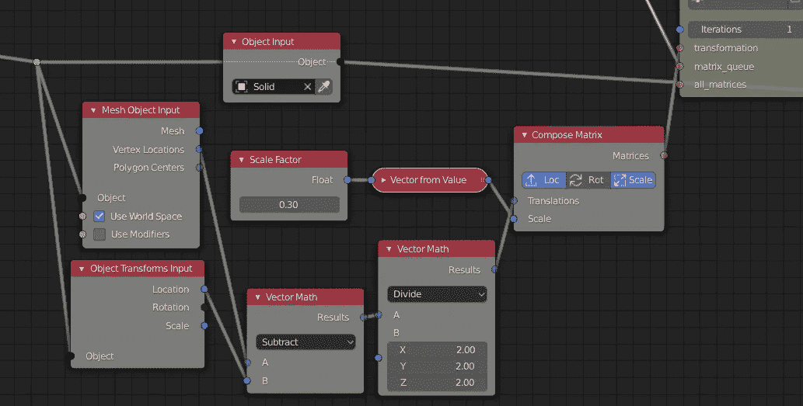

如果我们只实例化最后一次迭代的对象，我们会得到正确的**柏拉图立体分形。众所周知的例子是 Sierpinski 四面体和 Menger 海绵。**

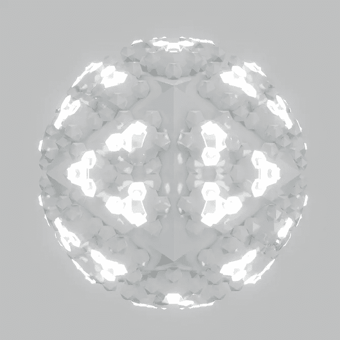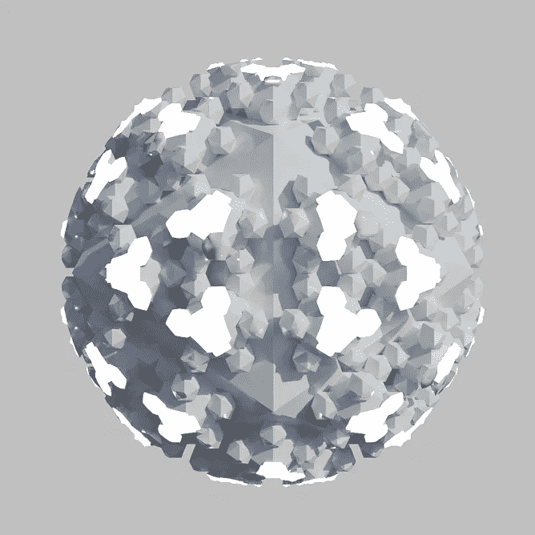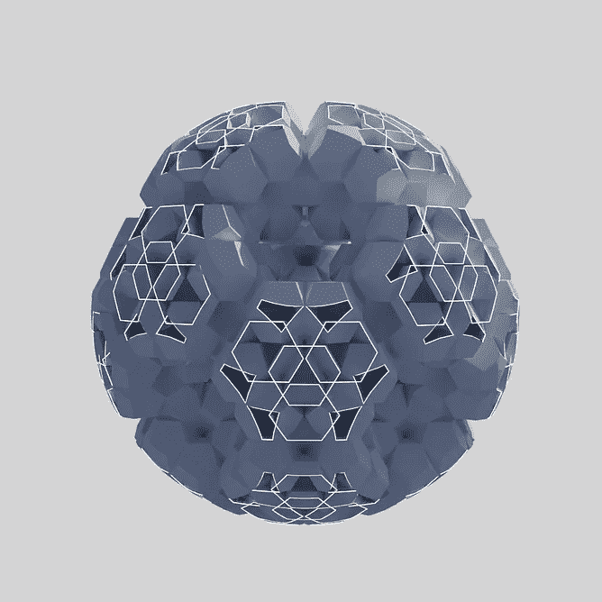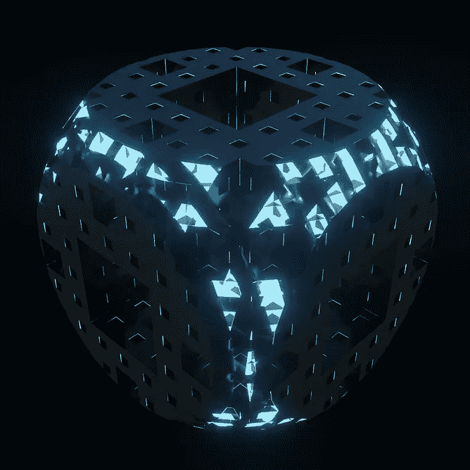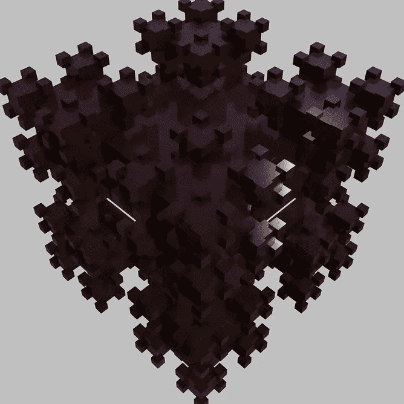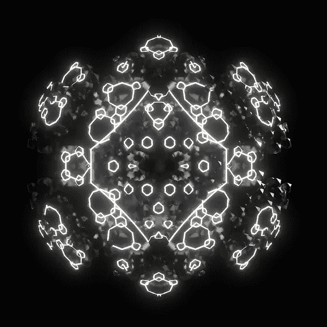

Eevee 中渲染的示例，增加了布尔运算符以增加趣味性

## 要尝试的事情

*   在递归步骤中任意/随机更改 polyflake 类型
*   使用置换贴图来模拟额外的递归步骤，而无需创建更精细的额外几何体
*   体积和纯着色器节点设置

# l 系统

[一个 L-系统(或林登迈耶系统)](https://en.wikipedia.org/wiki/L-system)是一个文法；指定如何通过一组规则、字母表和初始公理生成文本字符串的东西。它伴随着将这种字符串转换成几何图形的转换机制。

我们对 L 系统感兴趣，因为它们可以用来生成自相似分形，也因为我们可以通过`LSystem`节点免费获得它们。这里是一个将结果实例化为 object 的示例设置。

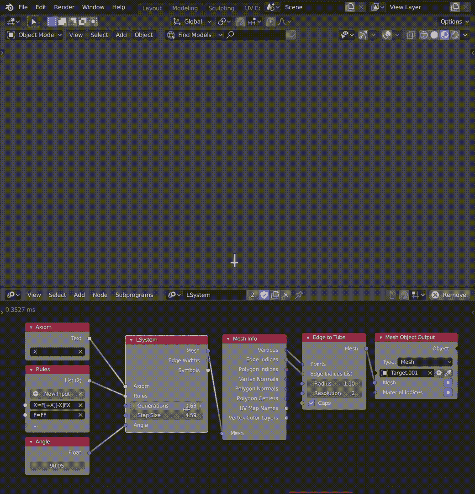

边上的是由公理`X`(初始状态)和两条规则`X=F[+X][-X]FX`和`F=FF`定义的分形图形。节点负责使系统进化到指定的代数，这可以是很好的分数，允许平滑过渡。它还将文本结果转换为网格。由于这个原因，你必须遵循公理和字母用法的特定惯例。

另一个需要考虑的重要参数是高级节点设置中的`Symbol Limit`，它指定了生成的字符串的最大长度。如果超过这个限制，系统将抛出一个错误。

## 例子

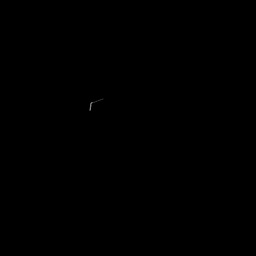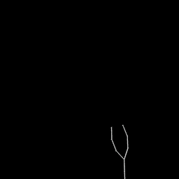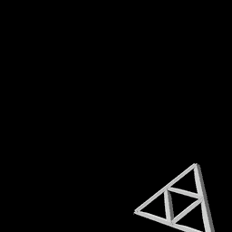

龙曲线，分形植物，sierpinski 三角形

```
dragon curve - axiom: FX, rules: (X=X+YF, Y=-FX-Y), angle: 90fractal plant - axiom: F, rules: (F=FF-[-F+F+F]+[+F-F-F]), angle: 22.5sierpinski triangle - axiom: F-F1-F1, rules: (X=X+YF, Y=-FX-Y), angle: 120
```

## 要尝试的事情

*   3D L 系统(例如方位角+倾斜度)和随机 L 系统。([见 Python 代码](https://github.com/5agado/data-science-learning/tree/master/graphics/l_systems))
*   步长规则，与增长成比例，这样视图可以在增加代数时保持不变

# 曼德尔布罗特

作为分形之父，最常见和最频繁展示的分形以他的名字命名也就不足为奇了。Mandelbrot 集合与 Julia 集合一起为一种现象提供了理论基础，这种现象也是由简单的规则定义的，但能够产生一幅美丽和复杂的无限画面。

我们可以把这些集合看作是“用坐标形式表示的函数的迭代”，其中我们处理的是复数的平面。Jeremy Behreandt 的这篇文章提供了关于复数、Mandelbrot 集合和更多内容的令人印象深刻的详细介绍，所有这些都包含在 Blender 的 Python API 和开放着色语言(OSL)中。

我们完全可以在 Blender 节点中实现类似的结果(没有脚本)，但是像往常一样，我们受到设置中缺少的迭代/递归功能的限制。基本思想是围绕复数平面移动，如公式所示

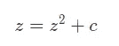

根据每个点收敛到无穷大的速度给每个点着色。这里`z`是我们的起点，`c`可以是任意选择的复数。该公式可以用纯笛卡尔平面坐标形式改写为

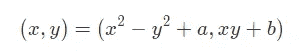

这里我们现在用`(x,y)`作为我们的点，用`a`和`b`作为我们的控制值(之前`c`的实部和虚部)。
这里是着色器节点设置中公式的翻译

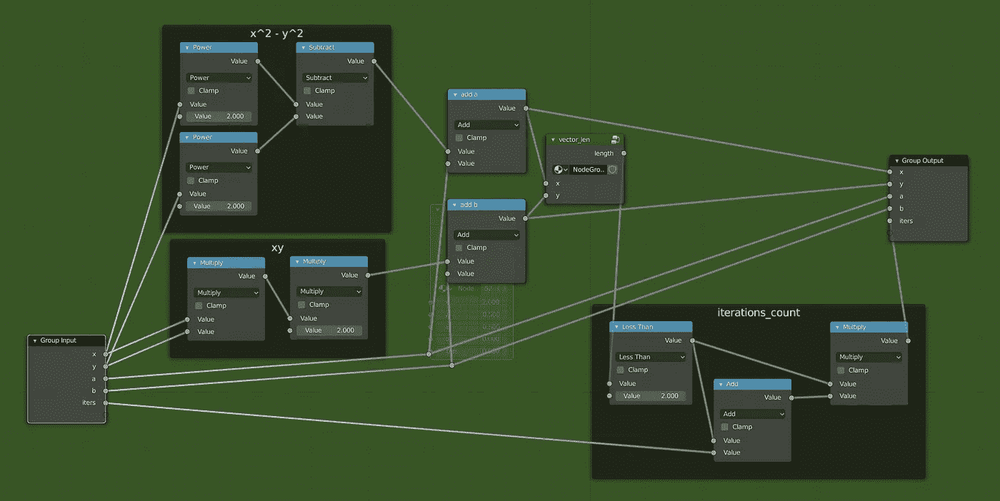

坐标形式函数的节点设置

*iterations_count* 部分用于跟踪有效的迭代，那些点没有分叉的迭代。出于实用目的，这可以通过检查向量幅度是否小于 2 来近似计算。

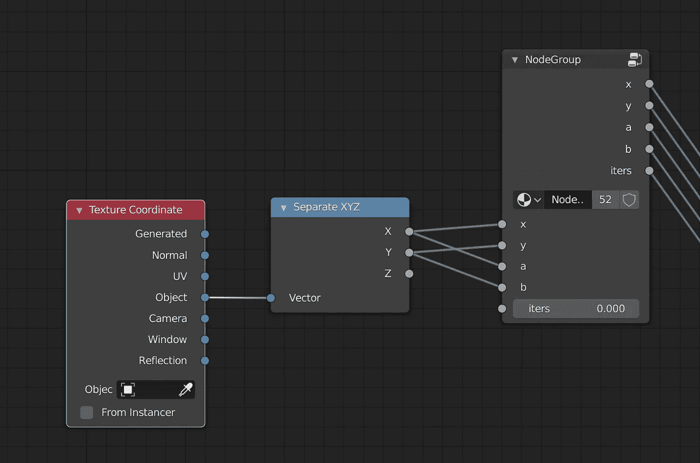

Mandelbrot 集合的设置

然后我们可以插入我们的纹理坐标，通过分离`x`和`y`如图所示。为`a`和`b`重用它们给了我们 Mandebrot 集合，或者我们可以传递自定义值来探索其他集合和结果。现在是丑陋的部分:我们必须通过非常不优雅的复制粘贴混乱来近似函数迭代，对我来说最终看起来像这样。100 次迭代是提供良好结果的合理估计，你添加的越多，你得到的细节就越多，但是设置会很快变得很慢。

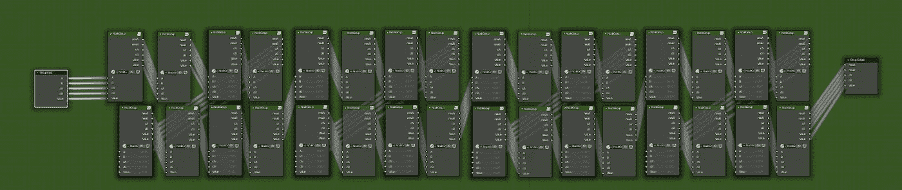

是..

但至少我们现在有东西可以玩了

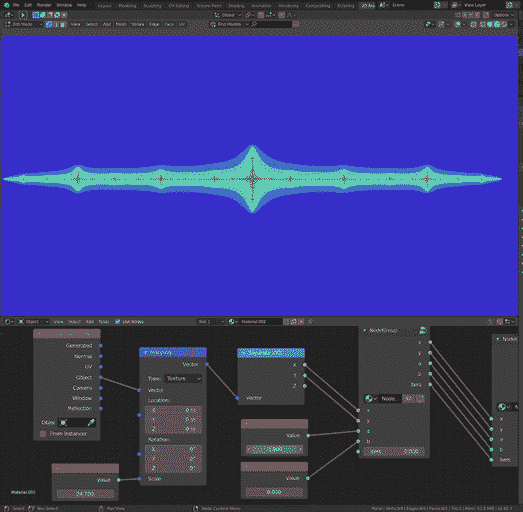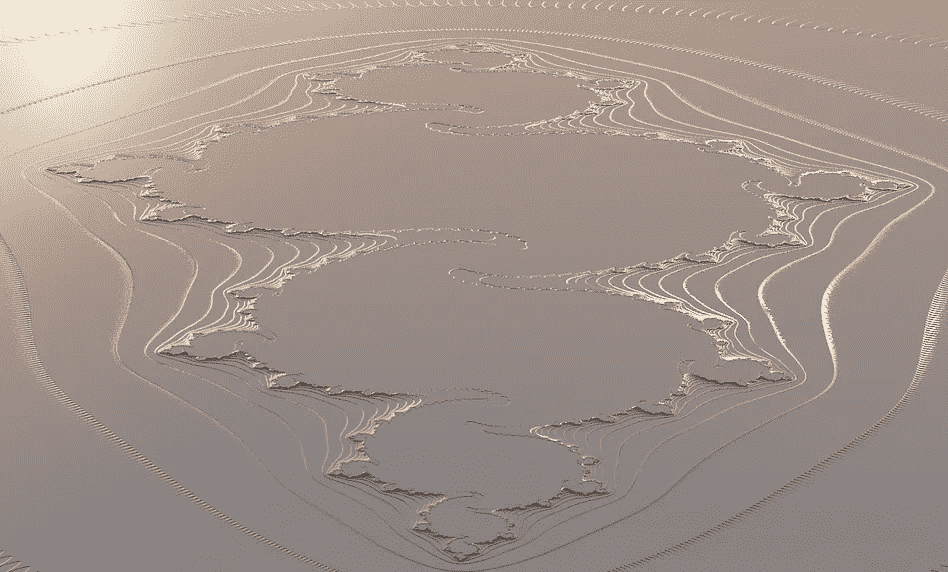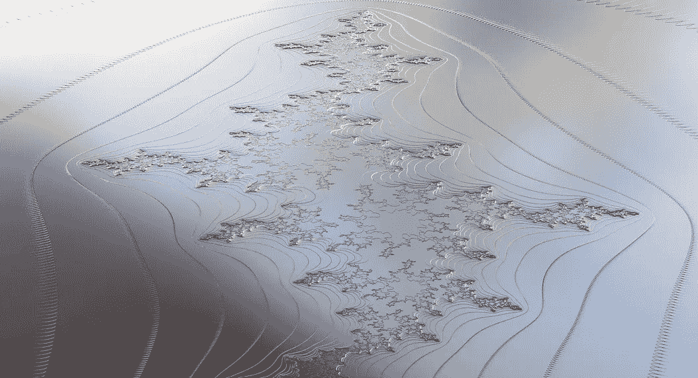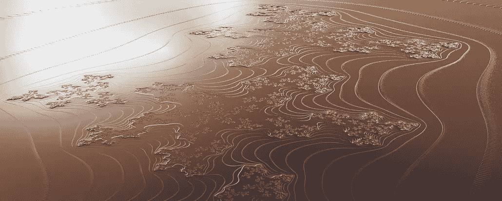

## 曼德尔布尔

[Mandelbulb](https://en.wikipedia.org/wiki/Mandelbulb) 是 Mandelbrot 集合的 3D 投影。另外[已经有一个很棒的教程](https://www.youtube.com/watch?v=WSQFt1Nruns)由 [Jonas Dichelle](https://twitter.com/JonasDichelle) 编写，解释了如何在 Blender nodes 和 Eevee 中模拟 Mandelbulb。鉴于这种方法依赖于体积学，也值得参考一下 Gleb Alexandrov 在 Blender 会议上关于 3D 星云的演讲。

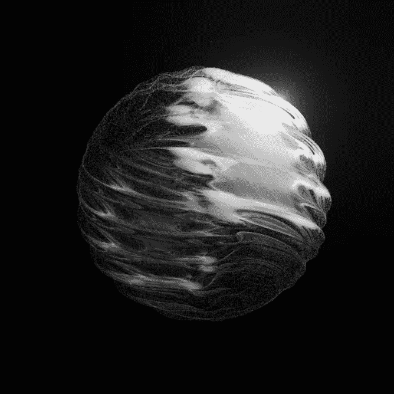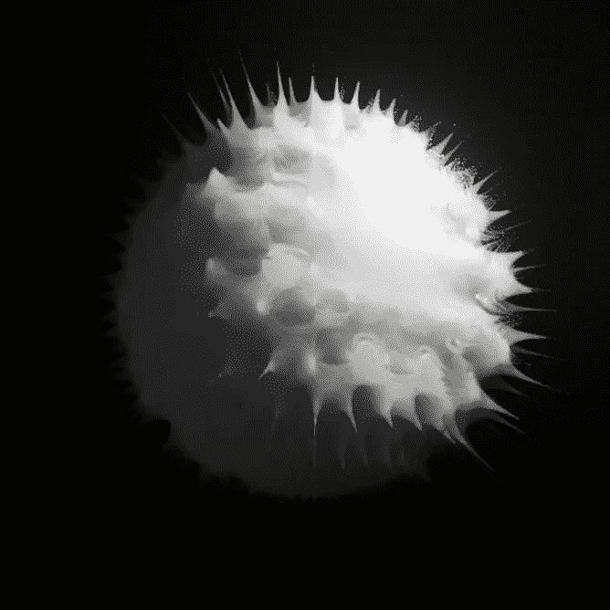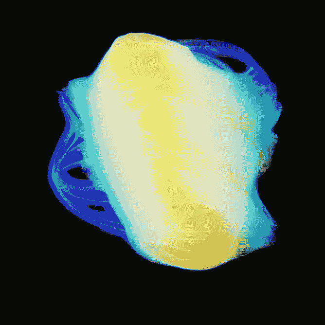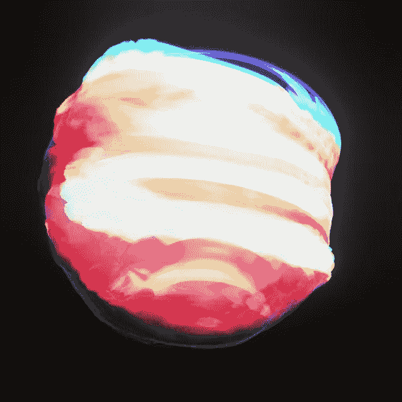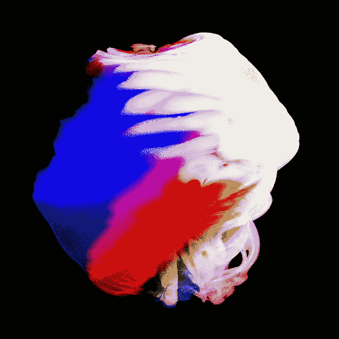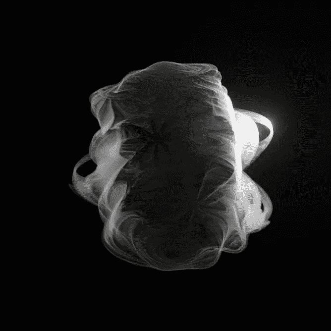

玩弄公式和颜色

# 结论

我总是被那些从简单规则中展现出复杂性的现象所吸引，而将它们可视化的能力让这一切变得更加有趣。Blender 只是让它变得如此简单，而 animation-nodes 只是已经存在的一组令人惊叹的工具/实用程序的又一个补充，特别是从过程的角度来看。

我承认*远离纯粹的编码对我来说有点可怕*，就像一种发自内心的感觉，我没有做正确的事情，但是从迭代和实验的角度来看，毫无疑问我可以通过使用节点来实现效率。我仍然相信一些部分更适合作为单独的脚本，并且人们应该总是首先用代码构建/理解基础，因为它为复杂性分解和组织以及解决问题的一般化提供了更好的框架。

我计划探索更多类似的主题，完善理论理解和实践能力，以令人信服的方式再现它们。

具体来说，这些是当前最热门的条目:

*   超越三维
*   元胞自动机
*   形态发生
*   反应扩散
*   奇怪的吸引子
*   棋盘形布置
*   本轮

我欢迎任何建议、批评和反馈。

> 你可以在 [Instagram](https://www.instagram.com/amartinelli1/) 上看到更多我“润色”的图形结果，在 [Twitter](https://twitter.com/5agado) 上阅读更多技术/故障解释，在 [Github](https://github.com/5agado/data-science-learning) 上试用我的代码。