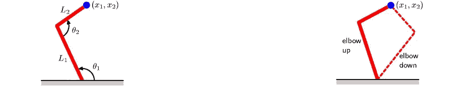
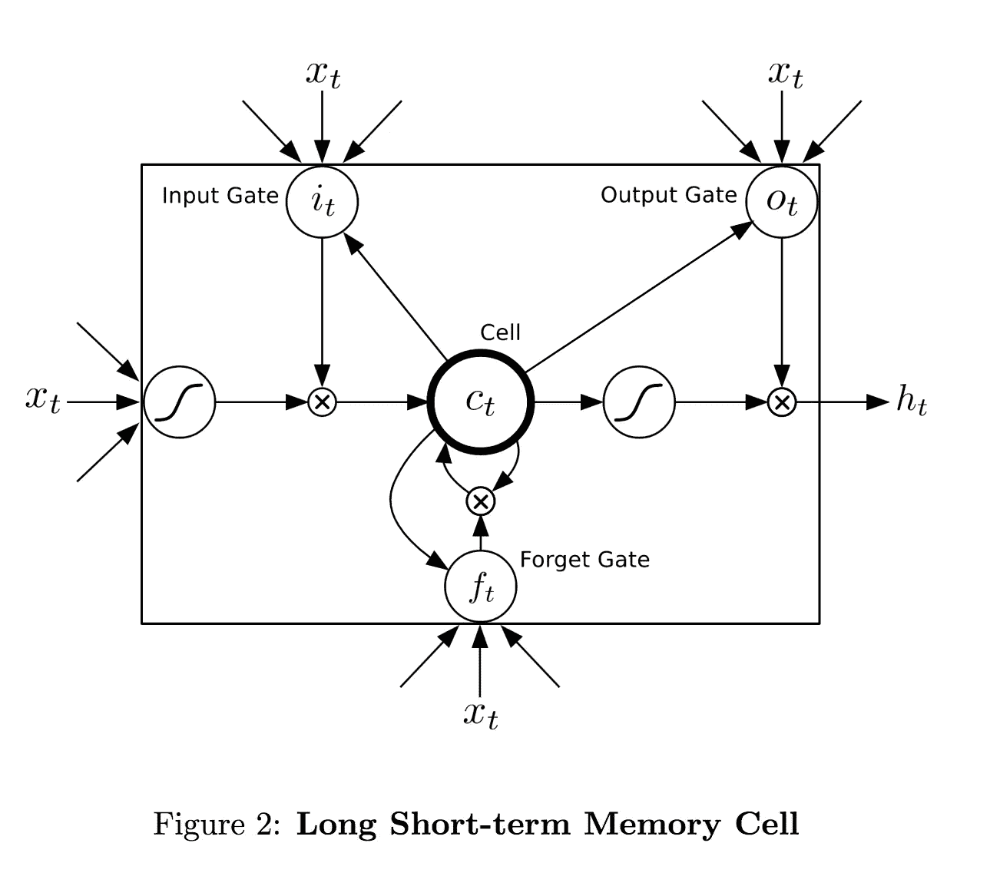
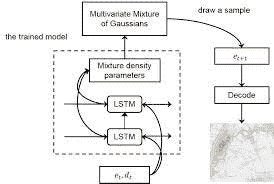
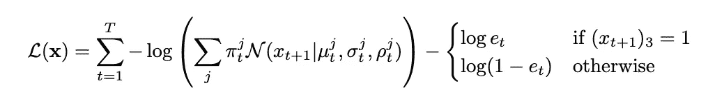
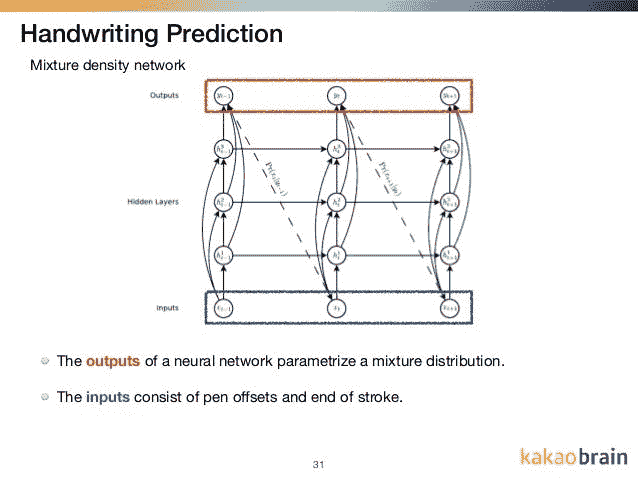
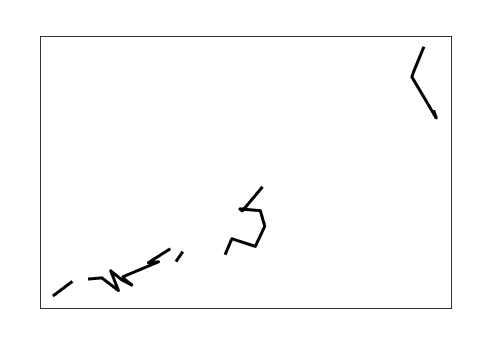

# 使用 LSTMs 和混合密度网络生成手写序列

> 原文：<https://towardsdatascience.com/generating-handwritten-sequences-using-lstms-and-mixed-density-networks-c3a2b4a65539?source=collection_archive---------16----------------------->


由于每个人都在年初提出了一个解决方案，所以我会尽量少在博客上发帖😀。已经过去一个多月了，我想在这里分享一些话😀。在这篇博客中，我们将讨论一篇由 Alex Graves(DeepMind)提出的关于用递归神经网络生成序列[的有趣论文。我还将使用 Tensorflow 和 Keras 来实现这篇论文。](https://arxiv.org/abs/1308.0850)

## 问题定义

这里的数据集是手写笔画的数学表示形式。所以笔画序列中的一个点是一个长度=3 的向量。第一个值是一个二进制数字，表示笔是否在该点上升起。第二个值是 x 坐标相对于序列中前一个 x 值的偏移量，同样，第三个值是 y 坐标的偏移量。问题是，给定数据集，我们需要一个可以无条件生成手写笔画的模型(通过给定一个种子值随机生成，就像 GANs 一样)。

## 混合密度网络

在进入实现部分之前，我想讨论一种特殊的网络，称为 MDNs 或混合密度网络。监督问题的目标是对要素和标注的生成器或联合概率分布进行建模。但是在大多数情况下，这些分布被认为是时不变的，例如在图像或文本分类的情况下。但是，当概率分布本身不稳定时，比如手写笔画或汽车的路径坐标，正常的神经网络在这种情况下表现很差。混合密度网络假设数据集是各种分布的混合物，并倾向于学习这些分布的统计参数，从而获得更好的性能。**迷茫？**


来源:https://media1.giphy.com/media/3o7btPCcdNniyf0ArS/giphy.gif

好吧，好吧，我们会进入更多的细节。

让我们举一个下图所示的例子:



来源:[https://cedar . buffalo . edu/~ Sri Hari/CSE 574/chap 5/chap 5.6-mixdensitynetworks . pdf](https://cedar.buffalo.edu/~srihari/CSE574/Chap5/Chap5.6-MixDensityNetworks.pdf)

在第一张图中，给定θ1 和θ2，当被问及预测机械臂的位置时，我们有一个独特的解决方案。现在看第二个图，问题反过来了。给定 x1 和 x2，当被问及预测θ参数时，我们得到两个解。在大多数情况下，我们会遇到像第一张图这样的问题，其中数据分布可以被假设为来自单个高斯分布。而对于像第二幅图这样的情况，如果我们使用传统的神经网络，它的性能不会下降。我很快会告诉你为什么。

这并不是说具有均方损失或交叉熵损失的神经网络不考虑(混合分布)的事情。它考虑了这一点，但给出了一个结果分布，它是所有这些混合物的平均值，这篇[论文](https://publications.aston.ac.uk/id/eprint/373/1/NCRG_94_004.pdf)建议我们不需要平均值，而是最可能的混合物成分来模拟统计参数。因此 **MDN** 进入了画面。

它看起来怎么样？

因此，MDN 只不过是一个预测统计参数的神经网络，而不是预测回归问题的类或值的概率。让我们假设数据是 **M** 正态分布的混合物，因此最终预测将是混合物的 **M** 概率权重、 **M** 平均值和 **M** 方差。取样时，我们取最可能的混合物成分的参数。我们将在后面详细讨论其结构和实现。

## 长短期记忆网络



来源:[https://i.stack.imgur.com/SjiQE.png](https://i.stack.imgur.com/SjiQE.png)

虽然这不是什么新鲜事，但我可能会遇到一些新人。因此，我将在这里给出一个关于 LSTMs 的基本概念。因此，LSTMs 只不过是一种特殊的神经网络，具有三个门，分别是输入门、遗忘门和输出门。LSTM 细胞中最重要的东西是它的记忆——如上图所示。

**遗忘门:**一个 LSTM 细胞会输出隐藏状态和本细胞的记忆，反馈给它旁边的细胞。一个遗忘门决定了从前一个存储器传入当前单元的信息量。它基本上采用以前的输出和当前的输入，并输出一个遗忘概率。

**输入门:**它接受与遗忘门相同的输入，并输出一个概率，该概率决定了有助于记忆的单元状态的信息量。

**输出门:**它再次接受与上述相同的输入，并给出一个概率，该概率预测决定要传递给下一个单元的信息量的概率。

LSTMs 非常擅长处理顺序输入，如前面讨论的文本、时间序列数据集或笔画数据集，并为样本数据序列提供健壮的特征向量。Alex Graves 因此建议将它们用于手写笔画，以找到笔画序列的特征向量，然后将该特征向量馈送到 MDN 网络，以找到统计参数，如下图所示:



我希望我们现在可以进入实施阶段了。我将使用 Keras 来创建网络，并在其后端使用 Tensorflow 来定义损失函数。

假设 x 和 y 点偏移遵循二元正态分布的混合，笔抬起遵循伯努利分布(很明显，对吗？).我将使用两个二元正态分布的混合来演示解决方案，伯努利分布可以用一个概率值来表示，对吗？

哦！我忘了告诉你损失函数。它由下面给出的等式定义:



其中，π是混合物成分的概率，e 是确定伯努利分布参数的冲程终点的概率。

现在让我们完成我们被雇来的任务😮….🤫….😃代码代码代码:

输入将是 3 个长度向量的序列，每个点的输出是笔画序列中的下一个点，如下图所示:



来源:[https://image . slidesharecdn . com/rnne Rica-180423124525/95/rnn-and-its-applications-31-638 . jpg？cb=1524487703](https://image.slidesharecdn.com/rnnerica-180423124525/95/rnn-and-its-applications-31-638.jpg?cb=1524487703)

## 车型(LSTM + MDN)

```
import numpy **as** np
import numpy
import tensorflow **as** tf
import tensorflow.keras **as** keras
import tensorflow.keras.backend **as** K
import keras.layers.Input **as** Input
import keras.layers.LSTM **as** LSTM
from tensorflow.keras.models import Model

*# nout = 1 eos + 2 mixture weights + 2*2 means \
# + 2*2 variances + 2 correlations for bivariates* 
**def** **build_model**(ninp**=**3, nmix**=**2):
    inp **=** Input(shape**=**(None, ninp), dtype**=**'float32')
    l,h,c **=** LSTM(400, return_sequences**=**True, \
    return_state**=**True)(inp)
    l1 ,_,_**=** LSTM(400, return_sequences**=**True, \
    return_state**=**True)(l, initial_state**=**[h,c])

    output **=** keras**.**layers**.**Dense(nmix*****6 **+** 1)(l1)
    model **=** Model(inp,output)

    **return** model
```

## 损失函数

```
**def** **seqloss**():
    **def** **pdf**(x1, x2, mu1, mu2, s1, s2,rho):
        norm1 **=** tf**.**subtract(x1, mu1)
        norm2 **=** tf**.**subtract(x2, mu2)
        s1s2 **=** tf**.**multiply(s1, s2)
        z **=** tf**.**square(tf**.**div(norm1, s1)) **+** \
            tf**.**square(tf**.**div(norm2, s2)) **-** \
            2 ***** tf**.**div(tf**.**multiply(rho, tf**.**multiply(norm1, norm2)), s1s2)
        negRho **=** 1 **-** tf**.**square(rho)
        result **=** tf**.**exp(tf**.**div(**-**z, 2 ***** negRho))
        denom **=** 2 ***** np**.**pi ***** tf**.**multiply(s1s2, tf**.**sqrt(negRho))
        result **=** tf**.**div(result, denom)
        **return** result

    **def** **loss**(y_true, pred):

        prob **=** K**.**sigmoid(pred[0][:,0]); pi **=** K**.**softmax(pred[0][:,1:3])

        x **=** y_true[0][:,1]; y **=** y_true[0][:,2]; penlifts **=** y_true[0][:,0]

        m11 **=** K**.**sigmoid(pred[0][:,3]); m12 **=** K**.**sigmoid(pred[0][:,4])
        s11**=** K**.**exp(pred[0][:,5]); s12 **=** K**.**exp(pred[0][:,6])
        rho1 **=** K**.**tanh(pred[0][:,7])
        pdf1 **=** tf**.**maximum(tf**.**multiply(pdf(x, y, m11, m12, s11, s12, rho1),pi[:,0]), K**.**epsilon())

        **for** i **in** range(1,2):
            m11 **=** K**.**sigmoid(pred[0][:,3**+**5*****i]); m12 **=** K**.**sigmoid(pred[0][:,4**+**5*****i])
            s11 **=** K**.**exp(pred[0][:,5**+**5*****i]); s12 **=** K**.**exp(pred[0][:,6**+**5*****i])
            rho1 **=** K**.**tanh(pred[0][:,7**+**5*****i])
            pdf1 **+=** tf**.**maximum(tf**.**multiply(pdf(x, y, m11, m12, s11, s12, rho1),pi[:,i]), K**.**epsilon())

        loss1 **=** tf**.**math**.**reduce_sum(**-**tf**.**log(pdf1))
        pos **=** tf**.**multiply(prob, penlifts)
        neg **=** tf**.**multiply(1**-**prob, 1**-**penlifts)
        loss2 **=** tf**.**math**.**reduce_mean(**-**tf**.**log(pos**+**neg))
        final_loss **=** loss1**+**loss2

        **return** final_loss

    **return** loss
```

我在一个小的笔画数据集上随机训练了 2 个时期的模型，因为笔画的长度是变化的。我得到的结果如下所示:



我认为，如果你增加混合、数据集和时期的数量，你会得到更好的结果。我希望我的博客是一个愉快的阅读，如果你有任何疑问或建议，请联系我。

# 参考

1.  【https://arxiv.org/abs/1308.0850 
2.  [https://cedar . buffalo . edu/~ Sri Hari/CSE 574/chap 5/chap 5.6-mixdensitynetworks . pdf](https://cedar.buffalo.edu/~srihari/CSE574/Chap5/Chap5.6-MixDensityNetworks.pdf)
3.  [https://github.com/Grzego/handwriting-generation](https://github.com/Grzego/handwriting-generation)