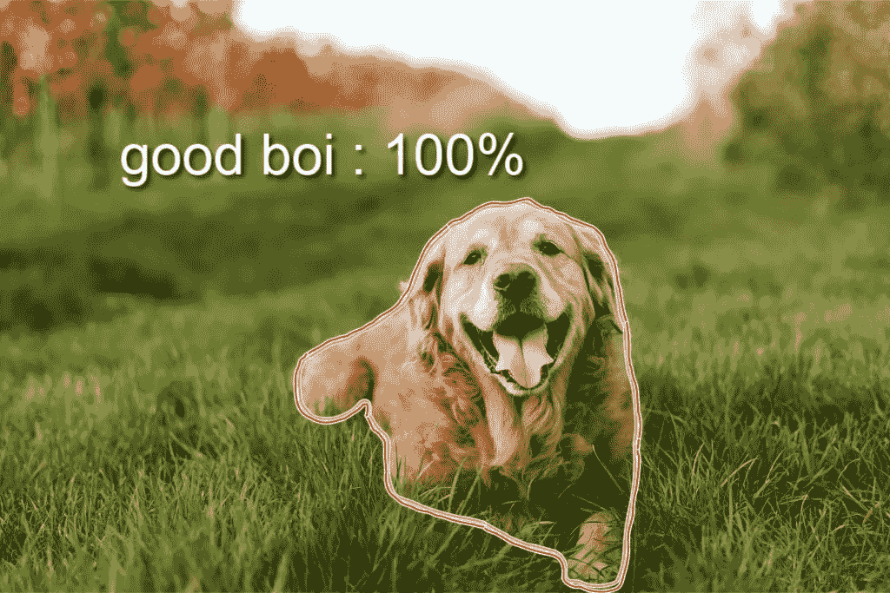
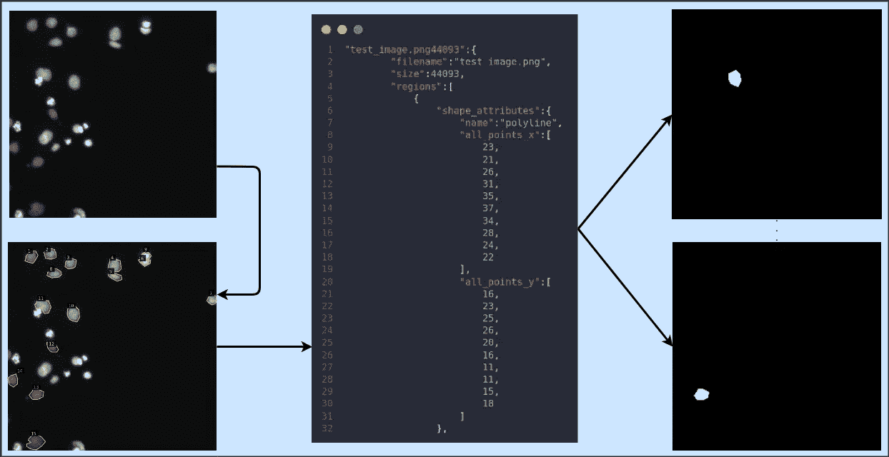
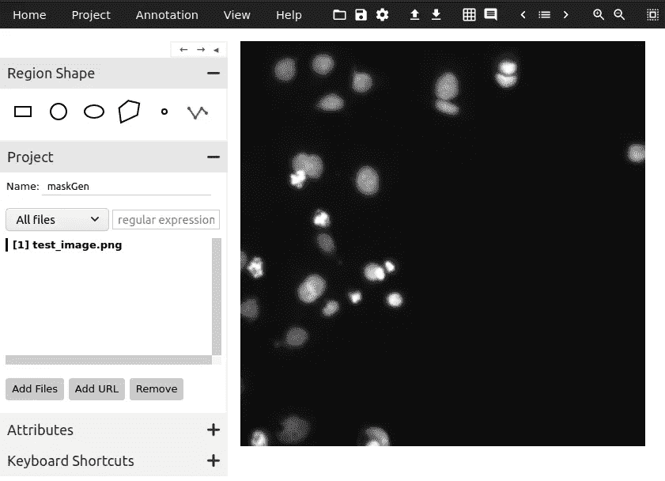
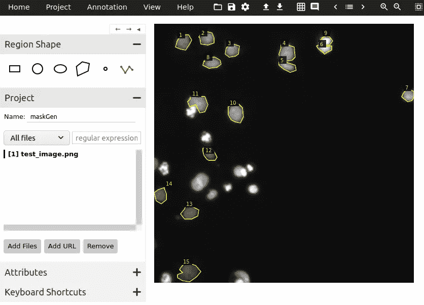
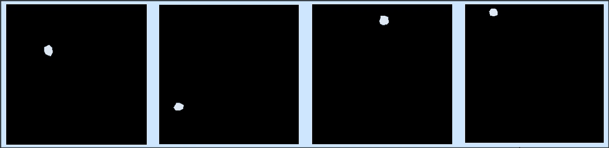

# 生成图像分割蒙版——简单的方法

> 原文：<https://towardsdatascience.com/generating-image-segmentation-masks-the-easy-way-dd4d3656dbd1?source=collection_archive---------1----------------------->

## …不到 5 分钟



米歇尔·胡贝尔在 [Unsplash](https://unsplash.com?utm_source=medium&utm_medium=referral) 上拍摄的图片。作者编辑

如果你正在读这篇文章，那么你可能知道你在寻找什么🤷。所以我就开门见山了，假设你熟悉图像分割是什么意思，语义分割和实例分割的区别，以及 U-Net、Mask R-CNN 等不同的分割模型。如果没有，我**强烈**推荐阅读[这篇](https://www.analyticsvidhya.com/blog/2019/07/computer-vision-implementing-mask-r-cnn-image-segmentation/)关于分析的优秀文章 Vidhya，全面介绍这个主题，最后用一个例子完成使用 Mask R-CNN。

大多数在线图像分割教程使用预处理和标记的数据集，并生成地面真实图像和掩膜。在实际项目中，当您想要处理类似的任务时，几乎不会出现这种情况。我也面临过同样的问题，在一个实例分割项目中，我花了无数个小时试图找到一个足够简单和完整的例子。我不能，因此决定写自己的:)

下面是我们将在本文中做的事情的一个简单的可视化:)



作者图片

# VGG 图像注释器(VIA)

VIA 是一个非常轻量级的注释器，支持图像和视频。可以通过[项目首页](http://www.robots.ox.ac.uk/~vgg/software/via/)了解更多。使用 VIA 时，您有两种选择:V2 或 V3。我会试着解释下面的区别:

1.  V2 要老得多，但足以完成基本任务，而且界面简单
2.  与 V2 不同，V3 支持视频和音频注释器
3.  如果您的目标是使用 JSON 和 CSV 等多种导出选项进行图像分割，那么 V2 是更好的选择
4.  V2 项目与 V3 项目不兼容

在这篇文章中，我将使用 V2。你可以在这里下载需要的文件[。或者，如果您想通过在线试用，您可以在这里](http://www.robots.ox.ac.uk/~vgg/software/via/downloads/via-2.0.10.zip)进行[。](https://www.robots.ox.ac.uk/~vgg/software/via/via_demo.html)

# 操作方法

我将使用 ka ggle[nucleus 数据集](https://www.kaggle.com/paultimothymooney/identification-and-segmentation-of-nuclei-in-cells/)并注释其中一幅测试图像，以生成分割蒙版。充分披露，我是**而不是**认证的医学专家，我做的注释只是为了这篇文章。您也可以快速调整该过程以适应其他类型的对象。

根文件夹树如下所示。`via.html`是我们将用来注释图像的文件。它位于上面提供的 VIA V2 ZIP 下载链接中。将所有要添加注释的图片放在`images`文件夹中。`maskGen.py`是一个将注释转换成遮罩的脚本。

```
├── images
│   └── test_image.png
├── maskGen.py
└── via.html
```



图一。作者图片

1.**打开** `via.html`:会在你默认的浏览器中打开。在**区域形状**下，选择折线工具(最后一个选项)并给你的项目命名。然后点击**添加文件**并选择您想要添加注释的所有图像。此时，您的屏幕应该如图 1 所示。

2.**开始标注**:点击一个对象的边框，在对象周围画一个多边形。你可以通过按*回车*来完成多边形，或者如果你犯了一个错误，按*退格键*。对所有对象重复此操作。完成后，您的屏幕应该如图 2 所示。



图二。作者图片

3.**导出注释**:完成后，点击顶部的**注释**选项卡，选择*导出注释(作为 JSON)。*一个 JSON 文件将被保存到您的设备中。按照上面给出的树，找到这个文件并将其转移到根文件夹。

4.生成遮罩:现在，你的根文件夹应该看起来像这样。

```
├── images
│   └── test_image.png
├── maskGen_json.json
├── maskGen.py
└── via.html
```

`maskGen.py`给出了下面的大意。它读取 JSON 文件，记住每个遮罩对象的多边形坐标，生成遮罩，并将其保存在*中。png* 格式。对于`images`文件夹中的每个图像，脚本会以该图像的名称创建一个新文件夹，该文件夹包含原始图像和生成的遮罩文件的子文件夹。确保将 *json_path* 变量更新为您的 json 文件名，并设置遮罩高度和宽度。几个生成的掩码显示在要点之后。

如果你做的一切都是正确的，你的根文件夹树应该看起来像这样。每个`mask`文件夹中的文件数量对应于你在地面真实图像中标注的对象数量。

```
├── images
│   └── test_image
│       ├── images
│       │   └── test_image.png
│       └── masks
│           ├── test_image_10.png
│           ├── test_image_11.png
│           ├── test_image_12.png
│           ├── test_image_13.png
│           ├── test_image_14.png
│           ├── test_image_15.png
│           ├── test_image_1.png
│           ├── test_image_2.png
│           ├── test_image_3.png
│           ├── test_image_4.png
│           ├── test_image_5.png
│           ├── test_image_6.png
│           ├── test_image_7.png
│           ├── test_image_8.png
│           └── test_image_9.png
├── maskGen_json.json
├── maskGen.py
└── via.html 
```



一些最终的分割蒙版。作者图片

# 结论

我希望这篇文章对你的项目有所帮助。请联系我们寻求任何建议/澄清:)

你可以通过以下方式联系我:[邮箱](mailto:abhiroop.talasila@gmail.com)、 [LinkedIn](https://www.linkedin.com/in/abhiroop1999/) 、 [GitHub](https://github.com/abhirooptalasila)

[](/automatic-speech-recognition-for-the-indian-accent-91bb011ad169) [## 印度口音的自动语音识别

### 谷歌语音识别 API 的最佳开源替代方案——现在是第二大英语国家……

towardsdatascience.com](/automatic-speech-recognition-for-the-indian-accent-91bb011ad169) [](/generating-subtitles-automatically-using-mozilla-deepspeech-562c633936a7) [## 使用 Mozilla DeepSpeech 自动生成字幕

### 对于那些嘴里薯条的噪音让你无法看电影的时候:)

towardsdatascience.com](/generating-subtitles-automatically-using-mozilla-deepspeech-562c633936a7)