# 用可变自动编码器生成新的人脸

> 原文：<https://towardsdatascience.com/generating-new-faces-with-variational-autoencoders-d13cfcb5f0a8?source=collection_archive---------6----------------------->

## 一个关于使用可变自动编码器生成新面的综合教程。

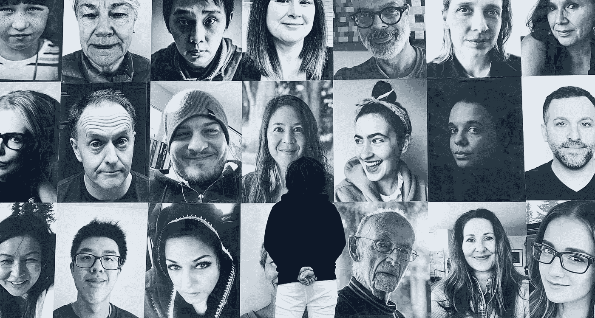

照片由 [Vidushi Rajput](https://unsplash.com/@wish07?utm_source=medium&utm_medium=referral) 在 [Unsplash](https://unsplash.com?utm_source=medium&utm_medium=referral) 拍摄

# 介绍

深度生成模型在行业和学术研究中都获得了极大的欢迎。计算机程序生成新的人类面孔或新的动物的想法是非常令人兴奋的。与我们很快将讨论的监督学习相比，深度生成模型采用了一种稍微不同的方法。

本教程涵盖了使用可变自动编码器的生成式深度学习的基础知识。我假设你相当熟悉卷积神经网络和表示学习的概念。如果没有，我会推荐观看安德烈·卡帕西的 [CS231n 演讲视频](https://www.youtube.com/playlist?list=PLkt2uSq6rBVctENoVBg1TpCC7OQi31AlC)，因为在我看来，它们是在互联网上学习 CNN 的最佳资源。你也可以在这里找到[课程的课堂讲稿。](http://cs231n.github.io/)

这个例子演示了使用 Keras 生成新脸来构建和训练 VAE 的过程。我们将使用来自 Kaggle 的[名人面孔属性(CelebA)数据集](https://www.kaggle.com/jessicali9530/celeba-dataset)和 [Google Colab](https://colab.research.google.com/) 来训练 VAE 模型。

# 生成模型

如果你开始探索生成性深度学习领域，一个变化的自动编码器(VAE)是开启你旅程的理想选择。VAE 的建筑很直观，也很容易理解。与诸如 CNN 分类器的判别模型相反，生成模型试图学习数据的基本分布，而不是将数据分类到许多类别中的一个。一个训练有素的 CNN 分类器在区分汽车和房子的图像时会非常准确。然而，这并没有实现我们生成汽车和房屋图像的目标。

判别模型学习从数据中捕捉有用的信息，并利用该信息将新数据点分类为两个或更多类别中的一个。从概率的角度来看，判别模型估计概率𝑝(𝑦|𝑥，其中𝑦是类别或级别，𝑥是数据点。它估计数据点𝑥属于𝑦.类别的概率例如，图像是汽车或房子的概率。

生成模型学习解释数据如何生成的数据的底层分布。本质上，它模拟了底层分布，并允许我们从中取样以生成新数据。它可以被定义为估计概率𝑝(𝑥)，其中𝑥是数据点。它估计在分布中观察到数据点𝑥的概率。

# 简单自动编码器

在深入研究变型自动编码器之前，分析一个简单的自动编码器是至关重要的。

一个简单或普通的自动编码器由两个神经网络组成——一个编码器和一个解码器。编码器负责将图像转换成紧凑的低维向量(或潜在向量)。这个潜在向量是图像的压缩表示。因此，编码器将输入从高维输入空间映射到低维潜在空间。这类似于 CNN 分类器。在 CNN 分类器中，这个潜在向量将随后被送入 softmax 层，以计算各个类别的概率。然而，在自动编码器中，这个潜在向量被送入解码器。解码器是一个不同的神经网络，它试图重建图像，从而从较低维度的潜在空间映射到较高维度的输出空间。编码器和解码器执行完全相反的映射，如图 *img-1* 所示。


img-1(资料来源:en.wikipedia.org/wiki/Autoencoder)

考虑下面的类比来更好地理解这一点。想象你正在和你的朋友通过电话玩游戏。游戏规则很简单。你会看到许多不同的圆柱体。你的任务是向你的朋友描述这些圆柱体，然后他将尝试用粘土模型重新制作它们。禁止您发送图片。你将如何传达这一信息？

因为任何圆柱体都可以用两个参数来构造——高度和直径，所以最有效的策略是估计这两个尺寸，并把它们传达给你的朋友。你的朋友收到这个信息后，就可以重建圆筒。在这个例子中，很明显，你通过将视觉信息压缩成两个量来执行编码器的功能。相反，你的朋友正在执行一个解码器的功能，利用这个浓缩的信息来重建圆筒。

# 家政

## 下载数据集

数据集可以使用如下所示的 [Kaggle API](https://www.kaggle.com/docs/api) 直接下载到您的 Google Colab 环境中。更多细节可以参考这个[在 Medium 上的帖子](https://medium.com/@opalkabert/downloading-kaggle-datasets-into-google-colab-fb9654c94235)。

上传从您注册的 Kaggle 帐户下载的 Kaggle.json。

```
!pip install -U -q kaggle
!mkdir -p ~/.kaggle
```

从 Kaggle 下载数据集。

```
!cp kaggle.json ~/.kaggle/
!kaggle datasets download -d jessicali9530/celeba-dataset
```

定义项目结构。

*注意(针对 Colab 用户) :不要试图使用左边的查看器浏览目录，因为数据集太大，页面会变得没有响应。*

## 进口

## 数据

由于数据集非常大，我们将创建一个 *ImageDataGenerator* 对象，并使用其成员函数 *flow_from_directory* 来定义直接来自磁盘的数据流，而不是将整个数据集加载到内存中。ImageDataGenerator 还可用于动态应用各种图像增强转换，这在小数据集的情况下特别有用。

我强烈建议你参考[文档](https://keras.io/preprocessing/image/#flow_from_directory)来理解数据流函数的各种参数。

# 模型架构

## 构建编码器

如下所示，编码器的架构由一堆卷积层组成，后面是一个密集(全连接)层，输出大小为 200 的矢量。

*注意:padding = 'same '和 stride = 2 的组合将产生一个在高度和宽度上都是输入张量一半大小的输出张量。深度/通道不受影响，因为它们在数字上等于过滤器的数量。*

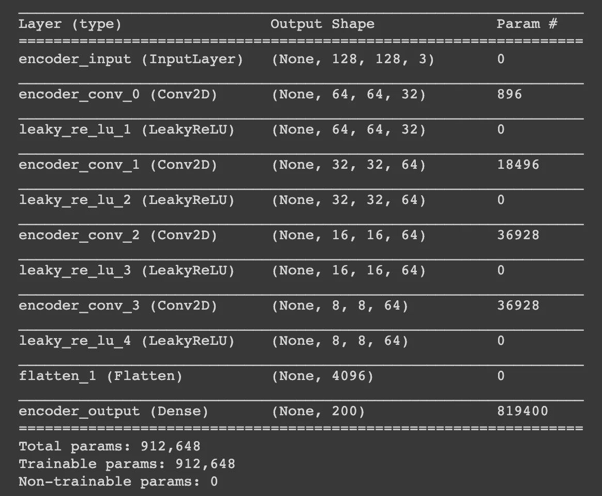

## 构建解码器

回想一下，解码器的功能是从潜在向量中重建图像。因此，有必要定义解码器，以便通过网络逐渐增加激活的大小。这可以通过[上采样 2D](https://keras.io/layers/convolutional/#upsampling2d) 层或 [Conv2DTransponse](https://keras.io/layers/convolutional/#conv2dtranspose) 层来实现。

这里采用了 Conv2DTranspose 层。这一层产生的输出张量在高度和宽度上都是输入张量的两倍。

*注意:在这个例子中，解码器被定义为编码器的镜像，这不是强制性的。*

## 将解码器连接到编码器

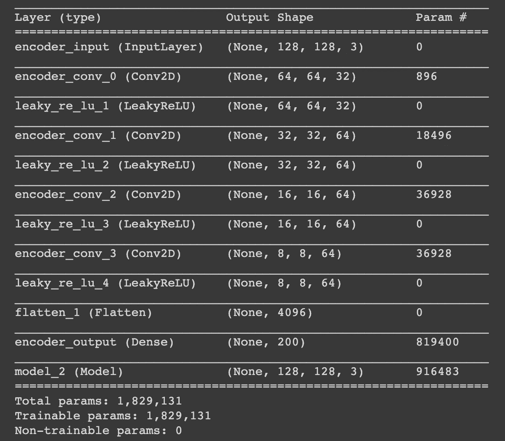

# 汇编和培训

使用的损失函数是简单的均方根误差(RMSE)。真正的输出是在输入层提供给模型的同一批图像。Adam 优化器正在优化 RMSE 误差，用于将一批图像编码到它们各自的潜在向量中，并随后解码它们以重建图像。

ModelCheckpoint Keras 回调保存模型权重以供重用。它在每个时期后用一组新的权重覆盖文件。

*注意:如果你正在使用 Google Colab，要么下载重量到光盘，要么安装你的 Google Drive。*

提示:这是我在 Reddit(arvind 1096)上找到的一个非常有用的提示——为了防止 Google Colab 由于超时问题而断开连接，请在 Google Chrome 控制台中执行以下 JS 函数。

```
function ClickConnect(){console.log(“Working”);document.querySelector(“colab-toolbar-button#connect”).click()}setInterval(ClickConnect,60000)
```

# 重建

第一步是使用顶部“数据”部分中定义的 ImageDataGenerator 生成一批新图像。图像以数组的形式返回，图像的数量等于 *BATCH_SIZE* 。

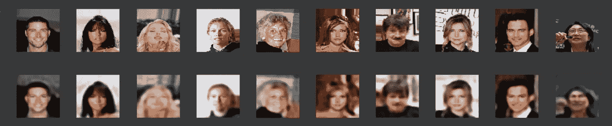

第一行显示直接来自数据集的图像，第二行显示已经通过自动编码器的图像。显然，该模型已经很好地学会了编码和解码(重建)。

*注意:图像缺乏清晰度的一个原因是 RMSE 损失，因为它平均了单个像素值之间的差异。*

# 缺点

## 将从标准正态分布采样的噪声向量添加到图像编码

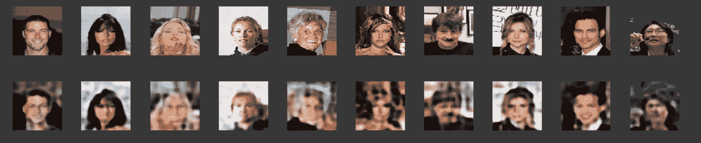

可以观察到，随着编码中加入一点噪声，图像开始失真。一个可能的原因是模型没有确保编码值周围的空间(潜在空间)是连续的。

## 尝试从从标准正态分布采样的潜在向量生成图像

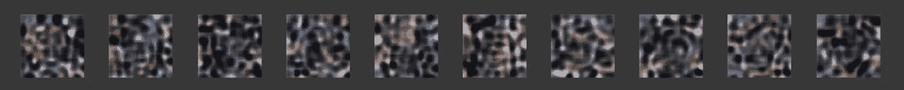

显然，从标准正态分布采样的潜在向量不能用于生成新的人脸。这表明由模型生成的潜在向量不是以原点为中心/对称的。这也加强了我们的推论，即潜空间不是连续的。

因为我们没有一个明确的分布来采样潜在向量，所以我们不清楚如何生成新的面孔。我们观察到在潜在向量中加入一点杂讯并不会产生新的面孔。我们可以编码和解码图像，但这并不符合我们的目标。

基于这种想法，如果我们可以从标准正态分布的潜在向量中生成新的面孔，那不是很好吗？这基本上就是变分自动编码器能够做到的。

# 变分自动编码器

变型自动编码器解决了上面讨论的大多数问题。他们被训练来从从标准正态分布采样的潜在向量中生成新的面孔。简单的自动编码器学习将每个图像映射到潜在空间中的固定点，而变分自动编码器(VAE)的编码器将每个图像映射到 z 维标准正态分布。

## 如何修改简单的自动编码器，使编码器映射到 z 维标准正态分布？

任何 z 维正态分布都可以用平均矢量𝜇和协方差矩阵σ来表示。

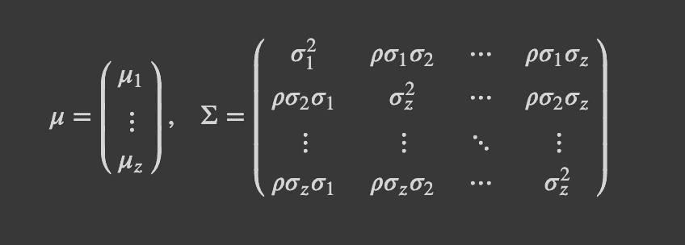

**因此，在 VAE 的情况下，编码器应该输出均值向量(** 𝜇 **)和协方差矩阵(**σ**)来映射到正态分布，对吧？**

是的，但是，需要对协方差矩阵σ进行细微的修改。

**修改 1)** 假设潜在向量的元素之间没有相关性。因此，代表协方差的非对角线元素都是零。因此，协方差矩阵是一个对角矩阵。

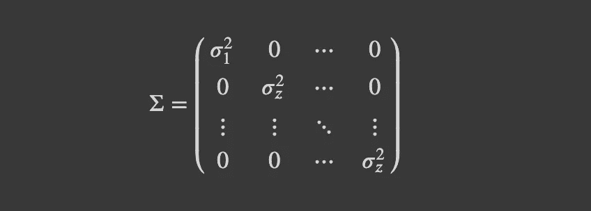

因为这个矩阵的对角元素代表方差，所以它被简单地表示为𝜎2，一个 z 维方差向量。

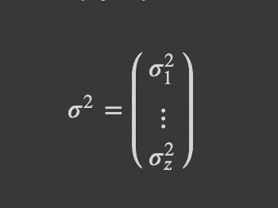

**修改 2)** 回想一下方差只能取非负值。为了保证编码器的输出无界，编码器实际上映射到均值向量和方差向量的**对数**。对数确保输出现在可以取范围内的任何值，(∞，∞)。这使得训练更容易，因为神经网络的输出自然是无界的。

**现在，如何确保编码器映射到标准正态分布(即平均值为 0，标准偏差为 1)？**

输入 KL 散度。

**KL 散度**提供了一个概率分布与另一个概率分布不同程度的度量。具有平均𝜇和标准偏差𝜎的分布与标准正态分布之间的 KL 散度采用以下形式:

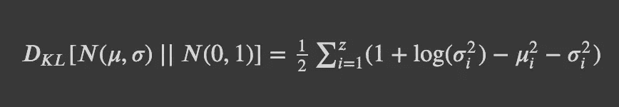

通过稍微修改损失函数以包括除 RMSE 损失之外的 KL 发散损失，VAE 被迫确保编码非常类似于多元标准正态分布。因为多元标准正态分布的平均值为零，所以它以原点为中心。将每个图像映射到与固定点相对的标准正态分布确保了潜在空间是连续的，并且潜在向量以原点为中心。

看一下图像 *img-2* 以便更好地理解。


img-2(来源:blog . Bayes labs . co/2019/06/04/All-you-need-to-know-about-Vae)

## 如果编码器映射到𝜇和𝜎，而不是 z 维的潜在向量，那么在训练期间给解码器的输入是什么？

解码器的输入，如 *img-2* 所示，是从编码器输出——𝜇和𝜎.——表示的正态分布中采样的向量这种采样可以按如下方式进行:

𝑍=𝜇+𝜎𝜀

其中𝜀是从多元标准正态分布中取样的。

## 我们如何生成新面孔？

由于 KL 散度确保编码器映射尽可能接近标准正态分布，因此我们可以从 z 维标准正态分布进行采样，并将其提供给解码器以生成新图像。

## 解码器需要修改吗？

不，解码器保持不变。它等同于简单的自动编码器。

# VAE 建筑模型

编码器架构有微小的变化。它现在有两个输出:mu(均值)和 log_var(方差的对数)，如下所示。

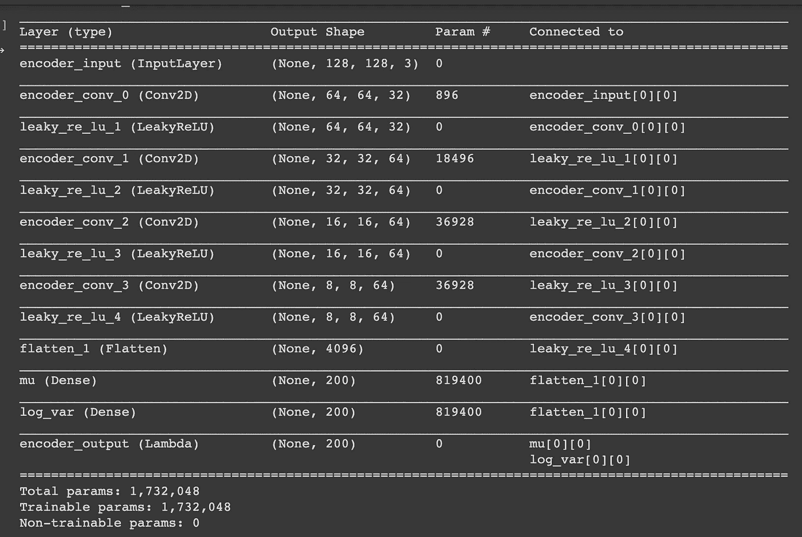

## 构建解码器

由于解码器保持不变，简单自动编码器的解码器架构被重用。

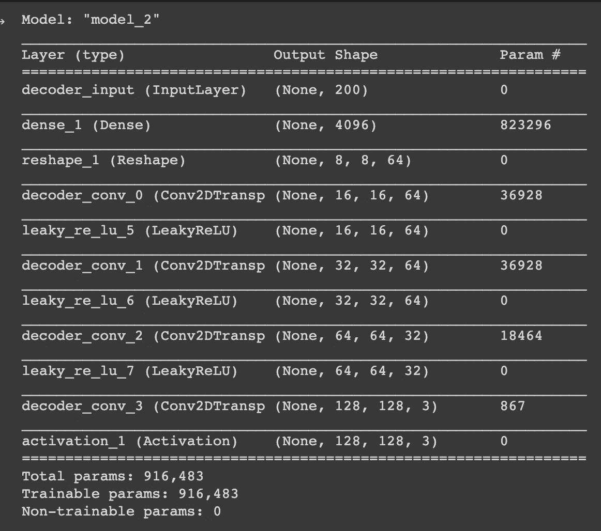

## 将解码器连接到编码器

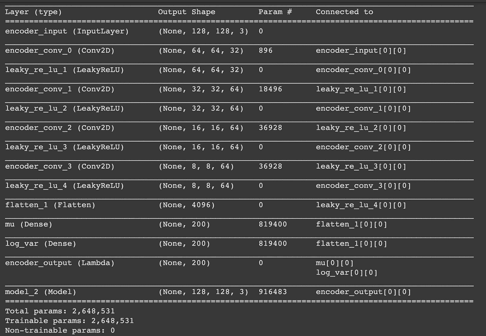

# 汇编和培训

损失函数是 RMSE 和 KL 散度之和。RMSE 损耗被赋予一个权重，称为损耗因子。损耗因子乘以 RMSE 损耗。如果我们使用高损耗因子，简单的自动编码器的缺点就开始出现了。然而，如果我们使用的损耗因子太低，重建图像的质量将会很差。因此，损耗因子是一个需要调整的超参数。

# 重建

重建过程与简单自动编码器的过程相同。

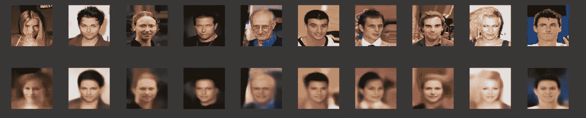

重建结果与简单的自动编码器非常相似。

## 从标准正态分布采样的随机向量生成新面孔。

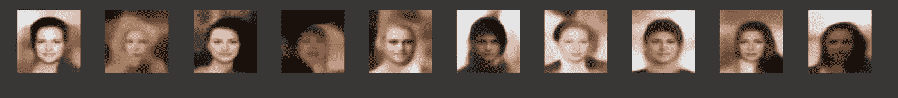

VAE 显然有足够的能力从标准正态分布的样本向量中产生新的面孔。神经网络能够从随机噪声中生成新面孔的事实表明，它在执行极其复杂的映射方面是多么强大！

由于不可能可视化 200 维向量，潜在向量的一些元素被单独可视化，以查看它们是否接近标准正态分布。

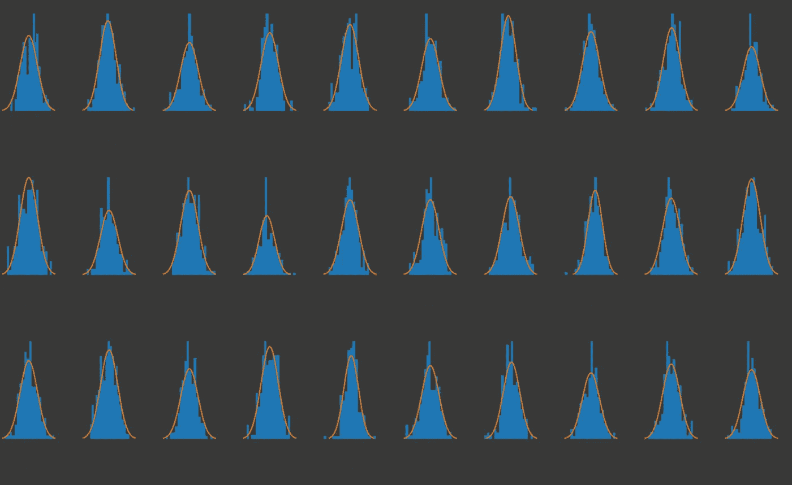

观察到 Z 维向量的前 30 个元素非常类似于标准正态分布。因此，增加 KL 散度项是合理的。

# 结论

正如我们所观察到的，变分自动编码器实现了我们创建生成模型的目标。VAE 已经学会模拟数据的基本分布，并在多元标准正态分布和表面数据之间执行非常复杂的映射。换句话说，我们可以从多元标准正态分布中采样一个潜在向量，我们的 VAE 模型将该向量转换成一个新的面孔。

本教程的笔记本可以从我的[**GitHub 资源库**](https://github.com/dhanushkamath/VariationalAutoencoder) **访问。**

为了进一步阅读，我推荐卡尔·多施的关于变分自动编码器 *的 [**教程。**](https://arxiv.org/abs/1606.05908)*

在 [**LinkedIn**](https://www.linkedin.com/in/dhanushkamath/) 和 [**GitHub**](https://github.com/dhanushkamath) 上随时联系我。

感谢阅读！