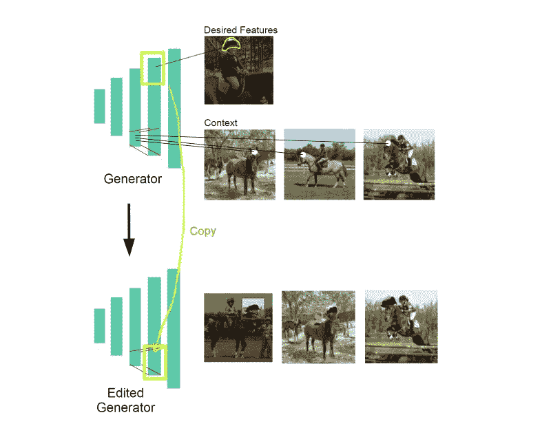

# 在没有数据集的情况下生成新内容

> 原文：<https://towardsdatascience.com/generating-novel-content-without-dataset-544107da4cc8?source=collection_archive---------28----------------------->

## 重写 GAN 中的规则:上下文相关的复制和粘贴特性

编辑样式为马添加头盔[【来源】](https://www.youtube.com/watch?v=iBpdJ2CopIE)

# 介绍

GAN 架构一直是通过人工智能生成内容的标准，但它真的能在训练数据集中可用的内容之外发明新的内容吗？还是只是模仿训练数据，用新的方式混合特征？

在本文中，我将讨论[“重写深度生成模型”](https://arxiv.org/abs/2007.15646)论文，该论文支持直接编辑 GAN 模型以给出我们想要的输出，即使它与现有数据集不匹配。上面的图像是一个编辑的例子，其中您复制头盔特征并将其粘贴到马的上下文中。我相信这种可能性将在数字行业中开辟许多新的有趣的应用程序，例如为动画或游戏生成虚拟内容，这些内容可能不存在现有的数据集。您可以通过下面的链接观看演示视频。

 [## 重写深度生成模型(ECCV 2020)——cross minds . ai

### 重写深度生成网络，发表于 ECCV 2020(口头)。在本文中，我们展示了如何深生成…

crossminds.ai](https://crossminds.ai/video/5f3b29e596cfcc9d075e35f0/?utm_campaign=5edc3d3a07df2164&utm_medium=share) 

# 【甘】

生成对抗网络(GAN)是一种生成模型，这意味着它可以生成与训练数据相似的真实输出。例如，在人脸上训练的 GAN 将能够生成看起来相似的真实人脸。GAN 能够通过学习训练数据的分布来做到这一点，并生成遵循相同分布的新内容。

甘建筑[图片由作者提供]

甘通过一个试图区分真实和虚假图像的鉴别器和一个创建虚假数据来欺骗鉴别器的生成器来“间接”学习分布。这两个网络将不断竞争和相互学习，直到它们都能够分别生成和区分真实的图像。

# GAN 限制

尽管 GAN 能够学习一般的数据分布并生成数据集的不同图像。它仍然局限于训练数据中存在的内容。举个例子，我们来看一个在人脸上训练的 GAN 模型。虽然它可以生成数据集中不存在的新面孔，但它不能发明一个具有新颖特征的全新面孔。你只能期望它以新的方式结合模型已经知道的东西。

因此，如果我们只想生成正常的脸，这是没有问题的。但是如果我们想要长着浓密眉毛或者第三只眼睛的脸呢？GAN 模型无法生成这一点，因为在训练数据中没有眉毛浓密或第三只眼睛的样本。快速的解决方法是用照片编辑工具简单地编辑生成的人脸，但是如果我们想要生成大量这样的图像，这是不可行的。因此，GAN 模型更适合这个问题，但是在没有现有数据集的情况下，我们如何让 GAN 生成我们想要的图像呢？

# **改写甘规则**

2020 年 1 月，MIT 和 Adobe Research 发表了一篇名为[“重写深度生成模型”](https://arxiv.org/abs/2007.15646)的有趣论文，使我们能够直接编辑 GAN 模型，生成新颖的内容。模型重写是什么意思？我们没有让模型根据训练数据或标签来优化自己，而是直接设置我们希望保留的规则(参数)，以获得所需的结果。想要马背上的头盔吗？没问题。我们可以复制头盔的特征，并将其放在马头特征上。然而，这需要了解内部参数及其如何影响输出，这在过去是一个相当大的挑战。虽然，论文已经证明是可行的。

通过重写模型，根据上下文复制和粘贴特征[图片由作者提供]

> *训练*和*重写*之间的区别类似于自然选择和基因工程之间的区别。虽然培训可以有效地优化整体目标，但它不允许直接指定内部机制。相比之下，重写允许一个人直接选择他们希望包含的内部规则，即使这些选择碰巧不匹配现有的数据集或优化全局目标。
> 
> -大卫·鲍尔(论文主要作者)

正如大卫·鲍尔所说，重写一个模型就像基因工程。这就像把发光水母的 DNA 植入猫体内，制造出一只在黑暗中发光的猫。

发光的猫【图片由*阿纳希德·巴拉瓦尼亚*[】](https://edition.cnn.com/2013/03/29/tech/innovation/biotech-animals-emily-anthes/index.html)

# 它是如何工作的

你实际上如何重写一个生成模型？本文提出了将生成器的权值视为最优线性联想记忆(OLAM)的思想。OLAM 的作用是存储一个键值对关联。我们将选择某一层 L，它表示值 *V* ，该值表示图像的输出特征，例如微笑表情。然后，层 L 之前的前一层将表示键 *K* ，其表示有意义的上下文，例如嘴的位置。这里，层 L 和层 L-1 之间的权重 W 充当存储 K 和 v 之间的关联的线性关联存储器

权重作为联想记忆[图片由作者提供]

我们可以认为 K🠖V 协会是模型中的一个规则。例如，想象一下，如果我们有一个在马身上训练的 StyleGAN 模型，我们想重写这个模型，给马戴上头盔。我们将我们想要的特征头盔标记为 **V*** ，将我们想要粘贴特征的上下文马头标记为 **K*** 。因此，为了得到我们想要的特征，我们想把原来的规则 **K** 🠖 **V** 改为我们想要的规则 **K*** 🠖 **V*** 。为此，我们以这样的方式更新权重，以将规则更改为目标 **K*** 🠖 **V*** 。

模型重写[图片由作者提供]

[【来源】](https://rewriting.csail.mit.edu/)

# 数学细节

我们如何更新 **W** 来得到目标 **K*** 🠖 **V*** ？我们想要设定新规则 **K*** 🠖 **V*** 同时最小化旧 k🠖v.的变化因此，

上面的表达式是一个约束最小二乘问题，可以用

这可以被简化

其中 C = K*KT，λ和 c^−1 k∫都是简单矢量。

因此，我们的更新将有两个分量，幅度λ和更新方向 c^−1 k*。我们将更新方向 c^−1 k∫表示为 ***d*** *。*更新方向 d 仅受密钥 **k*** 影响，且仅λ取决于值 **v*** 。为了简化，更新方向确保只有影响所选上下文 k*的权重将被更新，以最小化与其他规则的干扰，同时λ确保我们实现期望的 **v*。关于数学的更多细节，我推荐阅读[论文](https://arxiv.org/abs/2007.15646)本身。**

总之，获得更新的权重 W1 的步骤是

[【来源】](https://rewriting.csail.mit.edu/)

# **结果**

本研究通过重写预先训练好的 StyleGAN 和 ProGAN 模型来验证其能力。一些演示是给马戴上头盔，把圆顶变成树顶，把皱眉变成微笑，去掉耳环，加上浓密的眉毛，加上眼镜。我推荐观看 David Bau 的演示视频，他展示了如何使用研究制作的接口工具重写模型。

 [## 重写深度生成模型(ECCV 2020)——cross minds . ai

### 重写深度生成网络，发表于 ECCV 2020(口头)。在本文中，我们展示了如何深生成…

crossminds.ai](https://crossminds.ai/video/5f3b29e596cfcc9d075e35f0/?utm_campaign=5edc3d3a07df2164&utm_medium=share) 

给马戴帽[【来源】](https://arxiv.org/abs/2007.15646)

添加浓眉[【来源】](https://arxiv.org/abs/2007.15646)

把教堂顶改成树顶[【来源】](https://arxiv.org/abs/2007.15646)

变皱眉为微笑[【来源】](https://arxiv.org/abs/2007.15646)

取下耳环[【来源】](https://arxiv.org/abs/2007.15646)

添加眼镜[【来源】](https://arxiv.org/abs/2007.15646)

该界面工具易于使用，并且可以在 Jupyter 笔记本上运行。您可以使用这个 [Colab 笔记本](https://colab.research.google.com/github/davidbau/rewriting/blob/master/notebooks/rewriting-interface.ipynb)或从[源代码](https://github.com/davidbau/rewriting)中使用该工具。

接口工具重写模型[【来源】](https://www.youtube.com/watch?v=iBpdJ2CopIE)

感谢您的阅读，如果您喜欢我的文章，请随时查看我的其他文章！

 [## 带有可变自动编码器的创成式建模(VAE)

### 理解变分自动编码器背后的直觉(VAE)

medium.com](https://medium.com/vitrox-publication/generative-modeling-with-variational-auto-encoder-vae-fc449be9890e)  [## 使用 StyleGAN2 生成动画角色

### 了解如何生成这个很酷的动画人脸插值

towardsdatascience.com](/generating-anime-characters-with-stylegan2-6f8ae59e237b) 

# 参考

[1] Bau，d .，Liu，s .，Wang，t .，Zhu，J. Y .，& Torralba，A. (2020)。重写深度生成模型。arXiv 预印本 arXiv:2007.15646 。

[https://rewriting.csail.mit.edu/](https://rewriting.csail.mit.edu/)