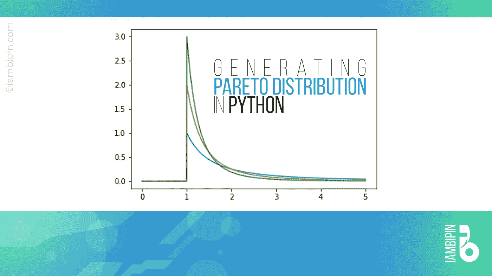
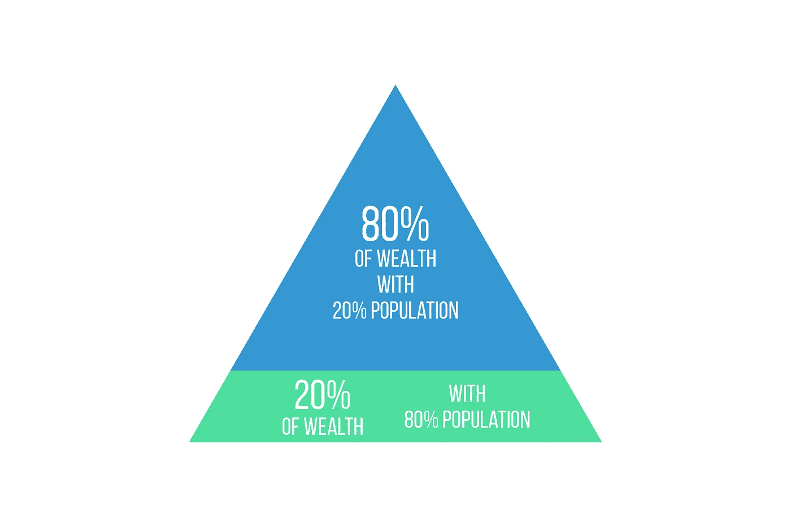
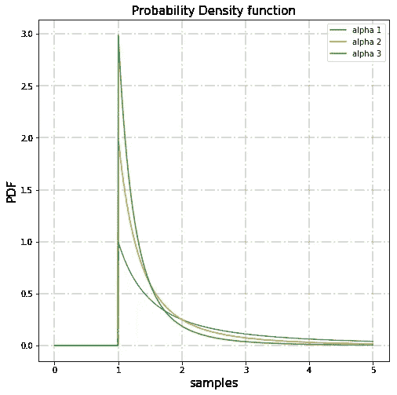
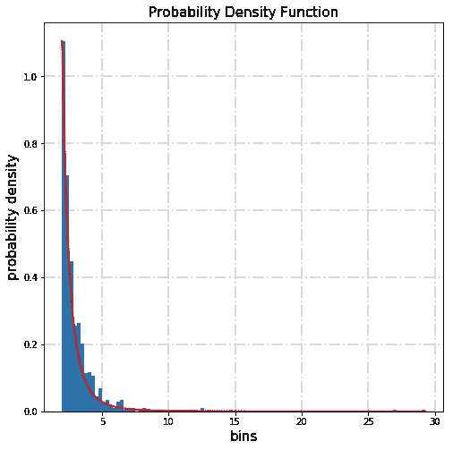
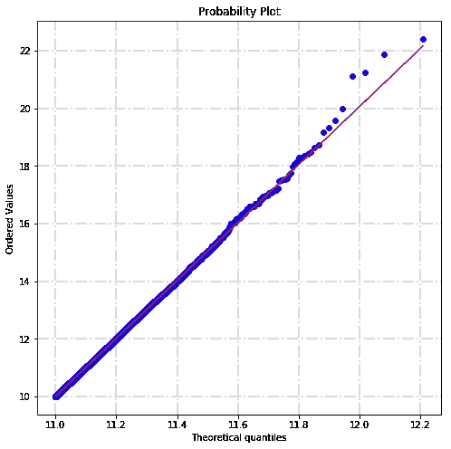

# 在 Python 中生成帕累托分布

> 原文：<https://towardsdatascience.com/generating-pareto-distribution-in-python-2c2f77f70dbf?source=collection_archive---------15----------------------->

## 概率统计/帕累托分布

## 让我们更好地理解帕累托分布



照片由 iambipin 拍摄

## 1.帕累托分布

P areto 分布是一种**幂律概率分布**，以意大利土木工程师、经济学家、社会学家**维尔弗雷多·帕累托**的名字命名，用于描述社会、科学、地球物理、精算以及其他各种类型的可观测现象。帕累托分布有时被称为帕累托原则或“80-20”规则，因为该规则表明，80%的社会财富掌握在 20%的人口手中。帕累托分布不是自然规律，而是一种观察。它在许多现实世界的问题中是有用的。这是一个偏斜的重尾分布。

看完定义，你一定在疑惑什么是幂律？幂律是两个量之间的函数关系，使得一个量的变化触发另一个量的成比例变化，而不管两个量的初始大小。



照片由 iambipin 拍摄

80-20 法则在很多情况下都适用。例如，维尔弗雷多·帕累托发现意大利 80%的土地被 20%的人口占有。他还发现，从他的菜园里采购的 80%的豌豆来自 20%的豌豆植株。全球 82.7%的收入被 20%的人口控制。微软 2002 年的一份报告表明，Windows 和 MS Office 80%的错误和崩溃是由 20%的检测到的错误造成的。80%的销售额来自 20%的产品。80%的客户只使用 20%的软件功能。这种 80-20 分布经常出现。

## 2.在 Python 中生成帕累托分布

可以使用 Scipy.stats 模块或 NumPy 在 Python 中复制 Pareto 分布。Scipy.stats 模块包含各种概率分布和不断增长的统计函数库。Scipy 是用于科学计算和技术计算的 Python 库。NumPy 是一个用于科学计算的 Python 库，除了科学用途之外，它还可以用作通用数据的多维容器。

## 2.1 使用 Scipy.stats

```
import numpy as np
import matplotlib.pyplot as plt
from scipy.stats import pareto
x_m = 1 #scale
alpha = [1, 2, 3] #list of values of shape parameters
samples = np.linspace(start=0, stop=5, num=1000)for a in alpha:
    output = np.array([pareto.pdf(x=samples, b=a, loc=0, scale=x_m)])
    plt.plot(samples, output.T, label='alpha {0}' .format(a))plt.xlabel('samples', fontsize=15)
plt.ylabel('PDF', fontsize=15)
plt.title('Probability Density function', fontsize=15)
plt.grid(b=True, color='grey', alpha=0.3, linestyle='-.', linewidth=2)
plt.rcParams["figure.figsize"] = [5, 5]
plt.legend(loc='best')
plt.show()
```



照片由 iambipin 拍摄

**x_m** 和**α**是**帕累托分布**的两个参数。x_m 是标度参数，代表帕累托分布随机变量可以取的最小值。α是形状参数，等于 n/SUM{ln(x_i/x_m)}。

**np.linspace()** 返回特定间隔[开始，停止]内间隔均匀的样本(样本数等于 num)。在上面的代码中，linspace()方法返回范围[0，5]内 1000 个均匀分布的样本。

shape values -alpha 列表被迭代以绘制每个值的线条。 **np.array()** 创建一个数组。 **scipy.stats.pareto()** 方法返回 pareto 连续随机变量。 **pareto.pdf()** 创建概率密度函数(pdf)。参数 **x、b、loc 和 scale** 分别是类数组分位数、类数组形状参数、类数组可选位置参数(默认值=0)和类数组可选比例参数(默认值=1)。

**plt.plot()** 绘制均匀间隔的样本和 PDF 值数组。该图是为每个α值绘制的。这里，**输出。T** 正在变换输出。输出是具有 3 行的 Pareto 分布值的数组，每个形状参数一行。在转置时，输出被转换成 1000 行的数组。

剩下的代码行几乎是不言自明的。 **plt.xlabel()** 和 **plt.ylabel()** 用于标注 x 轴和 y 轴。 **plt.title()** 给图形指定标题。 **plt.grid()** 配置网格线。

```
plt.rcParams['figure.figsize'] = [width, height]
```

**plt.rcParams[]** 设置当前 rc 参数。Matplotlib 使用 matplotlibrc 配置文件自定义各种属性，称为‘RC 设置’或‘RC 参数’。Matplotlib 中几乎每个属性的默认值都可以控制:图形大小和 DPI、线条宽度、颜色和样式、轴、轴和网格属性、文本和字体属性等等。

**plt.legend()** 显示图例，plt.show()显示所有图形。想进一步了解如何让你的情节更有意义，请访问这里。

## 2.2 使用 Numpy

```
import numpy as np
import matplotlib.pyplot as plt
x_m, alpha = 1, 3.
#drawing samples from distribution
samples = (np.random.pareto(alpha, 1000) + 1) * x_m
count, bins, _ = plt.hist(samples, 100, normed=True)
fit = alpha*x_m**alpha / bins**(alpha+1)
plt.plot(bins, max(count)*fit/max(fit), linewidth=2, color='r')
plt.xlabel('bins', fontsize=15)
plt.ylabel('probability density', fontsize=15)
plt.title('Probability Density Function', fontsize=15)
plt.grid(b=True, color='grey', alpha=0.3, linestyle='-.', linewidth=2)
plt.rcParams['figure.figsize'] = [8, 8]
plt.show()
```



照片由 iambipin 拍摄

**np.random.pareto()** 从指定形状的 **Pareto II 或 Lomax 分布**中抽取随机样本。帕累托 II 分布是一种转移的帕累托分布。通过加 1 并乘以标度参数 x_m，可以从 Lomax 分布得到经典的 Pareto 分布。

```
samples = (np.random.pareto(alpha, 1000) + 1) * x_m
```

帕累托 II 分布的最小值是零，而经典帕累托分布的最小值是μ，其中标准帕累托分布的位置μ= 1。

**plt.hist()** 绘制直方图。当参数 density 或 normed 设置为 True 时，返回的元组将把第一个元素作为计数规范化以形成概率密度。因此直方图下的面积将是 1。这是通过将计数除以观察数量乘以箱宽度而不是除以观察总数来实现的。因此，y 轴将具有样本密度。

**count，bin，_** 中的 **'_'** 表示返回的元组的最后一个值不重要( **plt.hist()** 将返回一个具有三个值的元组)。

我们将在分箱的数据上绘制曲线，

我们将通过计算 Pareto 分布在由具有参数 x_m 和 alpha 的条柱定义的 x 值处的概率密度，使 Pareto 分布符合我们的随机采样数据，并在我们的数据之上绘制该分布。

```
fit = alpha*x_m**alpha / bins**(alpha+1)
```

## 3.验证帕累托分布

**Q-Q 图**(分位数-分位数图)用于判断连续随机变量是否遵循帕累托分布。

```
import numpy as np
import matplotlib.pyplot as plt
import scipy.stats as statsx_m = 10 
alpha = 15 
size = 100000 #the size of the sample(no. of random samples)
samples = (np.random.pareto(alpha, size) + 1) * x_m
stats.probplot(samples, dist='pareto', sparams=(15, 10), plot=pylab)
plt.show()
```



照片由 iambipin 拍摄

**stats . proplot**根据指定理论分布(帕累托分布)的分位数，生成从分布(样本数据)中抽取的随机样本的概率图。由于绝大多数蓝点(样本数据)几乎与红线(理论分布)对齐，我们可以得出分布遵循帕累托分布的结论。

在得出结论之前，必须了解帕累托分布在现实世界中的应用。

## 4.帕累托分布的应用

*   人类住区的规模(更少的城市和更多的村庄)。
*   沙粒的大小。
*   遵循 TCP 协议通过互联网分发的数据的文件大小。
*   油田(几个大油田和许多小油田)的石油储量值
*   在 Tinder 中，80%的女性争夺 20%最有魅力的男性。
*   用户在 Steam 中玩各种游戏所花费的时间(很少有游戏玩得很多，比大多数很少玩的游戏更频繁)。

帕累托分布及其概念非常简单而强大。它总是有助于收集重要的线索，以了解广泛的人类行为，科学和社会现象。我希望你能更好地理解帕累托分布，以及如何从中抽取样本并使用 Pyplot、Numpy、Scipy 和 Python 绘图。编码快乐！！！

## 参考

[](https://docs.scipy.org/doc/scipy/reference/generated/scipy.stats.pareto.html) [## scipy.stats.pareto — SciPy v1.4.1 参考指南

### scipy.stats. pareto( *args，**kwds) = [source]一个 pareto 连续随机变量。作为 rv_continuous 的一个实例…

docs.scipy.org](https://docs.scipy.org/doc/scipy/reference/generated/scipy.stats.pareto.html) [](https://docs.scipy.org/doc/numpy-1.10.1/reference/generated/numpy.random.pareto.html) [## NumPy . random . Pareto—NumPy 1.10 版手册

### numpy.random. pareto ( a，size=None)从指定形状的 Pareto II 或 Lomax 分布中抽取样本。的…

docs.scipy.org](https://docs.scipy.org/doc/numpy-1.10.1/reference/generated/numpy.random.pareto.html) 

[https://en.wikipedia.org/wiki/Pareto_distribution](https://en.wikipedia.org/wiki/Pareto_distribution)

[https://docs . scipy . org/doc/numpy-1 . 10 . 1/reference/generated/numpy . random . Pareto . html](https://docs.scipy.org/doc/numpy-1.10.1/reference/generated/numpy.random.pareto.html)

[https://stack overflow . com/questions/19525899/how-to-generate-random-numbers-in-specific-range-using-Pareto-distribution-in-py](https://stackoverflow.com/questions/19525899/how-to-generate-random-numbers-in-specyfic-range-using-pareto-distribution-in-py)