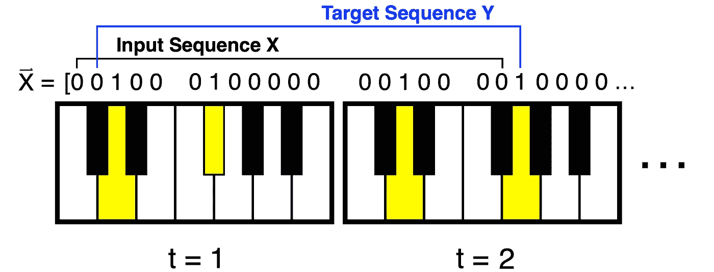

# 用扩张卷积神经网络生成钢琴音乐

> 原文：<https://towardsdatascience.com/generating-piano-music-with-dilated-convolutional-neural-networks-d81d02e1dda6?source=collection_archive---------20----------------------->

## 如何建立完全卷积的神经网络，能够以惊人的成功模拟复杂的钢琴音乐结构


# 介绍

由扩展 1D 卷积组成的完全卷积神经网络易于构建、易于训练，并且可以生成逼真的钢琴音乐，例如:

通过 100 小时古典音乐训练的完全卷积网络产生的示例性能。

## 动机

大量的研究致力于训练可以创作钢琴音乐的深度神经网络。例如，OpenAI 开发的 [Musenet](https://openai.com/blog/musenet/) 已经训练出能够创作长度为许多分钟的逼真钢琴曲的大规模变形金刚模型。Musenet 使用的模型采用了许多技术，比如最初为 NLP 任务开发的注意力层。参见[上一篇 TDS 文章](/generate-piano-instrumental-music-by-using-deep-learning-80ac35cdbd2e)，了解更多关于将注意力模型应用于音乐生成的细节。

虽然基于 NLP 的方法非常适合基于机器的音乐生成(毕竟，音乐就像一种语言)，但 transformer 模型架构有些复杂，并且适当的数据准备和训练可能需要极大的关注和经验。这种陡峭的学习曲线促使我探索更简单的方法来训练可以创作钢琴音乐的深度神经网络。特别是，我将重点关注基于扩展卷积的全卷积神经网络，它只需要几行代码来定义，需要最少的数据准备，并且易于训练。

## 历史关联

2016 年， [DeepMind](https://deepmind.com/) 研究人员推出了 [WaveNet](https://arxiv.org/abs/1609.03499) 模型架构，在语音合成方面产生了最先进的性能。他们的研究表明，具有指数增长膨胀率的堆叠 1D 卷积层可以极其有效地处理原始音频波形序列，从而产生可以合成来自各种来源的令人信服的音频的生成模型，包括[钢琴音乐](https://deepmind.com/blog/article/wavenet-generative-model-raw-audio)。

在这篇文章中，我以 DeepMind 的研究为基础，明确专注于创作钢琴音乐。我没有从录制的音乐中向模型输入原始音频，而是显式地向模型输入在乐器数字接口(MIDI)文件中编码的钢琴音符序列。这有助于数据收集，大大减少计算量，并允许模型完全集中于数据的音乐方面。这种高效的数据编码和数据收集的便利性使得快速探索完全卷积网络能够多好地理解钢琴音乐成为可能。

## 这些模特“弹钢琴”的水平如何？

为了让大家了解这些模型听起来有多逼真，我们来玩一个模仿游戏。以下哪一段是由人类创作的，哪一段是由模特创作的:

钢琴作曲 A:人还是模特？

钢琴作曲 B:人还是模特？

也许你预料到了这个诡计，但是这两个作品都是由这篇文章中描述的模型产生的。生成上述两个片段的模型仅用了四天时间在一台 NVIDIA Tesla T4 上进行训练，训练集中有 100 小时的古典钢琴音乐。

我希望这两个表演的质量为你提供动力，继续阅读并探索如何构建你自己的钢琴音乐创作模型。这个项目中描述的代码可以在 piano et 的 [Github](https://github.com/angsten/pianonet) 中找到，更多示例作品可以在 piano et 的 [SoundCloud](https://soundcloud.com/tom-angsten) 中找到。

现在，让我们深入了解如何训练一个模型像上面的例子一样产生钢琴曲的细节。

# 方法

当开始任何机器学习项目时，很好的做法是明确定义我们试图完成的**任务**，我们的模型将从中学习的**体验**，以及我们将用来确定我们的模型是否在任务中改进的**性能**度量。

## 工作

我们的首要目标是生成一个模型，有效地逼近数据生成分布 P(X)。这个分布是一个函数，它将钢琴音符的任意序列 X 映射到一个范围在 0 和 1 之间的实数。本质上，P(X)赋予更可能由熟练的人类作曲家创作的序列更大的值。举个例子，如果 X 是由 200 个小时随机选取的音符组成的曲子，X 是莫扎特的奏鸣曲，那么 P(X ) < P(X)。此外，P(X)将非常接近零。

实际上，分布 P(X)永远无法精确确定，因为这需要将所有可能存在的人类作曲家聚集在一个房间里，让他们永远创作钢琴曲。然而，对于更简单的数据生成分布，也存在同样的不完整性。例如，精确确定人类身高的分布需要所有可能的人类存在并被测量，但这并不阻止我们定义和近似这样的分布。在这个意义上，上面定义的 P(X)是一个有用的数学抽象，它包含了决定钢琴音乐如何产生的所有可能的因素。

如果我们用一个模型很好地估计了 P(X ),我们就可以用这个模型随机抽样出新的、现实的、从未听过的作品。这个定义仍然有点抽象，所以让我们应用一些合理的近似，使 P(X)的估计更容易处理。

**数据编码:**我们需要用计算机可以理解的方式对钢琴音乐进行编码。为此，我们将把一首钢琴作品表示为一个可变长度的二进制状态时间序列，每个状态跟踪在一个时间步长内手指是否按下了键盘上的给定音符:


图 1:数据编码过程，展示了如何将钢琴音乐表示为二进制按键状态的 1D 序列，其中一个状态表示在特定的时间步长内按下了一个按键。

数据处理不等式告诉我们，只有当我们处理信息时，信息才会丢失，我们选择的钢琴音乐编码方法也不例外。在这种情况下，信息丢失有两种方式。首先，必须通过使时间步长有限来限制时间方向上的分辨率。幸运的是，0.02 秒的相当大的步长仍然会导致音乐质量的可忽略不计的降低。第二，我们不能代表按键的速度，因此，音乐的力度就丧失了。

尽管有重要的近似，这种编码方法以简洁和机器友好的形式捕获了大量的底层信息。这是因为钢琴实际上是一个大型的有限状态机。有效地编码其他更微妙的乐器的音乐，如吉他或长笛，可能会困难得多。

既然我们有了编码方案，我们可以用更具体的形式来表示数据生成分布:


等式 1:在 88 键钢琴上演奏的钢琴作品的联合概率分布。有 T 个时间步长，或 88 个按键状态的集合，每个 *x 变量可以是 1(按键)或 0。*

作为一个例子，在第一时间步，如果钢琴上的第一个音符被按下，在 *t* =1， *x* ₁ = 1。

**分解分布:**另一种简化涉及使用概率链规则分解(1)中的联合概率分布:


等式 2:将编码数据生成分布因式分解成条件概率。

类似于 *n* -gram 语言模型，我们可以做出马尔可夫假设，即在过去发生超过 *N* 个时间步的音符对在时间 *t=n* 的音符是否被按下没有影响。这允许我们最多使用最后一个 *N* 音符来重写(2)中的每个因子:


等式 3 :( 2)中的每一项可以使用该表达式来近似，该表达式假设只有键状态的最后 N 个时间步长影响下一个键被按下的概率。

请注意，在一首歌曲的开头，音符历史可以用多达 *N 个*零来填充，以便总是有至少 *N 个*音符的历史。此外，请注意 *N* 必须在数百个时间步长(许多秒的历史)内，这种近似才能很好地适用于钢琴音乐。我们将在后面看到 *N* 是由我们模型的感受野决定的，并且是表演质量的关键决定因素。

最后，我们已经涵盖了足够的数学背景，以严格定义这个项目的任务:**使用真实钢琴音乐的编码序列数据集，训练一个估计器 *p̂* ，给出最后 *N* 个音符状态下下一个音符被按下的概率。然后，我们可以使用 *p̂* 重复采样下一个音符，在每次采样后更新音符历史，自动回归创建一个全新的乐曲。**

在这个项目中，我们的估计器 *p̂* 将是一个完全卷积的深度神经网络。但是，在我们谈论模型架构或培训之前，我们需要收集一些数据。

## 经验

我们的模型在训练期间看到的数据将在很大程度上决定其生成的音乐的质量和风格。此外，我们试图估计的联合概率分布是非常高维的，并且容易出现数据稀疏的问题。这可以通过使用足够大量的训练数据和适当的模型选择来克服。关于前者，钢琴音乐很容易收集和预处理，原因有二。

首先，互联网上有大量 MIDI 格式的钢琴音乐。这些文件本质上是钢琴键状态的序列，并且需要最少的预处理来获得我们期望的训练数据的编码。第二，我们试图完成的任务是*自监督学习*，其中我们的目标标签可以从数据中自动生成，无需人工标注:



图 2:输入和目标音符序列由相同的数据组成，目标相对于输入向前移动一个音符。该任务的自我监督性质排除了手动贴标的需要。

图 2 显示了如何收集这个任务的训练实例。首先，从一首歌曲中选择一个二元密钥状态序列。然后，这些状态被分成两个子序列；一个输入序列，然后是一个大小相等的目标序列，但索引向前移动一个音符。总而言之，构建我们的数据集就像从互联网上下载高质量的钢琴 midi 文件并操作数组一样简单。

值得注意的是，我们在训练集中包含的音乐风格将在很大程度上决定我们最终估计的数据生成分布 P(X)的子空间。如果我们喂巴赫和莫札特的模式序列，它显然不会学习产生塞隆尼斯·蒙克的爵士乐。出于数据收集的考虑，我将重点放在最著名的古典作曲家的输入数据上，包括巴赫、肖邦、莫扎特和贝多芬。然而，将这项工作扩展到不同风格的钢琴音乐只需要用这些附加风格的代表性例子来扩充数据集。

## 绩效指标

PianoNet 本质上是一个自我监督的二进制分类器，它被反复调用来预测下一个键状态是向上还是向下。对于任何概率二进制分类器，我们可以通过最小化训练数据上的交叉熵损失来最大化模型对数据集的预测可能性:


等式 4:交叉熵损失，针对具有参数θ的概率模型 p̂，在一组 *m 个实例*的训练集上计算。如果第 I 个训练实例的实际目标音符被按下，yᵢ = 1，否则为 0。

在训练过程中，我们的模型被输入长序列的音符状态输入和从人类创作的钢琴音乐中采样的目标。在每个训练步骤，该模型使用有限的音符历史来预测下一个钢琴键状态被按下的概率。如果当真键状态被按下时预测概率接近于零，或者当真键状态未被按下时预测概率接近于 1，则模型将根据(4)受到强烈惩罚。

这个损失函数有一个潜在的问题。我们的最终目标不是创建一个基于人类创作的作品中的过去音符来预测单个下一个音符的模型，而是基于模型本身生成的音符历史来创建扩展的音符序列。在这个意义上，我们做了一个非常强有力的假设:当给定一个人为生成的音符状态的历史时，随着模型在预测下一个钢琴音符的状态方面的改进，它通常也会在使用其自己的输出作为音符历史自动回归地生成扩展的演奏方面有所改进。

事实证明，这个假设**并不** **而不是**总是成立的，因为验证损失相对较低的模型在生成表演时听起来仍然很不悦耳。下面，我表明这个假设不适用于浅层网络，但对于足够深的网络，它在实践中适用。

## 模型架构

我们现在知道如何定义任务，并可以收集大量正确编码的数据，但我们应该根据数据训练什么模型才能更好地完成钢琴作曲的任务？作为一个好的起点，我们的模型应该有几个属性，这些属性应该能够提高它对看不见的数据进行归纳的能力:

*   **该模型对于调的移调应该是不变的，也就是说，将按下的音符向上或向下移动固定数量的键:**为了更好地近似，以 c 大调和弦开始的莫札特奏鸣曲应该具有与以 G 大调和弦开始的奏鸣曲相同的相对音符分布。调式并不完全对称，但是音调的相对频率在很大程度上决定了作品的音乐语义。这种现象就是为什么一个乐队可以用主唱更舒服的音调来覆盖汤姆·佩蒂的*自由落体*，而观众不会注意到。
*   **该模型对于节奏的微小变化应该是不变的:**如果一首歌曲播放快了或慢了 2%，这应该不会对下一个音符的分布产生太大影响。事实证明，我们不能直接强加这种不变性，但我们可以通过使用数据增强来教授模型速度不变性。
*   **当数据流经网络时，模型不应降低输入分辨率:**未来音符的分布可能对音乐中的高分辨率细微差别非常敏感，尤其是时间方向上的节奏变化，因此我们不应破坏这些信息。在这方面，假定像池化这样的技术会损害模型性能。
*   **模型参数的数量应与感受野的大小成比例:**总感受野是模型输入的大小。该值越大，可用于影响未来票据概率的票据历史就越多。在钢琴曲中，这必须至少有几秒钟长。对于几秒钟的感受野，模型参数的数量应该保持在几百万或更少。

由堆叠的扩展卷积层组成的全卷积神经网络是满足上述特性的简单而有效的选择。除了在内核输入之间可能有一个或多个长度的间隙之外，扩展卷积类似于传统卷积。见这篇 [TDS 博客文章](/understanding-2d-dilated-convolution-operation-with-examples-in-numpy-and-tensorflow-with-d376b3972b25)了解膨胀卷积的更详细的概述，虽然我们在这种情况下使用 1D 卷积，而不是 2D。

与 WaveNet 论文中使用的方法类似，我们将在每个“块”中使用指数增长的膨胀率来构建我们的模型，并堆叠多个块来创建完整的网络。下面是构建两个块模型的 Tensorflow 代码示例，每个块有七层。整个网络变得越来越宽，因此第二个块的每一层比第一个块有更多的滤波器。最后，该模型以单个滤波器结束，其输出通过 sigmoid 激活运行，并且该输出将是下一个音符状态为 1 的预测概率。

```
from tensorflow.keras.layers import Input, Conv1D, Activation
from tensorflow.keras.models import Model

filter_counts = [
    [4,  8,  12, 16, 20, 24, 28], *# block one's filter counts* [32, 36, 38, 42, 46, 50, 54], *# block two's filter counts* ]

inputs = Input(shape=(None, 1)) *# None allows variable input lengths* conv = inputs

for block_idx in range(0, len(filter_counts)):
    block_filter_counts = filter_counts[block_idx]

    for i in range(0, len(block_filter_counts)):
        filter_count = block_filter_counts[i]
        dilation_rate = 2**i *# exponentially growing receptive field*conv = Conv1D(filters=filter_count, kernel_size=2,
                      strides=1, dilation_rate=dilation_rate,
                      padding=**'valid'**)(conv)
        conv = Activation(**'elu'**)(conv)

outputs = Conv1D(filters=1, kernel_size=1, strides=1,
                 dilation_rate=1, padding=**'valid'**)(conv)
outputs = Activation(**'sigmoid'**)(outputs)

model = Model(inputs=inputs, outputs=outputs)
```

线`dilation_rate = 2**i`导致每个块中的膨胀率从 1 开始(类似于核大小为 2 的传统卷积)，然后随着块中的每个后续层呈指数增加。一旦第二个区块开始，这个膨胀率重置为大小 1，并开始像以前一样以指数方式增加。

我们可以让扩张率继续呈指数增长，而无需重置，但这将导致感受野在每个模型深度增长过快。我们也不必为每个新层增加过滤器的数量。我们可以让每一层的过滤器计数总是等于某个大的数字，比如 64。然而，在实验过程中，我发现从少量的过滤器开始，慢慢地增加数量会产生一个统计效率更高的模型。图 3 显示了一个包含两个模块的示意模型:


图 3:模型架构，包括堆叠的扩张 1D 卷积层，每增加一层，扩张率增加两倍。当第二个块开始时，膨胀率重置为 1。每个节点代表一个向量，该向量包含每个后续层的越来越多的元素。

需要对每个`Conv1D`层实例化的`padding='valid'`参数做最后的说明。我们希望我们的模型输入只看到在当前预测音符之前发生的音符——否则我们将允许在推理时不存在的未来信息泄漏到我们的预测中。我们也不想在输入的音符序列中填充零(静音)。输入序列可以在歌曲中间开始，用无声填充会产生一种人为的输入状态，其中无声突然被内部歌曲片段打断。“有效”设置以满足上述两个要求的方式填充序列。

# 训练的技巧和诀窍

尽管获取大型数据集很容易，并且我们讨论的模型架构构建起来也相当简单，但训练一个产生真实音乐的模型仍然是一门艺术。这里有一些技巧可以帮助你克服我面临的许多挑战。

## 深度的重要性

当我开始训练模型时，我从单块浅层网络架构开始，大约有 15 层，每层有大量的权重。虽然验证损失表明这些模型正在从数据中学习，而不是过度拟合，但听到如下表现时，我感到沮丧:

来自太浅(13 个卷积层)的网络的示例性能。

浅层网络的表现开始有点音乐，但随着它离人类产生的种子越来越远，它最终陷入混乱，最终让位于大部分沉默。

令人惊讶的是，当我通过添加更多块来增加网络深度，但保持参数数量不变时，即使验证损失没有减少，性能质量也显著提高:

深层网络(36 层)的性能示例。这种表演在音乐上与种子相去甚远。

产生上述**表演的浅层和深层网络在验证集**上的损失几乎相同，然而深层网络能够形成连贯的音乐短语，而浅层网络是……*前卫*。请注意，上述两个网络相对较小，具有 2.6 秒的狭窄感受野和 10-40 层。本文开头显示的更高级的模型有接近 100 层和几乎 10 秒的感受域。同样，这些结果也不是随机的。我已经听了很多分钟的音乐，这些音乐来自浅层和深层模型，使用了许多不同的种子，模式保持一致。

为什么验证损失不能说明全部情况？请记住，我们使用的损失衡量的是模型预测下一个音符的能力，因为人类生成了大量音符。这将涉及，但不完全捕获，一个模型的能力，使用*它的* *自己的*生成的音符历史自动回归一个干净的性能，在很长一段时间内，没有下降到 P(X)内的一个空间，它没有被给予代表性的训练数据。**(4)中给出的交叉熵损失是便于训练的内在度量，但是表演的主观质量才是真正的外在度量。**

我支持为什么低验证损失并不意味着良好的音响性能，但为什么增加我们的网络深度往往会提高相同损失的音乐性？很可能统计效率是这里的决定性因素。深而薄的卷积神经网络很可能代表了我们试图比浅而宽的卷积神经网络更有效地估计的函数家族。作曲的过程，像许多人类的任务一样，似乎更好地表现为一系列简单功能的组合，而不是一些相对复杂的功能。很可能浅层网络正在“记忆”笔记历史中的常见模式，而深层网络正在将这些模式编码成更有意义的表示，这些表示随着输入的小变化而变化。

我发现了最后一个关于深度的启发，它可以提高表现，减少训练时间。每个附加块的感受野应该相对于最后一个块缩小两倍。这需要每个后续块比上一个少一层。这大大减少了卷积运算的次数，因为最宽的层(靠近输出层的层)具有最小的感受野。同时，如果第一层具有相当大的感受野，模型的整体感受野不会受到很大影响。

## 应该训练多久？更久。

添加到网络中的每一个额外的块都增加了显著的深度——每个块大约十层。因此，让这些深层网络接受训练可能会很快变得棘手。为了对抗训练期间的爆炸梯度，学习率需要相当小，通常在 0.0001 左右，这意味着模型在收敛到好的解决方案之前必须训练更多的步骤。

然而，也有一线希望。因为我们可以访问如此多的数据(数十亿个注释状态)，所以对于一个具有大约一百万个参数的中等规模的模型来说，很难适应数据集。这实际上意味着，你让你的模型训练的时间越长，它听起来就越好。随着训练的进行，验证损失将越来越少，但是模型在训练后期继续学习音乐的极其重要的元素。

为了证明让模型训练足够长的时间是多么重要，这里有一组迷你表演，展示了给定模型在训练过程中是如何学习的。每场迷你演出都有相同的人类作曲种子，由贝多芬的 *Für Elise 的片段组成。W* 随着每一次重复，模型在被要求完成 seed 之前被给予越来越多的训练时间:

随着模型训练时间的延长，它可以更令人信服地完成音乐短语。

我们看到，直到最后 20%的训练时间，模型才产生音乐上合理的乐句。

为了加快训练速度，我经常从一个批量开始，慢慢增加到 32 个。这鼓励了跨参数空间的探索，并限制了所需的计算资源量。我们可以不考虑初始批量大小为 1 的情况，因为每个单独的训练样本可以包含歌曲片段中的数百个预测(参见图 2 中的输入和目标序列)。

## 战略偏差初始化

大多数时候，钢琴键没有被按下。只有最具实验性的艺术家才会在任何时候按下几个以上的键。这使得在输出层中正确设置偏置非常重要:

```
output_bias_init = tensorflow.keras.initializers.Constant(-3.2)outputs = Conv1D(filters=1, kernel_size=1, strides=1,
                 dilation_rate=1, padding=**'valid'**,
                 bias_initializer=output_bias_init)(conv)outputs = Activation(**'sigmoid'**)(outputs)
```

通过将偏差设置为-3.2，我们的模型从一开始就预测了平均被按压的音符的正确基本比率(大约 0.04)。该模型不再需要花费许多训练步骤来弄清楚钢琴键只是没有被经常按下。这消除了曲棍球杆的学习曲线，并加快了训练速度。

## 数据扩充

同样，旋转和缩放图像可以帮助模型在计算机视觉任务中更好地概括，我们可以将钢琴音符的 1D 序列拉伸和压缩几个百分点，以进一步增加训练数据。其思想是，给定的钢琴作品可以演奏得快一点或慢一点，而不改变其从数据生成分布中被采样的机会。这在对抗数据稀疏性方面有很大帮助，并且它还帮助模型学会对节奏的微小变化保持不变。我通常为每首输入歌曲创建五个克隆，随机拉长 15%到 15%的速度。

## 安全创建验证数据集

在构建训练集和验证集时，我们不应该对所有歌曲的随机片段进行采样。钢琴曲经常重复整个部分，所以如果我们使用随机抽样的方法，我们可能会无意中在验证集上结束训练。

为了避免这种情况，我们必须确保在将训练集和验证集分成样本片段之前，为它们分配完全不同的歌曲。只要从每个作曲家那里采样的歌曲数量是数百首，我们仍然会得到模型对未知音乐的泛化误差的合理估计。

## **作曲家和熵**

一般来说，不同的作曲家会有更高或更低的音乐熵。也就是说，作曲家的作品或多或少是不可预测的，因为在前一个音符之后可能会有或多或少的不确定性。一般来说，早期作曲家，如巴赫或海顿，在其数据生成分布中具有较低的不确定性，而后期作曲家，如普罗科菲耶夫或拉威尔，在给定音符历史的情况下，将具有更多可能的音符。

由于这种不同程度的熵，如果您的模型需要更多的模型容量、训练时间和/或训练数据来重现更不可预测的风格，请不要感到惊讶。根据我的经验，这篇文章中描述的模型通常可以轻松地用一百首歌曲复制巴赫的作品，而让一个模型产生引人注目的肖邦音乐似乎需要更多的输入数据。

# 使用训练模型生成性能

## 朴素模型推理

一旦你有了一个训练好的模型，你会想用它来生成新的作品。为了生成一个性能，我们从一个长度等于模型感受域的输入种子开始。这颗种子可以是人类写的一首歌的一部分，或者只是沉默。然后我们可以调用这个输入种子上的`model.predict`来生成下一个时间步长中第一个键的状态被按下的概率。如果这个预测是 0.01，那么我们将以 1%的概率对下一个被按下的键进行采样。

如果我们从输入种子中删除第一个音符，并将模型的最后一个采样音符状态添加到末尾，那么我们再次得到长度等于模型感受域的输入向量。我们可以使用新的输入来生成另一个键状态，这次使用模型的最后一个输出作为输入的一部分。最后，我们可以无限地重复这个过程，在某一点上，输入完全由我们的模型生成。这是自回归背后的核心思想。

## 快速波网生成算法

虽然上述方法可以很好地工作，但制作一分钟的音乐可能需要几个小时。这是因为每个`model.predict(input)`调用需要非常大量的连续卷积运算来计算最终输出，并且计算时间与模型深度的比例很差。

事实证明，如果我们将过去卷积运算的一些信息存储在一个队列中，我们可以大大加快这些计算的速度。这就是[快速波网生成算法](https://arxiv.org/abs/1611.09482)背后的思想。这个算法如何工作超出了本文的范围，但是请放心，我已经在下面更详细描述的 [PianoNet](https://github.com/angsten?tab=repositories) 包中实现了一个纯 Python 版本。如果你使用这个软件包，即使有一个包含数百万参数的非常大的网络，生成一分钟的钢琴音乐也需要五分钟的时间，而不是几个小时。

## 边缘厌恶

关于性能生成的最后一个细节包括限制模型漂移。因为我们的架构相对于按键变化是不变的，所以它不编码按键状态处于哪个八度音阶。这意味着该模型将键盘上的所有八度音程视为同等可能性，并且可以向钢琴键状态的边缘漂移。我们不希望这种情况发生，因为作曲家倾向于将按下的键放在更靠近钢琴中间的位置。

为了用最简单的方法来对抗这种漂移，我使用了我称之为边缘厌恶的方法。这种方法是在表演过程中使模型偏离边缘的一种方式，而不会过多地改变模型的输出分布。本质上，边缘厌恶强制钢琴键盘上非常高和非常低的音符仅在模型预测到非常高的概率时被演奏。例如，如果模型预测钢琴上最高的键将以 0.05 的概率被按下，则该键仍然不会被随机采样为被按下。

# 使用 PianoNet Python 包

此时，您可能会兴奋地开始训练自己的模型来生成钢琴曲。为了使这个过程尽可能简单，我创建了 [PianoNet](https://github.com/angsten?tab=repositories) ，这是一个 Python 包，用于轻松复制我上面描述的工作。

有关如何使用该软件包的完整端到端教程，请参见链接报告中包含的自述文件。在下面的小节中，我将简要地讨论用于控制数据收集、模型训练和性能生成的抽象。任何工作流程的基本步骤都是:

*   使用 piano net/scripts/master _ note _ array _ creation . py 脚本创建培训和验证 MasterNoteArray 文件
*   创建一个目录来保存您的计算并包含一个 run_description.json 文件，该文件指定了用于训练的超参数以及到输入数据文件的链接
*   使用 pianonet/scripts/runner.py 脚本在同一目录中启动运行
*   一旦训练完成，使用 piano net/model _ inspection/performance _ tools . py 中的`get_performance`方法生成表演

## 收集和预处理数据

第一步是找到一些 midi 文件，其中包含您希望模型学习的风格的钢琴演奏。互联网是找到各种作曲家的免费钢琴 midi 文件的好地方。一旦你收集了这些文件，把它们都移到你选择的目录下。在本例中，我假设它们位于`/path/to/midi/`。

为了使用 PianoNet 包训练模型，我们需要将所有的 midi 文件提取到保存到磁盘的训练和验证 **MasterNoteArray** 实例中。MasterNoteArray 对象实质上是所有输入歌曲的 1D 数组，这些歌曲以一种易于训练的方式连接在一起。我们可以创建一个数据描述 json 文件来生成 MasterNoteArray，如下所示:

```
{
  "file_name_prefix": "dataset_master_note_array",
  "min_key_index": 31,
  "num_keys": 72,
  "resolution": 1.0,
  "end_padding_range_in_seconds": [
    4.0,
    6.0
  ],
  "num_augmentations_per_midi_file": 5,
  "stretch_range": [
    0.85,
    1.15
  ],
  "time_steps_crop_range": [],
  "midi_locator": {
    "paths_to_directories_of_midi_files": ["/path/to/midi/"],
    "whitelisted_midi_file_names": []
  },
  "validation_fraction": 0.2
}
```

确保将上面的`/path/to/midi/`路径更改为存储 midi 文件的位置。对于更多的增强(每首歌曲的拉伸)，将`num_augmentations_per_midi_file`从 5 增加到一个更大的数字。

最后，我们可以使用以下命令生成输入数据集:

```
*python pianonet/scripts/master_note_array_creation.py /path/to/data_description.json /path/to/output/directory*
```

这个脚本将生成两个`.mna_jl`文件，一个包含训练数据，一个包含验证数据。

## 培训模型

一旦我们有了 MasterNoteArray 数据集，我们就可以开始模型训练课程或运行。每个运行都位于自己的目录中，并且有一个 run_description.json 文件来描述运行应该如何执行:

```
{
  "data_description": {
    "training_master_note_array_path": "./dataset_train.mna_jl",
    "validation_master_note_array_path": "./dataset_val.mna_jl"
  },
  "model_description": {
    "model_path": "",
    "model_initializer": {
      "path": "pianonet/scripts/model_generators/basic_convolutional_with_blocks.py",
      "params": {
        "filter_increments": [
          [ 4, 4, 4, 4, 4, 4, 4, 4, 4, 4, 4, 4],
          [ 4, 4, 4, 4, 4, 4, 4, 4, 4, 4, 4],
          [ 6, 6, 6, 6, 6, 6, 6, 6, 8, 8],
        ],
        "default_activation": "elu",
        "use_calibrated_output_bias": true
      }
    }
  },
  "training_description": {
    "batch_size": 8,
    "num_predicted_time_steps_in_sample": 24,
    "epochs": 10000,
    "checkpoint_frequency_in_steps": 250,
    "fraction_data_each_epoch": 0.1,
    "loss": "binary_crossentropy",
    "optimizer_description": {
      "type": "Adam",
      "kwargs": {
        "lr": 0.0001,
        "beta_1": 0.9,
        "beta_2": 0.999,
        "epsilon": 1e-07,
        "decay": 0.0
      }
    }
  },
  "validation_description": {
    "batch_size": 1,
    "num_predicted_time_steps_in_sample": 512,
    "fraction_data_each_epoch": 1.0
  }
}
```

重要的是`training_master_note_array_path`和`validation_master_note_array_path`都指向。在数据集创建步骤中创建的 mna_jl 文件。

`model_description`参数描述了应该如何生成模型。`filter_increments`中的每个列表控制一个块，每个数字代表当前层的过滤器数量相对于前一层的过滤器数量的增加。添加更多的列表将通过增加深度(更多的块)来增加模型容量，而增加过滤器增量幅度将增加模型的宽度。其余的描述符字段都是不言自明的，它们允许您控制超参数，比如批量大小、每个输入样本序列包含多少个预测音符以及优化器的参数。以上数字都代表了理智的默认。

一旦创建了 run_description.json 文件并将其放在运行目录中，就可以使用以下命令开始培训:

```
*python pianonet/scripts/runner.py /path/to/run/directory*
```

这将在您的终端中启动一个培训会话。要查看运行的输出日志，在运行目录中启动另一个终端，并使用`tail -f training_output.txt`在训练过程中实时查看日志。

模型将定期保存在运行路径内的 Models 目录中，文件名类似于`0_trained_model`。如果训练停止，可以使用上述命令重新开始，并从最后保存的模型开始。

## 产生性能

最后一步，一旦你对模型进行了充分的训练，就是听听它的声音。这包括输入您的训练模型的文件路径和性能工具方法的种子。我已经创建了一个 jupyter 笔记本，概述了如何一步一步地做到这一点，可以在`pianonet/examples/pianonet_mini/get_performances.ipynb`找到。

# 结论

基于扩张卷积的全卷积神经网络在正确训练时可以成功地生成令人信服的钢琴音乐。这些模型可以输入原始的音符序列，易于构建，并且在一些技巧的帮助下易于训练。最棒的是，如果使用 Fast-WaveNet 算法，他们几乎可以实时生成音乐。 [PianoNet](https://github.com/angsten?tab=repositories) 是一个 python 包，可以轻松重现所有这些特性。

虽然这些全卷积网络的性能听起来相当不错，但与简介中提到的基于变压器的架构相比，它们在某些方面有所欠缺。因为全卷积网络被有效地限制为具有短于 20 秒的感受域，所以它们不能学习超过这个时间尺度的歌曲模式，例如奏鸣曲式的重复结构。卷积模型也很难学习旋律，而基于 NLP 的 transformer 模型似乎做得很好。

尽管有这些缺点，本帖中描述的全卷积架构相对简单，易于使用，并且是探索机器生成艺术可能性的一种快速方式。

# 参考

[1]波网论文:[https://arxiv.org/abs/1609.03499](https://arxiv.org/abs/1609.03499)

[https://en.wikipedia.org/wiki/Data_processing_inequality](https://en.wikipedia.org/wiki/Data_processing_inequality)

[3]快波网论文:[https://arxiv.org/abs/1611.09482](https://arxiv.org/abs/1611.09482)