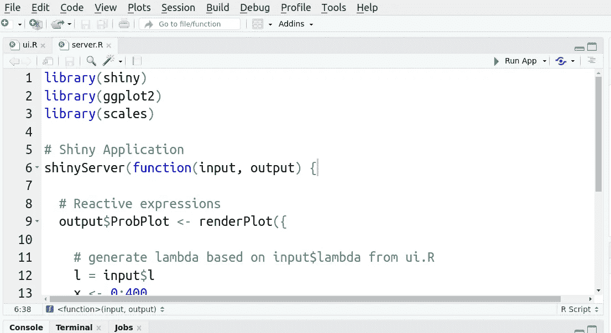
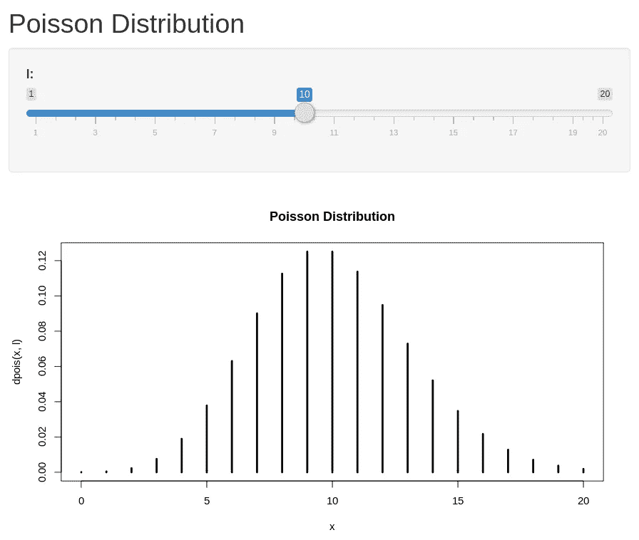

# 用闪亮的 Web 应用生成泊松分布

> 原文：<https://towardsdatascience.com/generating-poisson-distributions-with-shiny-web-apps-9c3352a006ab?source=collection_archive---------47----------------------->

## 使用闪亮的网络应用程序进行交互式概率分析

泊松分布使我们能够想象在给定的时间间隔内一个事件发生的概率。这些事件必须相互独立。

这方面的一些例子可能是:

*   一个人每周收到的电子邮件数量(假设电子邮件相互独立到达)
*   给定时间间隔内极端天气事件的数量，例如一个国家每 10 年发生一次异常寒潮的概率
*   一家公司在一周内的产品销售数量

# 例子

让我们以酒店取消为例(Antonio、Almeida 和 Nunes 的数据和研究，可从下面的参考资料部分获得)。

假设在给定的一周内，酒店会有一定数量的预订取消。根据研究中的第一个数据集(H1)，酒店预计每周平均有 115 次预订取消。


来源:闪亮的网络应用

从上面我们可以看到，酒店预计每周最少有 90 次取消预订，最多有 150 次取消预订。

然而，一个闪亮的 Web 应用程序的优势在于，它允许我们动态地分析一系列不同的场景，由此可以操纵 **l** (我们的λ值)。

例如，研究中的另一家酒店(H2)平均每周有 287 次取消预订。让我们更改 lambda 值，看看这会如何影响分析。


来源:闪亮的网络应用

在这种情况下，我们看到每周大约有 230–330 次取消。这将允许酒店经理对每周可预期的酒店取消的大致数量进行概率评估。

也就是说，上述泊松分布可用于分析任何问题——只需知道*λ*值，并在必要时调整 x 轴，以说明特定数据集的整体值范围。

你为什么不自己试试这个模拟？

# 创建您自己的闪亮网络应用程序

要生成闪亮的 Web 应用程序，请执行以下操作:

1.  打开 RStudio，点击**文件- >新文件- >闪亮 Web App** 。
2.  选择**多文件**并为您的应用程序指定一个名称。
3.  在 **ui 中。R** ，粘贴以下内容:

```
library(shiny)# Define UI for application that draws a Poisson probability plot
shinyUI(fluidPage(

  # Application title
  titlePanel("Poisson Distribution"),

  # Sidebar with a slider input for value of lambda
  sidebarLayout(
    sidebarPanel(
      sliderInput("l",
                  "l:",
                  min = 1,
                  max = 400,
                  value = 1)
    ),

    # Show a plot of the generated probability plot
    mainPanel(
      plotOutput("ProbPlot")
    )
  )
))
```

4.在**服务器中。R** ，粘贴以下内容:

```
library(shiny)
library(ggplot2)
library(scales)# Shiny Application
shinyServer(function(input, output) {

  # Reactive expressions
  output$ProbPlot <- renderPlot({

    # generate lambda based on input$lambda from ui.R
    l = input$l
    x <- 0:400

    # generate trials based on lambda value
    muCalculation <- function(x, lambda) {dpois(x, l=lambda)}
    probability_at_lambda <- sapply(input$x, muCalculation, seq(1, 400, 0.01))
    # draw the probability
    plot(x, dpois(x, l), type='h',lwd=3)
    title(main="Poisson Distribution")
  })

})
```

5.完成后，点击控制台右上角的**运行应用**:



资料来源:RStudio

现在，您将看到一个动态泊松分布，其中 **l (lambda)** 可以动态调整:)


来源:闪亮的网络应用

现在，假设你想调整音阶。如果您正在处理一个小得多的问题，例如，您平均每天收到 10 封电子邮件，并且想知道这个时间间隔的最小值和最大值，该怎么办？

在 ui 中。r，我们把最大 lambda 值设为 20。

```
# Sidebar with a slider input for value of lambda
  sidebarLayout(
    sidebarPanel(
      sliderInput("l",
                  "l:",
                  min = 1,
                  max = 20,
                  value = 1)
```

在服务器中。r， **x** 的值和顺序可以调整。让我们将最大范围设置为 20。

```
x <- 0:20
probability_at_lambda <- sapply(input$x, muCalculation, seq(1, 20, 0.01))
```

假设 **l = 10** ，下面是现在的分布图:



来源:闪亮的网络应用

# 结论

泊松分布在分析给定时间间隔内一定数量的事件发生的概率时非常有用——当我们可以使用闪亮的 Web 应用程序进行动态分析时甚至更有用！

非常感谢您阅读本文，感谢您的任何问题或反馈。

您还可以找到我的 GitHub(MGCodesandStats/shiny-we b-apps)的链接，其中包含下面的代码脚本，以及其他有用的参考资料。

*免责声明:本文是在“原样”的基础上编写的，没有担保。本文旨在提供数据科学概念的概述，不应以任何方式解释为专业建议。*

# 参考

*   [安东尼奥、阿尔梅达、努内斯，2016。使用数据科学预测酒店预订取消](https://www.researchgate.net/publication/309379684_Using_Data_Science_to_Predict_Hotel_Booking_Cancellations)
*   [GitHub:MGCodesandStats/hotel-modeling](https://github.com/MGCodesandStats/hotel-modelling)
*   [GitHub:MGCodesandStats/shiny-web-apps](https://github.com/MGCodesandStats/shiny-web-apps)
*   [R 文档:泊松分布](https://stat.ethz.ch/R-manual/R-devel/library/stats/html/Poisson.html)