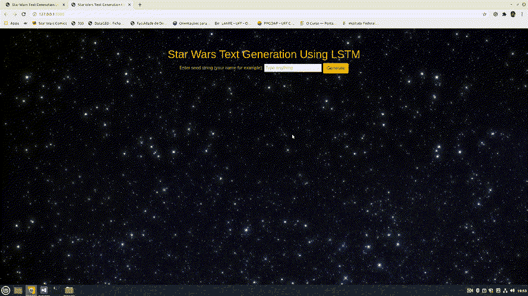

# 用 LSTM 的生成简短的星球大战文本

> 原文：<https://towardsdatascience.com/generating-short-star-wars-text-with-lstms-c7dc65e252c4?source=collection_archive---------42----------------------->

## “会说话并不会让你变得聪明”——绝地大师魁刚·金。

毫无疑问，我是那些被称为“星球大战迷”的人中的一员。我记得小时候在电视上看《幽灵的威胁》时被它震撼了(我知道，这不是一部伟大的电影)。后来，我看了《T2》中的《克隆人的进攻》和《T4》中的《西斯的复仇》(这是影院上映的最后一部电影)，接着又看了原版三部曲的 DVD，那时这些电影还在上映。作为一个成年人，我在右臂上纹了一个 Tie 战士的纹身，这让我达到了高潮。

对《星球大战》的热情很好地回答了“我应该做什么样的 NLP 项目？”；我想开发一个完整的[自然语言处理](https://chatbotslife.com/)项目，边做边练习一些技能。

这是一个关于 LSTM 氏症的项目实验的简要文档，以及如何训练一个语言模型来在字符级别上生成特定域内的文本。给定一个种子标题，它通过一个 API 编写一个简短的描述。该模型是使用 Tensorflow 从零开始构建的，没有迁移学习。它使用了来自 Wookiepedia.com 的文本，Fandom.com 的团队(负责管理网站)非常友好地允许我使用网络抓取器收集数据并发表这篇文章。

# 最终产品

下面可以看到工作模型的演示。



作者图片

# 要求

为了复制这个模型，你需要从[这里](https://github.com/Pedrohgv/Star-Wars-Text-Generation)下载代码。然后，安装所有需要的依赖项(强烈建议创建一个新的虚拟环境，并在其上安装所有软件包),如果您使用的是 Linux，则:

```
pip install -r requirements-linux.txt
```

但是，如果您使用的是 Windows，只需使用:

```
pip install -r requirements-windows.txt
```

在安装了所有依赖项之后，您需要经过训练的模型能够生成任何文本。由于 GitHub 上的大小限制，模型必须从[这里](https://drive.google.com/drive/folders/1JTzVV8uir74BlqF9HXtYMZdIu_4ZDpBP?usp=sharing)下载。只需下载整个*模型*文件夹，并将其放在*部署*文件夹下。最后，激活安装了所有依赖项的环境，并在下载项目的文件夹中打开终端，键入:

```
python deploy/deploy.py
```

# 该项目

下面是所有使用的重要库的列表:

*   美丽的声音
*   要求
*   Lxml
*   熊猫
*   Numpy
*   MatplotLib
*   张量流
*   瓶
*   超文本标记语言
*   半铸钢ˌ钢性铸铁(Cast Semi-Steel)

我们现在将检查项目的所有主要部分。

# 数据处理

用于训练模型的文本是使用网络报废从[伍基人百科网站](https://starwars.fandom.com/wiki/Main_Page)(一种星球大战维基百科)中挖掘出来的。用于该任务的所有代码都在 [wookiescraper.py](https://github.com/Pedrohgv/Star-Wars-Text-Generation/blob/master/wookiescraper.py) 文件中，并且创建了一个类`Article`来构造文本，每篇文章都包含一个标题、主题描述(这将是文章页面上的第一个简要描述)以及它们所属的类别。提取数据的主要库是 beautifulsoup、requests 和 Pandas(在数据帧中存储文本)。

为了列出所有可能的文章，调用了函数`create_complete_database`。它创建了一个所有佳能文章的 URL 列表(在《星球大战》宇宙中，所有在书籍、漫画和视频游戏等替代媒体中产生的故事都被重新启动；旧的故事被贴上“*传说*的标签，而仍然是官方的故事和新的故事被认为是*经典*。然后，它通过使用 *Article* 类自己的函数下载并创建列表中的每篇文章。然后创建一个包含所有下载文章的数据框架，并保存在一个*完整的 Database.csv* 文件中。

为了给模型提供信息，我们还必须处理获得的数据；文件 [data_processor.py](https://github.com/Pedrohgv/Star-Wars-Text-Generation/blob/master/data_processor.py) 包含该任务使用的所有代码。函数`clean_data`获取文本的数据帧，并通过删除不需要的字符和缩短文本对其进行格式化(这是必须要做的，因为我们正在创建一个在字符级别上工作的模型，该模型将很难从较长的句子中学习模式和上下文)。该文件还包含将给定的文本语料库转换成*单热点*向量的函数，反之亦然，以及*数据集生成器*函数；函数`build_datasets`将构建一个 *training_dataset* 和一个 *validation_dataset* ，而不是在训练期间将所有数据加载到内存中，每一个都是 Tensorflow *Dataset* 对象，它们在训练期间处理数据并将数据作为块馈送到模型中。

# 模型和培训

[LSTM](https://en.wikipedia.org/wiki/Long_short-term_memory) 是一种递归神经网络细胞，在长数据序列中具有更高的信息保持能力。因为这个特性，它在处理 [NLP](https://chatbotslife.com/ultimate-guide-to-leveraging-nlp-machine-learning-for-you-chatbot-531ff2dd870c) 问题时非常有用。对于这个项目，使用了一个[序列到序列](https://blog.keras.io/a-ten-minute-introduction-to-sequence-to-sequence-learning-in-keras.html)架构来生成输出句子。在这种方法中，输入字符串(文章的标题)被提供给编码器，编码器按顺序逐个字符地处理数据，并传递包含输入信息的编码向量。然后，解码器将使用此信息再次按顺序逐个字符地生成新的嵌入向量，该向量将进入 softmax 层以生成概率向量，每个可能的字符一个值。每个输出字符在前一个字符之后生成，总是使用包含编码器生成的输入信息的向量。创建和训练模型的代码在文件 [run.py](https://github.com/Pedrohgv/Star-Wars-Text-Generation/blob/master/run.py) 中。

在 GPU 初始化和词汇定义之后，创建了一个`config`字典，以使超参数调整更容易:

```
# enable memory growth to be able to work with GPU
GPU = tf.config.experimental.get_visible_devices('GPU')[0]
tf.config.experimental.set_memory_growth(GPU, enable=True)# set tensorflow to work with float64
tf.keras.backend.set_floatx('float64')# the new line character (\n) is the 'end of sentence', therefore there is no need to add a '[STOP]' character
vocab = 'c-y5i8"j\'fk,theqm:/.wnlrdg0u1 v\n4b97)o36z2axs(p'
vocab = list(vocab) + ['[START]']config = {  # dictionary that contains the training set up. Will be saved as a JSON file
    'DIM_VOCAB': len(vocab),
    'MAX_LEN_TITLE': MAX_LEN_TITLE,
    'MAX_LEN_TEXT': MAX_LEN_TEXT,
    'DIM_LSTM_LAYER': 512,
    'ENCODER_DEPTH': 2,
    'DECODER_DEPTH': 2,
    'LEARNING_RATE': 0.0005,
    'BATCH_SIZE': 16,
    'EPOCHS': 100,
    'SEED': 1,
    # 'GRAD_VAL_CLIP': 0.5,
    # 'GRAD_NORM_CLIP': 1,
    'DECAY_AT_10_EPOCHS': 0.9,
    'DROPOUT': 0.2,
}
```

为了使结果具有可重复性，还将使用种子:

```
tf.random.set_seed(config['SEED'])
```

之后，最后，采集的数据被加载到数据帧中，进行清理，现在可以设置新的配置选项，如训练/验证分割:

```
data = pd.read_csv('Complete Database.csv', index_col=0)data = clean_data(data)config['STEPS_PER_EPOCH'] = int((data.shape[0] - 1500) / config['BATCH_SIZE'])
config['VALIDATION_SAMPLES'] = int(
    data.shape[0]) - (config['STEPS_PER_EPOCH'] * config['BATCH_SIZE'])
config['VALIDATION_STEPS'] = int(
    np.floor(config['VALIDATION_SAMPLES'] / config['BATCH_SIZE']))
```

然后定义学习率。在这个项目中，一个指数衰减的学习率被证明可以给出最好的结果:

```
# configures the learning rate to be decayed by the value specified at config['DECAY_AT_10_EPOCHS'] at each 10 epochs, but to that gradually at each epoch
learning_rate = ExponentialDecay(initial_learning_rate=config['LEARNING_RATE'],
                                decay_steps=config['STEPS_PER_EPOCH'],
                                decay_rate=np.power(
                                    config['DECAY_AT_10_EPOCHS'], 1/10),
                                staircase=True)
```

加载数据后，现在可以构建训练数据集和验证数据集:

```
training_dataset, validation_dataset = build_datasets(
    data, seed=config['SEED'], validation_samples=config['VALIDATION_SAMPLES'], batch=config['BATCH_SIZE'], vocab=vocab)
```

以训练后保存模型为目标，将选择一条路径。该文件夹将以通用名称命名，然后更改为模型完成训练的具体时间。此外，词汇和模型配置都将保存为`json`文件。

```
folder_path = 'Training Logs/Training'  # creates folder to save traning logs
if not os.path.exists(folder_path):
    os.makedirs(folder_path)# saves the training configuration as a JSON file
with open(folder_path + '/config.json', 'w') as json_file:
    json.dump(config, json_file, indent=4)

# saves the vocab used as a JSON file
with open(folder_path + '/vocab.json', 'w') as json_file:  
    json.dump(vocab, json_file, indent=4)
```

为了监控模型，使用了一些回调函数(在训练期间以指定的时间间隔调用的函数)。这些函数包含在 [callbacks.py](https://github.com/Pedrohgv/Star-Wars-Text-Generation/blob/master/callbacks.py) 文件中。创建了一个自定义类`CallbackPlot`，以便在整个训练过程中绘制训练误差。Tensorflow 回调类`ModelCheckpoint`和`CSVLogger`的对象也被实例化，以便分别保存训练时的模型和训练日志:

```
loss_plot_settings = {'variables': {'loss': 'Training loss',
                                    'val_loss': 'Validation loss'},
                    'title': 'Losses',
                    'ylabel': 'Epoch Loss'}last_5_plot_settings = {'variables': {'loss': 'Training loss',
                                    'val_loss': 'Validation loss'},
                        'title': 'Losses',
                        'ylabel': 'Epoch Loss',
                        'last_epochs': 5}plot_callback = CallbackPlot(folder_path=folder_path,
                            plots_settings=[
                                loss_plot_settings, last_5_plot_settings],
                            title='Losses', share_x=False)model_checkpoint_callback = ModelCheckpoint(
    filepath=folder_path + '/trained_model.h5')csv_logger = CSVLogger(filename=folder_path +
                    '/Training logs.csv', separator=',', append=False)
```

最后，可以构建、编译和训练模型:

```
###### BUILDS MODEL FROM SCRATCH WITH MULTI LAYER LSTM ###########
tf.keras.backend.clear_session()  # destroys the current graphencoder_inputs = Input(shape=(None, config['DIM_VOCAB']), name='encoder_input')
enc_internal_tensor = encoder_inputsfor i in range(config['ENCODER_DEPTH']):
    encoder_LSTM = LSTM(units=config['DIM_LSTM_LAYER'],
                        batch_input_shape=(
                            config['BATCH_SIZE'], MAX_LEN_TITLE, enc_internal_tensor.shape[-1]),
                        return_sequences=True, return_state=True,
                        name='encoder_LSTM_' + str(i), dropout=config['DROPOUT'])
    enc_internal_tensor, enc_memory_state, enc_carry_state = encoder_LSTM(
        enc_internal_tensor)  # only the last states are of interestdecoder_inputs = Input(shape=(None, config['DIM_VOCAB']), name='decoder_input')
dec_internal_tensor = decoder_inputsfor i in range(config['DECODER_DEPTH']):
    decoder_LSTM = LSTM(units=config['DIM_LSTM_LAYER'],
                        batch_input_shape=(
                            config['BATCH_SIZE'], MAX_LEN_TEXT, dec_internal_tensor.shape[-1]),
                        return_sequences=True, return_state=True,
                        name='decoder_LSTM_' + str(i), dropout=config['DROPOUT'])  # return_state must be set in order to retrieve the internal states in inference model later
    # every LSTM layer in the decoder model have their states initialized with states from last time step from last LSTM layer in the encoder
    dec_internal_tensor, _, _ = decoder_LSTM(dec_internal_tensor, initial_state=[
                                            enc_memory_state, enc_carry_state])decoder_output = dec_internal_tensordense = Dense(units=config['DIM_VOCAB'], activation='softmax', name='output')
dense_output = dense(decoder_output)model = Model(inputs=[encoder_inputs, decoder_inputs], outputs=dense_output)model.compile(optimizer=optimizer, loss='categorical_crossentropy')history = model.fit(x=training_dataset,
                    epochs=config['EPOCHS'],
                    steps_per_epoch=config['STEPS_PER_EPOCH'],
                    callbacks=[plot_callback, csv_logger,
                            model_checkpoint_callback],
                    validation_data=validation_dataset,
                    validation_steps=config['VALIDATION_STEPS'])
```

训练后，文件夹将包含与本次训练相关的所有数据，如损失函数图、不同时间步长的误差以及模型本身。

```
model.save(folder_path + '/trained_model.h5', save_format='h5')
model.save_weights(folder_path + '/trained_model_weights.h5')
plot_model(model, to_file=folder_path + '/model_layout.png', show_shapes=True, show_layer_names=True, rankdir='LR') timestamp_end = datetime.now().strftime('%d-%b-%y -- %H:%M:%S')# renames the training folder with the end-of-training timestamp
root, _ = os.path.split(folder_path)timestamp_end = timestamp_end.replace(':', '-')
os.rename(folder_path, root + '/' + 'Training Session - ' + timestamp_end)print("Training Successfully finished.")
```

# 部署

为了服务于该模型，使用 Flask 包构建了一个简单的接口，其代码可以在 [deploy](https://github.com/Pedrohgv/Star-Wars-Text-Generation/tree/master/deploy) 文件夹下找到。

# 结论

经过训练后，该模型能够在给定种子字符串的情况下生成句子。下面是生成句子和用于生成句子的种子字符串的一些示例(我将使用我的猫的名字作为示例，但是因为它们已经被称为 Luke、Han 和 Leia，所以它们已经存在于训练数据集中):

*   佩德罗:佩德罗是一名男性人类，在瑞博·l·阿拉内特·奥尼号上担任指挥官。
*   佩德罗·恩里克:佩德罗·欧索农是一名人类女性，在银河共和国的加巴尔形态中担任指挥官。
*   奇科是一名塔姆泰德人，作为银河帝国的指挥官为银河帝国服务。
*   莎拉:莎拉是一名人类男性，在银河内战期间，他在共和军中担任指挥官。

从上面可以看出，该模型学习了如何合理地形成一些单词，如何确定这些单词的大小，如何正确地结束一个句子，以及如何形成某种上下文。然而，它似乎严重偏向于总是描述在《星球大战》宇宙中的一个派系下服务的人类。这可以用这样一个事实来解释，即模型的架构不是使用单词嵌入构建的(这将允许更复杂的上下文学习)，因为有几个单词是《星球大战》独有的。我对未来项目的一个好主意将是为星球大战宇宙生成一个特定的单词嵌入，然后使用它来生成新的文本。