# 通过无监督学习生成 Spotify 播放列表

> 原文：<https://towardsdatascience.com/generating-spotify-playlists-with-unsupervised-learning-abac60182022?source=collection_archive---------25----------------------->

## [数字音乐](https://towardsdatascience.com/tagged/music-by-numbers)

## 人工智能能区分愚蠢的朋克和混蛋吗？


图片— [Stas Knop on Pexels](https://www.pexels.com/photo/black-cassette-tape-on-top-of-red-and-yellow-surface-1626481/)

在[这个系列](https://towardsdatascience.com/tagged/music-by-numbers) ' [之前的博客](/analysing-the-greatest-show-on-earth-e234f611e110)中，我们探索了音乐流媒体巨头 Spotify 如何创建算法，完全基于其波形自动描述任何歌曲的[音乐质量。这些算法可以计算一些显而易见的音乐属性(例如，一首歌有多快，它的调是什么)。然而，他们也可以得到更微妙的措施；一首歌有多快乐？是冰镇还是高能？你能随着它跳舞吗？](https://developer.spotify.com/documentation/web-api/reference/tracks/get-audio-features/)

为了看看这是如何工作的，我创建了一个播放列表，比如说，一些折衷的内容——Kendrick Lamar 到黑色安息日，通过披头士和 Billie Eilish。当然，还有德帕西托。

让我们看看 Spotify 如何根据各种音频特征指标对这些歌曲进行分类(这些指标的完整描述可以在[之前的博客](/analysing-the-greatest-show-on-earth-e234f611e110)中找到)。

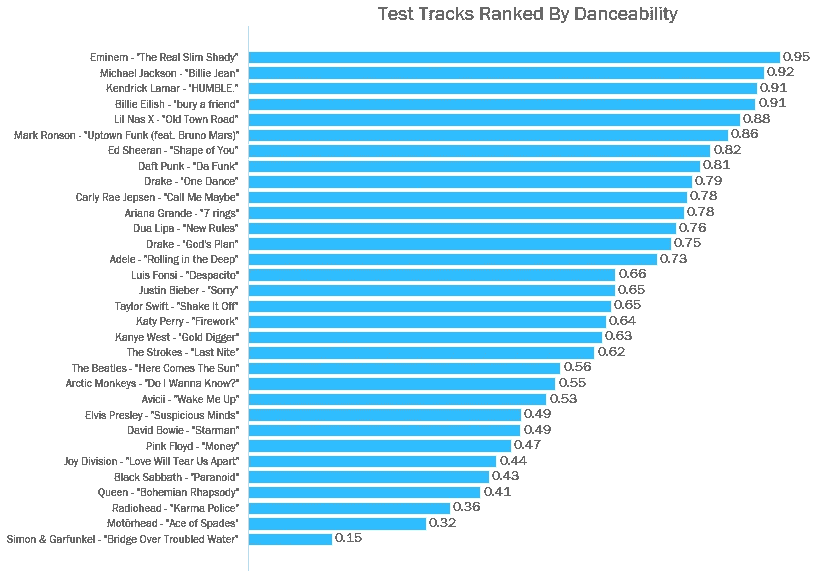

节奏稳定、不间断的歌曲被认为更适合跳舞——因此像《真正的苗条阴影》和《卑微》这样的说唱歌曲得分很高。

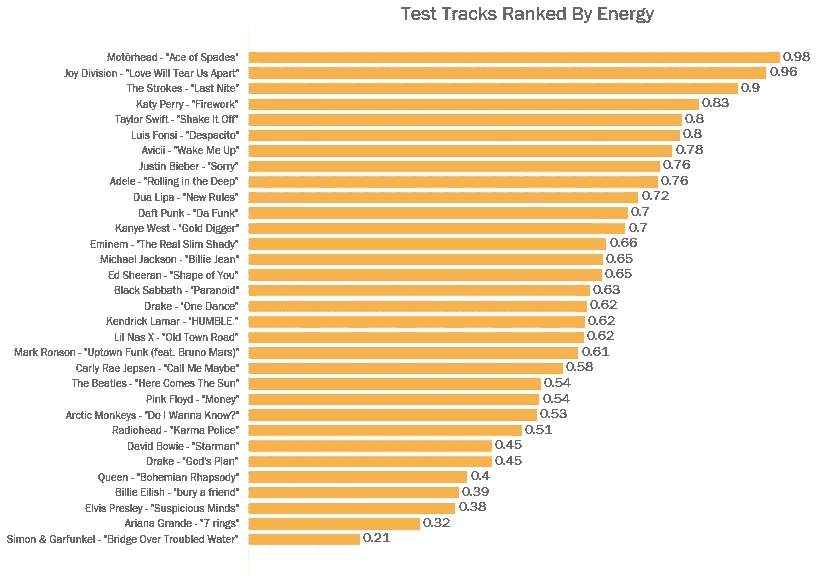

正如我们在之前的博客中提到的，可跳舞性和能量并不像我们预期的那样高度相关。《黑桃 a》是最有活力的曲目，看过 motrhead 现场演出的人都不会感到惊讶。

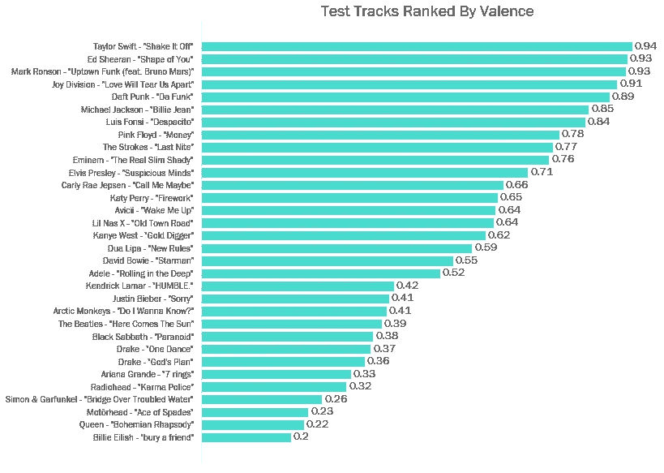

回忆——高价曲目是‘快乐和欣快’，低价曲目是‘阴郁和悲伤’。看到比莉·埃利什在这个排名中垫底，我们不应该感到惊讶。

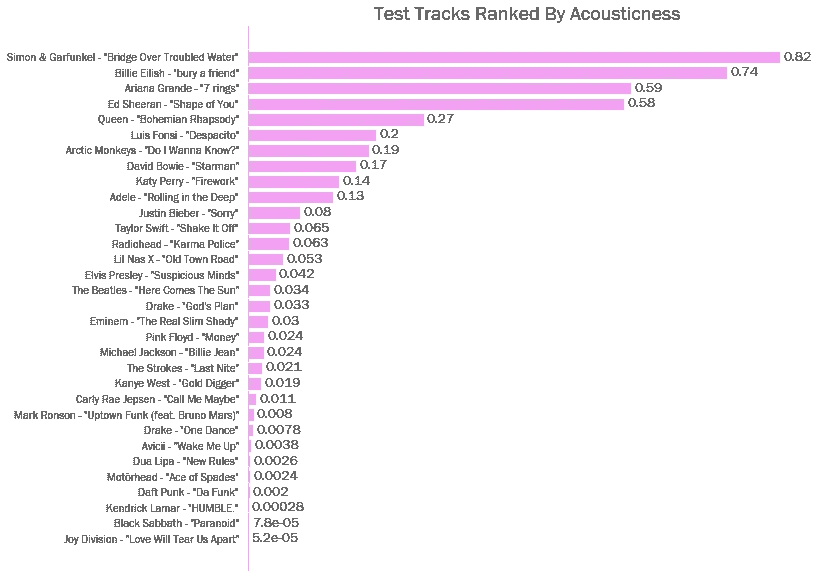

在这里，Spotify 给出了一个从 0 到 1 的置信度，来判断该曲目是否是原声的。“多灾多难的水上桥梁”被正确识别。黑色安息日的重金属敏感性也在排名中垫底。

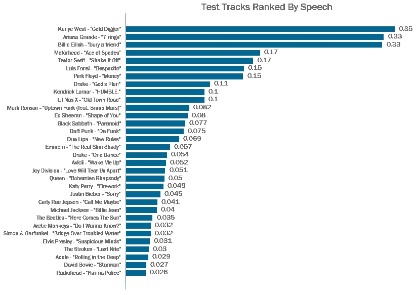

“Speechiness”试图在音频文件中查找口语单词。播客得分接近 1，说唱音乐通常在 0.2 到 0.5 之间。

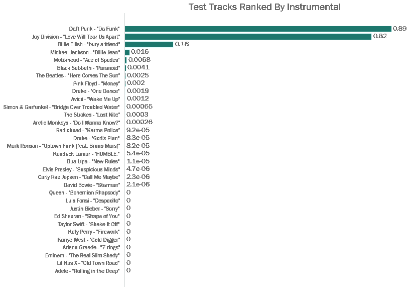

Spotify 正确地指出了播放列表中的一首器乐歌曲(蠢朋克)，尽管也认为 Joy Division 是器乐歌曲(可能是因为伊恩·柯蒂斯的演唱风格，以及它在整体混音中的位置)。

当然，我们可以用这些方法来思考哪些歌曲在发音上*和*相似。让我们暂时保持简单，并假设歌曲只有两个特征——舞蹈性和效价。这两个度量都取 0 到 1 之间的值，所以我们可以通过它们在散点上的两点之间的(欧几里德)距离来推断两首歌有多相似。

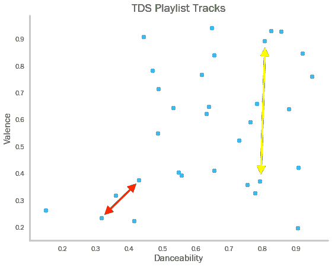

由红色箭头分隔的歌曲比由黄色箭头分隔的歌曲更“相似”，尽管第二对歌曲具有非常相似的舞蹈性。

我们可以扩展这个逻辑。给定播放列表中的一首歌曲，我们可以通过在散点上找到最近的 *n* 点来计算出 *n* 最相似的曲目。但是我们可以做得更复杂——假设我们想把这 32 首歌分成给定数量的播放列表(比如 5 首)。然后，我们需要某种方法来获取上面的散点图，并将这些点分成五个不同的组，其中组内的歌曲彼此“最佳相似”。

如果这听起来很像集群的用例，那是因为它是。具体来说，我们可以部署“[分层聚集聚类](https://en.wikipedia.org/wiki/Hierarchical_clustering#Agglomerative_clustering_example)”(HAC)。用外行人的话来说，HAC 首先将每个单独的点视为其自身的一组点。然后，它合并两个彼此“最接近”的现有集群(注意；在这种情况下,“距离”的定义是可变的——我们稍后将对此进行探讨)。HAC 算法将反复合并“闭合”聚类，直到得出所有数据点都属于一个聚类的自然结论。

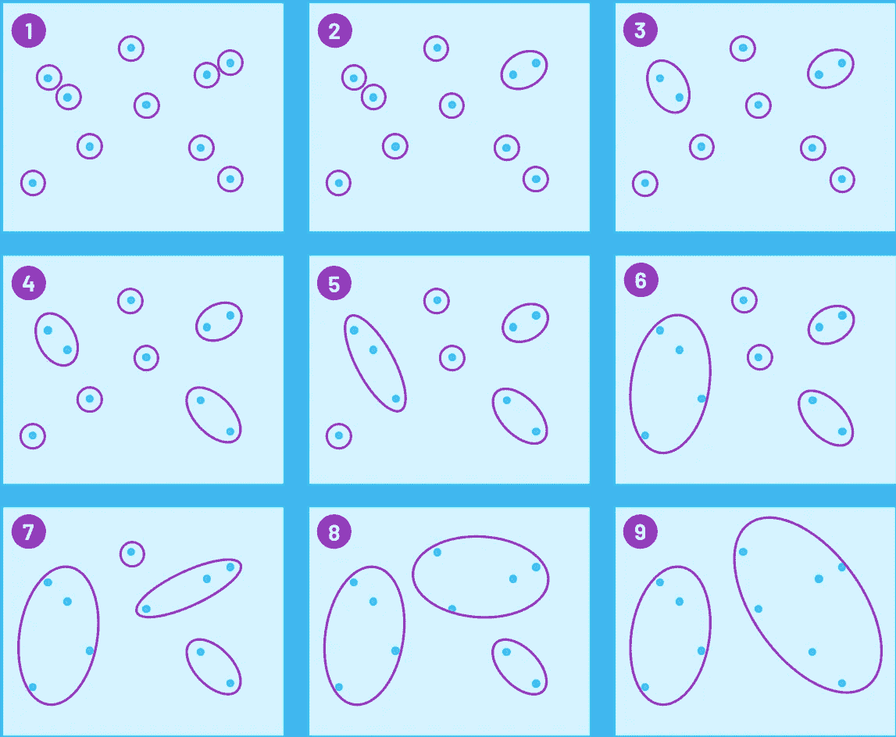

HAC 阶段的示例-请记住，每个点都被视为一个“集群”，因此各个集群的数量随着每个阶段而减少

如前所述，算法如何考虑两个现有集群之间的“距离”是可变的。sci kit-lean 提供了三种“连锁标准”作为其 [HAC 包](https://scikit-learn.org/stable/modules/generated/sklearn.cluster.AgglomerativeClustering.html#sklearn.cluster.AgglomerativeClustering)的一部分:

*   **沃德**(默认):选择两个聚类合并，使所有聚类内的方差增加最小。一般来说，这导致了大小相当的集群。
*   **平均**:合并所有点间 ***平均*** 距离最小的两簇。
*   **完成**(或称最大联动):合并两个点间 ***最大*** 距离最小的聚类。

考虑到 HAC 处理的是“距离”——抽象的或其他的——我们需要在将数据输入聚类算法之前对其进行[标准缩放](https://scikit-learn.org/stable/modules/generated/sklearn.preprocessing.StandardScaler.html)。这确保了我们的最终结果不会被特征单元扭曲。例如，速度通常在每分钟 70 到 180 拍之间，而大多数其他小节在 0 到 1 之间。如果没有缩放，两首节奏非常不同的歌曲将总是“相距甚远”，即使它们在其他指标上完全相同。

幸运的是，使用 Scikit-Learn 的标准缩放和 HAC 非常简单:

```
**from** sklearn.preprocessing **import** StandardScalersclaer = StandardScaler()
X_scaled = scaler.fit_transform(X)***#This scaled data can then be fed into the HAC alorithm* from** sklearn.cluster **import** AgglomerativeClustering***#We can tell it how many clusters we're aiming for***
agg_clust = AgglomerativeClustering(n_clusters=3)
assigned_clusters = agg_clust.fit_predict(X_scaled)
```

让我们将 HAC 应用到我们的播放列表中(记住，我们仍然将自己限制在两个维度上——水平轴上是 danceability，垂直轴上是 valence)。我们可以看到不同颜色的数量随着星团的融合而减少。

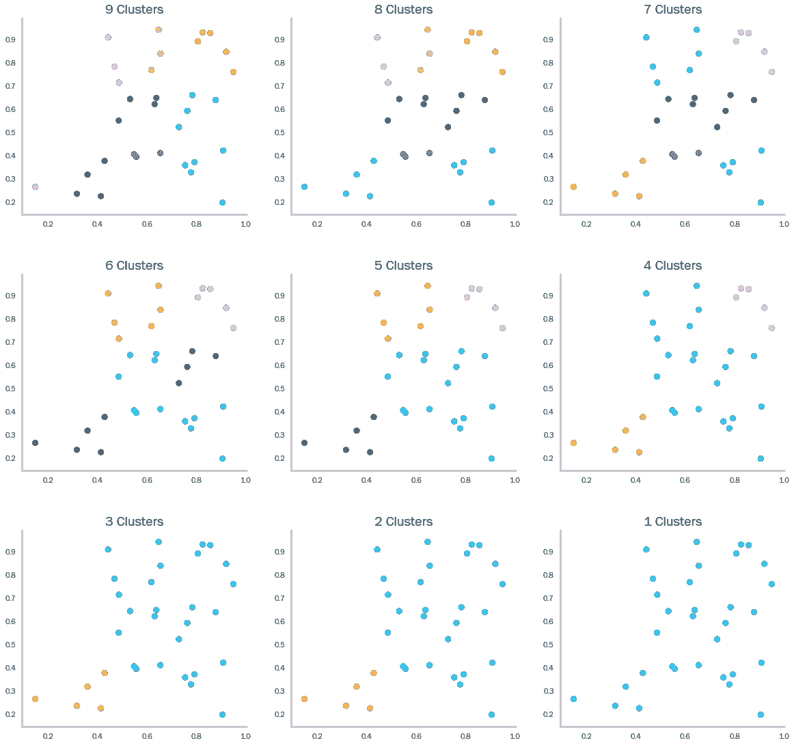

当然，由于两点之间的距离可以用二维来定义，所以也可以用三维来定义——下图显示了当我们添加第三个度量(“能量”)时，HAC 算法如何创建四个聚类。

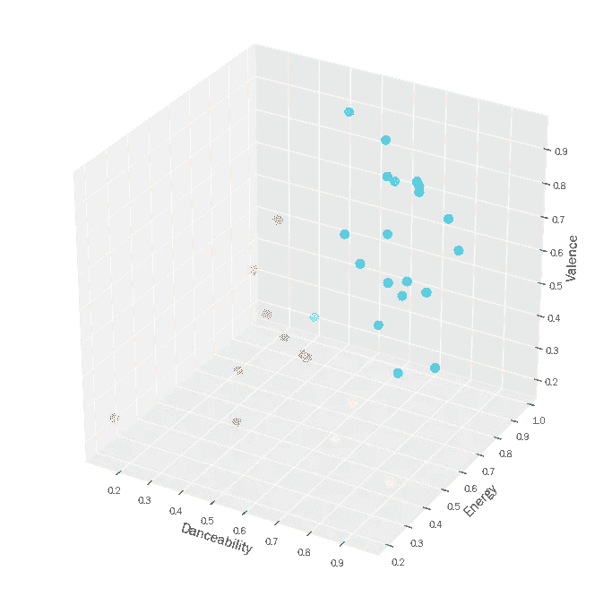

接下来，我们可以继续添加维度，以同样的方式计算点之间的“距离”，我们只是失去了在“网格”上可视化结果的能力。然而，我们可以通过[树状图](https://en.wikipedia.org/wiki/Dendrogram)来查看结果。按照下图从左到右，我们看到不同的歌曲是如何链接在一起成为越来越大的集群。

注意——水平距离表示两个链接的簇有多“接近”,较长的线表示歌曲“相距较远”。如果我们想要创建 *n* 个集群，我们可以使用树状图来完成。我们只需要在图表的适当位置画一条垂直的直线——不管相交多少条直线，都是创建的集群数。

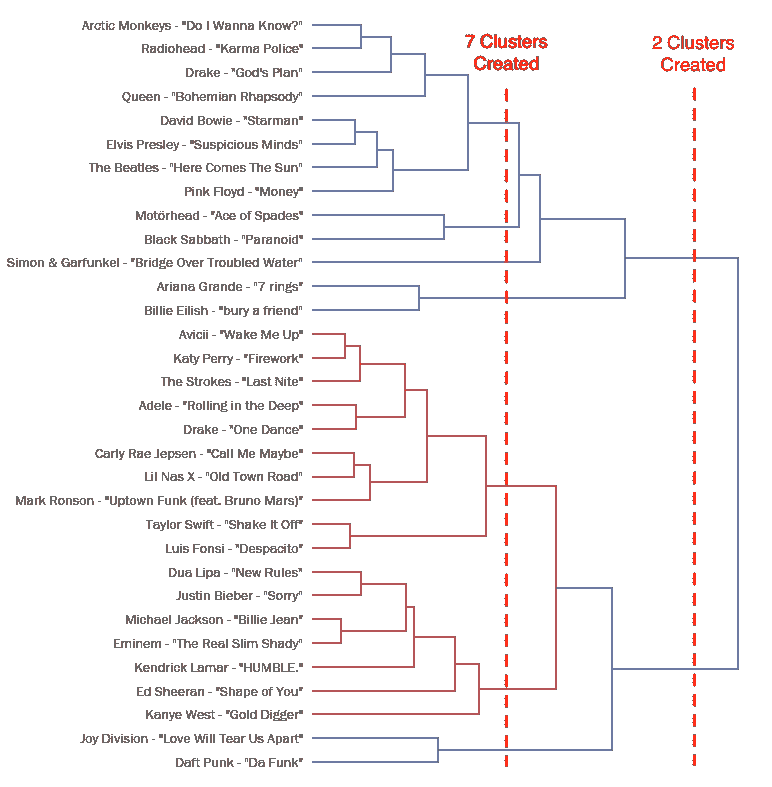

可以说，这种聚类分析得出了一些有趣的结果。北极猴子和电台司令是显而易见的伙伴，杜阿·利帕和贾斯汀·比伯，莫特海德和黑色安息日也是如此。鲍伊、披头士、平克·弗洛伊德和埃尔维斯·普雷斯利听起来也是一个合理的组合，尽管迈克尔·杰克逊和阿姆是一个令人惊讶的组合。不过，总而言之，我们可以说，Spotify 的 metrics 结合 HAC，在对类似歌曲进行分组方面做得相当不错。

在接下来的几篇博客中，我们将看看如何用数学方法测量聚类结果的质量。然后，我们将从数千首歌曲中制作相似歌曲的播放列表，并研究如何使用 Spotify 的 API 将这些新的播放列表直接上传到用户的个人资料中。

> 这是我的“ [Music By Numbers](https://towardsdatascience.com/tagged/music-by-numbers) ”专栏中的最新博客，它使用数据来讲述关于音乐的故事。我很乐意听到对以上分析的任何评论——欢迎在下面留言，或者通过 [LinkedIn](https://www.linkedin.com/in/callum-ballard/) 联系我！