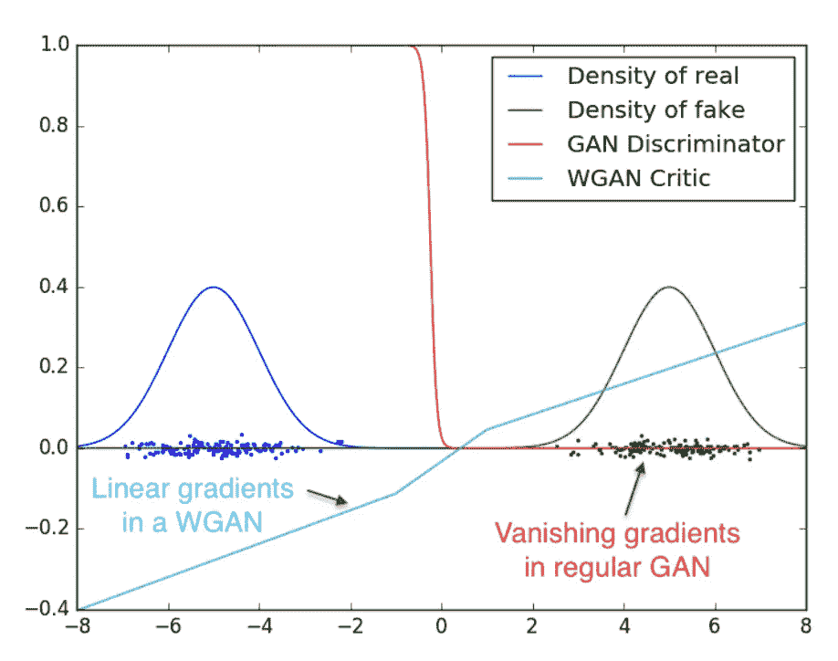

# 用 WGANs 生成合成金融时间序列

> 原文：<https://towardsdatascience.com/generating-synthetic-financial-time-series-with-wgans-e03596eb7185?source=collection_archive---------18----------------------->

寻找稳定的平衡——泰勒·米利根在 Unsplash 上的照片

## Pytorch 代码的首次实验

# 介绍

过度拟合是研究人员在尝试将机器学习技术应用于时间序列时遇到的问题之一。出现这个问题是因为我们使用我们已知的唯一时间序列路径训练我们的模型:实现的历史。毕竟，我们一生只见过这个世界的一种状态:无聊，不是吗？=)

特别是，并非所有可能的市场机制或事件都能在我们的数据中得到很好的体现。事实上，极不可能发生的事件，如异常高波动时期，通常会被低估，这使得模型无法得到足够好的训练。所以，当这些经过训练的算法面对新的场景时，它们可能会失败；如果我们在没有任何预防措施的情况下让它们生产足够长的时间，这种情况就会发生。

现在，如果我们可以教一个模型为相同的资产生成新的数据，会怎么样呢？如果我们有一种工具，可以产生与原始时间序列具有相同统计特性的替代现实时间序列，会怎么样？有了这样的工具，我们可以用关于不可能发生的事件或罕见的市场机制的数据来扩充我们的训练集；因此，研究人员将能够建立更好的模型，从业者将执行更好的模拟和交易回测。在这方面，最近在《金融数据科学杂志》上发表的[论文](https://jfds.pm-research.com/content/2/1/76.short)的作者展示了在合成数据上训练深度模型如何减轻过度拟合并提高性能。

事实证明，生成对抗网络(GANs)可以做到这一点。GANs 是一个机器学习框架，其中两个神经网络，一个生成器(G)和一个鉴别器(D)，互相玩游戏，前者试图欺骗后者生成类似真实事物的假数据。当我说“游戏”时，我指的是这里的博弈论！

然而，没有人应该获胜:GAN 的研究人员总是在 G 和 D 之间寻找纳什均衡，希望——GAN 可能很难训练——**生成器已经学会如何产生虚假但真实的样本**，鉴别器的最佳选择是随机猜测。

# 本文的目的

我在这里的目的不是深入研究 GANs 的理论(网上有很好的论文和资源)，而是简单地触及基础，分享我和我的队友兼朋友 Andrea Politano 的实验结果。

虽然我们的最终目标是使用一个或多个经过训练的生成器一次生成多个时间序列，但我们选择从简单开始，逐步进行。在这方面，我们首先检查 GANs 是否能够学习我们完全理解的数据生成过程(DGP)的系列。当然，只有少数人——如果有的话——理解金融资产回报的 DGP；因此，我们开始产生假正弦波。

# 我们的模型

我们首先对 Pytorch 数据集进行编码，以产生不同的正弦函数。Pytorch 数据集是方便的实用程序，它使数据加载更容易，并提高了代码的可读性。点击查看[。](https://pytorch.org/tutorials/beginner/data_loading_tutorial.html)

Pytorch 数据集生成正弦

然后，我们选择了 [Wasserstein GAN](https://arxiv.org/abs/1701.07875) (WGAN)，因为这种特殊类型的模型具有坚实的理论基础，并显著提高了训练稳定性；此外，损失与生成器的收敛和样本质量相关-这非常有用，因为研究人员不需要不断检查生成的样本来了解模型是否在改进。最后，WGANs 比标准的 gan 对模式崩溃和架构变化更健壮。

## WGANs 和 gan 有什么不同？

标准 GAN 中的损失函数量化了训练和生成的数据分布之间的距离。事实上，GANs 基于这样的思想，随着训练的进行，模型的参数逐渐更新，并且 G 学习的分布收敛到真实的数据分布。这种收敛必须尽可能平滑，重要的是要记住**这个分布序列收敛的方式取决于我们如何计算每对分布之间的距离。**

现在，WGANs 与标准 gan 在量化距离的方式上有所不同。常规 gan 使用[Jensen–Shannon divergence](https://en.wikipedia.org/wiki/Jensen%E2%80%93Shannon_divergence)(JS)，而 WGANs 使用 [Wasserstein distance](https://en.wikipedia.org/wiki/Wasserstein_metric) ，其特征在于更好的属性。特别是，Wasserstein 度量是连续的，在任何地方都有良好的梯度，因此即使当真实分布和生成分布的支持位于非重叠低维流形中时，也允许更平滑的分布收敛**。**查看这篇好的[文章](https://lilianweng.github.io/lil-log/2017/08/20/from-GAN-to-WGAN.html)了解更多细节。

图片直接取自 WGANs 的原始文件。它显示了标准 GAN 的鉴别器如何饱和并导致梯度消失，而 WGAN critic 在空间的所有部分提供非常干净的梯度。

## 李普希茨约束

简单的 Wasserstein 距离是相当棘手的；因此，我们需要运用一个聪明的技巧——Kantorovich-Rubinstein 对偶——来克服这个障碍，获得我们问题的最终形式。按照理论，我们的瓦瑟斯坦度量的新形式中的函数 *f_w* 必定是 [K-Lipschitz 连续的](https://en.wikipedia.org/wiki/Lipschitz_continuity)。 *f_w* 由我们的评论家学习，属于参数化函数序列； *w* 代表一组参数，即权重。

目标函数的最终形式——瓦瑟斯坦度量。相对于真实分布计算第一期望，而相对于噪声分布计算第二期望。z 是潜在张量，g_theta(z)代表 g 产生的伪数据。这个目标函数表明，t *批评家并不直接归因于一个概率。相反，它被训练来学习 K-Lipschitz 连续函数，以帮助计算我们的 Wasserstein 距离的最终形式。*

我们说一个可微函数是 K-Lipschitz 连续的当且仅当它在任何地方都有范数至多为 K 的梯度。k 称为李普希茨常数。

Lipschitz 连续性是一种很有前途的改善 GANs 训练的技术。不幸的是，其实施仍然具有挑战性。事实上，这是一个活跃的研究领域，有几种方法可以加强约束。最初的 WGAN 论文提出了权重裁剪，但是我们采用了一种“[梯度惩罚](https://arxiv.org/abs/1704.00028)”(GP)方法，因为权重裁剪会导致容量问题，并且需要额外的参数来定义权重所在的空间。另一方面，GP 方法能够在几乎没有超参数调整的情况下实现更稳定的训练。

## 第一架构

我们的第一个架构来自这篇[论文](https://repository.tudelft.nl/islandora/object/uuid%3A51d69925-fb7b-4e82-9ba6-f8295f96705c)，其中提出了一个 WGAN-GP 架构来生成单变量合成金融时间序列——不从零开始总是一个好主意。所提出的架构混合了 G 和 D 中的线性层和卷积层，并且开箱即用。不幸的是，尽管最初的 WGAN-GP 论文明确规定**“无批判批次归一化”**，但使用这种设置训练看起来并不十分稳定，并且 D 是通过批次归一化(BN)实现的。

因此，我们摆脱了 BN，转而采用频谱归一化(SN)。简单来说，SN 确保 D 是 K-Lipschitz 连续的。为此，它逐步作用于你的批评家的每一层，以限制它的李普希兹常数。更多细节参见这篇伟大的[文章](https://christiancosgrove.com/blog/2018/01/04/spectral-normalization-explained.html)和这篇[论文](https://arxiv.org/abs/1802.05957)。

虽然从理论上讲 SN 可以消除损失中的 GP 项——SN 和 GP 应该被认为是加强 Lipschitz 连续性的替代方法——但我们的测试并不支持这一观点。然而，SN 提高了训练的稳定性并使收敛更快。因此，我们在 G 和 d 中都采用它。

最后，最初的 WGAN-GP 论文建议对 G 和 D 都使用 Adam 优化器，但是我们根据经验发现 RMSprop 更适合我们的需要。

批评家和生成器的 Pytorch 代码

要尝试一下，你还需要一段代码来计算损失，反向传递，更新模型权重，保存日志，训练样本等。你会在下面找到它。如果你需要更多关于如何使用这个代码的细节，请参考这个[回购](https://github.com/mirkosavasta/GANetano)。

培训师代码

# 结果

好消息是，我们的模型学会了生成真实的正弦样本；坏消息是正弦不是资产回报！=)那么，下一步如何增加我们对这种模式的信任呢？

用训练过的模型生成不同的真实正弦波

为什么我们不去掉简单的正弦信号，用来自一个我们知道参数的 ARMA 工艺的样本来填充 GAN 呢？！

我们选择一个简单的 ARMA(1，1)过程，其中 **p** =0.7 和 **q** =0.2，使用新的 Pytorch 数据集生成真实样本并训练模型。

Pytorch ARMA 数据集

我们现在生成一百个假样本，估计 **p** 和 **q** 和**看看下面的结果。***p***T22***q****是我们 DGP 唯一的参数。***

用训练模型生成的合成 ARMA(1，1)样本

对合成 ARMA 样本进行的参数估计的分布。可以看出，模型很好地学习了 DGP。事实上，这些分布的模式接近 DGP 的真实参数 p 和 q，它们分别是 0.7 和 0.2。

这些结果加强了我们的信任，并鼓励进一步的研究。

# 奖金部分

## 亏损应该是什么样的？

在我们的第一次实验中，我们不停地问自己会从损失中得到什么。当然，一切都取决于训练数据、优化算法和你选择的学习率，但我们根据经验发现，成功的训练的特点是损失，尽管在开始时不稳定，但随后会逐渐收敛到较低的值。在其他条件相同的情况下，降低学习率可以稳定训练。

发电机损耗示例

评论家的损失例子

## 如何检查模式崩溃？

为了检查模式崩溃，我们在训练期间每次生成假样本时都使用不同的潜在张量。通过这样的程序，我们可以检查对噪声空间的不同部分进行采样时会发生什么。如果你对不同的随机张量进行采样，而 G 一直产生相同的序列，那么你正在经历模式崩溃。=(

## GANs 比其他发电机制更有优势吗？

这是一个重要的问题，我想通过进一步的实验来回答:GANs 的复杂性必须通过明显更好的性能来证明。

## GP 限值

我们必须提到，根据这篇[论文](https://arxiv.org/abs/1904.01184)的作者，标准 GP 方法可能不是 Lipschitz 正则化的最佳实现。此外，频谱归一化可能会不必要地限制评论家，并削弱其为 g 提供声音梯度的能力。当标准方法失败时，作者提出了一种替代方法。我们将很快试验他们的建议。

## 为什么要训练 D 多于 G？

一个训练有素的 D 在 WGAN 环境中至关重要，因为评论家估计真实和虚假分布之间的 Wasserstein 距离。一个最佳的评论家将提供我们的距离度量的良好估计，这反过来将导致梯度是健康的！

## 文献学

*   *【2019】在 GANs 中实现 Lipschitz 连续性的高效和无偏实现—周，沈等*
*   *【2019】用生成式对抗网络丰富金融数据集，de Meer Pardo*
*   *【2018】生成性对抗网络的谱归一化——宫藤，片冈等*
*   *【2017】改善了 Wasserstein GANs — Gulrajani、Ahmed 等人的培训*
*   *【2017】wasser stein GAN—Arjovsky，Chintala 等人*