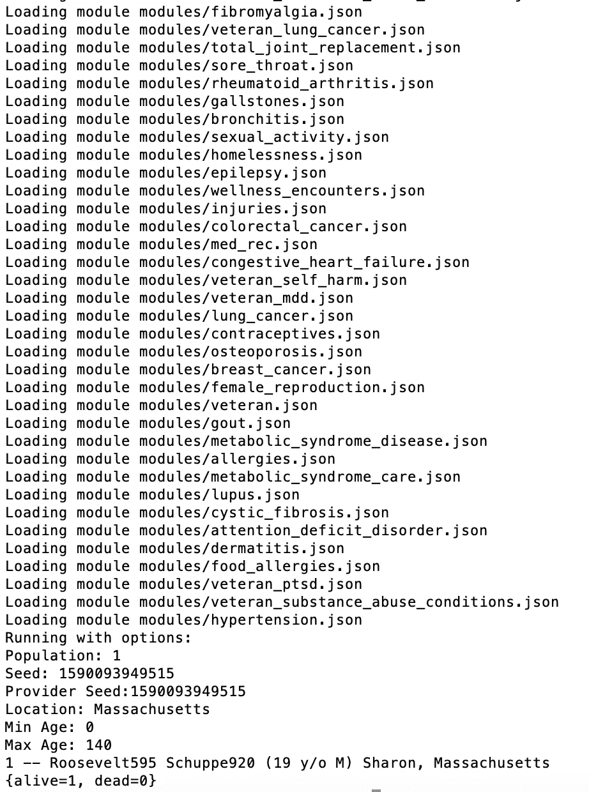
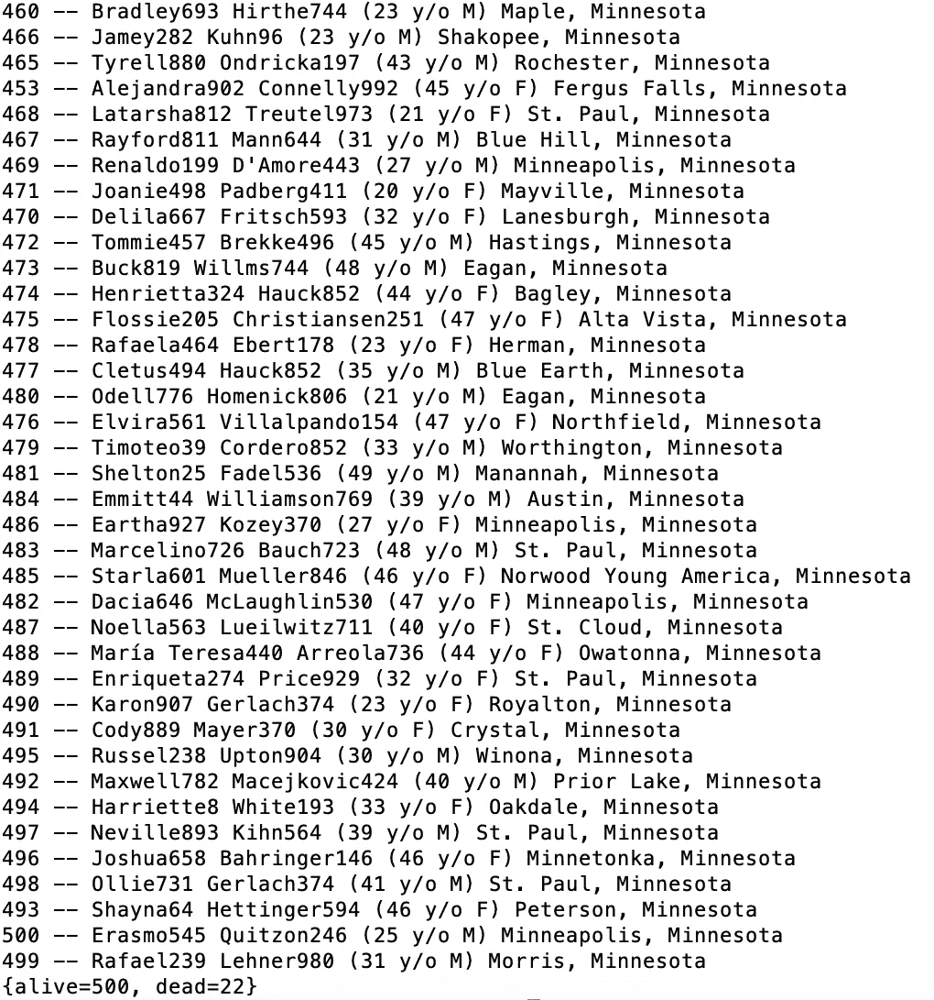
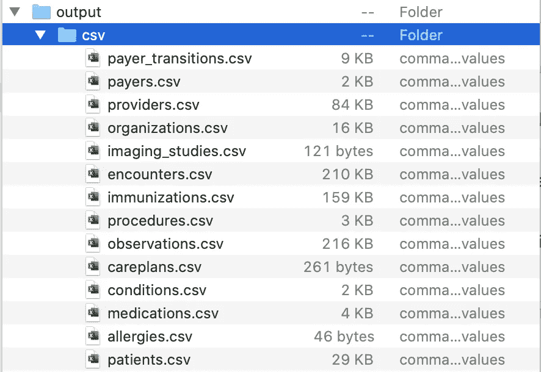

# 生成合成患者数据

> 原文：<https://towardsdatascience.com/generating-synthetic-patient-data-b7901c3bd397?source=collection_archive---------33----------------------->

## 快速浏览使用 Synthea


马库斯·斯皮斯克在 [Unsplash](https://unsplash.com/s/photos/data-science?utm_source=unsplash&utm_medium=referral&utm_content=creditCopyText) 上的照片

使用医疗保健数据进行研究可能会很棘手，为了使用某些数据，可能会遇到许多法律和财务障碍。在处理具体患者的信息时更是如此。但是，这些障碍可以通过使用开源患者生成器 Synthea 创建的合成数据来避免。Synthea 创建了可以无限制使用的真实数据。最重要的是，它非常人性化。

在你开始创建你自己的病人之前，确保你有最新版本的 JDK (JDK 14)。如果你还没有它，你可以遵循这个[安装指南。确保你安装的是 **JDK 14** ，而不是 **JRE 14** 。](https://docs.oracle.com/en/java/javase/14/)

下一步是安装 Synthea。如果你只是想运行 Synthea，而没有太多的灵活性和可定制性，你可以使用这里的链接[安装基本版本。或者，如果你想更自由地处理代码，你可以创建一个 Github 库的本地副本。我将使用基本版本，并将探索更扩展版本的任务留给您(按照](https://synthetichealth.github.io/synthea/build/libs/synthea-with-dependencies.jar)[这些说明](https://github.com/synthetichealth/synthea/wiki/Developer-Setup-and-Running))。

一旦安装了 Synthea，打开您的终端并切换到下载文件的目录。对我来说，那是“下载”文件夹。

```
cd /directory/with/downloaded/file
```

一旦进入目录，只需一个命令就可以运行 Synthea！你需要做的就是打开 JAR 文件。

```
java -jar synthea-with-dependencies.jar
```

您应该会看到终端中弹出一串文本。



终端输出

就这样，你成功地创造了一个人造病人；但是，这只是 Synthea 所能提供的表面现象。

# 添加参数

有几个不同的参数可用于定制您创建的患者。如需完整的参数列表，请查看[合成维基](https://github.com/synthetichealth/synthea/wiki)。

下面我们来看看一些有用的。

`-p size` —生成指定大小的群体(该大小指定群体中活着的**成员的数量，因此总群体大小可能会更大)**

`-g gender` —生成一个性别的群体(M 代表男性，F 代表女性)

`-a ageRange` —生成一个年龄范围内的人口(即 30-40 岁)

`-m module` —生成患有特定疾病(如哮喘、皮炎、狼疮等)的人群。)完整的模块列表可在[这里](https://github.com/synthetichealth/synthea/wiki/Module-Gallery)找到。

`State City` —生成特定区域内的人口(如明尼苏达州、得克萨斯州、达拉斯等)。)城市可选。一次只能运行一个状态；如果没有指定，默认的州是马萨诸塞州。

`--exporter.csv.export true` —将数据导出为 CSV 文件。默认格式是 FHIR。基于不同的数据，如“药物”、“就诊”、“提供者”等，患者信息被分割成多个 CSV 文件[。您也可以从许多其他输出格式中进行选择。完整列表可在](https://github.com/synthetichealth/synthea/wiki/CSV-File-Data-Dictionary)[这里](https://github.com/synthetichealth/synthea/wiki/Common-Configuration)找到。

有了这些参数，我们可以生成一些非常有意义的数据。这些参数都可以组合，使用的参数越多，生成的数据就越具体。让我们看几个例子。

```
java -jar synthea-with-dependencies.jar -p 500 -a 20–50 Minnesota
```

*这会生成一个居住在明尼苏达州的年龄在 20 到 50 岁之间的患者列表。该列表将有 500 个活着的患者和一些死亡的患者。*



生成的患者输出示例

```
java -jar synthea-with-dependencies.jar -p 100 -g F -m Asthma --exporter.csv.export true
```

*仅使用哮喘模块生成至少 100 名女性患者的列表，并将数据导出为 CSV 文件。*



CSV 文件输出示例

有很多方法可以组合不同的参数来创建非常不同的数据集。我鼓励您进行试验，尝试不同的参数，看看您会得到什么。或者，如果您对基本模型感到满意，您可以安装[完整存储库](https://github.com/synthetichealth/synthea/wiki/Developer-Setup-and-Running)并探索 Synthea 提供的一切。

我希望您喜欢这个关于 Synthea 的简短介绍，也希望我向您展示了这个工具的易用性和强大功能。无论你是在做一个大规模的项目，还是在你的笔记本电脑上做实验，都有无限的可能性。

# 资源:

1.  [https://docs . Oracle . com/javase/8/docs/technotes/guides/install/install _ overview . html # a 1097257](https://docs.oracle.com/javase/8/docs/technotes/guides/install/install_overview.html#A1097257)
2.  [https://synthetic health . github . io/synth ea/build/libs/synth ea-with-dependencies . jar](https://synthetichealth.github.io/synthea/build/libs/synthea-with-dependencies.jar)
3.  【https://github.com/synthetichealth/synthea 
4.  [https://github . com/synthetic health/synthetia/wiki/Developer-Setup-and-Running](https://github.com/synthetichealth/synthea/wiki/Developer-Setup-and-Running)
5.  [https://github.com/synthetichealth/synthea/wiki](https://github.com/synthetichealth/synthea/wiki)
6.  [https://github . com/synthetic health/syntheea/wiki/Module-Gallery](https://github.com/synthetichealth/synthea/wiki/Module-Gallery)
7.  [https://github . com/synthetic health/syntheea/wiki/CSV-File-Data-Dictionary](https://github.com/synthetichealth/synthea/wiki/CSV-File-Data-Dictionary)
8.  [https://github . com/synthetic health/synthetia/wiki/Common-Configuration](https://github.com/synthetichealth/synthea/wiki/Common-Configuration)