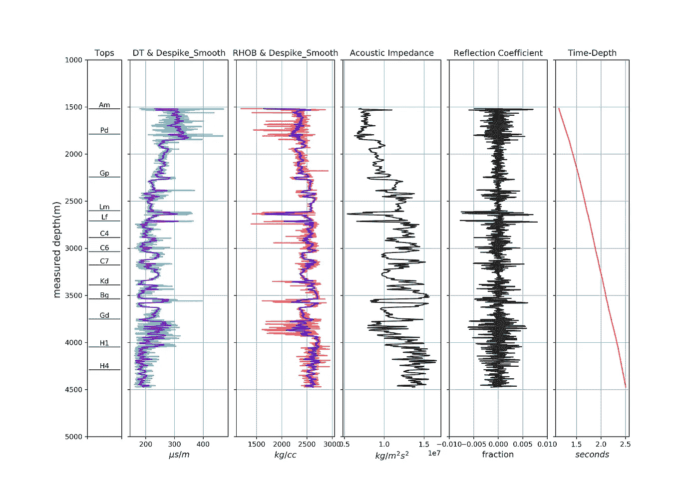
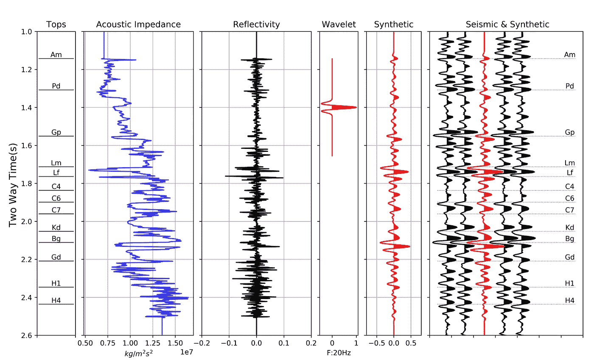

# 用 Python 生成合成地震图

> 原文：<https://towardsdatascience.com/generating-synthetic-seismogram-in-python-519f23f07894?source=collection_archive---------13----------------------->

## 从测井曲线生成地震记录的七个步骤

地球物理学中最基本的概念之一是卷积。我们在地球物理操作中记录的地震数据是来自地球内部表面的反射能量，这些表面与相邻层具有不同的岩石物理特性。实际上，地震信号是地层反射率与能量源子波褶积的结果。

从测井曲线生成合成地震记录是一个建模过程。我们将使用零相位小波(如 [Ricker](https://subsurfwiki.org/wiki/Ricker_wavelet) 小波)对反射率序列(从测井数据中获得)进行卷积。我们需要地震图来将油井数据与地震数据联系起来，以完成解释任务。

在本文中，我将尝试在合成地震图的制作过程中加入一些编程的乐趣。我非常喜欢 python，因为它有各种各样的库，可以使任务比其他编程平台容易得多。
我已经上传了一个完整的 jupyter 笔记本文件和原始数据到我的 [GitHub](https://github.com/mardani72/Synthetic_Seismogram) 账号里，如果你想自己尝试的话。我们将用 las 格式处理日志数据。如果你不熟悉如何将 las 文件读入 python 的过程，请查看我之前的文章。

生成地震记录所需步骤:
1-数据准备(单位转换和声波/密度测井处理)
2-时深关系构建
3-声阻抗(AI 或 Z)计算
4-反射系数(Rc)计算
5-重采样到时域和 Rc 重新计算
6-子波&卷积
7-可视化

# 1-数据准备

## 调节装置

将测井文件(las 格式)读入 python 并查看日志标题后，我们需要将密度和声波测井的单位转换为 SI 系统，因为我们需要这两种测井来计算阻抗。为了计算声阻抗，我们需要 s/m 单位的声波测井(DT)和 kg/m3 单位的密度测井(RHOB)。看标题:DT 有美制/英尺单位和 RHOB g/cm3。

```
w.data['DT'] = w.data['DT'] / 0.3048          #unit convert to µs/m
w.data['RHOB'] = w.data['RHOB'] * 1000        #unit convert to kg/m3
```

## 去毛刺和平滑

尖峰信号在测井记录中很常见，尤其是在声波测量中。这些尖峰并不能真正代表整个井段的岩石特性变化，需要消除。

```
#Sonic Despiking
dt = w.data['DT']
w.data['DT_DS'] = dt.despike(window_length=50, z=2)#Density Despiking
den = w.data['RHOB']
w.data['RHOB_DS'] = den.despike(window_length=50, z=2)
```

我们将输入要平滑的去尖峰数据:

```
#Sonic Smoothing
dt_ds = w.data['DT_DS']
w.data['DT_DS_SM'] = dt_ds.smooth(window_length=10, samples=False)#Density Smoothing
den_ds = w.data['RHOB_DS']
w.data['RHOB_DS_SM'] = den_ds.smooth(window_length=10, samples=False)
```

# 2-时间-深度关系

地震数据是在时间域测量的，而井数据主要在深度域测量。要将时间转化为深度，反之亦然，我们需要建立一种关系。有几种方法可以做到这一点，但在这里，我们使用声波测井，这是声波速度的倒数。从数学上讲，如果我们在深度区间上对 DT 积分，我们将计算出时间与深度的关系。在此之前，我们应该对上部测井数据进行补救，它与地面有数据缺口。由于这是岸上现场数据，我们没有水柱。测井曲线以上部分的替换速度几乎为 2600 米/秒。简单地说，用替换速度除以间隙层厚度(测井曲线开始深度减去 kb)就可以得到时间。

```
log_start = 1517          # Depth of logging starts(m) from header
kb = 15                   # Kelly Bushing elevation(m) from headergap_int = log_start - kb
repl_vel = 2632           # this is from VSP data knowledge (m/s)
log_start_time = 2.0 * gap_int / repl_vel        # 2 for twt
```

## T-D 机构

让我们实施一体化。由于深度采样间隔为 0.1524 米，我们需要用测得的声波数据计算该厚度传播所需的时间。然后计算向下的累计行程时间。从测井起始深度计算显示第一个值为零，而我们知道零时间属于地表。所以，这个间隙的传播时间应该加到综合声波时间中。

```
#first replace NaN values with zero
dt_iterval = np.nan_to_num(dt) * 0.1524 / 1e6
t_cum =  np.cumsum(dt_iterval) * 2
w.data['TWT'] = t_cum + log_start_time
```

# 3-声阻抗

声阻抗(AI，有时用 Z 表示)定义为声波速度和介质密度的乘积。在反射地震学中，地质层之间的 AI 变化负责向我们收集地震数据的表面的能量反射。

```
df['Vsonic'] = 1e6/df.DT_DS_SM                   #(unit: m/s)
df['AI'] = df['Vsonic'] * df['RHOB_DS_SM']        #(unit: kg/m2.s)
```

# 4-反射系数

反射系数(Rc)定义为两个相邻层的阻抗差除以它们的总和。数学上，这是深度的导数。

```
Imp = df['AI'].values
Rc=[]
for i in range(len(Imp)-1):
    Rc.append((Imp[i+1]-Imp[i])/(Imp[i]+Imp[i+1]))
```

# 5-重采样到时域和 Rc 计算

虽然我们建立了时深关系(TDR ),但合成地震记录所需的分量在深度域。反射率系列应该转换到时域进行卷积。定义时间向量后，我们可以使用 numpy 库中的插值函数。

```
dt = 0.001   #sampleing interval
t_max = 3.0   # max time to create time vector
t = np.arange(0, t_max, dt)
AI_tdom = np.interp(x=t, xp = df.TWT, fp = df.AI)    #resampling# again Rc calulation but in reampled time domain
Rc_tdom = []
for i in range(len(AI_tdom)-1):
    Rc_tdom.append((AI_tdom[i+1]-AI_tdom[i])/(AI_tdom[i]+AI_tdom[i+1]))
```

# 6-小波和卷积

在反射地震学中，假设我们在地表记录的地震数据是用子波卷积(掩蔽)的能量反射。在各种子波中，里克子波是最常见的一种，因为它是零相位的，有利于地震解释任务。

```
# define function of ricker wavelet
def ricker(f, length, dt):
    t0 = np.arange(-length/2, (length-dt)/2, dt)
    y = (1.0 - 2.0*(np.pi**2)*(f**2)*(t0**2)) * np.exp(-(np.pi**2)*(f**2)*(t0**2))
    return t0, y
```

## 盘旋

在这一步中，我们将利用子波对反射率序列进行卷积，以创建一个合成地震图。这通常被称为翻转和滑动一个功能到另一个功能上。如果你有兴趣知道这个操作背后的数学原理，你可以看看这个伟大的[视频](https://www.youtube.com/watch?v=eqAFP15AMPc)。

```
f=20            #wavelet frequency
length=0.512    #Wavelet vector length
dt=dt           # Sampling prefer to use smiliar to resampled AI
t0, w = ricker (f, length, dt) # ricker wavelet 
synthetic = np.convolve(w, Rc_tdom, mode='same')
```

# 7-可视化

## 图 1

在该图中，我们将绘制测井曲线(覆盖平滑和去尖峰结果),并计算深度域中的 AI 和反射率。关于 python 中的绘图程序，请参考笔记本文件[这里的](https://github.com/mardani72/Synthetic_Seismogram)。



## 图 2

在该图中，我们将在时域中绘制 AI 和卷积结果。我们还可以获得油井周围真实地面地震记录，这些记录可以与合成地震记录并置，以查看与数据的匹配程度。



查看最后一条轨迹表明，合成地震记录和地面地震数据之间存在适当的匹配，尤其是在关键层位。关于为什么匹配可以是相同的，有很多争论。一个重要的原因是地面地震和声波测井的频带。如果你有兴趣学习更多，请参考我的教授[的书](https://www.amazon.ca/Fundamentals-Geophysical-Interpretation-Laurence-Lines/dp/1560801255)、[劳伦斯·r·莱恩斯](https://www.amazon.ca/s/ref=dp_byline_sr_book_1?ie=UTF8&field-author=Laurence+R.+Lines&text=Laurence+R.+Lines&sort=relevancerank&search-alias=books-ca)。

# 结论

在反射地震学中，合成地震记录是以褶积理论为基础的。地震图是地震解释的一个非常重要的工具，它是井和地面地震数据之间的桥梁。在这篇文章中，我试图展示我们如何用 python 中的真实数据用几行代码实现这个任务。请随意下载源代码，四处看看，并为自己的数据实现。对于评论和问题，请在这里留言。