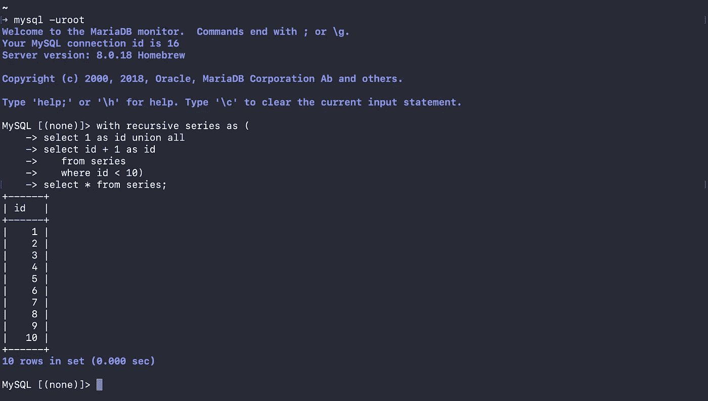
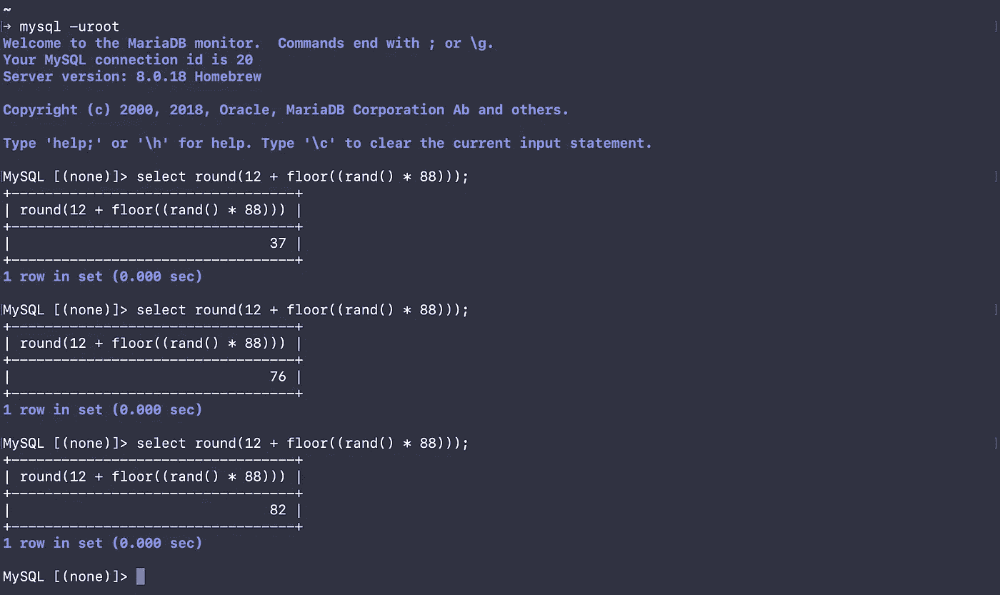
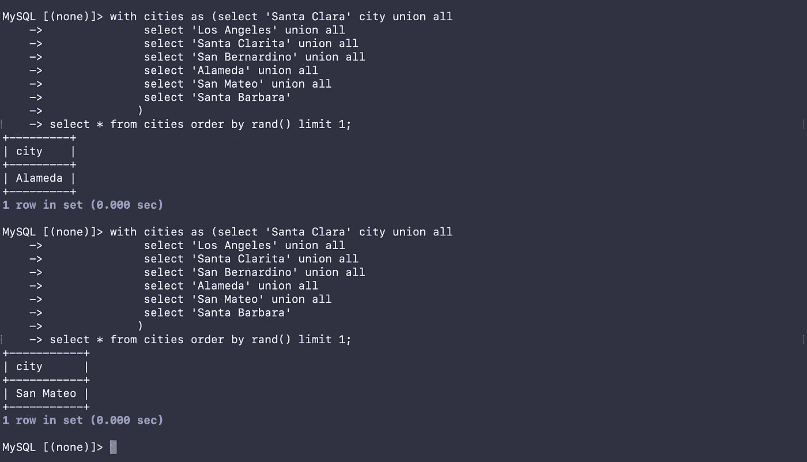
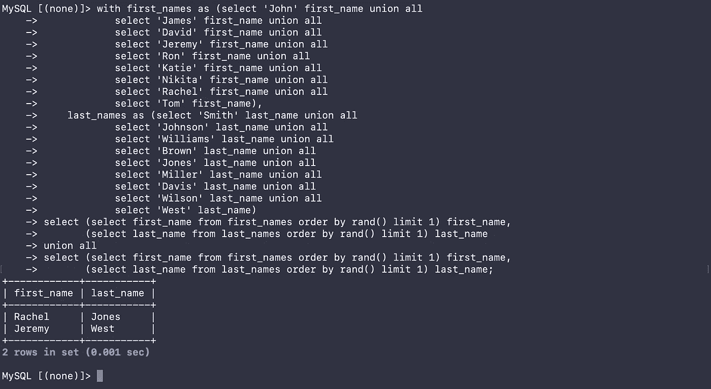
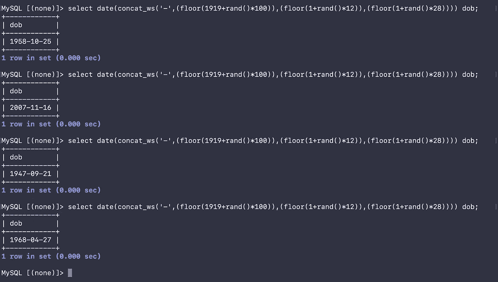
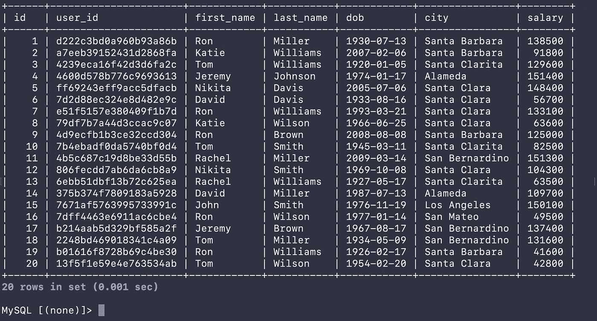
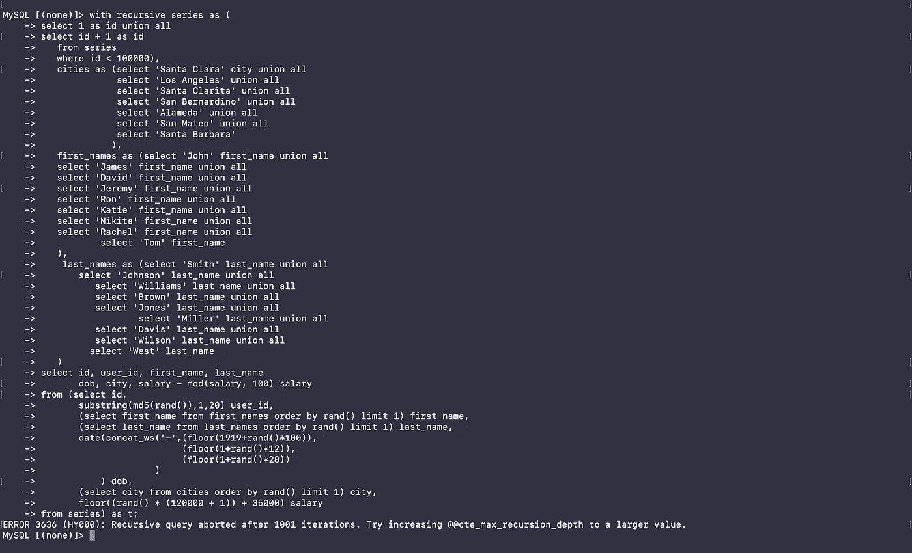
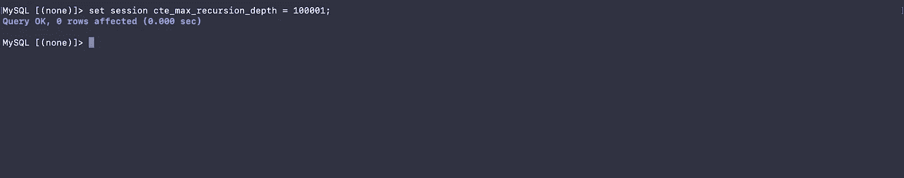
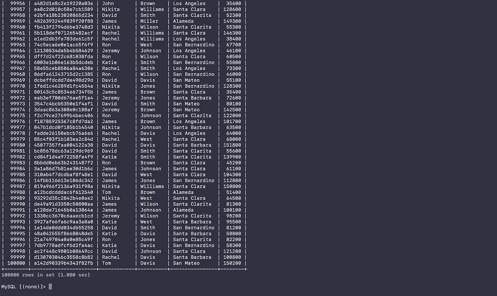

# 使用 SQL 生成测试数据

> 原文：<https://towardsdatascience.com/generating-test-data-using-sql-2a1162f5ef16?source=collection_archive---------28----------------------->

[国立癌症研究所](https://unsplash.com/@nci?utm_source=unsplash&utm_medium=referral&utm_content=creditCopyText)在 [Unsplash](https://unsplash.com/s/photos/test-data?utm_source=unsplash&utm_medium=referral&utm_content=creditCopyText) 上拍摄的照片

## 数据工程

## 使用 SQL 支持应用程序测试和开发

开发人员在开发和测试应用程序时需要测试数据。测试数据对于应用程序开发至关重要，因为这是开发人员能够领先模仿 API 响应一步的唯一方法。生成测试数据涉及两种不同的方法。两者都应该用来使应用程序变得更好。

*   使用应用程序期望的数据进行测试(高质量的数据)
*   使用应用程序不期望的数据进行测试(质量差的数据)

质量差的数据通常由不支持的字符、较长的字符串、高精度浮点数等组成。了解坏数据通过系统时会发生什么总是很有帮助的。

# [你需要知道什么](https://linktr.ee/kovid)

用 SQL 生成数据非常容易。要编写测试数据生成查询，只需要了解一些事情

*   cte 和递归 cte-公用表表达式是命名的结果集。假设查询的输出有一个表名。它的工作原理和熊猫的数据框架非常相似。
*   rand()，md5()函数— `rand()`用于生成随机数，`md5()`不用于加密数据。
*   基本字符串操作—基本字符串操作主要用于限制字段长度。
*   子查询—使用简单的子查询为给定行生成列值。请记住，本质上，这些既不是内联子查询，也不是相关子查询。

# 使用 cte

递归 cte 很棒。它们可用于生成系列数据。类似的事情可以在 PostgreSQL 中使用`generate_series`，在 Oracle 中使用`connect by level`，在 MySQL 中使用会话变量`@id := @id + 1`来完成。几乎所有的数据库都有生成数字序列的变通方法。其中一些变通办法比其他的更好。

使用 MariaDB 的递归 cte。在 MySQL 中，您可以使用会话变量来模拟这种情况。在 Oracle 中，您可以使用“按级别连接”来实现这一点。

# SQL 函数— rand()和 md5()

`rand()`函数给你一个 0 到 1 之间的数字。如果我们想要一个介于 0 和 100 之间的数字，我们只需将`rand()`函数的输出乘以 100。在下面分享的例子中，我正在生成一个介于 12 和 100 之间的数字。

生成一个介于 12 和 100 之间的数字，用于生成一个人的随机年龄数字

使用另一个 CTE 将城市列表用作表格。CTE 上的`order by rand()`将从城市列表中随机选择一个城市。请注意两个后续查询的结果是不同的。

从城市列表中随机选择一个城市

类似地，还有两个 cte，一个用于常见的名，另一个用于常见的姓。随机选取的这两个字段的任意组合将生成一个新名称。显然，由于`order by rand()`条款和提供给 CTE 的名称数量有限，名称可能会重复。

如果你不在乎名字看起来有多真实，你可以使用`substring(md5(rand()),1,6)`生成随机的字符串。这会给你一个包含六个字符的随机字符串。

从名和姓的列表中生成随机名称

# 生成随机日期

一旦你想好了在给定范围内生成随机数，那么生成一个随机日期就很容易了。以下示例显示了如何生成 1919 年 1 月 1 日到 2019 年 12 月 28 日之间的随机日期。唯一的警告是，这涵盖了任何给定月份的 1 日至 28 日之间的天数。我们完全可以编写一个查询，通过添加一些条件来覆盖所有日期。

最后，我们来看一个仅由 SQL 查询生成的样本数据集。用自动生成的真实数据获取数十万条记录只需要几秒钟的执行时间。

下面是生成以下数据的脚本

样本人口统计数据集

不使用任何外部依赖项生成测试数据的 SQL 脚本

显然，下一步是将查询参数化，并使其成为存储函数或存储过程。您可以传递要生成的记录的数量、出生日期的范围等等。

# 快速修复

您可能会看到一个错误，如下图所示。请注意，我试图获取 100000 条记录—在开始时在递归 CTE 中定义— `id < 100000`。

配置变量`cte_max_recursion_depth`需要设置为 100000 或更大，以获取这些记录。

将会话变量 cte_max_recursion_depth 设置为 100001

获取 100K 条记录

在这之后，你应该可以走了。