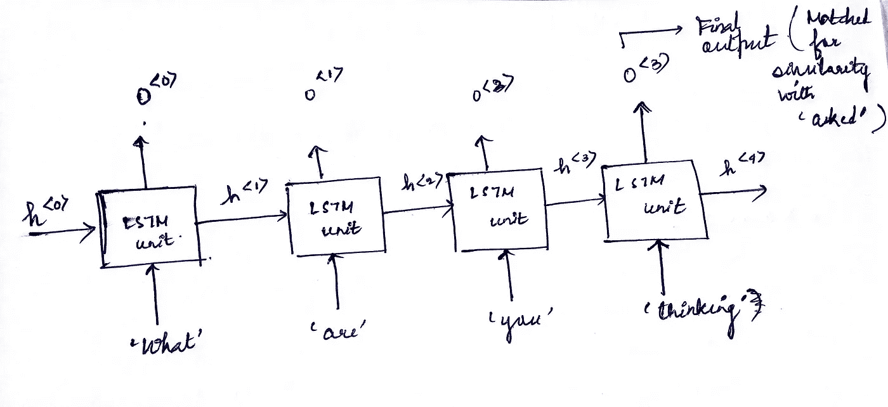
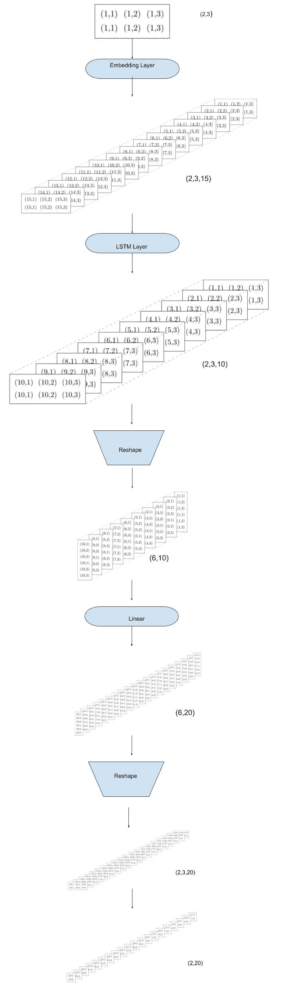

# 用 LSTM 制作电视剧本

> 原文：<https://towardsdatascience.com/generating-tv-scripts-with-lstm-e94be65a179?source=collection_archive---------30----------------------->

## 使用 LSTMs 的初学者项目

朋友们，我刚刚完成了这个项目，作为 Udacity 深度学习纳米学位的一部分。

该项目是关于预测脚本中的下一个单词，给定之前使用 LSTM 的上下文。

我会解释做这个项目时需要的主要和非常基本的概念。我介绍的部分包括:

**如何将我们的数据转换成模型可以处理的形式？**

*   预处理数据
*   批处理数据

**模型架构如何处理批量数据，将数据从一层传递到另一层，以及它如何最终导致预测序列中的下一个单词。**

# 目标受众和先决条件

这是 LSTM 完成的一个基础项目，任何对神经网络和 RNNs 有基础知识的人都可以很容易理解这一点。我试图尽可能简单地将项目分解到最基本的细节。

我在模型架构、输入形状、输出形状和每一层考虑的参数上投入了大量的精力。我已经编译并解释了这些输入/输出形状的含义，以及它们为什么以特定的方式成形，以便您更好地形象化。

注意:这个项目已经用 Pytorch 编码了。然而，LSTM 模型层考虑的参数没有太大的差别。所以，任何试图在 Keras 做这件事的人也可以参考我的解释。

**我没有提到的是什么？**

LSTM 是什么的理论细节，或者为什么它工作，虽然我已经触及了为什么在这种情况下它比神经网络更好的一部分。我附上了一个主项目的链接，但我没有逐行解释它的全部。

然而，我已经涵盖了我认为足以理解主要工作的部分，以便您可以将这个概念推广到其他类似的项目。

# 让我们直接跳进来吧🐬

照片由[威廉·冈克尔](https://unsplash.com/@wilhelmgunkel?utm_source=medium&utm_medium=referral)在 [Unsplash](https://unsplash.com?utm_source=medium&utm_medium=referral) 上拍摄

# 文本预处理

我们有了文本，我们首先以一种可以输入 LSTM 的形式批量处理数据。

其中一个重要的部分是文本预处理，我们对文本应用了一些非常基本的必要但不充分的*预处理:*

1.  用小写字母书写文本
2.  将文本标记化:将较长的文本字符串分割成较小的片段或标记的步骤。
3.  标点符号化，即替换“太好了！”由一个“太棒了”，“||感叹||”从而得出“太棒了！”和“伟大”不被认为是不同的词。
4.  创建两个将单词映射到整数的查找表(因为神经网络只理解数字语言)，反之亦然。

其他一些文本处理技术可能是词干化、词汇化。 [*这个*](https://www.kdnuggets.com/2017/12/general-approach-preprocessing-text-data.html) 是文字处理上的好读物。

在对文本进行预处理并将其转换为整数后，文本数据以 LSTM 可以将其视为输入的方式进行批处理。

在进一步讨论之前，有一个非常基本但重要的问题:

## 为什么 RNN/LSTM 不是一个正常的神经网络？

RNN/ LSTMs 中最重要的两个术语是循环单元和隐藏单元。这两者都在考虑文本的上下文中起作用。例如，如果你加入了一个你很难交谈的讨论，你需要在你说话之前知道讨论的背景。这在隐藏单元的帮助下成为可能，隐藏单元从以前的上下文中携带信息，所以 LSTM/RNN 单元考虑 2 个输入:输入单词和隐藏单元。

正常的神经网络也可以工作，但它的工作方式不考虑前面的上下文，只给出一个单词作为下一个单词出现的概率，给定前面的单词。

输入批次:[什么，是，你，在想]目标:['问'](图片由作者提供)

在上面的图像中，“h”是隐藏单元，“o”表示每个 LSTM 单元的输出，最终输出与目标的相似性匹配。

# 批处理示例:

让我们考虑一段文字，这是 quora 的摘录:

> ”“你在想什么？”老板问道我们没有问任何人任何问题。通过问几个问题，我们无法评估任何人的技能。所以我们的测试是评估这个人的态度。我们保留了一些基于候选人行为的测试，并通过闭路电视观察每个人。"

在选择了合适的序列长度和批量大小(这里分别为 4 和 3)后， **LSTM** 单元格的输入如下所示(这里我忽略了标点符号):

> 第一批:

> [什么，你在想什么]->[问道]
> 
> [是，你，在想，在问]->[美]
> 
> [你，思考，问，]-->[老板]

> 第二批:

> [思考，被问，那个，老板]->[我们]
> 
> [问，那个，老板，我们]->[没]
> 
> 【那个，老板，我们，没有】-->【问】

当然，转换成*整数*。

配料(照片由[去毛刺](https://unsplash.com?utm_source=medium&utm_medium=referral)上的[刻痕](https://unsplash.com/@jannerboy62?utm_source=medium&utm_medium=referral)拍摄)

相反，如果我们使用一个普通的**神经网络**，批次看起来会类似这样(批次大小:3):

> 第一批:

> [什么]->[是]
> 
> 【是】-->【你】
> 
> 【思考】-->【关于】

所以很明显，神经网络没有考虑之前的环境。

# 模型架构和工作:

下面介绍 LSTMs 如何处理这些批次。

> 注意:
> 
> 下面是一张带有参数的模型结构图
> 
> Batch_size:2，sequence_len:3，embedding_dim:15，output_size=vocab_size:20，hidden_dim:10
> 
> 请参考它以更好地理解架构，为了便于表示，我使用了较小的数字。

## 1.嵌入层

因此，如果这些*整数*(在 vocab_to_int 字典中映射到整数的单词)被传递到 LSTM 单元，它可能会发现将这些整数视为一些权重的有偏见的含义，为了避免这个问题，我们有时*一次性编码*这些整数。但是，当词汇表很大时，编码会占用很多不必要的空间。

> 假设 vocab 字典大小=3
> 
> 向量占据 3*3 单元大小的空间，即 9

> [1,0,0]
> 
> [0,1,0]
> 
> [0,0,1]

现在想象一下词汇量为 10000 的情况。这将意味着 10 ⁰细胞大小的空间。

因此就有了 ***嵌入层*** 的概念。

这一次，我们没有用一次性编码替换这些单词，而是用随机选择的数字填充一些固定长度的向量。随着时间的推移，这个值矩阵与模型一起接受训练，并学习单词的近似矢量表示，这有助于为单词添加意义，并有助于提高整体准确性。

torch.nn.Embedding 图层接受以下参数:

*   *num_embeddings* (字典的大小)，等于 *vocab_size*
*   *embedding_dim* (用于单词表示的嵌入向量的大小)

该层的输入形状为 *(batch_size，seq_length)* ，该层的输出形状为 *(batch_size，seq_length，embedding_dim)。*

*对于 25000 的 vocab 大小，300 的嵌入向量工作良好，这比在一个热码编码向量的情况下 25000 的每个向量大小小得多。*

一些预先训练的单词表示模型如 fastText、GloVe 是可用的，并且可以直接使用，而不是用嵌入层生成这些表示。

## 2.LSTM 层

[torch.nn.LSTM](https://pytorch.org/docs/stable/generated/torch.nn.LSTM.html#torch.nn.LSTM) 需要参数 *input_size，hidden_dim，num_layers* 。*Input _ size&hidden _ dim*分别是输入和隐藏状态下的特征个数。

*注:熟悉 CNN 的人可以把它比作 CNN 层的****【in _ channels】****和【hidden _ dim】****out _ channels****。*

由于我们使用了嵌入层，嵌入向量长度就是输入特征的数量。因此，*input _ size*=*embedding _ dim*。参数 *hidden_dim* 和*num _ layers*(LSTM 的层数，一般取值为 1 或 2)可以任意选择。

nn。LSTM 层返回一个输出和一个隐藏状态，输出的形状为 *(batch_size，sequence_length，hidden_dim)。*

## 3.线性层

该输出被**整形为**到*(batch _ size * sequence _ length，hidden_dim)* 并传递到线性层，其中 *in_features = hidden_dim* 和*out _ features = output _ size*。

在我们的例子中， *output_size =词汇表大小*，即输出节点的数量等于词汇表中存在的单词总数，因此网络可以从整个单词词汇表中选择最可能的下一个单词。

来自线性层的输出被整形为*(batch _ size * sequence_length，output_size)* ，其被进一步**整形为**以具有形状 *(batch_size，sequence _ length，output_size)* ，并且尽管我们在整个语料库上训练模型来预测序列的每个 *单词*的*下一个单词*

因此，最终输出层的形状为 *(batch_size，output_size)* 。

我们的模型的输出为我们提供了给定批次的每个序列的最可能的下一个单词。💁

Batch_size:2，sequence_len:3，embedding_dim:15，output_size=vocab_size:20，hidden_dim:10(图片由作者提供)C

## 代码:

这个项目的完整代码可以在这里找到:

 [## ankita-Das/深度学习-纳米学位

### permalink dissolve GitHub 是超过 5000 万开发人员的家园，他们一起工作来托管和审查代码，管理…

github.com](https://github.com/Ankita-Das/Deep-Learning-Nanodegree/blob/master/TV_script_generation/dlnd_tv_script_generation_copy.ipynb) 

## 试试这个！💻

我已经试着涵盖了做这个项目的所有重要和必要的概念，但是如果你在任何地方遇到困难，如果你觉得我错过了一点，请在下面的评论中告诉我。

我将热切地等着看你完成这个项目。🙌

最美好的祝愿。

告别😁

乔纳森·肯珀在 [Unsplash](https://unsplash.com?utm_source=medium&utm_medium=referral) 上拍摄的照片