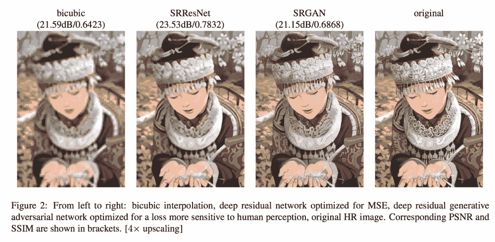
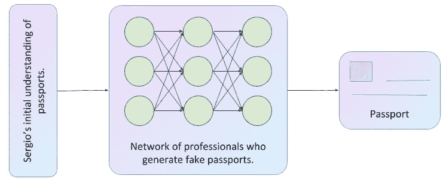
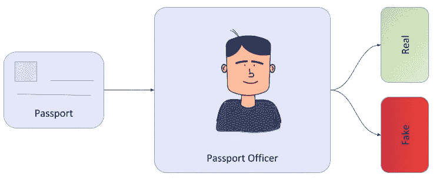
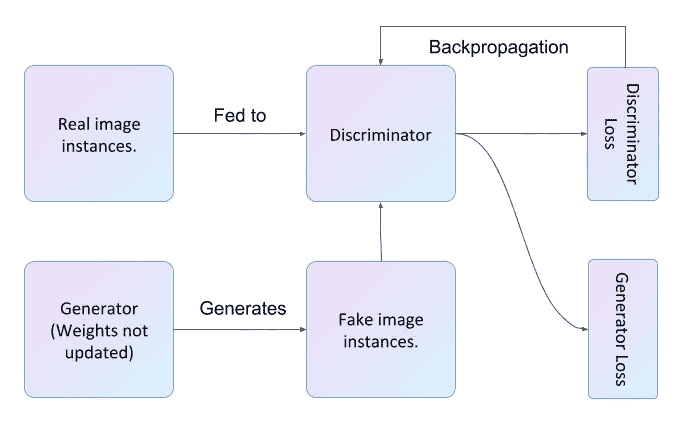
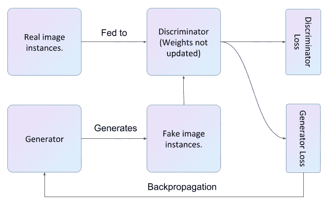

# 生成对抗网络

> 原文：<https://towardsdatascience.com/generative-adversarial-network-74eef7a82117?source=collection_archive---------37----------------------->

## 更简单直观的解释。



超分辨率。GAN 的一个应用([来源](https://arxiv.org/pdf/1609.04802.pdf))。

让我们假设塞尔吉奥正在计划他的下一次大抢劫，他需要他的团队前往外国。由于他的工作性质，他决定*制作*假护照。他不想冒险，因为他相信护照官员可以*辨别出真假护照。他决定利用他的设计师和专家网络来有效地实施他的计划。*

```
Generative Adversarial Networks have two components a generator and a discriminator. Just take my words as of now :)Let's get back to Sergio's plan and problems.
```

# 塞尔吉奥的护照生成器

下图显示了 Sergio 的行动计划，其中利用专业人员的综合技能制作假护照。



塞尔吉奥的发电机网络(图片由作者使用 [ML-Visuals](https://github.com/dair-ai/ml-visuals) )。

如果我们要概括塞尔吉奥的计划，我们可以说，图表是假护照的生成器。一群基本上了解护照安全特征的专业人士试图利用他们的知识复制一个类似的护照。换句话说，给定一个空间，目标是画出一个与原始空间相似的例子。

这正是 GAN 的*发生器*组件的作用。它基于真实世界的例子来观察它们的特征，然后创建一个与原始例子相似的新例子。

# 护照官员作为鉴别者

下图显示了护照官员的工作流程。他每天检查数百本护照，塞尔吉奥希望他生成的护照能够被识别为真护照。



护照官员的工作流程(图片由作者使用 [ML-Visuals](https://github.com/dair-ai/ml-visuals) 制作)。

护照官员类似于 GAN 的第二个组件，称为*鉴别器*。*鉴别器*的工作是分类。它从伪造或生成的数据实例中识别出真实的数据实例。

在伪造的情况下，塞尔吉奥和护照官员是相互竞争的。塞尔吉奥希望他生成的护照被归类为真护照，而护照官员希望做好检测假护照的工作。这使他们成为对手，因此得名*敌对网络*。

现在我们已经了解了 GAN 的两个组成部分，让我们看看如何训练它们以获得 GAN。

# 把它放在一起

## 甄别训练

在 GAN 的情况下，鉴别器只是一个分类器，它将给定的实例标记为真或假。你可以使用任何适合你的问题陈述的神经网络。

当训练一个鉴别器时，它被馈送来自真实世界的例子作为正例，以及从生成器网络生成的例子作为负例。当训练鉴别器时，发生器没有被训练，也就是说它的权重没有改变。简单地说，发生器的输出作为负实例被馈送给鉴别器。如果鉴别器随后将负实例分类为正实例，或者反之亦然，则它被损失函数惩罚，并且它的权重通过反向传播来更新。



鉴别器培训(作者使用[ML-visual](https://github.com/dair-ai/ml-visuals)制作的图片)。

## 发电机培训

我们已经看到，生成器的工作是输出新的数据实例。发电机只不过是一个神经网络。然而，神经网络有输入。在发生器的情况下，噪声作为输入被馈送给它们，并且最终它学会生成可感知的数据。对于任何生成的图像，如果鉴别器将其归类为假的，则生成器将受到惩罚。在训练生成器时，仅更新生成器的权重。



发电机培训(图片由作者使用[ML-visual](https://github.com/dair-ai/ml-visuals))。

在实践中，使用迭代方法来训练 GAN，在这种方法中，您可以在为一次迭代训练生成器和为下一次迭代训练鉴别器之间切换。