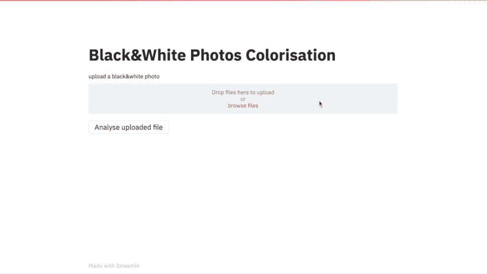
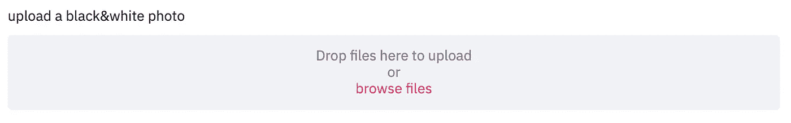
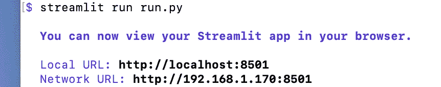

# 生成性对抗网络:构建一个用 Streamlit 给 B&W 照片着色的 web 应用程序

> 原文：<https://towardsdatascience.com/generative-adversarial-network-build-a-web-application-which-colorizes-b-w-photos-with-streamlit-5118bf0857af?source=collection_archive---------46----------------------->

## 使用 Streamlit 快速将生成式对抗网络模型转换为 web 应用程序，并部署到 Heroku



黑白照片彩色化的 Web 应用程序。

# 介绍

之前我做了一个 GAN 模型，给黑白照片上色。它运行良好，所以我希望与人们分享。在 Jupyter notebook 中编码非常方便开发，但不方便共享，因此我决定制作一个 web 应用程序并部署到 Heroku。

[](/colorize-black-and-white-photos-by-ai-cc607e164160) [## 人工智能给黑白照片上色。

### 利用 Fastai 的生成性对抗网络(GAN)使黑白照片变得丰富多彩

towardsdatascience.com](/colorize-black-and-white-photos-by-ai-cc607e164160) 

我没有网页开发的经验和技能，所以我花了一些时间来弄清楚如何去做。我发现了一个有用的工具 Stremlit，它可以让我用 Python 编码，并快速将其转化为 web 应用程序。

我做这个 app 有几个步骤:

1.  导出模型
2.  下载模型
3.  为用户创建照片上传工具
4.  调整上传照片的大小
5.  加载模型
6.  分析上传的照片
7.  显示结果
8.  把它部署到 Heroku

# 导出模型

我使用 fastai 训练 GAN 模型，所以我只需使用

```
learner.export(export.pkl)
```

这会将模型导出为 pkl 文件。

# 下载模型

这个应用程序的第一件事是下载模型。因为模型尺寸太大(> 200MB)，不方便推送到 Github 或者直接推送到 Heroku。因此，我需要应用程序从外部 url 下载文件，以确保模型准备就绪。

我将模型存储在我的 dropbox 账户中，并创建了一个可下载的链接。

```
EXTERNAL_DEPENDENCIES = {
"export_5.pkl": {
"url": "https://dl.dropboxusercontent.com/s/xxxxxxx/export_5.pkl?dl=0",
"size": 246698366}
}
```

然后我用 Streamlit 的演示代码([https://github.com/streamlit/streamlit](https://github.com/streamlit/streamlit))创建了一个带有进度条的下载功能

我可以调用函数并下载模型

```
for filename in EXTERNAL_DEPENDENCIES.keys():
    download_file(filename)
```

# 为用户创建上传工具

我想有一个工具，允许用户上传他们的 B&W 照片进行分析。

Streamlit 提供了一个工具来实现它:st.file_uploader

```
uploaded_file = st.file_uploader("upload a black&white photo", type=['jpg','png','jpeg'])
```

然后我将它保存到一个临时位置

```
if uploaded_file is not None:
   g = io.BytesIO(uploaded_file.read())  # BytesIO Object
   temporary_location = "image/temp.jpg"

   with open(temporary_location, 'wb') as out:  # Open temporary file as bytes
      out.write(g.read())  # Read bytes into file

      # close file
      out.close()
```



照片上传工具

# 调整上传照片的大小

由于计算时间和限制，如果上传的照片大于 800 像素，我想把它调整到 800 像素。我用 Opencv 写了一个简单的函数。

```
def resize_one(fn,img_size=800):
   dest = 'image/image_bw/temp_bw.jpg'

   # Load the image
   img=cv2.imread(str(fn))
   height,width  = img.shape[0],img.shape[1]if max(width, height)>img_size:
   if height > width:
      width=width*(img_size/height)
      height=img_size
      img=cv2.resize(img,(int(width), int(height)))
   elif height <= width:
      height=height*(img_size/width)
      width=img_size
      img=cv2.resize(img,(int(width), int(height)))cv2.imwrite(str(dest),img)
```

# 加载模型

如前所述，我使用 fastai 训练模型，所以我使用 fastai 加载模型，我创建了一个函数来加载它。

```
def create_learner(path,file):
   learn_gen=load_learner(path,file)
   return learn_gen
```

# 分析上传的照片并显示结果

然后我需要一个函数来预测图像的颜色，并使用 st.image 显示图像，请注意 st.image 无法读取 fastai 生成的张量，所以我需要 image2np()将其转换为 Numpy 数组。

```
def predict_img(fn,learn_gen,img_width=640):
   _,img,b=learn_gen.predict(open_image(fn))
   img_np=image2np(img)
   st.image(img_np,clamp=True,width=img_width)
```

# 把它们放在一起

现在我已经有了我需要的一切，让我们把它们放在主函数中。

首先，我从外部链接下载模型，并制作页面标题

```
def main():
   for filename in EXTERNAL_DEPENDENCIES.keys():
      download_file(filename) st.title("Black&White Photos Colorisation")
```

然后我制作照片上传器，调整上传照片的大小并显示它

```
 uploaded_file = st.file_uploader("upload a black&white photo", type=['jpg','png','jpeg'])

   if uploaded_file is not None:
      g = io.BytesIO(uploaded_file.read())  # BytesIO Object
      temporary_location = "image/temp.jpg"

      with open(temporary_location, 'wb') as out:  # Open temporary file as bytes
         out.write(g.read())  # Read bytes into file
         # close file
         out.close() resize_one("image/temp.jpg",img_size=800)
   st.image("image/temp.jpg",width=800)
```

然后，我制作一个按钮来调用创建模型和预测函数

```
start_analyse_file = st.button('Analyse uploaded file')
if start_analyse_file== True:
   learn_gen=create_learner(path='',file='export_5.pkl')
   predict_img("image/image_bw/temp_bw.jpg",learn_gen,img_width=800)
```

然后最后调用这个主函数

```
if __name__ == "__main__":
   main()
```

web 应用程序已准备就绪。我可以通过这个命令在我的本地机器上测试它。



黑白照片彩色化的 Web 应用程序。

# 部署到 Heroku

部署到 Heroku 非常简单——只需按下它。

我还需要三个文件:requirements.txt、setup.sh 和 Procfile。

## requirements.txt

它包含 Heroku 需要安装的软件包。就我而言:

```
scikit_image==0.17.2
numpy==1.17.2
opencv_python==4.1.1.26
streamlit==0.64.0
pandas==0.25.1
https://download.pytorch.org/whl/cpu/torch-1.6.0%2Bcpu-cp36-cp36m-linux_x86_64.whl
fastai
```

## setup.sh

```
mkdir -p ~/.streamlit
echo "[server]
headless = true
port = $PORT
enableCORS = false
" > ~/.streamlit/config.toml
```

## Procfile

```
web: sh setup.sh && streamlit run run.py
```

然后注册一个免费的 Heroku 账号，下载并安装 Heroku CLI。

登录 Heroku，会弹出一个窗口输入账号和密码

```
heroku login
```

然后创建一个 web 应用程序

```
heroku create yourapp
```

将显示类似这样的内容

```
Creating app… done, ⬢ yourapp
https://yourapp.herokuapp.com/ | 
https://git.heroku.com/yourapp.git
```

然后把回购推给 Heroku

```
git add .
git commit -m "Enter your message here"
git push heroku master
```

它将开始下载和安装包，过一会儿，它就准备好了。

现在模型已经上线运行。但是…当我点击分析时，它崩溃了。这可能是由于 Heroku 自由层帐户的计算限制，它提供了 512MB 的内存，这是不够的。所以我不得不将照片的大小调整为 256 以使其运行，结果不是很令人满意，但至少有一些东西在运行。我觉得简单升级账号就能解决。

有兴趣可以试试。[https://colorisation.herokuapp.com/](https://colorisation.herokuapp.com/)

感谢阅读，随时给我任何建议和意见！