# 虚拟生成对抗网络(GAN)——循序渐进教程

> 原文：<https://towardsdatascience.com/generative-adversarial-network-gan-for-dummies-a-step-by-step-tutorial-fdefff170391?source=collection_archive---------1----------------------->

## 理解、构建和训练具有防弹 Python 代码的 GANs 的终极初学者指南。

这篇文章介绍了你需要从生成性敌对网络中获得的一切。不需要预先了解 GANs。我们提供了如何在大型图像数据集上训练 GANs 并使用它们通过 Keras 生成新的名人脸的分步指南。

> 人工智能教父、脸书副总裁兼首席人工智能科学家 Yann LeCun 的“生成对抗网络——过去十年机器学习中最有趣的想法”。

Alex Iby 在 Unsplash 上拍摄的照片

虽然生成对抗网络(GAN)是一个源于博弈论的旧思想，但它们是由 Ian J. Goodfellow 和合著者在文章[生成对抗网络](https://arxiv.org/abs/1406.2661)中于 2014 年引入机器学习社区的。GAN 是如何工作的，它有什么用途？

> 甘斯可以创造出看起来像人脸照片的图像，尽管这些人脸并不属于任何真实的人。

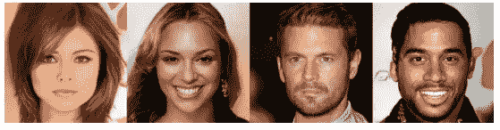

阿甘创造的仿真人脸([来源](https://research.nvidia.com/sites/default/files/pubs/2017-10_Progressive-Growing-of/karras2018iclr-paper.pdf))

我们在上一篇文章的[中看到了如何使用可变自动编码器生成新的照片级逼真图像。我们的 VAE 是在著名的](/variational-autoencoders-vaes-for-dummies-step-by-step-tutorial-69e6d1c9d8e9)[名人面孔数据集](http://mmlab.ie.cuhk.edu.hk/projects/CelebA.html)上接受训练的。

使用我们的 VAE 码(自创)的图像及其重建的例子

VAEs 通常会产生模糊和非真实感的人脸。这是建立生成性对抗网络的动机。

在本文中，我们将研究 GANs 如何提供一种完全不同的方法来生成与训练数据相似的数据。

# 概率游戏

生成新数据是一个概率游戏。当我们观察周围的世界并收集数据时，我们正在进行一项实验。一个简单的例子就是**拍一张名人的脸。**

这可以认为是一个概率实验，有一个未知的结果 *X* ，也叫**随机变量**。

如果实验重复多次，我们通常将随机变量 *X* 得到值小 *x* 的**概率**定义为小 *x* 发生的次数的分数。

例如，我们可以定义这张脸是著名歌手泰瑞斯的概率。

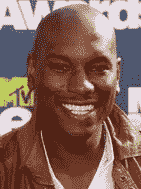

泰瑞斯·吉布森

这种实验的所有可能结果构建了所谓的**样本空间**，表示为ω(所有可能的名人面孔)。

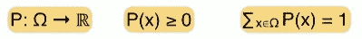

因此，我们可以将概率视为一个函数，它获取一个结果，即来自样本空间(一张照片)的一个元素，并将该结果映射到一个非负实数，使得所有这些数字的总和等于 1。

我们也称此为**概率分布函数** *P(X)* 。当我们知道样本空间(所有可能的名人面孔)和概率分布(每个面孔出现的概率)时，我们就有了实验的完整描述，我们可以对不确定性进行推理。

你可以通过下面的文章来更新你的概率知识。

 [## 理解概率。终于！

### 数据科学家概率概念实用指南

towardsdatascience.com](/understanding-probability-finally-576d54dccdb5) 

## 名人脸概率分布

生成新面孔可以用一个随机变量生成问题来表示。脸部由随机变量描述，通过其 RGB 值表示，展平成一个由 *N* 个数字组成的向量。

名人头像的高度为 218 像素，宽度为 178 像素，有 3 个颜色通道。因此每个向量是 116412 维的。

如果我们建立一个有 116412 ( *N* )个轴的空间，那么每个面都将是那个空间中的一个点。**名人脸概率分布函数** *P(X)* 会将每个脸映射到一个非负实数，使得所有脸的所有这些数字的总和等于 1。

该空间的一些点很可能代表名人的脸，而对于其他一些人来说，这是极不可能的。

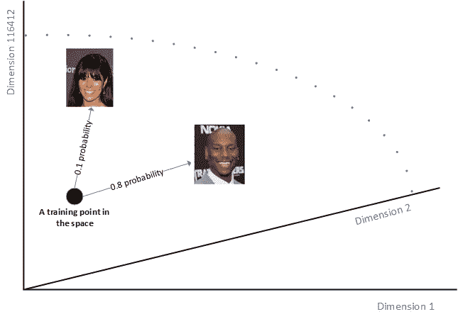

名人脸概率分布函数(自创)

GAN 通过在 N 维向量空间上生成遵循名人面部概率分布的新向量来生成新的名人面部。

> 简单地说， **GAN 会产生一个关于特定概率分布的随机变量。**

## 如何从复杂分布中生成随机变量？

N 维向量空间上的名人脸概率分布非常复杂，我们不知道如何直接生成复杂的随机变量。

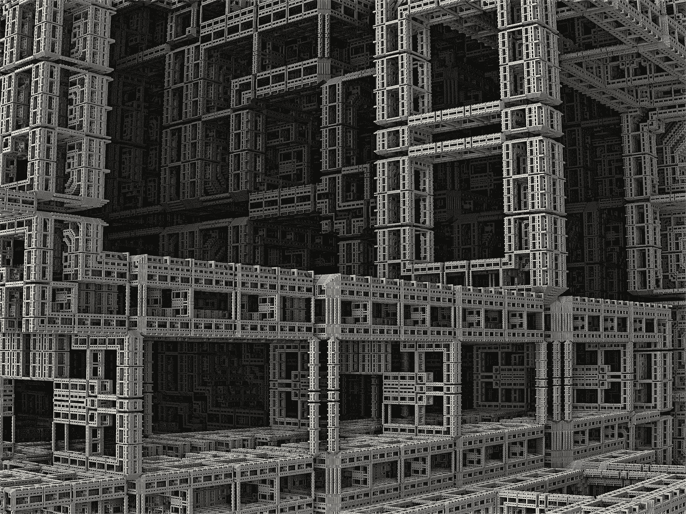

图片来自[像素点](https://pixabay.com/illustrations/fractal-3d-construction-industry-1120769/)上的数码相机

幸运的是，我们可以用一个适用于均匀随机变量的函数来表示复杂的随机变量。这就是**变换方法**的思想。它首先产生 N 个不相关的均匀随机变量，这很容易。然后它对这个简单的随机变量应用一个非常复杂的函数！**非常复杂的函数自然地被神经网络近似**。训练后，网络将能够接受一个简单的 N 维均匀随机变量作为输入，并返回另一个 N 维随机变量，该变量将遵循我们的名人脸概率分布。**这是生成性敌对网络背后的核心动机。**

# 为什么是生成性对抗网络？

在变换神经网络的每次训练迭代中，我们可以将名人训练集中的人脸样本与生成的人脸样本进行比较。

理论上，我们将使用**最大平均差异(MMD)方法**比较真实分布和基于样本生成的分布。

这将给出分布匹配误差，该误差可用于通过反向传播来更新网络。这种直接方法实际上实现起来非常复杂。

> GANs 不是直接比较真实分布和生成分布，而是解决真实样本和生成样本之间的无差别任务。

一个 GAN 有三个主要组件:一个用于生成新数据的*生成器模型*，一个用于对生成的数据是真实人脸还是虚假人脸进行分类的*鉴别器模型*，以及使它们相互对抗的*对抗网络*。

**生成部分**负责将 N 维均匀随机变量(噪声)作为输入，生成假面。生成器捕获概率 *P(X)* ，其中 *X* 为输入*。*

**鉴别部分**是一个简单的分类器，用于评估和区分生成的人脸和真正的名人人脸。鉴别器捕获条件概率 *P(Y|X)* ，其中 *X* 为输入， *Y* 为标签*。*

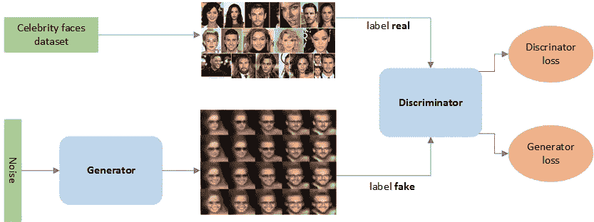

名人脸生成对抗网络(自创)

# 训练生成性对抗网络

生成网络被训练成最大化最终分类误差(真实数据和生成数据之间)，而判别网络被训练成最小化最终分类误差。这就是对抗性网络概念的来源。

从博弈论的角度来看，当生成器产生遵循名人脸概率分布的样本，并且鉴别器以相等的概率预测假货或非假货时，就达到了**均衡**,就好像它只是抛硬币一样。

重要的是，两个网络在训练期间平等地学习，并且**将** **汇聚到一起**。一种典型的情况是，当鉴别网络在识别假货方面变得更好时，导致生成网络被卡住。

在**鉴别器训练**过程中，我们忽略发生器损耗，只使用鉴别器损耗，这是对鉴别器将真实人脸误分类为假或将生成的人脸误分类为真实人脸的惩罚。生成器的权重通过反向传播来更新。发电机的重量没有更新。

在**生成器训练**时，我们使用生成器损耗，惩罚生成器未能骗过鉴别器，生成一张被鉴别器归类为假的脸。鉴别器在生成器训练期间被冻结，并且只有生成器的权重通过反向传播被更新。

这就是用 GANs 合成名人脸的魔术。收敛经常被认为是短暂的，而不是稳定的。当你把一切都做对了，GANs 会提供令人难以置信的结果，如下所示。

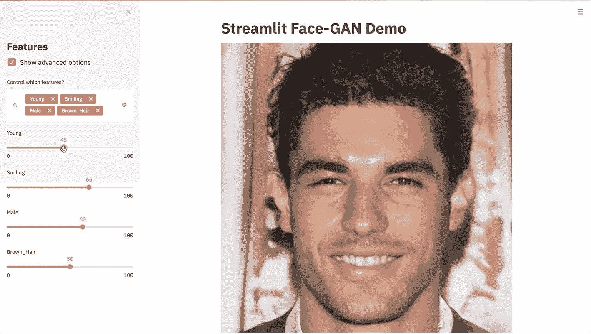

[通过细流合成 GAN-App(来源)](/build-an-app-to-synthesize-photorealistic-faces-using-tensorflow-and-streamlit-dd2545828021)

# 构建和训练 DCGAN 模型

在本节中，我们将介绍为名人面孔数据集创建、编译和训练 DCGAN 模型所需的所有步骤。深度卷积生成对抗网络(DCGANs)是使用卷积层的 gan。

## **鉴别器**

鉴别器可以是任何图像分类器，甚至是决策树。我们使用一个卷积神经网络来代替，它有 4 层。每个块都包括一个卷积、批量归一化和另一个卷积，该卷积将图像缩小一倍，并进行另一个批量归一化。结果通过平均池，然后是返回单一输出概率的密集 sigmoid 层。

## **发电机**

生成器获取潜在维度的噪声向量并生成图像。图像的形状应该与鉴别器输入的形状相同(*spatial _ dim*x*spatial _ dim*)。

发生器首先用密集层对噪声向量进行上采样，以便有足够的值来整形到第一个发生器块中。投影的目标是与鉴别器架构中的最后一个模块具有相同的维数。这相当于鉴频器最后一个卷积层中的 4 x 4 x 数量的滤波器，我们将在本文后面演示。

每个生成器模块应用去卷积来对图像进行上采样和批量归一化。我们使用 4 个解码器块和一个最终卷积层来获得一个 3D 张量，它表示一个具有 3 个通道的伪图像。

## **甘**

通过在生成器顶部添加鉴别器来构建联合 DCGAN。

在编译完整设置之前，我们必须将鉴别器模型设置为不可训练。这将冻结其权重，并告知整个网络中唯一需要训练的部分是发电机。

尽管我们编译了鉴别器，但我们不需要编译生成器模型，因为我们不单独使用生成器。

这个顺序确保鉴别器在正确的时间被更新，并在必要时被冻结。因此，如果我们训练整个模型，它将只更新生成器，而当我们训练鉴别器时，它将只更新鉴别器。

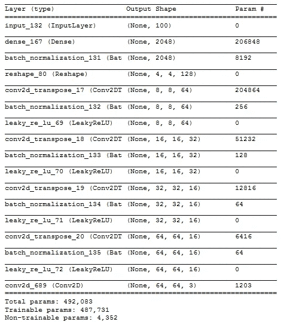

发电机架构

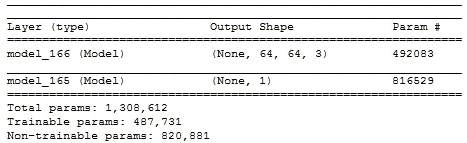

DCGAN 架构

## 甘培训

现在是艰难而缓慢的部分:训练一个生成性的对抗网络。因为 GAN 由两个独立训练的网络组成，收敛很难识别。

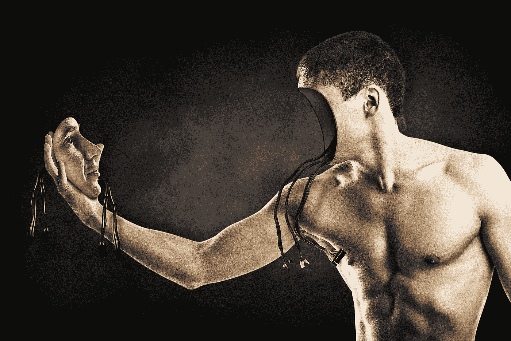

图像由 024–657–834 在 [Pixabay](https://pixabay.com/illustrations/man-face-facial-expression-body-845847/) 上显示

下面的步骤来回执行，让甘斯处理其他棘手的生殖问题。

**步骤 1** —从训练集中选择若干真实图像。

**第二步** —生成一些假图像。这是通过采样随机噪声向量并使用发生器从它们创建图像来完成的。

**步骤 3** —使用假图像和真实图像训练鉴别器一个或多个时期。这将通过将所有真实图像标记为 1 并将虚假图像标记为 0 来仅更新鉴别器的权重。

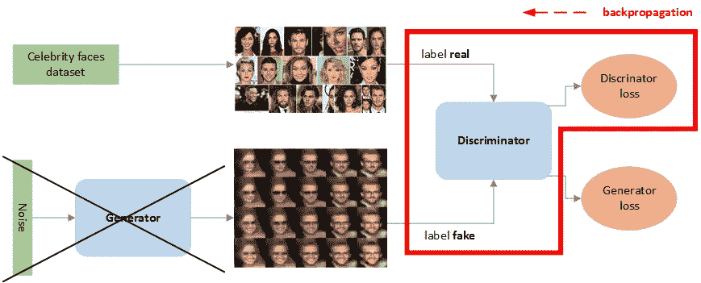

鉴别器训练模式(自行创建)-不更新生成器的权重。仅调整鉴别器的权重。真假数据都用。鉴别器学会检测假图像。

**步骤 4** —生成另一批伪图像。

**步骤 5** —仅使用伪图像训练一个或多个时期的完整 GAN 模型。这将通过将所有假图像标记为 1 来仅更新生成器的权重。

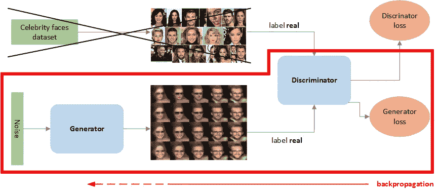

生成器训练模式(自行创建)-鉴别器权重未更新。仅调整发生器的权重。发电机学会愚弄鉴别器。

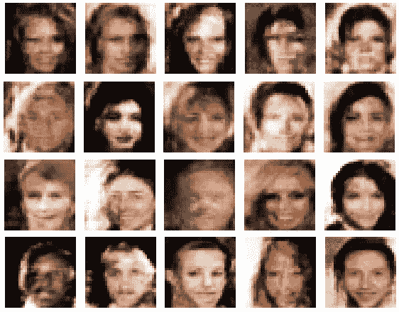

甘训练时生成器生成的假面

上面我们可以看到我们的甘表现很好。即使照片质量不如 CelebA 训练集中的照片质量好，生成的人脸看起来也很合理。这是因为我们在重新调整的 64x64 图像上训练我们的 GAN，这些图像变得比原始的 218x178 更小更模糊。

## 与甘的区别

与我们上一篇文章中的[中的 variable auto encoder 生成的人脸相比，DCGAN 生成的人脸看起来足够生动，足以代表足够接近现实的有效人脸。](/variational-autoencoders-vaes-for-dummies-step-by-step-tutorial-69e6d1c9d8e9)

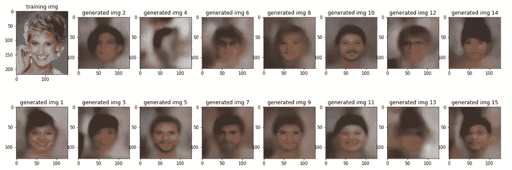

训练时由一个可变自动编码器生成的假脸([来源](/variational-autoencoders-vaes-for-dummies-step-by-step-tutorial-69e6d1c9d8e9)

与 vae 相比，gan 是典型的高级深度生成模型。尽管 vae 注定要在一个潜在的空间工作，他们训练起来更容易也更快。VAEs 可以被认为是半监督学习器，因为它们被训练来最小化再现某个图像的损失。另一方面，GAN 正在解决一个无监督的学习问题。

# 结论

在这篇文章中，我解释了生成敌对网络如何能够近似一大组图像的概率分布，并使用它来生成照片级的图像。

我提供了可以工作的 Python 代码，允许您构建和训练一个 GAN 来解决您自己的任务。

你可以通过[谷歌开发者](https://developers.google.com/machine-learning/gan/gan_structure)或 [Joseph Rocca 的文章](/understanding-generative-adversarial-networks-gans-cd6e4651a29)了解更多关于 GANs 的信息。变型自动编码器将在我下面的文章中进一步探讨。

 [## 用于假人的可变自动编码器(VAEs)——循序渐进教程

### DIY 实践指南与实践证明代码建设和培训与 Keras 的名人脸上的 VAEs。

towardsdatascience.com](/variational-autoencoders-vaes-for-dummies-step-by-step-tutorial-69e6d1c9d8e9) 

感谢《走向数据科学》的 Amber Teng 的编辑评论。

感谢阅读。注意安全。好好呆着。