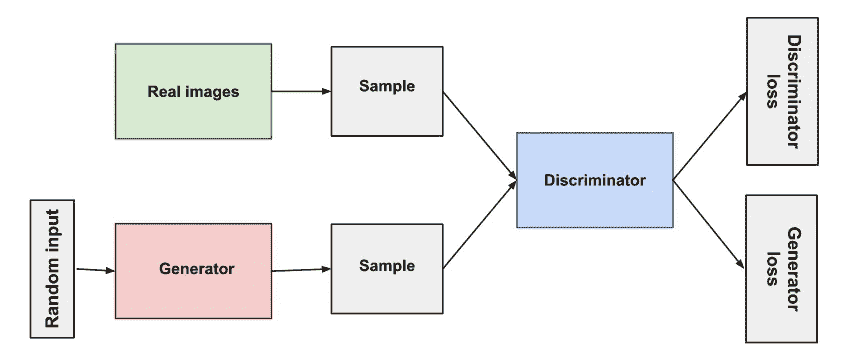

# 生成对抗网络

> 原文：<https://towardsdatascience.com/generative-adversarial-networks-6a17673db367?source=collection_archive---------13----------------------->

## 深度学习

## 用解读甘博弈

阿曼达·达尔比约恩在 [Unsplash](https://unsplash.com?utm_source=medium&utm_medium=referral) 上拍摄的照片

# 什么是生成性对抗网络？

由 [Ian Goodfellow](https://en.wikipedia.org/wiki/Ian_Goodfellow) 和他的同事在 2014 年设计的 GANs 由两个神经网络组成，它们在零和游戏中一起训练，其中一个玩家的损失是另一个玩家的收益。

为了理解 GANs，我们需要熟悉生成模型和判别模型。

***创成式模型*** *尝试使用训练集中的分布输出新的数据点。这些模型生成新的数据实例。这些模型捕捉联合概率 p(X，Y)*

**生成模型的类型** 1。显式密度模型
2。隐式密度模型

*显式密度模型定义了显式密度函数，而隐式密度模型定义了可直接生成数据的随机程序。*

如果您有兴趣阅读更多关于生成模型的内容，请查看下面这个流行的 GitHub 知识库。

 [## wise odd/生成模型

### 生成模型的集合，例如 GAN、Pytorch 中的和 Tensorflow。

github.com](https://github.com/wiseodd/generative-models) 

***另一方面，判别模型*** *捕捉条件概率 p(X/Y)，它们区分不同的数据实例。*

[图片来源:谷歌开发者。](https://developers.google.com/machine-learning/gan/generative)根据知识共享署名 4.0 许可证进行许可。

生成模型解决困难的任务。与辨别模型相比，注意力细节的水平更高。简单地说，生成模型做更多的工作。生成模型试图尽可能接近真实的数据分布。

在上图中，我们可以看到判别模型试图分离 0 和 1 的数据空间。而生成模型非常接近 0 和 1 的数据空间。

> 现在你知道了生成模型和判别模型的基本定义，让我们来学习一下 gan。

# 鉴别器和发生器网络 GAN 游戏

[JESHOOTS.COM](https://unsplash.com/@jeshoots?utm_source=medium&utm_medium=referral)在 [Unsplash](https://unsplash.com?utm_source=medium&utm_medium=referral) 上的照片

> 生成对抗网络是一种生成模型。它们并行生成完整的图像。GANs 由两个网络组成:鉴别器和发电机网络

[图片来源:谷歌开发者。](https://developers.google.com/machine-learning/gan/gan_structure)根据知识共享署名 4.0 许可证获得许可。

***甘斯使用了一个可微函数。这通常是一个神经网络。我们称之为发电机网络。*** *本发电机网络采用随机输入。这些输入是噪声。这种噪声被提供给一个可微分函数，该函数将其转换和整形为一个可识别的结构。这可能是一个镜像，它高度依赖于可微分函数输入端的噪声。*

对于各种噪声输入，我们可以生成许多图像。然而，生成器网络不会立即给出真实的图像。我们需要训练它。

> 我们如何训练这个发电机网络？可能和其他网络一样？其实没有！

生成器网络看到许多图像，并试图输出类似于相同概率分布的东西。这是怎么做到的？👀

***鉴别器来了，常规的神经网络分类器。鉴别器引导我们的发电机网络。***

为简单起见，我们称发电机网络的**输出图像为假图像。**发生器的输出，即假图像，作为输入提供给鉴别器。**鉴别器还从训练数据中看到所谓的真实图像。**鉴别器然后输出输入是真实图像的概率。所以 1 代表真实图像，0 代表虚假图像。与此同时，生成器还试图输出可能被鉴别器赋予概率为 1 的图像。

大多数机器学习模型试图通过优化参数来最小化一些成本函数。如果我们给 GANs 分配成本函数，我们可以说鉴别器的成本是发电机成本的负数，反之亦然。

因此，让我们通过假设鉴别器和生成器是两个参与者，a 是一个函数 f，来理解 GANs 是如何工作的。

发生器试图减少函数 f 的输出值，而鉴别器试图增加它。让我们假设这样做，直到我们达到一个平衡，在这个平衡中，发生器不能减少函数 f 的输出值，鉴别器也不能增加它。由于我们同时使用两种优化算法，一种用于发生器，另一种用于鉴别器，我们可能永远达不到平衡。亚当优化器是一个很好的选择。

简单来说，发生器和鉴别器竞争，发生器给鉴别器假数据。鉴别器也看到训练数据，预测接收到的图像是真的还是假的。

看看下面这个来自谷歌开发者机器学习速成班的例子。

生成器从不切实际的图像开始，很快学会了愚弄鉴别者。

[图片来源:谷歌开发者。](https://developers.google.com/machine-learning/gan/gan_structure)根据知识共享署名 4.0 许可证获得许可。

因此，随着时间的推移，生成器被训练来欺骗鉴别器，使其看起来像鉴别器看到的真实图像一样。

## 那么训练过程是怎样的呢？

在鉴别器的训练过程中，显示真实图像并使用计算鉴别器损失。它对来自生成器的真实和虚假图像进行分类，如果任何图像被错误分类，鉴别器损失惩罚鉴别器。通过反向传播，鉴别器更新其权重。

类似地，发生器被给予噪声输入以产生假图像。这些图像被提供给鉴别器，并且发生器损耗惩罚发生器产生被鉴别器网络分类为假的样本。权重通过从鉴别器到生成器的反向传播来更新。

需要注意的是，在鉴频器训练阶段，发生器必须保持不变。同样，鉴别器在发电机训练阶段保持不变。因此，GAN 训练以交替的方式进行。

# 甘

> 在本节中，我们将学习设计一个 GAN，它可以生成手写数字的新图像。我们将使用著名的 MNIST 数据集。[拿过来。](http://yann.lecun.com/exdb/mnist/)

## 鉴别器架构

鉴别器将会是一个典型的线性分类器。

我们将使用的激活函数是[泄漏 ReLu](https://pytorch.org/docs/stable/nn.html#torch.nn.LeakyReLU) 。

[图片来自 PyTorch 文档](https://pytorch.org/docs/stable/generated/torch.nn.LeakyReLU.html#torch.nn.LeakyReLU)。(开源)

**为什么会漏 ReLu？我们应该使用一个泄漏的 ReLU 来允许梯度不受阻碍地通过图层回流。泄漏的 ReLU 类似于正常的 ReLU，除了对于负输入值有一个小的非零输出。**

作者代码。

## 发电机架构

生成器使用潜在样本制作假图像。这些潜在样本是映射到伪图像的向量。一个潜在向量只是一个图像的压缩的特征级表示！

为了理解什么是潜在样本，考虑一个自动编码器。连接网络的编码器和解码器部分的输出由压缩表示组成，该压缩表示也可以称为**潜在向量。**

所有层的激活函数保持不变，除了我们将在输出中使用 [Tanh](https://pytorch.org/docs/stable/generated/torch.nn.Tanh.html#torch.nn.Tanh) 。

[图片来自 PyTorch 文档](https://pytorch.org/docs/stable/generated/torch.nn.Tanh.html#torch.nn.Tanh)。(开源)

**为什么在输出端出现 Tanh？**
已经发现，对于发电机输出的𝑡𝑎𝑛ℎtanh，发电机表现最佳，其将输出缩放到-1 和 1 之间，而不是 0 和 1。

作者代码。

## **缩放图像**

我们希望生成器的输出与真实图像的像素值相当，后者是 0 到 1 之间的归一化值。因此，当我们训练鉴别器时，我们还必须缩放我们的实际输入图像，使像素值在-1 和 1 之间。
这将在培训阶段完成。

## 一般化

为了帮助鉴别器更好地归纳，标签**从 1.0 减少到 0.9** 。为此，我们将使用参数 smooth 如果是真的，那么我们应该平滑我们的标签。在 PyTorch 中，这看起来像:
`labels = torch.ones(size) * 0.9`

我们还利用了脱落层来避免过度拟合。

## 损失计算

鉴别器的目标是为真实图像输出 1，为虚假图像输出 0。另一方面，生成器希望制作与真实图像非常相似的假图像。

*由此我们可以说如果****【D】****代表了对于鉴别器的损失，那么下面可以陈述:* ***鉴别器的目标:****D(real _ images)= 1&D(fake _ images)= 0* ***目标生成器:*** *D(real_images)=)*

作者代码

我们将使用 [BCEWithLogitsLoss](https://pytorch.org/docs/stable/nn.html#bcewithlogitsloss) ，它结合了一个 sigmoid 激活函数(我们希望鉴别器输出一个 0–1 的值，指示一个图像是*真实的还是伪造的*)和二进制交叉熵损失。

Binar 交叉熵损失方程。图片由作者提供。

## 培养

如前所述，Adam 是一个合适的优化器。

生成器接收一个向量 z 并输出假图像。鉴别器在真实图像的训练和由生成器产生的伪图像的训练之间交替。

## 鉴别器培训中涉及的步骤:

1.  我们首先计算真实图像的损失
2.  生成假图像
3.  计算假图像的损失
4.  添加真实和虚假图像的损失
5.  执行反向传播并更新鉴别器的权重

## 发电机培训涉及的步骤:

1.  生成假图像
2.  计算带有反向标签的伪图像的损失
3.  执行反向传播并更新生成器的权重。

作者代码。

## 培训损失

我们将绘制发生器和鉴频器损耗与历元数的关系图。

作者代码。

培训损失。图片由作者提供。

## 生成器生成的样本

**开始时**

作者代码。

图片由作者提供。

**加班**

作者代码。

图片由作者提供。

这样，生成器从有噪声的图像开始，并随着时间的推移而学习。

> 您也可以在我的 GitHub 个人资料上查看代码和自述文件。

 [## NvsYashwanth/MNIST 甘

### 了解 MNIST 实施的 GANs。

github.com](https://github.com/NvsYashwanth/MNIST-GAN) 

# 结论

自从蒙特利尔大学的 Ian Goodfellow 和他的同事设计出 GANs 以来，它们就大受欢迎。申请的数量惊人。GAN 通过许多变体得到进一步改进，其中一些变体是循环 GAN、条件 GAN、渐进 GAN 等。[要了解更多信息，请点击此链接](https://developers.google.com/machine-learning/gan/applications)。现在打开一个 Jupyter 笔记本，尝试实现你所学到的任何东西。

## 谢谢你。下一场见。