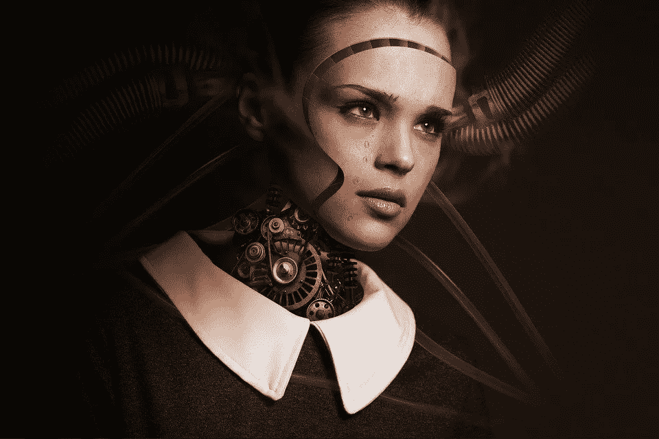
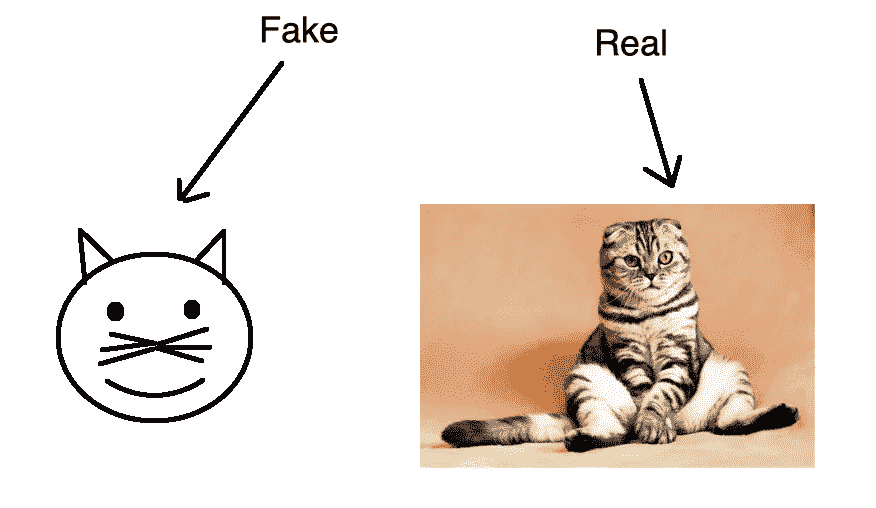
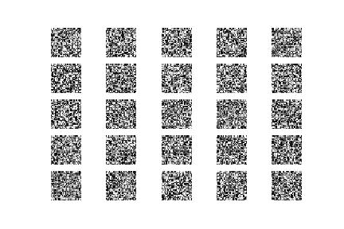
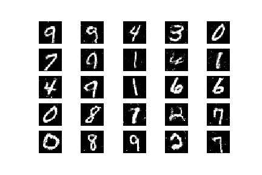

# 生成对抗网络

> 原文：<https://towardsdatascience.com/generative-adversarial-networks-bf4e809180b3?source=collection_archive---------41----------------------->



[combreak](https://pixabay.com/users/comfreak-51581/)pix abay

生成对抗网络或简称 GANs 是一种神经网络，可用于生成数据，而不是试图对其进行分类。虽然有点令人不安，以下网站提供了一个令人印象深刻的例子。

[](https://thispersondoesnotexist.com/) [## 此人不存在

### 此人不存在

这个人不是 Existthispersondoesnotexist.com](https://thispersondoesnotexist.com/) 

生成性对抗网络由两部分组成。一个学习生成似是而非的数据的**生成器**和一个学习区分生成器的假数据和真实数据的**鉴别器**。只要检测到虚假数据，鉴别器就会处罚生成器。



鉴别器和发生器的训练阶段是分开的。换句话说，生成器的权重保持固定，同时它为鉴别器提供训练样本，反之亦然。通常，我们交替训练鉴别器和生成器一个或多个时期。

鉴别器训练过程与任何其他神经网络的训练过程相当。鉴别器对来自发生器的真实样本和虚假数据进行分类。鉴别器损失函数惩罚将真实实例误分类为假实例或将假实例误分类为真实实例的鉴别器，并通过反向传播更新鉴别器的权重。

类似地，发生器产生样本，然后由鉴别器分类为假的或真的。然后将结果输入损失函数，该函数因生成器未能欺骗鉴别器而对其进行惩罚，并使用反向传播来修改生成器的权重。

随着生成器随着训练而改进，鉴别器的性能变得更差，因为鉴别器无法区分真假。如果生成器完全成功，那么鉴别器有 50%的准确性(不比随机机会好)。后者对 GAN 整体的收敛提出了真正的问题。如果 GAN 继续训练超过鉴别器给出完全随机反馈的点，那么发生器开始训练垃圾反馈，其自身的性能可能会受到影响。

# Python 代码

让我们来看看如何用 Python 来实现一个生成式对抗网络。首先，我们导入以下库。

```
from keras.datasets import mnist
from keras.layers import Input, Dense, Reshape, Flatten, Dropout
from keras.layers import BatchNormalization, Activation
from keras.layers.advanced_activations import LeakyReLU
from keras.models import Sequential, Model
from keras.optimizers import Adam
import matplotlib.pyplot as plt
import sys
import numpy as np
```

我们将使用 MNIST 数据集，其中包含 28×28 的手写数字图像。我们用以下参数创建了一个名为`GAN`的类。

```
class GAN():
    def __init__(self):
        self.image_rows = 28
        self.image_cols = 28
        self.channels = 1
        self.image_shape = (self.image_rows, self.image_cols, self.channels)
        self.input_dim = 100
        optimizer = Adam(0.0002, 0.5)
        self.discriminator = self.build_discriminator()
        self.discriminator.compile(loss='binary_crossentropy', optimizer=optimizer, metrics=['accuracy'])
        self.generator = self.build_generator()_in = Input(shape=(self.input_dim,))
        image = self.generator(_in)self.discriminator.trainable = Falsevalidity = self.discriminator(image)self.combined = Model(_in, validity)
        self.combined.compile(loss='binary_crossentropy', optimizer=optimizer)
```

我们定义了发电机网络。

```
def build_generator(self):
        model = Sequential()
        model.add(Dense(256, input_dim=self.input_dim))
        model.add(LeakyReLU(alpha=0.2))
        model.add(BatchNormalization(momentum=0.8))
        model.add(Dense(512))
        model.add(LeakyReLU(alpha=0.2))
        model.add(BatchNormalization(momentum=0.8))
        model.add(Dense(1024))
        model.add(LeakyReLU(alpha=0.2))
        model.add(BatchNormalization(momentum=0.8))
        model.add(Dense(np.prod(self.image_shape), activation='tanh'))
        model.add(Reshape(self.image_shape))
        model.summary()
        noise = Input(shape=(self.input_dim,))
        image = model(noise)
        return Model(noise, image)
```

我们定义鉴别器网络。

```
def build_discriminator(self):
        model = Sequential()
        model.add(Flatten(input_shape=self.image_shape))
        model.add(Dense(512))
        model.add(LeakyReLU(alpha=0.2))
        model.add(Dense(256))
        model.add(LeakyReLU(alpha=0.2))
        model.add(Dense(1, activation='sigmoid'))
        model.summary()
        image = Input(shape=self.image_shape)
        validity = model(image)
        return Model(image, validity)
```

接下来，我们定义一个函数来训练模型。我们首先对每个图像的像素进行归一化，使它们的范围从负到正。我们使用 Numpy 来创建随机噪声，它反过来被生成器用来产生假数据。除了已知为真实的样本之外，还对生成的数据训练鉴别器。最后，通过将输出与实际样本进行比较来计算发电机损耗。

```
def train(self, epochs, batch_size=128, sample_interval=50):
        (X_train, _), (_, _) = mnist.load_data()
        X_train = X_train / 127.5 - 1.
        X_train = np.expand_dims(X_train, axis=3)
        valid = np.ones((batch_size, 1))
        fake = np.zeros((batch_size, 1))for epoch in range(epochs):
            index = np.random.randint(0, X_train.shape[0], batch_size)
            images = X_train[index]
            noise = np.random.normal(0, 1, (batch_size, self.input_dim))
            gen_images = self.generator.predict(noise)
            d_loss_real = self.discriminator.train_on_batch(images, valid)
            d_loss_fake = self.discriminator.train_on_batch(gen_images, fake)
            d_loss = 0.5 * np.add(d_loss_real, d_loss_fake)noise = np.random.normal(0, 1, (batch_size, self.input_dim))
            g_loss = self.combined.train_on_batch(noise, valid)print ("%d [Discriminator loss: %f, acc.: %.2f%%] [Generator loss: %f]" % (epoch, d_loss[0], 100*d_loss[1], g_loss))
            if epoch % sample_interval == 0:
               self.sample_images(epoch)
```

我们定期保存输出，以便在整个训练过程中评估模型的性能。

```
def sample_images(self, epoch):
        r, c = 5, 5
        noise = np.random.normal(0, 1, (r * c, self.input_dim))
        gen_images = self.generator.predict(noise)
        gen_images = 0.5 * gen_images + 0.5
        fig, axs = plt.subplots(r, c)
        count = 0
        for i in range(r):
            for j in range(c):
                axs[i,j].imshow(gen_images[count, :,:,0], cmap='gray')
                axs[i,j].axis('off')
                count += 1
        fig.savefig("images/%d.png" % epoch)
        plt.close()
```

最后，我们创建 GAN 类的一个实例并训练该模型。

```
gan = GAN()
gan.train(epochs=100000, batch_size=128, sample_interval=10000)
```

最初，GAN 的输出只是随机噪声。



然而，到最后，输出开始看起来像手写数字。

