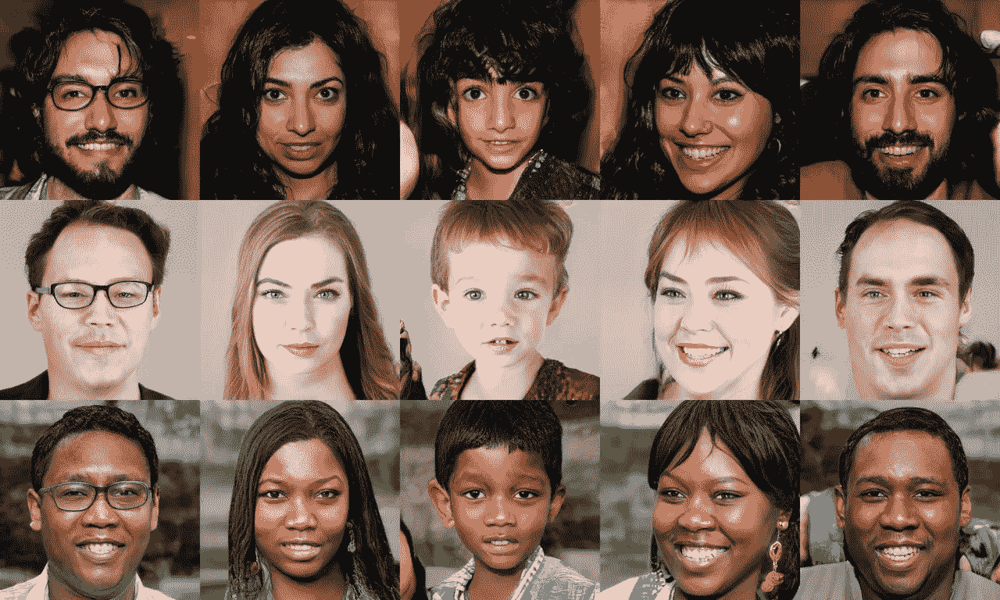

# 生成对抗网络

> 原文：<https://towardsdatascience.com/generative-adversarial-networks-gans-2231c5943b11?source=collection_archive---------16----------------------->

## 一个温和的甘的介绍，为什么训练他们是有挑战性的，有什么主要的补救措施？

这些超现实的人脸图像不是真实的；它们是由英伟达风格的 GAN 制作的，可以控制图像的不同方面

生成对抗网络(*又名* GANs)代表了深度学习领域最近最令人兴奋的创新之一。gan 最初是由蒙特利尔大学的 Ian Goodfellow 和 Yoshua Bengio 在 2014 年提出的，Yann LeCun 认为它们是*“过去 10 年中最有趣的想法”*。

GAN 是一个生成模型，其中两个神经网络在典型的博弈论场景中竞争。第一个神经网络是**生成器**，负责生成类似于你的训练数据的新合成数据实例，而它的对手**鉴别器**试图区分生成器生成的真实(训练)和虚假(人工生成)样本。生成器的任务是试图愚弄鉴别器，鉴别器试图抵制被愚弄。这就是为什么整个系统被描述为**对抗**的原因。

如下图所示，生成器的输入只是一个随机噪声，而只有鉴别器可以访问用于分类目的的训练数据。该发生器仅基于鉴别器网络的反馈(在与训练数据匹配的情况下为正，在不匹配的情况下为负)来不断改进其输出。

[生成对抗性网络架构](https://www.freecodecamp.org/news/an-intuitive-introduction-to-generative-adversarial-networks-gans-7a2264a81394/)

形式上，GANs 是基于**零和(极小最大)非合作博弈**，一方赢对方输。当第一个玩家试图最大化其行动时，第二个玩家的行动旨在最小化它们。从博弈论的角度来看，当鉴别器和发生器达到众所周知的**纳什均衡**时，GAN 模型收敛，该均衡是上述极小极大博弈的最佳点。由于两个参与者试图误导对方，当其中一个参与者不管对手做什么都不改变其行动时，纳什均衡就发生了。

因此，众所周知，gan 在实践中很难训练，存在严重的不收敛问题，在生成器开始产生接近真实数据的假数据之前需要一段时间。

# **共同面临的挑战**

GANs 有许多常见的故障模式，在训练时可能会出现。在这些失败中，三大挑战问题是世界各地几个研究小组的工作重点。虽然这些问题都没有完全解决，但我们会提到一些人们已经尝试过的事情。

## **1。模式崩溃**

在训练 GANs 时，目标是产生各种各样的模拟真实数据的假数据*(即符合相同的分布)*。从一个随机输入，我们想创造一个完全不同的新输出*(例如一个新的现实的人脸)*。然而，当发生器发现**一个**或一个**有限多样性**的样本而不考虑输入时，这对于鉴别器来说似乎是最合理的，发生器可以 ***合法地*** 学习只产生那个输出。即使它起初看起来是训练进展的良好迹象，但当训练被称为 ***模式崩溃*** 或 ***helvetica 场景*** 的 gan 时，这是最具挑战性的失败之一。一旦鉴别器陷入局部最小值并且不能区分真实输入和发电机的输出，这种情况就可能发生。此时，生成器将很容易注意到这个黑洞，并不断生成相同的输出，或者最多是略有不同的输出。

*尝试补救*

*   使用不同的损失函数，例如 **Wasserstein 损失**，让你训练鉴别器达到最优，而不用担心消失梯度。如果鉴别器没有陷入局部最小值，它会学习拒绝发电机稳定的输出。所以发电机必须尝试新的东西。
*   **展开的 GANs** 使用发电机损耗函数，该函数不仅包含当前鉴别器的分类，还包含未来鉴别器版本的输出。所以生成器不能对单个鉴别器进行过度优化。
*   用**不同的数据样本**训练 GANs。

## 2.不收敛

GANs 经常无法收敛。通过假设两个神经网络相互竞争，目标是两个网络最终都将达到平衡，对抗性训练场景可能很容易看起来不稳定。如果不深入了解如何规避这种风险，这可能被认为是一个天真的假设，因为无法保证竞争梯度更新将导致收敛而不是随机振荡。

*尝试补救*

*   一个简单的技巧是**将噪声**添加到鉴别器输入(真实和合成数据)中，以阻止它对其分类过于自信，或者依靠一组有限的特征来区分训练数据和生成器的输出。
*   在与上一个技巧相同的方向上，我们可以尝试使用 NIPS'2017 中提出的 [**两个时标更新规则**](https://papers.nips.cc/paper/7240-gans-trained-by-a-two-time-scale-update-rule-converge-to-a-local-nash-equilibrium.pdf) ，其中作者提供了收敛到纳什均衡的数学证明。为鉴别器选择比生成器更高的学习速率。因此，我们的生成器将比鉴别器有更多的训练迭代和更多的训练时间。很容易理解，训练一个分类器比训练一个生成模型要容易得多。
*   惩罚歧视者权重:参见，例如，通过**正则化**稳定生成性对抗网络的训练。

## 3.消失渐变

研究表明，如果你的鉴别器太好，那么发电机训练可能会因梯度消失而失败。实际上，最佳鉴别器不能为生成器提供足够的信息来取得进展。当我们应用反向传播时，我们使用微分的链式法则，它具有乘法效应。因此，梯度反向流动，从最后一层到第一层。当它向后流动时，它变得越来越小。有时，梯度太小，以至于初始层学习非常慢或者完全停止学习。在这种情况下，梯度根本不改变初始层的权重值，因此网络中初始层的训练被有效地停止。这就是所谓的**消失渐变**问题。

*尝试补救*

*   我们可以使用**激活功能**，例如 *ReLU* 、 *LeakyReLU* ，而不是 *sigmoid* 或 *tanh* 分别在 0 和 1 或-1 和 1 之间挤压输入值，导致梯度呈指数下降。
*   **Wasserstein 损失**旨在防止梯度消失，即使您将鉴别器训练到最佳状态。
*   原[甘](https://arxiv.org/pdf/1406.2661.pdf)论文提出了一种**改进的极大极小损失**来处理消失梯度。

## 了解你的作者

拉贝赫·阿亚里是一名高级数据科学家，致力于信用风险建模和欺诈分析的应用人工智能问题，并在机器学习方面进行原创研究。我的专业领域包括使用深度神经网络的数据分析、机器学习、数据可视化、特征工程、线性/非线性回归、分类、离散优化、运筹学、进化算法和线性编程。欢迎随时给我留言[这里](http://rabeh.ayari@polymtl.ca)！