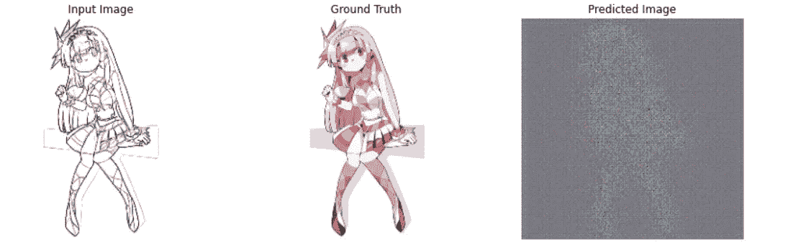

# 草图到彩色图像生成| GANs

> 原文：<https://towardsdatascience.com/generative-adversarial-networks-gans-89ef35a60b69?source=collection_archive---------12----------------------->

## GANS 系列

## 2-学习使用条件 GANs 构建草图到颜色图像生成模型

150 个纪元后发电机模型的输出(Gif 由作者制作)

本文是我在 towards data sciences on media 上发表的[***Gans-Series***](https://towardsdatascience.com/tagged/gans-series)的一部分。如果您不知道什么是赶工，或者您对赶工有一个想法，但希望很快再复习一遍，我强烈建议您阅读 [***之前的文章***](/generative-adversarial-networks-gans-8fc303ad5fa1)*，这只是一篇 7 分钟的阅读，为刚接触这一令人惊叹的深度学习领域的人提供了对赶工的简单理解。*

*如您从上面显示的 gif 中所知，本文将学习如何创建条件 GAN，以便在不了解实际情况的情况下，根据给定的黑白草图输入预测彩色图像。*

# *在进入编码模式之前，一些需要知道的事情…*

*草图到彩色图像生成是一种使用条件生成对抗网络的图像到图像翻译模型，如 Phillip Isola、朱俊彦、周廷辉、Alexei A. Efros 2016、*[***等在原论文中所述。***](https://arxiv.org/abs/1611.07004)**

**当我第一次看到这篇论文时，看到作者展示的如此伟大的成果是令人惊讶的，基本的想法本身也是令人惊讶的。**

## **应用程序**

**作者在原论文中描述了许多条件遗传算法的应用场景。部分选择如下。**

*   ****航空照片地图，航空照片地图****
*   ****拍照城市风景****
*   ****照片的建筑立面标签****
*   ****白天到晚上的照片****
*   ****照片修复****
*   ****彩色图像草图** *(我们将在本文中构建的那个)***

****

**图片来自 Phillip Isola，朱俊彦，周廷辉，Alexei A. Efros 2016，[条件敌对网络下的图像间翻译](https://arxiv.org/abs/1611.07004)**

**我们将要建立一个条件生成对抗网络，它接受一个 256x256 px 的黑白草图图像，并在不知道基本事实的情况下预测该图像的彩色版本。该模型将在 Kaggle 上可用的 [***动漫素描着色对数据集***](https://www.kaggle.com/ktaebum/anime-sketch-colorization-pair) 上进行训练，该数据集包含 14.2k 对素描着色动漫图像。**

> **当我在我的系统上训练模型时，我在单个 GeForce GTX 1060 6GB 显卡和 16 GB RAM 上运行了 150 个 epochs，耗时约 23 小时。经过所有的努力和耐心，结果是完全值得的！**

****

**经过训练的生成器模型的输出(图片由作者提供)**

# **现在让我们进入有趣的部分…**

**为了构建这个模型，我使用了 TensorFlow 2.x，大部分代码都是基于他们关于 pix 2 pix for[***CMP Facade Dataset***](http://cmp.felk.cvut.cz/~tylecr1/facade/)*的精彩教程，该教程从 Facade 标签预测建筑照片。TensorFlow 教程是理解框架和从事一些知名项目的好方法。我强烈推荐你浏览网站上的所有教程—[***https://www.tensorflow.org/tutorials***](https://www.tensorflow.org/tutorials)。***

# **要求**

**要构建这个模型，您需要在您的系统上安装一些基本要求，以便它能够正常工作。**

*   **[***Python 3.6***](https://www.python.org/downloads/release/python-360/)及以上**
*   **[***pip 19.0***](https://pypi.org/project/pip/)或更新**
*   **Windows 7 或更高版本(64 位)**
*   **[适用于 Visual Studio 2015、2017 和 2019 的 Microsoft Visual C++可再发行版](https://support.microsoft.com/en-us/help/2977003/the-latest-supported-visual-c-downloads)**
*   **[***tensor flow 2.2***](https://www.tensorflow.org/install/pip)及以上**
*   **[***GPU 支持***](https://www.tensorflow.org/install/gpu) 需要支持 CUDA 的卡**

**如果你计划使用任何像 Google Colab 这样的云环境，你需要记住训练将会花费很多时间，因为 GANs 运行起来计算量很大。Google Colab 有 12 个小时的绝对超时，这意味着笔记本内核被重置，所以你需要考虑一些要点，如安装 Google Drive 并定期保存检查点，以便你可以从超时前停止的地方继续训练。**

# **下载数据集**

**下载 Kaggle 上的 [***动漫素描上色对数据集***](https://www.kaggle.com/ktaebum/anime-sketch-colorization-pair) 并保存到文件夹目录。根文件夹将包含文件夹`colorgram`、`train`和`val`。为了方便起见，我们将根文件夹的路径称为`path/to/dataset/`。**

**一旦检查了基本要求，并且数据集被下载到您的机器上，就该开始编写您自己的条件 GAN 了。**

**在我们开始之前，请注意，如果你想理解它背后的基本工作原理，我将要提供的代码不应该只是从这里复制和粘贴。不要犹豫提出你的问题，因为这是学习的方式——通过提问。**

# **最后是代码！**

**首先，让我们初始化参数来配置模型的训练。如前所述，我们将使用 TensorFlow 框架，因此我们需要通过使用`import tensorflow as tf`来导入它。**

**`os`模块用于与操作系统交互。我们将使用它来访问和修改路径变量，以便在训练期间保存检查点。`time`模块让我们显示相对时间，因此，我们可以检查每个历元在训练中花费了多少时间。**

**`matplotlib`是另一个很酷的 python 库，我们将用它来绘制和显示图像。**

**`BUFFER_SIZE`用于我们在训练时混洗数据样本。这个值越高，洗牌的程度就越大，因此，模型的准确性就越高。但是对于大数据，打乱图像需要很大的处理能力。对于采用英特尔酷睿 i7–8750h CPU 和 16 GB 内存的系统，可以将其设置为等于训练数据集样本的大小，即 14，224。**

> **N 注:`shuffle()`的最高效率是当你设置 buffer_size 等于数据样本的大小时。通过这种方式，它获取主存储器中的所有样本[在本例中为 14，224 个]，并从中随机选择一个。如果你把它设置为 10，它会从内存中取出 10 个样本，从这 10 个样本中随机选择一个，然后对其余的样本重复这个过程。所以，检查你的机器性能，找出最佳点。**

**`BATCH_SIZE`用于将数据集分成小批量进行训练。该值越高，训练过程越快。但是您可能已经猜到了，更大的批量意味着机器上更高的负载。**

**现在，如果您看一下数据集，您有一个大小为 1024x512 px 的单个图像，其中左侧有一个大小为 512x512 px 的彩色图像，右侧有一个大小为 512x512 px 的黑白草图图像。**

****

**可视化数据(来自 [*动画草图-着色对数据集*](https://www.kaggle.com/ktaebum/anime-sketch-colorization-pair) 的图像)**

**我们将定义一个函数`load()`，它将图像路径作为一个参数，并返回一个`input_image`，它是我们将作为模型输入的黑白草图，以及一个 `real_image`，它是我们想要的彩色图像。**

## **预处理**

**现在我们已经加载了数据，我们需要做一些预处理，以便为模型准备数据。**

**下面给出了几个用于此目的的简单函数。**

**`resize()`功能用于返回 286x286 像素的图像。这样做是为了在数据集中偶然出现不同大小的图像时具有统一的图像大小。将大小从 512x512 px 减小到一半也有助于加速模型训练，因为它的计算量较小。**

**`random_crop()`函数返回所需尺寸为 256x256 px 的裁剪输入和真实图像。**

**`normalize()`函数，顾名思义，将图像归一化为[-1，1]。**

**在上面显示的`random_jitter()`函数中，所有之前的预处理函数被放在一起，随机图像被水平翻转。您可以从下面给出的图像中看到数据预处理的结果。**

****

**预处理图像(作者提供的图像)**

## **加载训练和测试数据**

**`load_image_train()` function 用于将之前看到的所有函数放在一起，输出最终的预处理图像。**

**`tf.data.Dataset.list_files()`收集数据集的`train/`文件夹中所有可用 png 文件的路径。然后映射这些路径的集合，每个路径作为参数单独发送给`load_image_train()`函数，该函数返回最终的预处理图像并将其添加到`train_dataset`。**

**最后，使用`BUFFER_SIZE`对这个`train_dataset`进行洗牌，然后如前所述分成小批量。**

**为了加载测试数据集，我们将使用一个类似的过程，除了一个小的变化。这里我们将省略`random_crop()`和`random_jitter()`函数，因为不需要这样做来测试结果。同样，出于同样的原因，我们可以省略对数据集的混洗。**

## **构建发电机模型**

**现在让我们构建生成器模型，它采用 256x256 px 的输入黑白草图图像，并输出有望类似于训练数据集中的彩色地面真实图像的图像。**

**生成器模型是一个 UNet 体系结构模型，并且跳过了与中间层以外的其他层的连接。请注意，由于输出和输入形状需要与连接的层相匹配，因此设计这样的架构会变得很复杂，所以要小心设计。**

**下采样叠层具有卷积层，这导致输入图像的尺寸减小。一旦缩小的图像通过具有某种“反向”卷积层的上采样堆栈，大小就会恢复到 256x256 像素。因此，发生器模型的输出是具有 3 个输出通道的 256x256 px 图像。**

**你可以看看下面给出的模型概要。**

****

**发电机模型的模型摘要(图片由作者提供)**

## **建立鉴别器模型**

**鉴别器模型的主要目的是找出哪个图像来自实际训练数据集，哪个图像是生成器模型的输出。**

**可以看看下面给出的鉴频器的型号总结。这不像生成器模型那样复杂，因为它的基本任务只是对真实和虚假的图像进行分类。**

****

**鉴别器模型摘要(图片由作者提供)**

## **模型的损失函数**

**由于我们有两个模型，我们需要两个不同的损失函数来独立计算它们的损失。**

**发生器的损耗通过寻找发生器输出的 sigmoid 交叉熵损耗和 1 的阵列来计算。这意味着我们正在训练它欺骗鉴别器输出值为 1，这意味着它是一个真实的图像。此外，为了使输出在结构上与目标图像相似，我们还考虑了 L1 损耗。 [***原论文***](https://arxiv.org/abs/1611.07004) 的作者建议`LAMBDA`的值保持为 100。**

**对于鉴别器损失，我们取真实图像和 1 阵列的相同 sigmoid 交叉熵损失，并将其与发生器模型和 0 阵列的输出图像的交叉熵损失相加。**

## **优化者**

**优化器是用来改变神经网络属性的算法或方法，如权重和学习率，以减少损失。在大多数用例中，Adam Optimizer 是最好使用的优化器之一。**

## **创建检查点**

**如前所述，云环境有一个特定的超时，它会中断训练过程。此外，如果您使用本地系统，可能会出现由于某些原因培训中断的情况。**

**gan 需要很长的训练时间，并且计算量很大。因此，最好定期保存检查点，这样您就可以恢复到最新的检查点，并从那里继续，而不会丢失您的机器之前所做的艰苦工作。**

## **显示输出图像**

**上面给出的代码块是一个基本的 python 函数，它使用来自`matplotlib`库的`pyplot`模块来显示生成器模型预测的图像。**

****

**通过未训练的生成器模型显示预测图像(作者提供的图像)**

## **记录损失**

**您可以将损失等重要指标记录在文件中，以便在 Tensorboard 等工具上进行训练时进行分析。**

## **训练步骤**

**一个基本的训练步骤将包括以下过程:**

*   **生成器输出预测**
*   **鉴频器模型设计为一次有 2 个输入。第一次给出了输入的草图图像和生成的图像。下一次给它真实的目标图像和生成的图像。**
*   **现在，发电机损耗和鉴频器损耗计算完毕。**
*   **然后，根据损失计算梯度，并将其应用于优化器，以帮助生成器生成更好的图像，并帮助鉴别器以更好的洞察力检测真实的和生成的图像。**
*   **使用之前使用`tf.summary`定义的`summary_writer`记录所有损失。**

## **Model.fit()**

**TensorFlow 是一个非常棒的、易于使用的模型训练框架。像`model.fit()`这样的小命令就能为我们带来奇迹。**

**不幸的是，它在这里不能直接工作，因为我们已经创建了两个协同工作的模型。但是这也很容易做到。**

**在这里，我们对每个时期进行迭代，并将相对时间分配给`start`变量。然后我们展示了一个由生成器模型生成的图像的例子。这个例子帮助我们直观地看到生成器如何在每个时期更好地生成颜色更好的图像。然后我们调用模型的`train_step`函数，从计算的损耗和梯度中学习。最后，我们检查纪元编号是否能被 5 整除，以节省检查点。这意味着我们每完成 5 个训练周期就保存一个检查点。在整个时期完成后，从最终相对时间中减去开始时间，以计算该特定时期所用的时间。**

## ***啊！终于，我们到了…***

**我们现在要做的就是运行这一行代码，然后等待模型自己施展魔法。好吧，我们不要完全相信这个模型，我们已经做了很多艰苦的工作，现在是时候看看结果了。**

## **恢复最新的检查点**

**在继续之前，我们必须恢复可用的最新检查点，以便在对映像进行测试之前加载最新版本的已定型模型。**

## **测试输出**

**这从`test_dataset`中随机选择 5 幅图像，并将它们分别输入到发生器模型中。现在该模型被训练得足够好，并且预测输入草图图像的接近完美的彩色版本。**

****

**经过训练的生成器模型后的黑白草图输出(图片由作者提供)**

## **保存模型**

**我们不要在做了这么多工作之后就把模型给毁了，好吗？**

> **一个模特不应该在笔记本里结束自己的生命！
> —[丹尼尔·伯克](https://medium.com/u/dbc019e228f5?source=post_page-----89ef35a60b69--------------------------------)说得对**

**只需一行代码就可以将整个模型保存为 Keras 模型支持的. H5 文件。**

# **结论**

***原来如此，原来如此！***

**我们不仅看到了条件 GAN 是如何工作的，而且还成功地实现了它来从给定的黑白输入草图图像预测彩色图像。**

**你可以从我的 [***GitHub 库***](https://github.com/tejasmorkar/sketch-to-color) 中浏览全部代码并下载下来，看看它在你的系统上是如何工作的。**

** [## 使用条件高斯函数生成草图到彩色图像

### 草图到彩色图像的生成是一个图像到图像的翻译模型，使用条件生成的对抗…

tejasmorkar.github.io](https://tejasmorkar.github.io/sketch-to-color/) 

如果您面临任何问题，想要提出一些改进建议，或者只是想留下一个快速反馈，请不要犹豫，通过任何最适合您的媒体与我联系。

## 我的联系信息:

***LinkedIn***:[*https://www.linkedin.com/in/tejasmorkar/*](https://www.linkedin.com/in/tejasmorkar/) ***GitHub***:[*https://github.com/tejasmorkar*](https://github.com/tejasmorkar)
***Twitter***:[*https://twitter.com/TejasMorkar*](https://twitter.com/TejasMorkar)**